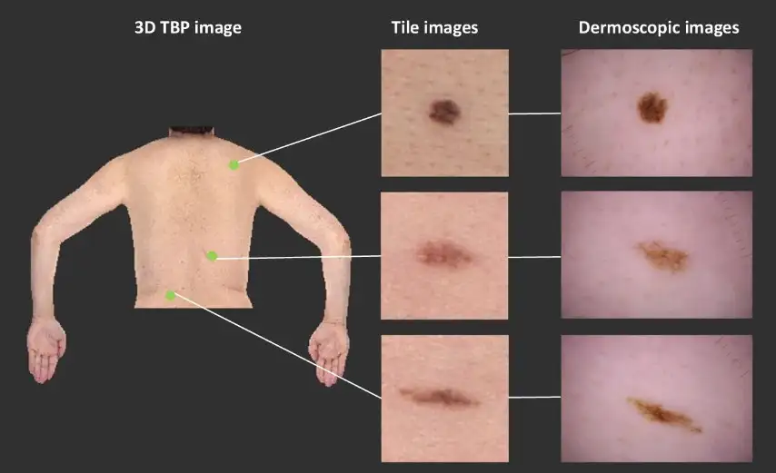
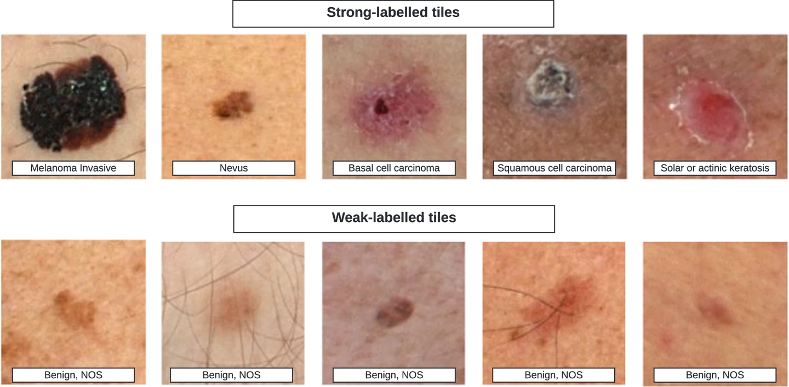

# SLICE-3D

<div align="center">
    <a href="https://github.com/openmedlab/"></a>
</div>
<p style="text-align:center;font-size:10px;"><em></em></p>

## Dataset Information

The artificial intelligence image classification algorithms used for skin cancer detection have shown promising results. Most publicly available skin cancer image datasets consist of dermatoscopic photos, which are limited by selection bias, lack of standardization, and are only suitable for algorithm development used by skilled clinicians. The SLICE-3D dataset described here addresses these issues and contains over 400,000 images of various skin lesions from seven dermatology centers around the world. The de-identified images are systematically extracted from sensitive 3D full-body photos, with optical resolution comparable to smartphone images. When deployed in primary care or non-clinical settings, algorithms trained with low-quality images can improve clinical workflows and detect skin cancer earlier, where photos are taken by non-professional doctors or patients themselves. Such tools can encourage individuals to visit professional dermatologists. This dataset circumvents many inherent limitations of previous datasets and can be used to build a foundation for previous skin imaging applications in cancer detection.

<div align="center">
    <a href="https://github.com/openmedlab/"></a>
</div>
<p style="text-align:center;font-size:10px;"><em>Figure 1. Examples of image types. The SLICE-3D dataset consists of sliced images extracted from 3D TBP images. These sliced images display fewer morphological features compared to dermatoscopic images, which are captured in clinical settings to document and monitor specific skin lesions.</em></p>

## Dataset Meta Information

| Dimensions | Modality            | Task Type      | Anatomical Structures | Anatomical Area | Number of Categories | Data Volume    | File Format |
|------------|---------------------|----------------|-----------------------|-----------------|----------------------|----------------|-------------|
| 2D         | Dermoscopic Images  | Classification | Skin                  | Skin            | 2                    | 401,059	       | JPG         |


### Resolution Details

| Dataset Statistics | size       |
|--------------------|------------|
| median             | (133, 133) |

## Label Information Statistics

| Category    | English               | Chinese           |
|-------------|-----------------------|-------------------|
| Melanoma    | Invasive Melanoma     | 侵袭性黑色素瘤   |
| Basal       | Basal Cell Carcinoma  | 基底细胞癌       |
| Squamous    | Squamous Cell Carcinoma | 鳞状细胞癌     |
| Solar       | Solar or Actinic Keratosis | 日光性角化病 |
| ...         | ...                   | ...               |
| Benign      | Benign NOS            | 未特指的良性     |

## Visualization

<div align="center">
    <a href="https://github.com/openmedlab/"></a>
</div>
<p style="text-align:center;font-size:10px;"><em>Figure 2. Example slice images of different diagnostic categories.</em></p>

## File Structure

``` 
SLICE-3D/
├── train-image
├── train-image.hdf5 
├── train-metadata.csv
├── sample_submission.csv
├── test-metadata.csv
├── ISIC_2024_Training_Supplement.csv
```

## Authors and Institutions

- Nicholas R. Kurtansky (Memorial Sloan Kettering Cancer Center)
- Brian M. D’Alessandro (Canfeld Scientific, Inc.)
- Maura C. Gillis (Memorial Sloan Kettering Cancer Center)
- Brigid Betz-Stablein (The University of Queensland, Dermatology Research Centre)
- Sara E. Cerminara (University Hospital of Basel)
- Rafael Garcia (University of Girona)
- Marcela Alves Girundi (Melanoma Institute Australia)
- Elisabeth Victoria Goessinger (University Hospital of Basel)
- Philippe Gottfrois (University Hospital of Basel)
- Pascale Guitera (Melanoma Institute Australia, University of Sydney)
- Allan C. Halpern (Memorial Sloan Kettering Cancer Center)
- Valerie Jakrot (Melanoma Institute Australia, University of Sydney)
- Harald Kittler (Medical University of Vienna)
- Kivanc Kose (Memorial Sloan Kettering Cancer Center)
- Konstantinos Liopyris (University of Athens Medical School)
- Josep Malvehy (Hospital Clínic Barcelona, Universitat de Barcelona, IDIBAPS)
- Victoria J. Mar (Monash University, Victorian Melanoma Service, Alfred Hospital)
- Linda K. Martin (Melanoma Institute Australia, University of Sydney, University of New South Wales)
- Thomas Mathew (Melanoma Institute Australia)
- Lara Valeska Maul (University Hospital of Zurich)
- Adam Mothershaw (The University of Queensland, Dermatology Research Centre)
- Alina M. Mueller (University Hospital of Basel)
- Christoph Mueller (Medical University of Vienna)
- Alexander A. Navarini (University Hospital of Basel)
- Tarlia Rajeswaran (FNQH Cairns Skin Cancer Clinic)
- Vin Rajeswaran (FNQH Cairns Skin Cancer Clinic)
- Anup Saha (University of Girona)
- Maithili Sashindranath (Monash University)
- Laura Serra-García (Hospital Clínic Barcelona)
- H. Peter Soyer (The University of Queensland, Dermatology Research Centre)
- Georgios Theocharis (University of Athens Medical School)
- Ayesha Vos (Victorian Melanoma Service, Alfred Hospital)
- Jochen Weber (Memorial Sloan Kettering Cancer Center)
- Veronica Rotemberg (Memorial Sloan Kettering Cancer Center)

## Source Information

Official Website: https://challenge2024.isic-archive.com/

Download Link: https://challenge2024.isic-archive.com/

Article Address: [Link](https://www.nature.com/articles/s41597-024-03743-w?_gl=1*12acmts*_up*MQ..&gclid=Cj0KCQjwi5q3BhCiARIsAJCfuZmBdlchDnyiZWURlGNM0A6KEM_q887kHYTs270jUIwdkxbO3ScvLIgaAg1DEALw_wcB)

Publication Date: 2024-08

## Citation

``` 
@article{kurtansky2024slice,
  title={The SLICE-3D dataset: 400,000 skin lesion image crops extracted from 3D TBP for skin cancer detection},
  author={Kurtansky, Nicholas R and D’Alessandro, Brian M and Gillis, Maura C and Betz-Stablein, Brigid and Cerminara, Sara E and Garcia, Rafael and Girundi, Marcela Alves and Goessinger, Elisabeth Victoria and Gottfrois, Philippe and Guitera, Pascale and others},
  journal={Scientific Data},
  volume={11},
  number={1},
  pages={884},
  year={2024},
  publisher={Nature Publishing Group UK London}
}
```

Original introduction article is [here](https://zhuanlan.zhihu.com/p/720347877).