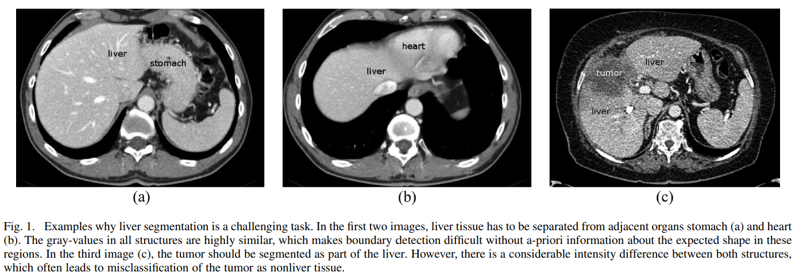
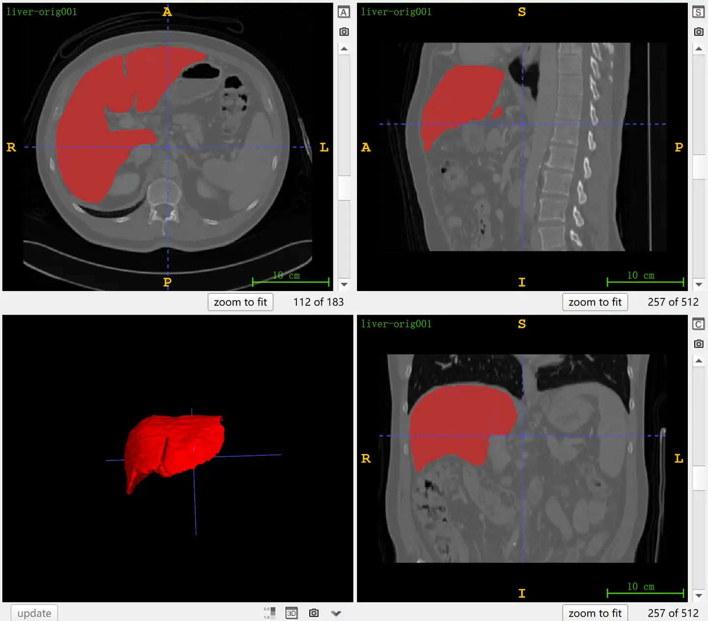

# SLIVER07

<div align="center">
    <a href="https://github.com/openmedlab/"></a>
</div>
<p style="text-align:center;font-size:10px;"><em></em></p>

## Dataset Information

SLIVER07 (Segmentation of the Liver Competition 2007) is a classic dataset used for segmenting the liver in contrast-enhanced CT images, providing 20 CT images with liver annotations for training, and 10 cases with unpublicized annotations for testing, originally used in the MICCAI 2007 competition.

In the context of 2007, the field of medical image analysis greatly lacked robust evaluation and comparison mechanisms. It was challenging to compare proposed segmentation algorithms because most were not accessible and re-implementation was too cumbersome and time-consuming. Furthermore, datasets used for evaluation often did not represent the true images used in clinical practice. Liver segmentation in CT images is fundamental for computer-assisted surgical planning (such as tumor removal, liver transplantation, or minimally invasive surgery). It is also used for diagnosing and monitoring diseases. In CT images, the intensity of neighboring organs and tissues is often very similar to that of the liver tissue itself. This situation typically occurs at the boundaries with the stomach and heart, but also at the margins of subcostal fat. In these problem areas, purely grayscale-based automatic liver segmentation is nearly unfeasible. For instance, region growing methods would infiltrate surrounding tissues, requiring subsequent manual correction. Another issue is that most clinical images display severe pathologies, such as large tumors, cirrhosis, or scars remaining after partial liver resection. All these special cases must be accurately handled by the segmentation algorithms.

## Dataset Meta Information

| Dimensions | Modality | Task Type | Anatomical Structures | Anatomical Area | Number of Categories | Data Volume | File Format |
|------------|----------|-----------|-----------------------|-----------------|----------------------|-------------|-------------|
| 3D         | CT       | Segmentation | Liver                 | Abdomen         | 1                    | 30          | .mhd        |


### Resolution Details

| Dataset Statistics | spacing (mm)       | size            |
|--------------------|--------------------|-----------------|
| min                | (0.58, 0.58, 0.70) | (512, 512, 64)  |
| median             | (0.70, 0.70, 1.0)  | (512, 512, 200) |
| max                | (0.81, 0.81, 5.0)  | (512, 512, 394) |

Number of 2D slices in the dataset: 4159

## Label Information Statistics

| Metric              | Liver |
|---------------------|-------|
| Case Count          | 20    |
| Coverage            | 100%  |
| Min Volume (cm³)    | 1170  |
| Median Volume (cm³) | 1687  |
| Max Volume (cm³)    | 3015  |

## Visualization

<div align="center">
    <a href="https://github.com/openmedlab/"></a>
</div>
<p style="text-align:center;font-size:10px;"><em>Local ITK-SNAP Visualization. Red: Liver.</em></p>

## File Structure

The dataset file structure is as follows. Training set: `training-labels` contains label files, such as segmentation annotations (MHD and RAW files); `training-scans` contains scan files. Test set: `test-scans` contains unannotated image data for testing.

``` 
.
├── training-labels
│   ├── liver-seg001.mhd
│   ├── liver-seg001.raw
│   ├── liver-seg002.mhd
│   ├── liver-seg002.raw
│   ├── ...
├── training-scans
│   ├── liver-orig001.mhd
│   ├── liver-orig001.raw
│   ├── liver-orig002.mhd
│   ├── liver-orig002.raw
│   ├── ...
├── test-scans
│   ├── liver-seg001.mhd
│   ├── liver-seg001.raw
│   ├── liver-seg002.mhd
│   ├── liver-seg002.raw
│   ├── ...
```

## Authors and Institutions

Tobias Heimann (German Cancer Research Center, Germany)

Bram van Ginneken (Image Sciences Institute, University Medical Center Utrecht, Netherlands)

Martin A. Styner (Department of Psychiatry and Computer Science, North Carolina State University, USA)

## Source Information

Official Website: https://sliver07.grand-challenge.org/

Download Link: https://zenodo.org/records/2597908

Article Address: https://ieeexplore.ieee.org/abstract/document/4781564/

Publication Date: 2007

## Citation

``` 
@article{heimann2009comparison,
  title={Comparison and evaluation of methods for liver segmentation from CT datasets},
  author={Heimann, Tobias and Van Ginneken, Bram and Styner, Martin A and Arzhaeva, Yulia and Aurich, Volker and Bauer, Christian and Beck, Andreas and Becker, Christoph and Beichel, Reinhard and Bekes, Gy{\"o}rgy and others},
  journal={IEEE transactions on medical imaging},
  volume={28},
  number={8},
  pages={1251--1265},
  year={2009},
  publisher={IEEE}
}
```

Original introduction article is [here](https://zhuanlan.zhihu.com/p/703921777).