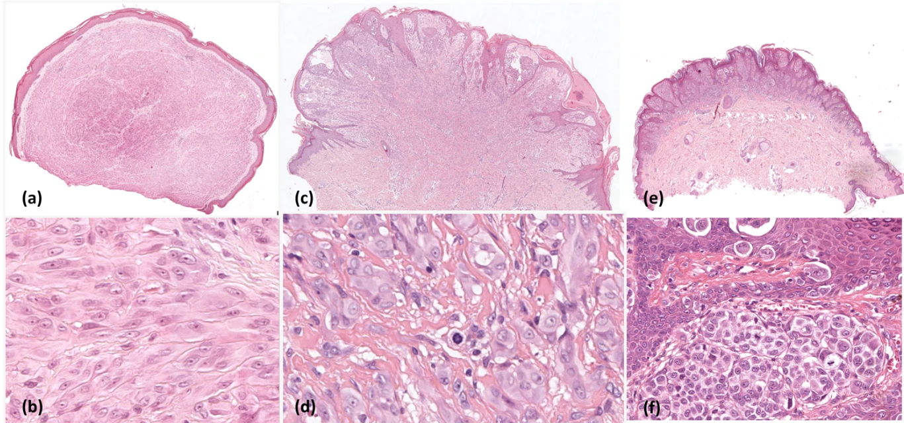

# SOPHIE Spitz

<div align="center">
    <a href="https://github.com/openmedlab/"></a>
</div>
<p style="text-align:center;font-size:10px;"><em></em></p>

## Dataset Information

Spitz-like tumors (ST) account for 1-2% of all melanocytic tumors and are among the most challenging entities in histopathological diagnosis. The discrepancy between histopathological appearance and clinical progression can lead to misdiagnosis, resulting in either undertreatment or overtreatment. ST is defined as a melanocytic proliferation featuring large epithelioid or spindle-shaped melanocytes with large nuclei, vesicular chromatin, and prominent nucleoli. This entity is divided into three categories: the benign group, known as Spitz nevi (SN); the malignant type, referred to as Spitzoid melanoma (SM); and a third category, which, due to its uncertain prognosis, is classified as intermediate and termed Spitzoid Tumors of Uncertain Malignant Potential (STUMP) or atypical Spitz tumors.

In the era of digital pathology, significant and promising advancements have been made in identifying histological whole-slide images (WSIs) through the implementation of deep learning (DL) models. WSIs, created via a digital scanning technique, capture and transform glass slides used in pathology, histology, and other medical fields into high-resolution digital images. These digital images can be viewed, analyzed, and shared electronically, enabling more efficient and accurate diagnostics, research, and collaboration among medical professionals. By 2030, it is estimated that certain algorithms will become integral to pathology lab workflows, enhancing diagnostic accuracy, reducing subjectivity—particularly for tumors with high diagnostic complexity that lead to inter-observer variability—and standardizing diagnosis and tumor grading, alongside other advancements in pathology.

To the authors' knowledge, there is currently no publicly available dataset that facilitates the study of ST within WSIs. In this article, the authors introduce a dataset previously used by Del Amor et al. in their publication on ST. This dataset of ST cases (named "SOPHIE" in honor of Sophie Spitz) includes hematoxylin and eosin (H&E) stained WSIs and clinical information, helping researchers explore and develop methods to improve the diagnosis and classification of ST. The dataset comprises 61 H&E-stained WSIs and clinical information from 58 patients.

## Dataset Meta Information

| Dimension | Modality           | Task Type | Anatomical Structure | Region | Number of Classes | Quantity | File Format |
|-----------|--------------------|-----------|-----------------------|--------|--------------------|----------|-------------|
| 2D        | Pathology Slides   | Classification | Spitz Tumor          | Skin   | 3                  | 61       | .tif        |

### Label Information Statistics

| Label                                                                           | Chinese Translation                                                                         |
|---------------------------------------------------------------------------------|---------------------------------------------------------------------------------------------|
| Spitz Nevus (SN)                                                                | Benign: Spitz Nevus (SN)                                                                    |
| Spitzoid Melanoma (SM)                                                          | Malignant: Spitzoid Melanoma (SM)                                                           |
| Spitzoid Tumor of Unknown Malignant Potential (STUMP) or Atypical Spitz Tumor   | Intermediate: Spitzoid Tumor of Unknown Malignant Potential (STUMP) or Atypical Spitz Tumor |


## Visualization

<div align="center">
    <a href="https://github.com/openmedlab/"></a>
</div>
<p style="text-align:center;font-size:10px;"><em>**Figure 1.** Representative image patches extracted from WSIs of Spitz Tumors (ST): (a-b): SN shows a large number of uniform melanocytes arranged in an orderly manner without mitotic activity; (c-d): STUMP exhibits deep mitotic activity; (e-f): SM displays abundant mitotic figures and Pagetoid spread.</em></p>

## File Structure

``` 
SOPHIE /
├── SOPHIE: Spitzoid WSI dataset with clinical data
│   ├── SN_00XX
│   ├── SM_00XX
│   ├── STUMP_00XX
│   ├── meta.xlsx
├── Code used in Sophie Dataset
```

## Authors and Institutions

- Andrés Mosquera-Zamudio (Universidad de Valencia, Instituto de Investigación Sanitaria)  

- Laëtitia Launet (Human-Centered Technology Research Institute, HUMAN-tech Universitat Politècnica de València)

- Rocío del Amor (Human-Centered Technology Research Institute, HUMAN-tech Universitat Politècnica de València)

- Anaïs Moscardó (Pathology Department, Hospital Clínico Universitario de Valencia, Universidad de Valencia) 

- Adrián Colomer (Human-Centered Technology Research Institute, HUMAN-tech Universitat Politècnica de València; valgrAI: Valencian Graduate School and Research Network of Artificial Intelligence)

- Valery Naranjo (Human-Centered Technology Research Institute, HUMAN-tech Universitat Politècnica de València; valgrAI: Valencian Graduate School and Research Network of Artificial Intelligence)

- Carlos Monteagudo (Universidad de Valencia, Instituto de Investigación Sanitaria)  

## Source Information

Official Website: https://www.nature.com/articles/s41597-023-02585-2#ref-CR23

Download Link: https://springernature.figshare.com/collections/SOPHIE_Spitzoid_Tumor_dataset_with_clinical_metadata_Whole_Slide_Images_for_Deep_Learning_models/6472282/1

Article Address: https://www.nature.com/articles/s41597-023-02585-2#ref-CR23

Publication Date: 2023-10

## Citation

``` 
@article{mosquera2023spitzoid,
  title={A Spitzoid Tumor dataset with clinical metadata and Whole Slide Images for Deep Learning models},
  author={Mosquera-Zamudio, Andr{\'e}s and Launet, La{\"e}titia and Del Amor, Roc{\'\i}o and Moscard{\'o}, Ana{\"\i}s and Colomer, Adri{\'a}n and Naranjo, Valery and Monteagudo, Carlos},
  journal={Scientific Data},
  volume={10},
  number={1},
  pages={704},
  year={2023},
  publisher={Nature Publishing Group UK London}
}
```

Original introduction article is [here](https://zhuanlan.zhihu.com/p/976936820).