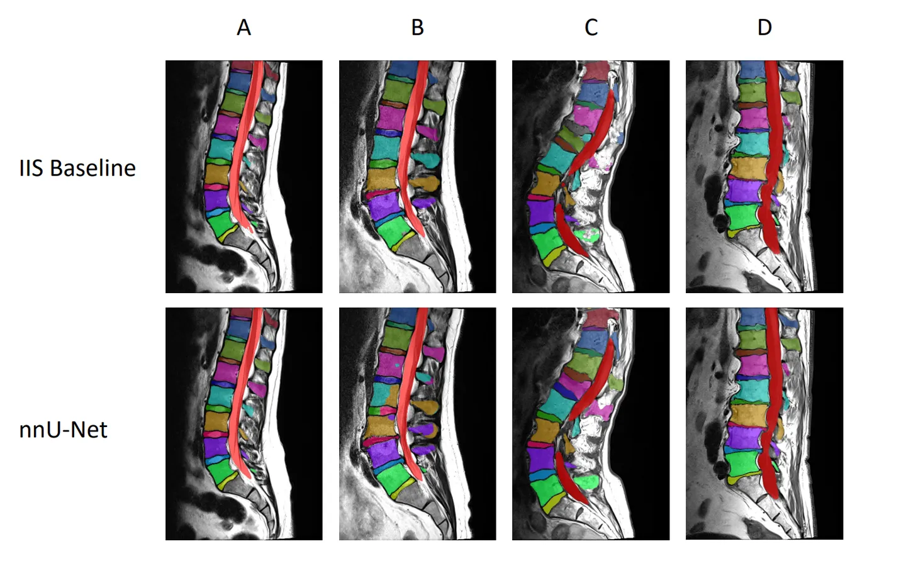
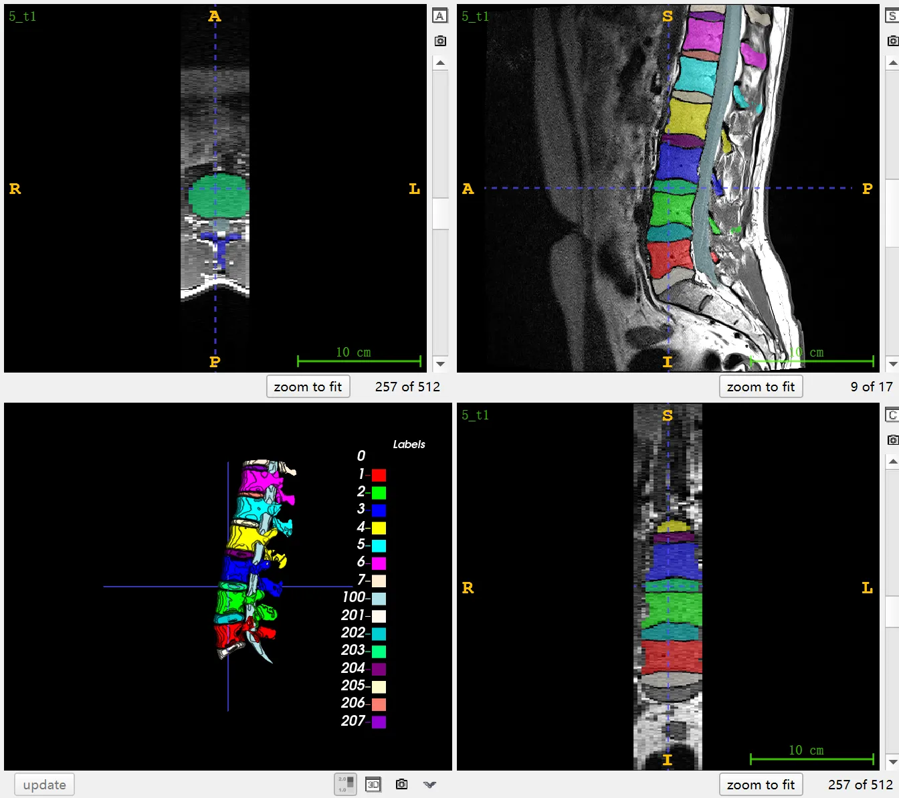
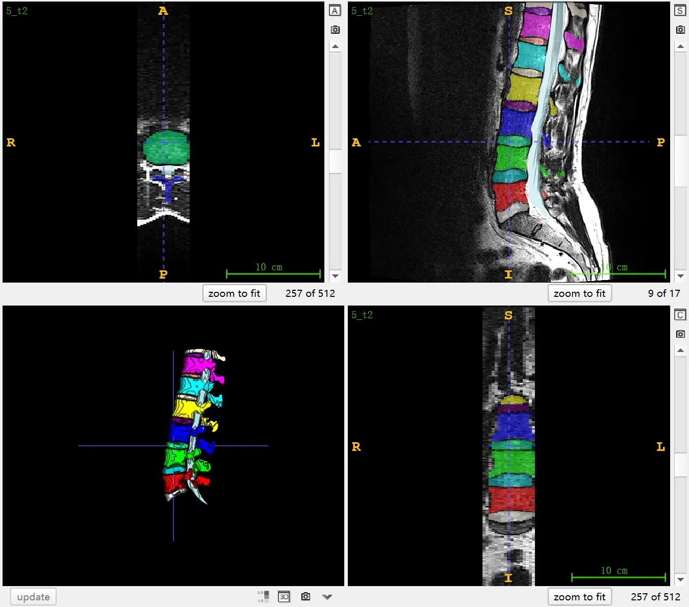
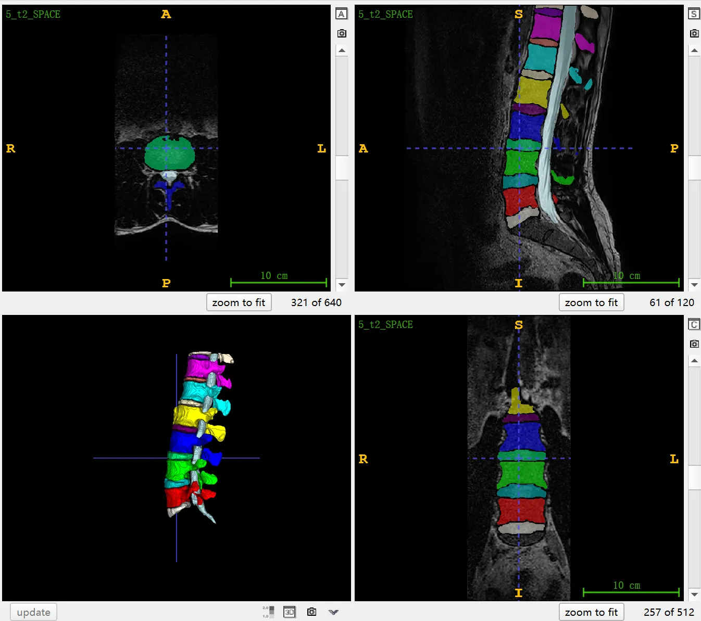

# SPIDER

<div align="center">
    <a href="https://github.com/openmedlab/"></a>
</div>
<p style="text-align:center;font-size:10px;"><em></em></p>

## Dataset Information

The SPIDER (**Spi**ne Segmentation: **D**iscs, V**er**tebrae, and Spinal Canal) dataset is a large-scale multi-center MRI dataset of the spine offering segmentation annotations for the spine, intervertebral discs (IVDs), and spinal canal. It publicly provides 447 sagittal T1 and T2 MRI sequence images from 218 patients with low back pain, with a few patients offering T2 Space sequence images. The data, sourced from 4 different hospitals, is divided into images from 179 patients as a training set, and images from 39 patients as a validation set. Additionally, 97 images from 39 undisclosed patients are used for competition evaluation. The dataset also provides patients' gender information and some patients' age data. For each MRI image, the scanner and acquisition parameters are listed. Radiological grading for several degenerative changes is also provided for each image, including Modic changes (classified into types I, II, III), endplate changes or Schmorl's nodes, spondylolisthesis, disc protrusion, disc narrowing, disc protrusion, and Pfirrmann grade (classified from 1 to 5). All these radiological grades are detailed for each intervertebral disc level.

Low back pain (LBP) is a significant cause of disability and a major social medical issue. Lumbar spine magnetic resonance imaging (MRI) is one of the common tools for diagnosis and treatment decisions for LBP. The frequency of using MRI imaging for LBP patients has significantly increased over the past decades. Automatic image analysis has the potential to alleviate the workload of radiologists and spine surgeons and to enhance the diagnostic value of MRI by achieving more objective and quantitative image interpretation. However, to effectively assess complex multifactorial conditions like LBP, automatic analysis must understand multiple anatomical elements of the spine, including the vertebrae, intervertebral discs (IVDs), and the spinal canal. SPIDER provides a large and diverse dataset for developing precise and reliable AI algorithms for lumbar spine MRI segmentation.

## Dataset Meta Information

| Dimensions | Modality | Task Type | Anatomical Structures          | Anatomical Area | Number of Categories | Data Volume | File Format |
|------------|----------|-----------|--------------------------------|-----------------|----------------------|-------------|-------------|
| 3D         | CT       | Segmentation | spine, intervertebral disc, spinal canal | Vertebrae       | 19                   | 554         | .mha        |


### Resolution Details

The official description states that the standard sagittal T1 and T2 images in the dataset have a resolution range from 3.3 x 0.33 x 0.33 millimeters to 4.8 x 0.90 x 0.90 millimeters. The sagittal T2 SPACE sequence images have an almost isotropic spatial resolution, with voxel sizes of 0.90 x 0.47 x 0.47 millimeters.

| Dataset Statistics | spacing (mm)     | size            |
|--------------------|------------------|-----------------|
| min                | (0.47, 0.25, 0.08)              | (17, 264, 8)     |
| median             | (3.3, 0.63, .066)           | (424, 448, 25) |
| max                | (9.6, 1.1, 3.3)              | (3682, 1168, 512) |

Number of two-dimensional slices in the data set: 204, 082 (based on 447 published image statistics of 218 patients)

## Label Information Statistics

| Label | Detection Count | Detection Rate | Small Volume (cm³) | Medium Volume (cm³) | Large Volume (cm³) |
|-------|-----------------|----------------|--------------------|---------------------|--------------------|
| 1     | 447             | 100.00%        | 25.84              | 43.97               | 86.26              |
| 2     | 447             | 100.00%        | 27.5               | 45.7                | 92.05              |
| 3     | 447             | 100.00%        | 26.58              | 44.71               | 88.32              |
| 4     | 446             | 99.78%         | 23.24              | 40.57               | 73.64              |
| 5     | 446             | 99.78%         | 20.15              | 35.83               | 64.52              |
| 6     | 445             | 99.55%         | 8.89               | 29.11               | 53.99              |
| 7     | 307             | 68.68%         | 0.75               | 22.03               | 39.86              |
| 8     | 119             | 26.62%         | 1.95               | 16.58               | 35.94              |
| 9     | 21              | 4.70%          | 1.98               | 7.61                | 26.62              |
| 100   | 447             | 100.00%        | 20.9               | 48                  | 79.31              |
| 201   | 447             | 100.00%        | 2.35               | 7.97                | 25.71              |
| 202   | 447             | 100.00%        | 1.55               | 9.59                | 29.17              |
| 203   | 447             | 100.00%        | 1.85               | 9.43                | 25.94              |
| 204   | 446             | 99.78%         | 2.61               | 8.55                | 21.11              |
| 205   | 446             | 99.78%         | 2.95               | 6.79                | 17.95              |
| 206   | 445             | 99.55%         | 1.86               | 4.96                | 14.34              |
| 207   | 310             | 69.35%         | 1.25               | 3.9                 | 11.8               |
| 208   | 127             | 28.41%         | 1.26               | 3.24                | 8                  |
| 209   | 32              | 7.16%          | 1.06               | 2.82                | 5.04               |


## Visualization

<div align="center">
    <a href="https://github.com/openmedlab/"></a>
</div>
<p style="text-align:center;font-size:10px;"><em> Paper visualization.</em></p>

<div align="center">
    <a href="https://github.com/openmedlab/"></a>
</div>
<p style="text-align:center;font-size:10px;"><em> ITK-SNAP Visualization. T1 sequence MR images of Patient No. 5.</em></p>

<div align="center">
    <a href="https://github.com/openmedlab/"></a>
</div>
<p style="text-align:center;font-size:10px;"><em> ITK-SNAP Visualization. T2 sequence MR images of Patient No. 5.</em></p>

<div align="center">
    <a href="https://github.com/openmedlab/"></a>
</div>
<p style="text-align:center;font-size:10px;"><em> ITK-SNAP Visualization. T2 Space sequence MR images of Patient No. 5.</em></p>

## File Structure

The SPIDER dataset file structure is as follows. In the `images` folder, there are multiple MRI image files in `.mha` format, each named in the format `[number]_[sequence type].mha`, representing MRI scan images of different patients. For example, `1_t1.mha` and `1_t2.mha` represent different types (T1 and T2) of MRI images of the same patient. In the `masks` folder, there are also multiple `.mha` format files, which are segmentation masks corresponding to the images. The `overview.csv` file contains information about the allocation of MRI studies to training and validation sets, all patients' biological sex, and available patient age information. Additionally, scanner and acquisition parameters for each individual MRI study are also recorded in this file. The `radiological_gradings.csv` file contains radiological grading information related to the MRI images, corresponding to degenerative changes such as Modic changes, disc degeneration, and others.

``` 
SPIDER
│
├── images
│   ├── 1_t1.mha
│   ├── 1_t2.mha
│   ├── 2_t1.mha
│   ├── 2_t2.mha
│   └── ... 
│
├── masks
│   ├── 1_t1.mha
│   ├── 1_t2.mha
│   ├── 2_t1.mha
│   ├── 2_t2.mha
│   └── ... 
│
├── overview.csv 
│
└── radiological_gradings.csv 
```

## Authors and Institutions

Nikolas Lessmann (Radboud University Medical Center, Netherlands)

Miranda van Hooff (Radboud University Medical Center, Netherlands)

Marinus de Kleuver (Radboud University Medical Center, Netherlands)

Bram van Ginneken (Radboud University Medical Center, Netherlands)

Stan Buckens (Radboud University Medical Center, Netherlands)

Matthieu Rutten (Jeroen Bosch Hospital, Netherlands)

Robert Jan Kroeze (Sint Maartenskliniek, Netherlands)

Job van Susante (Rijnstate Hospital, Arnhem, Netherlands)


## Source Information

Official Website: https://spider.grand-challenge.org/

Download Link: https://spider.grand-challenge.org/data/

Article Address: https://arxiv.org/abs/2306.12217

Publication Date: 2023-06

## Citation

``` 
@misc{vandergraaf2023lumbar,
      title={Lumbar spine segmentation in MR images: a dataset and a public benchmark}, 
      author={Jasper W. van der Graaf and Miranda L. van Hooff and Constantinus F. M. Buckens and Matthieu Rutten and Job L. C. van Susante and Robert Jan Kroeze and Marinus de Kleuver and Bram van Ginneken and Nikolas Lessmann},
      year={2023},
      eprint={2306.12217},
      archivePrefix={arXiv}, 
      primaryClass={eess.IV}
}
```

Original introduction article is [here](https://zhuanlan.zhihu.com/p/670436854).