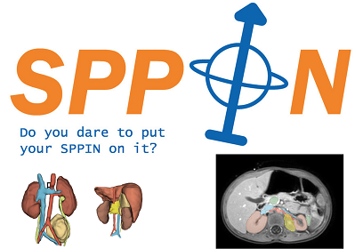
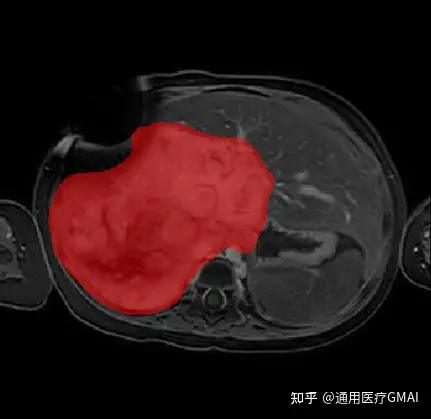
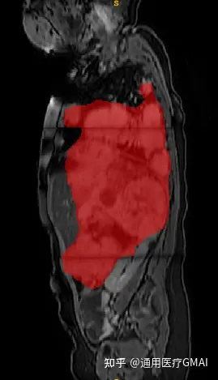
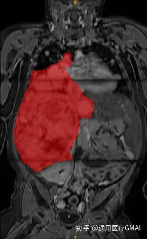
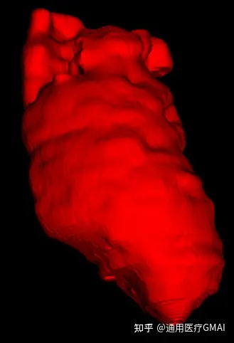

# SPPIN

<div align="center">
    <a href="https://github.com/openmedlab/"></a>
</div>
<p style="text-align:center;font-size:10px;"><em></em></p>

## Dataset Information

The translation of the given text is:

SPPIN (Surgical Planning in Pediatric Neuroblastoma) is a multi-modal MRI segmentation dataset designed specifically for surgical planning of neuroblastoma. This dataset encompasses 79 training scans with precise labels from 34 patients. Additionally, there is a preliminary test set consisting of 7 scans from 3 patients, and a final test set composed of 24 scans from 11 patients. The data modalities include T2-weighted imaging, contrast-enhanced T1-weighted imaging, and two b-value diffusion-weighted imaging (DWI), totaling four modalities. Neuroblastoma is a common form of cancer in children, accounting for 15% of cancer-related deaths in children. This type of tumor is often located in the abdomen and may be near or surround critical organs and vessels, making accurate and efficient preoperative imaging segmentation tools particularly crucial. The dataset faces several challenges: 1) Limited scale of pediatric tumor datasets; 2) Chemotherapy can cause significant changes in the size and structure of the tumor, thus increasing the complexity of the dataset; 3) The complex relationship between the tumor and its surrounding anatomical structures increases the difficulty of segmentation.

## Dataset Meta Information

| Dimensions | Modality | Task Type | Anatomical Structures | Anatomical Area | Number of Categories | Data Volume                                     | File Format |
|------------|----------|-----------|-----------------------|-----------------|----------------------|-------------------------------------------------|-------------|
| 3D         | MR       | Segmentation | Tumour                | abdomen       | 1                    | 80 for training, 7 for validation, 24 for test. | .nii.gz     |


### Resolution Details

You can also write down the resolution details such as size (x, y, z) and spacing information about the dataset.

For example:

| Dataset Statistics | spacing (mm)     | size            |
|--------------------|------------------|-----------------|
| min                | (0.7440, 0.7440, 1.2978)              | (336, 336, 161)     |
| median             | (0.9115, 0.9115, 1.5096)           | (384, 384, 330) |
| max                | (0.9115, 0.9115, 3.1040)              | (384, 384, 360) |

## Label Information Statistics

| Anatomical Structure | Tumor   |
|----------------------|---------|
| Total Volume (cm³)   | 1250    |
| Minimum Volume (cm³) | 2       |
| Median Volume (cm³)  | 46      |

## Visualization

<div align="center">
    <a href="https://github.com/openmedlab/"></a>
</div>
<p style="text-align:center;font-size:10px;"><em> PT_07_201811-View 1 (annotation in red).</em></p>

<div align="center">
    <a href="https://github.com/openmedlab/"></a>
</div>
<p style="text-align:center;font-size:10px;"><em> PT_07_201811-View 2 (annotation in red).</em></p>

<div align="center">
    <a href="https://github.com/openmedlab/"></a>
</div>
<p style="text-align:center;font-size:10px;"><em> PT_07_201811-View 3 (annotation in red).</em></p>

<div align="center">
    <a href="https://github.com/openmedlab/"></a>
</div>
<p style="text-align:center;font-size:10px;"><em> PT_07_201811 3D annotation.</em></p>

## File Structure

``` 
SPPIN_Dataset
├── SPPIN_train
│   ├── PT_06
│   │   ├── 20180628
│   │   │   ├── PT_06_DWI_b0_20180628.nii
│   │   │   ├── PT_06_DWI_b0_20180628.nii
│   │   │   ├── PT_06_NB_20180628.nii.gz
│   │   │   ├── PT_06_T1_gd_20180628.nii
│   │   │   └── PT_06_T2_20180628.nii
│   ├── . . . 
│   └── PT_92
          └── 20180628
               ├── PT_92_DWI_b0_20181026.nii
               ├── PT_92_DWI_b0_20181026.nii
               ├── PT_92_NB_20181026.nii.gz
               ├── PT_92_T1_gd_20181026.nii
               └── PT_92_T2_20181026.nii
```

## Authors and Institutions

Myrthe Buser: A technical physician dedicated to personalizing surgical care for pediatric solid tumors through the application of artificial intelligence.

Princess Máxima Center for Pediatric Oncology: Established in 2018, the center specializes in the treatment and research of pediatric oncology.

The Wijnen Group: Focuses on pediatric tumor surgery, improving the quality of surgical decisions through innovative strategies such as 3D imaging and fluorescence-guided surgery.


## Source Information

Official Website: https://sppin.grand-challenge.org/sppin/

Download Link: https://zenodo.org/record/7845214

Publication Date: 2023-04-14

## Citation

``` 
@inproceedings{buser2023surgical,
    author = {Myrthe A.D. Buser and Alida F.W. van der Steeg and Dominique C. Simons and Marc H.W.A. Wijnen and Annemieke S. Littooij and Annemiek H. ter Brugge and Iris N. Vos and Bas H.M. van der Velden},
    title = {Surgical Planning in Pediatric Neuroblastoma},
    booktitle = {International Conference on Medical Image Computing and Computer Assisted Intervention (MICCAI) 2023},
    year = {2023},
    publisher = {Zenodo},
    url = {https://doi.org/10.5281/zenodo.7848306}
}
```

Original introduction article is [here](https://zhuanlan.zhihu.com/p/655941310).