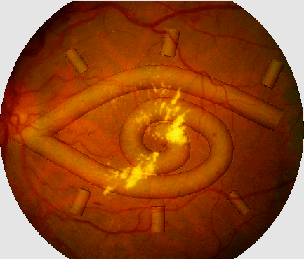

# STARE

<div align="center">
    <a href="https://github.com/openmedlab/"></a>
</div>
<p style="text-align:center;font-size:10px;"><em></em></p>

## Dataset Information

The **STARE** (Structured Analysis of the Retina) dataset is a publicly available dataset for retinal vessel segmentation, created by Dr. Michael Goldbaum from the University of Vermont, USA. The STARE dataset includes 20 fundus images with a resolution of 700x605 pixels. These images feature a variety of lesions, such as macular degeneration, hypertensive retinopathy, diabetic retinopathy, etc. Each image is provided with a hand-labeled vessel segmentation map, which is used to train and evaluate vessel segmentation algorithms, making it one of the most commonly used datasets for fundus vessel segmentation. Retinal vessel segmentation in medical imaging is an important task that is crucial for the diagnosis and analysis of fundus diseases. The pattern of vascular distribution on the retina reflects the health status of the fundus. Different lesions can cause changes in the vascular distribution. Therefore, by analyzing the vascular distribution in the fundus, related fundus diseases (such as diabetic retinopathy, hypertension and other cardiovascular diseases, age-related macular degeneration, etc.) can be diagnosed.

## Dataset Meta Information

| Dimensions | Modality | Task Type | Anatomical Structures | Anatomical Area | Number of Categories | Data Volume | File Format |
|------------|----------|-----------|-----------------------|-----------------|----------------------|-------------|-------------|
| 2D         | Retinal Image       | Segmentation | Fundus blood vessels  | Eye             | 1                    | 20          | .ppm.gz     |


### Resolution Details

| Dataset Statistics | size        |
|--------------------|-------------|
| min                | (605, 700)  |
| median             | (605, 700)  |
| max                | (605, 700)  |

## Label Information Statistics

| Category            | Retinal Vessel (眼底血管) |
|---------------------|--------------------------|
| Number of Images    | 20                       |
| Coverage Rate       | 100%                     |
| Minimum Pixel Count | 364900                 |
| Medium Pixel Count  | 660610                |
| Maximum Pixel Count | 864860                |


## Visualization

<div align="center">
    <a href="https://github.com/openmedlab/"></a>
</div>
<p style="text-align:center;font-size:10px;"><em></em></p>

## File Structure

``` 
DRIVE Dataset
├── labels-ah
│   ├── im0001.ah.ppm.gz
│   ├── im0002.ah.ppm.gz
│   ├── im0003.ah.ppm.gz
│   └── ...
├── labels-vk
│   ├── im0001.vk.ppm.gz
│   ├── im0002.vk.ppm.gz
│   ├── im0003.vk.ppm.gz
│   └── ...
└── stare-images
    ├── im0001.ppm.gz
    ├── im0002.ppm.gz
    ├── im0003.ppm.gz
    └── ...
```

## Authors and Institutions

Adam Hoover (Department of Electrical and Computer Engineering, Clemson University)

Valentina Kouznetsova (Vision Computing Lab, Department of Electrical and Computer Engineering, University of California, San Diego, La Jolla)

Michael Goldbaum (Department of Ophthalmology, University of California, San Diego)


## Source Information

Official Website: https://cecas.clemson.edu/~ahoover/stare/

Download Link: https://cecas.clemson.edu/~ahoover/stare/probing/index.html

Article Address: https://ieeexplore.ieee.org/document/845178

Publication Date: 2000-03

## Citation

``` 
@ARTICLE{845178,
  author={Hoover, A.D. and Kouznetsova, V. and Goldbaum, M.},
  journal={IEEE Transactions on Medical Imaging}, 
  title={Locating blood vessels in retinal images by piecewise threshold probing of a matched filter response}, 
  year={2000},
  volume={19},
  number={3},
  pages={203-210},
  doi={10.1109/42.845178}}
```

Original introduction article is [here](https://zhuanlan.zhihu.com/p/663763698?).