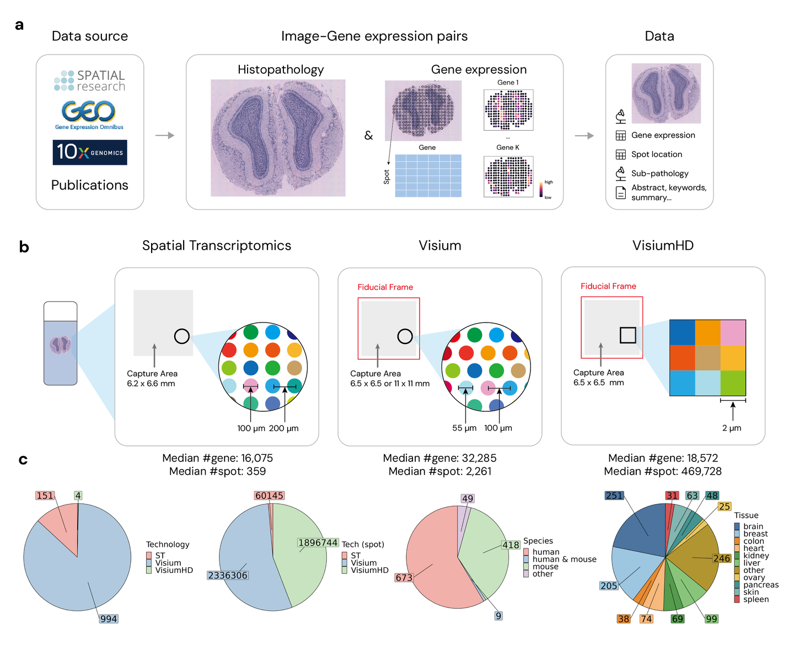

# STimage-1K4M

<div align="center">
    <a href="https://github.com/openmedlab/"></a>
</div>
<p style="text-align:center;font-size:10px;"><em></em></p>

## Dataset Information

**STimage-1K4M** is a groundbreaking multimodal dataset containing **1,149 images** based on spatial transcriptomics, detailing gene expression information for each spatial spot. These images are divided into smaller sub-tiles, each corresponding to **15,000 to 30,000-dimensional gene expression data**, resulting in a total of **4,293,195 sub-image and gene expression pairs**.

Previous multimodal histopathology datasets typically provided only localized regions of pathology images along with high-level textual summaries, which struggled to capture fine-grained details within the pathology images. For example, a single image covering a wide tissue region might include both cancerous and healthy areas, yet the accompanying text annotation might simply label it as a "cancer slice," lacking the granularity needed for in-depth analysis. **STimage-1K4M** addresses this gap by associating sub-images with detailed gene expression features.  

The **STimage-1K4M dataset** includes pathology images generated using three major technologies: **Spatial Transcriptomics**, **Visium**, and **VisiumHD**. It spans **10 species** and **50 different tissue types**. By providing extensive gene expression information paired with sub-image tiles, the dataset supports research into tissue spatial structure and the intricate relationships between cellular gene activity and diseases.  

The high-resolution data resources in STimage-1K4M not only advance the development of multimodal data analysis but also lay the foundation for innovative applications in computational pathology and personalized medicine.

## Dataset Meta Information

| Task Type  | Language | Quantity | File Format    |
|------------|----------|----------|----------------|
| image-gene | English  | 1,149    | .png, .csv     |

## Dataset Statistics Information

| slide  | image-gene pairs | technology  | species | tissue  | 
|--------|------------------|-------------|---------|---------|
| 1,149  | 4,293,195        | 3           | 10      | 50      |

## Data Example

**STimage-1K4M Overview**  

1. **(a) Dataset Organization Overview**:  
   A summary of how the dataset is structured and curated, including the pairing of sub-images with gene expression data.  

2. **(b) Resolution of Spatial Transcriptomics Technologies**:  
   Details about the spatial resolution provided by the technologies used in the dataset, such as Spatial Transcriptomics, Visium, and VisiumHD.  

3. **(c) Distribution of Technologies, Species, and Tissue Types in STimage-1K4M**:  
   A breakdown of the dataset's content by technology, species, and tissue types, highlighting its diversity and broad applicability.  

<div align="center">
    <a href="https://github.com/openmedlab/"></a>
</div>
<p style="text-align:center;font-size:10px;"><em></em></p>


## File Structure

``` 
.               
├──ST
├────coord
├──────GSE144239_GSM4284316_coord.csv
├──────GSE144239_GSM4284317_coord.csv
├──────GSE144239_GSM4284318_coord.csv
├──────...
├────gene_exp
├──────GSE144239_GSM4284316_count.csv
├──────GSE144239_GSM4284317_count.csv
├──────GSE144239_GSM4284318_count.csv
├──────...
├────image
├──Visium
├──VisiumHD
├──annotation
├──aux
├──meta
```

## Authors and Institutions

Jiawen Chen（University of North Carolina at Chapel Hill）

Muqing Zhou（University of North Carolina at Chapel Hill）

Wenrong Wu（University of North Carolina at Chapel Hill）

Jinwei Zhang（University of North Carolina at Chapel Hill）

Yun Li（University of North Carolina at Chapel Hill）

Didong Li（University of North Carolina at Chapel Hill）

## Source Information

Official Website: https://github.com/JiawenChenn/STimage-1K4M

Download Link: https://huggingface.co/datasets/jiawennnn/STimage-1K4M

Article Address: https://arxiv.org/abs/2406.06393

Publication Date: 2024-08

## Citation

``` 
@misc{chen2024stimage1k4m,
      title={STimage-1K4M: A histopathology image-gene expression dataset for spatial transcriptomics}, 
      author={Jiawen Chen and Muqing Zhou and Wenrong Wu and Jinwei Zhang and Yun Li and Didong Li},
      year={2024},
      eprint={2406.06393},
      archivePrefix={arXiv},
      primaryClass={cs.CV}
}
```

Original introduction article is [here](https://zhuanlan.zhihu.com/p/2148736791).