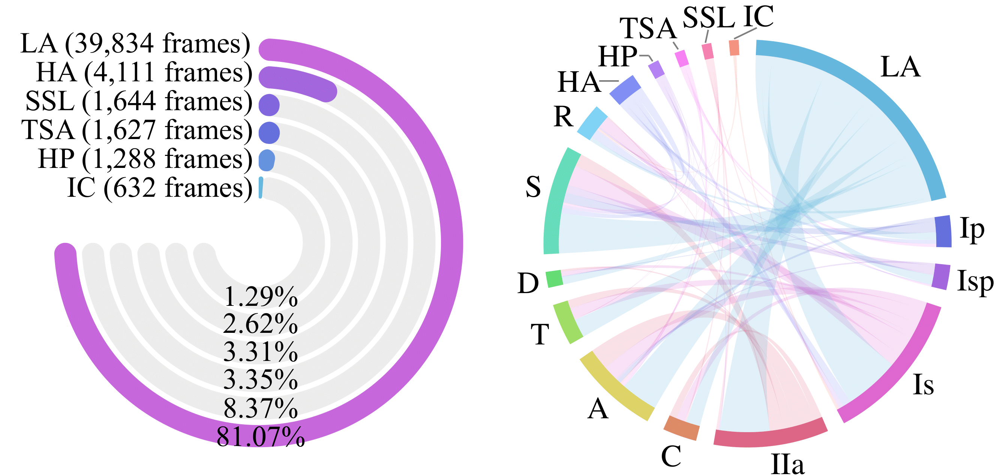

# SUN-SEG

<div align="center">
    <a href="https://github.com/openmedlab/"></a>
</div>
<p style="text-align:center;font-size:10px;"><em>Visualisation of the SUN-SEG</em></p>


## Dataset Information

SUN-SEG is a high-quality, per-frame annotated VPS dataset derived from the renowned SUN dataset, containing 158,690 frames. It encompasses a variety of labels, including object masks, boundaries, scribbles, polygons, and visual attributes. Moreover, it retains the pathological information from the original SUN dataset, such as pathological classification labels, location details, and shape information.

The videos from the original SUN dataset have been manually trimmed into 378 positive and 728 negative short clips while maintaining their intrinsic consecutive relationships. This preprocessing ensures each clip lasts around 3 to 11 seconds at a real-time frame rate (30 fps). The final version of SUN-SEG includes 49,136 polyp frames (positive part) and 109,554 non-polyp frames (negative part) from 285 and 728 colonoscopy video clips, respectively, along with the corresponding annotations. 


## Dataset Meta Information

| Dimensions | Modality    | Task Type    | Number of Categories | Data Volume | File Format |
|------------|-------------|--------------|----------------------|-------------|-------------|
| 2D         | Colonoscopy | Segmentation | 7                    | 158,690     | .jpg, .png  |


## Label Information Statistics

<div align="center">
    <a href="https://github.com/openmedlab/"></a>
</div>
<p style="text-align:center;font-size:10px;"><em>Figure (Left) Distribution over pathological patterns. (Right) Multi-dependencies among pathological pattern, shape, and location.</em></p>

Figure (left) illustrates the statistical distributions for pathological patterns, excluding non-polyp (NP). It is observed that well-differentiated or low-grade adenoma is predominant but challenging to locate due to the low-intensity contrast between the lesion and the mucosal surface. Figure (right) displays the multi-dependencies among pathological patterns, shape, and location of colon polyps.


### Label-I: Category Classification Annotation
| Category                     | Video Number | Image Number |
|------------------------------|--------------|--------------|
| Low-grade adenoma            | 229          | 39,834       |
| High-grade adenoma           | 26           | 4,111        |
| Hyperplastic polyp           | 10           | 1,644        |
| Traditional serrated adenoma | 9            | 1,627        |
| Sessile serrated lesion      | 8            | 1,288        |
| Invasive carcinoma           | 3            | 632          |
| Non-Polyp                    | 728          | 109,554      |


### Label-II: Object Mask
In polyp-existing frames, each polyp is annotated with a segmentation mask. Each image's name directly corresponds with the annotation file name. For example, the segmentation mask for image_dir_00001.jpg is image_dir_00001.png.


### Label-III: Bounding Box
The bounding box annotation for each polyp-existing frame is provided, following the same format as the COCO dataset. Below is an example of COCO-style annotation:

```JSON
{
    'info': {
        'year': 2021, 
        'version': 'v1.0', 
        'description': 'SUN Colonoscopy Video Database. Hayato et al, 2020.', 
        'contributor': '', 
        'url': '', 
        'date_created': ''}, 
    'images': [{
        'id': 'case1_1-a2-image0001', 
        'width': 1158, 
        'height': 1008,
        'case_name': 'case1_1'  # case_name means the name of case in the folder.
        'file_name': 'case_M_20181001100941_0U62372100109341_1_005_001-1_a2_ayy_image0001'}, # file_name is corresponding to the image name in the folder. 
        ...], 
    'annotation': [{
        'id': 'case1_1-a2-image0001', 
        'bbox': [72, 262, 68, 81]},  # Each element represnets the [min_x, min_y, width, height], where min_x and min_y are the upper-left coordinates of the bounding box.
        ...]
}
```

### Label-IV: Boundary
The annotations are stored in `./data/DATASET/Edge/`. Each image's name has a direct correspondence with the annotation file name. 


### Label-V: Two Weak Labels (Scribble & Polygon)
The annotations are in `./data/DATASET/Scribble/`, and `./data/DATASET/Polygon/`, respectively. Each image's name has a direct correspondence with the annotation file name. 


## Visualization

<div align="center">
    <a href="https://github.com/openmedlab/"></a>
</div>
<p style="text-align:center;font-size:10px;"><em>SUN-SEG visualization</em></p>


## File Structure
```text
├──data
    ├──SUN-SEG
        ├──TrainDataset
            ├──Frame  # The images from SUN dataset
                ├──case1_1
                    ├──image_name_00001.jpg
                    |...
                ├──case1_3
                |...
            ├──GT  # Object-level segmentation mask
                ├──case1_1
                    ├──image_name_00001.png
                    |...
                ├──case1_3
                |...
            ├──Edge  # Weak label with edge
                |...
            ├──Scribble  # Weak label with scribble
                |...
            ├──Polygon  # Weak label with Polygon
                |...
            ├──Classification  # Category classification annotation
                ├──classification.txt
            ├──Detection  # Bounding box
                ├──bbox_annotation.json
        ├──TestEasyDataset
            ├──Seen
                ├──Frame
                    ├──case2_3
                    |...
                ├──GT
                    ├──case2_3
                    |...
                |...
            ├──Unseen
                ├──Frame
                    ├──case3_1
                    |...
                ├──GT
                    ├──case3_1
                    |...
                |...
        ├──TestHardDataset
            ├──Seen
                ├──Frame
                    ├──case1_2
                    |...
                ├──GT
                    ├──case1_2
                    |...
                |...
            ├──Unseen
                ├──Frame
                    ├──case10_1
                    |...
                ├──GT
                    ├──case10_1
                    |...
                |...
```

## Authors and Institutions

Ge-Peng Ji (Australian National University, Canberra, Australia)

Guobao Xiao (Minjiang University, Fuzhou, China)

Yu-Cheng Chou (Johns Hopkins University, Baltimore, USA)

Deng-Ping Fan (ETH Zurich, Zurich, Switzerland)

Kai Zhao (UCLA, Los Angeles, USA)

Geng Chen (NPU, Xian, China)

Luc Van Gool (ETH Zurich, Zurich, Switzerland)


## Source Information

Official Website: https://github.com/GewelsJI/VPS/tree/main

Download Link (label): https://drive.google.com/file/d/1Drw_U7YklqDh3KY7870bNQSoVcXl5iy2/view

Download Link (image): http://sundatabase.org/

Article Address: https://link.springer.com/article/10.1007/s11633-022-1371-y

Publication Date: 2022-11


## Citation
``` 
@article{ji2022vps,
    title={Video Polyp Segmentation: A Deep Learning Perspective},
    author={Ji, Ge-Peng and Xiao, Guobao and Chou, Yu-Cheng and Fan, Deng-Ping and Zhao, Kai and Chen, Geng and Fu, Huazhu and Van Gool, Luc},
    journal={Machine Intelligence Research},
    year={2022}
}

@inproceedings{ji2021pnsnet,
    title={Progressively Normalized Self-Attention Network for Video Polyp Segmentation},
    author={Ji, Ge-Peng and Chou, Yu-Cheng and Fan, Deng-Ping and Chen, Geng and Jha, Debesh and Fu, Huazhu and Shao, Ling},
    booktitle={MICCAI},
    pages={142--152},
    year={2021}
}

@article{misawa2021development,
  title={Development of a computer-aided detection system for colonoscopy and a publicly accessible large colonoscopy video database (with video)},
  author={Misawa, Masashi and Kudo, Shin-ei and Mori, Yuichi and Hotta, Kinichi and Ohtsuka, Kazuo and Matsuda, Takahisa and Saito, Shoichi and Kudo, Toyoki and Baba, Toshiyuki and Ishida, Fumio and others},
  journal={Gastrointestinal endoscopy},
  volume={93},
  number={4},
  pages={960--967},
  year={2021},
  publisher={Elsevier}
}
```