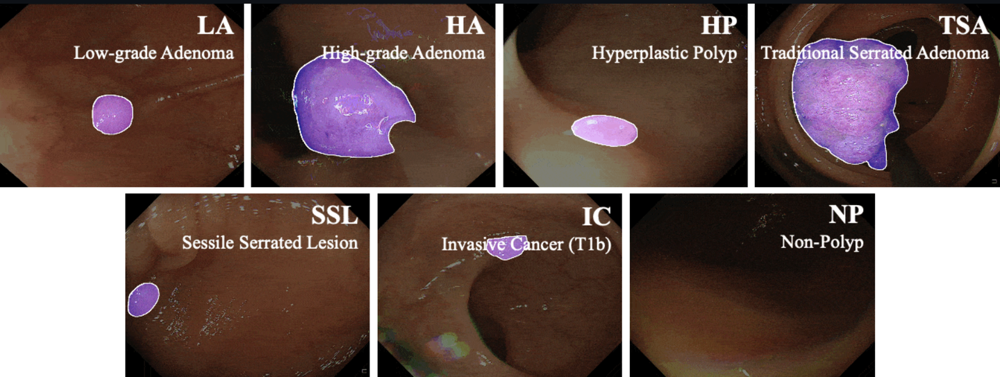
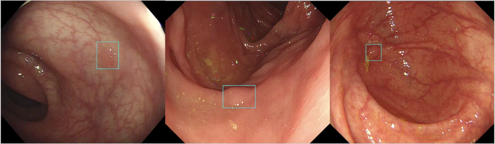

# SUN Colonoscopy Video

<div align="center">
    <a href="https://github.com/openmedlab/"></a>
</div>
<p style="text-align:center;font-size:10px;"><em></em></p>

## Dataset Information

The SUN Colonoscopy Video dataset is a collection of endoscopic video frames for polyp detection, developed in collaboration between Nagoya University and Showa University Northern Yokohama Hospital. The dataset is designed to evaluate the effectiveness of automated colon polyp detection technologies. It includes 49,136 polyp frames from 100 different polyps, all of which have been meticulously annotated with bounding boxes. In addition, the database contains 109,554 frames of non-polyp scenes.

Automating polyp detection to alleviate the workload of endoscopists and improve the accuracy and efficiency of detection is crucial for the early diagnosis and treatment of colon cancer. The SUN Colonoscopy Video dataset advances the development of related automated detection technologies by providing a large number of real-world images with expert-level annotations, making these technologies more feasible and effective in real-world applications.

## Dataset Meta Information

| Dimensions | Modality | Task Type       | Anatomical Structures          | Number of Categories | Data Volume | File Format |
|------------|----------|-----------------|--------------------------------|----------------------|-------------|-------------|
| 2D         | Endoscopy       | Polyp Detection | colon | 1                    | 49,136 polyp frames, 109,554 non-polyp frames        | jpg         |


## Label Information Statistics

Polyp frame label statistics:

| ID | Detection Count | Type | Size | Location        | Pathological Type      | Ratio (%) |
|----|-----------------|------|------|-----------------|------------------------|-----------|
| 1  | 527             | Is   | 6mm  | Cecum           | Low-grade adenoma      | 1.0725338 |
| 2  | 1,313           | Is   | 18mm | Rectum          | High-grade adenoma     | 2.67217519|
| 3  | 292             | IIa  | 3mm  | Ascending colon | Low-grade adenoma      | 0.59426897|
| 4  | 80              | Is   | 4mm  | Sigmoid colon   | Low-grade adenoma      | 0.16281342|
| 5  | 930             | IIa  | 3mm  | Transverse colon| Low-grade adenoma      | 1.89270596|
| 6  | 491             | IIa  | 3mm  | Sigmoid colon   | Low-grade adenoma      | 0.99926734|
| 7  | 315             | IIa  | 6mm  | Descending colon| Low-grade adenoma      | 0.64107782|
| 8  | 256             | Isp  | 12mm | Sigmoid colon   | Low-grade adenoma      | 0.52100293|
| 9  | 136             | Is   | 4mm  | Sigmoid colon   | Low-grade adenoma      | 0.27678281|
| 10 | 436             | IIa  | 3mm  | Transverse colon| Low-grade adenoma      | 0.88733312|
| 11 | 113             | IIa  | 5mm  | Descending colon | Low-grade adenoma      | 0.22997395|
| 12 | 538             | Is   | 5mm  | Rectum           | Low-grade adenoma      | 1.09492022|
| 13 | 479             | Is   | 5mm  | Transverse colon | Low-grade adenoma      | 0.97484533|
| 14 | 1,183           | IIa  | 3mm  | Sigmoid colon    | Low-grade adenoma      | 2.40760339|
| 15 | 487             | Is   | 5mm  | Transverse colon | Low-grade adenoma      | 0.99112667|
| 16 | 199             | Is   | 4mm  | Transverse colon | Low-grade adenoma      | 0.40499837|
| 17 | 304             | Is   | 4mm  | Sigmoid colon    | Low-grade adenoma      | 0.61869098|
| 18 | 243             | Is   | 2mm  | Sigmoid colon    | Hyperplastic polyp     | 0.49454575|
| 19 | 96              | IIa  | 3mm  | Transverse colon | Low-grade adenoma      | 0.1953761 |
| 20 | 3,159           | IIa  | 3mm  | Ascending colon  | Low-grade adenoma      | 6.42909476|
| 21 | 100             | IIa  | 3mm  | Sigmoid colon    | Low-grade adenoma      | 0.20351677|
| 22 | 314             | IIa  | 2mm  | Ascending colon  | Low-grade adenoma      | 0.63904266|
| 23 | 182             | Ip   | 12mm | Ascending colon  | Low-grade adenoma      | 0.37040052|
| 24 | 973             | Ip   | 15mm-| Sigmoid colon    | Low-grade adenoma      | 1.98021817|
| 25 | 338             | Is   | 7mm  | Sigmoid colon    | Low-grade adenoma      | 0.68788668|
| 26 | 370             | Is   | 5mm  | Descending colon | Low-grade adenoma      | 0.75301205|
| 27 | 249             | Is   | 5mm  | Ascending colon  | Hyperplastic polyp     | 0.50675676|
| 28 | 195             | Is   | 2mm  | Transverse colon | Low-grade adenoma      | 0.3968577 |
| 29 | 377             | Isp  | 13mm | Sigmoid colon    | Low-grade adenoma      | 0.76725822|
| 30 | 224             | IIa  | 4mm  | Sigmoid colon    | Low-grade adenoma      | 0.45587756|
| 31 | 183             | Ip   | 12mm | Descending colon | Low-grade adenoma          | 0.37243569 |
| 32 | 981             | Ip   | 15mm-| Ascending colon  | Traditional serrated adenoma| 1.99649951 |
| 33 | 594             | Is   | 5mm  | Sigmoid colon    | Low-grade adenoma          | 1.20888961 |
| 34 | 245             | Is   | 3mm  | Ascending colon  | Low-grade adenoma          | 0.49861609 |
| 35 | 1,212           | Ip   | 15mm-| Sigmoid colon    | High-grade adenoma         | 2.46662325 |
| 36 | 815             | IIa  | 7mm  | Sigmoid colon    | Low-grade adenoma          | 1.65866167 |
| 37 | 448             | Is   | 7mm  | Transverse colon | Low-grade adenoma          | 0.91175513 |
| 38 | 509             | Is   | 5mm  | Ascending colon  | Low-grade adenoma          | 1.03590036 |
| 39 | 713             | IIa  | 13mm | Ascending colon  | Low-grade adenoma          | 1.45107457 |
| 40 | 159             | IIa  | 5mm  | Transverse colon | Low-grade adenoma          | 0.32359166 |
| 41 | 108             | IIa  | 3mm  | Rectum          | Low-grade adenoma          | 0.21979811 |
| 42 | 268             | Is   | 7mm  | Transverse colon| Low-grade adenoma          | 0.54542494 |
| 43 | 260             | Isp  | 10mm | Ascending colon | Low-grade adenoma          | 0.5291436  |
| 44 | 745             | IIa  | 5mm  | Sigmoid colon   | Low-grade adenoma          | 1.51619993 |
| 45 | 383             | Is   | 3mm  | Ascending colon | Low-grade adenoma          | 0.77946923 |
| 46 | 170             | IIa  | 2mm  | Transverse colon| Hyperplastic polyp         | 0.34597851 |
| 47 | 705             | Is   | 5mm  | Transverse colon| Low-grade adenoma          | 1.43479323 |
| 48 | 176             | Is   | 3mm  | Transverse colon| Low-grade adenoma          | 0.35818951 |
| 49 | 181             | IIa  | 3mm  | Transverse colon| Low-grade adenoma          | 0.36836535 |
| 50 | 740             | Ip   | 10mm | Sigmoid colon   | Low-grade adenoma          | 1.5060241  |
| 51 | 1,737           | IIa (LST-NG)   | 15mm | Cecum           | Low-grade adenoma           | 3.53508629 |
| 52 | 207             | IIa            | 6mm  | Sigmoid colon   | Low-grade adenoma           | 0.42127971 |
| 53 | 245             | Is             | 4mm  | Rectum          | Hyperplastic polyp          | 0.49861609 |
| 54 | 345             | Is             | 4mm  | Sigmoid colon   | Low-grade adenoma           | 0.70213286 |
| 55 | 700             | Is             | 3mm  | Ascending colon | Low-grade adenoma           | 1.42461739 |
| 56 | 248             | Is             | 4mm  | Sigmoid colon   | Hyperplastic polyp          | 0.50472159 |
| 57 | 326             | Is             | 5mm  | Transverse colon| Low-grade adenoma           | 0.66346467 |
| 58 | 267             | IIa            | 6mm  | Transverse colon| Sessile serrated lesion     | 0.54338978 |
| 59 | 646             | Isp            | 8mm  | Sigmoid colon   | Traditional serrated adenoma| 1.31471833 |
| 60 | 146             | IIa            | 8mm  | Transverse colon| Low-grade adenoma           | 0.29713448 |
| 61 | 679             | Isp  | 6mm  | Ascending colon  | Low-grade adenoma          | 1.38187887 |
| 62 | 351             | Is   | 7mm  | Ascending colon  | Low-grade adenoma          | 0.71434386 |
| 63 | 632             | Is   | 7mm  | Rectum           | Invasive cancer (T1b)      | 1.28622599 |
| 64 | 81              | IIa  | 3mm  | Sigmoid colon    | Low-grade adenoma          | 0.16484858 |
| 65 | 222             | IIa  | 3mm  | Cecum            | Low-grade adenoma          | 0.45180723 |
| 66 | 1,685           | Is   | 6mm  | Sigmoid colon    | Low-grade adenoma          | 3.42925757 |
| 67 | 191             | IIa  | 5mm  | Transverse colon | Low-grade adenoma          | 0.38871703 |
| 68 | 1,319           | Is   | 15mm | Rectum           | High-grade adenoma         | 2.68438619 |
| 69 | 130             | IIa  | 3mm  | Descending colon | Low-grade adenoma          | 0.2645718  |
| 70 | 264             | Ip   | 15mm | Sigmoid colon    | Low-grade adenoma          | 0.53728427 |
| 71 | 1,021           | Is   | 4mm  | Ascending colon  | Low-grade adenoma   | 2.07790622 |
| 72 | 774             | Is   | 5mm  | Ascending colon  | Low-grade adenoma   | 1.5752198  |
| 73 | 1,285           | Is   | 3mm  | Cecum            | Low-grade adenoma   | 2.61519049 |
| 74 | 276             | Isp  | 5mm  | Sigmoid colon    | Low-grade adenoma   | 0.56170628 |
| 75 | 343             | Is   | 3mm  | Transverse colon | Low-grade adenoma   | 0.69806252 |
| 76 | 343             | Is   | 3mm  | Cecum            | Low-grade adenoma   | 0.69806252 |
| 77 | 215             | Is   | 4mm  | Ascending colon  | Low-grade adenoma   | 0.43756106 |
| 78 | 267             | Isp  | 12mm | Sigmoid colon    | High-grade adenoma  | 0.54338978 |
| 79 | 76              | Is   | 4mm  | Descending colon | Low-grade adenoma   | 0.15467275 |
| 80 | 1,192           | Is   | 10mm | Sigmoid colon    | Low-grade adenoma   | 2.4259199  |
| 81 | 427             | Is   | 6mm  | Sigmoid colon    | Low-grade adenoma            | 0.86901661 |
| 82 | 111             | IIa  | 3mm  | Sigmoid colon    | Sessile serrated lesion      | 0.22590361 |
| 83 | 795             | Isp  | 13mm | Rectum           | Low-grade adenoma            | 1.61795832 |
| 84 | 218             | Is   | 5mm  | Descending colon | Low-grade adenoma            | 0.4436656  |
| 85 | 1,393           | IIa  | 8mm  | Ascending colon  | Low-grade adenoma            | 2.8349886  |
| 86 | 257             | IIa  | 4mm  | Sigmoid colon    | Low-grade adenoma            | 0.5230381  |
| 87 | 454             | Is   | 3mm  | Cecum            | Low-grade adenoma            | 0.92396613 |
| 88 | 249             | Is   | 4mm  | Ascending colon  | Low-grade adenoma            | 0.50675676 |
| 89 | 149             | Ip   | 5mm  | Descending colon | Low-grade adenoma            | 0.3032399  |
| 90 | 479             | Is   | 10mm | Ascending colon  | Sessile serrated lesion      | 0.97484533 |
| 91  | 1,061           | IIa  | 13mm | Ascending colon  | Low-grade adenoma            | 2.15931293 |
| 92  | 391             | Is   | 7mm  | Descending colon | Low-grade adenoma            | 0.79575057 |
| 93  | 452             | Is   | 7mm  | Descending colon | Low-grade adenoma            | 0.9198958  |
| 94  | 136             | Is   | 6mm  | Sigmoid colon    | Low-grade adenoma            | 0.27678281 |
| 95  | 606             | Isp  | 8mm  | Sigmoid colon    | Low-grade adenoma            | 1.23331162 |
| 96  | 301             | Is   | 5mm  | Sigmoid colon    | Hyperplastic polyp           | 0.61258548 |
| 97  | 431             | IIa  | 15mm-| Cecum            | Sessile serrated lesion      | 0.87715728 |
| 98  | 170             | IIa  | 4mm  | Transverse colon | Low-grade adenoma            | 0.34597851 |
| 99  | 161             | Is   | 5mm  | Sigmoid colon    | Low-grade adenoma            | 0.327662   |
| 100 | 188             | IIa  | 3mm  | Rectum           | Hyperplastic polyp           | 0.38261153 |

Non-polyp frame label statistics:

| ID | Detection Count | Detection Time (s) | Ratio (%) |
|----|-----------------|--------------------|-----------|
| 1  | 9,961           | 332                | 9.09232   |
| 2  | 10,073          | 335.8              | 9.194552  |
| 3  | 7,152           | 238.4              | 6.528287  |
| 4  | 14,635          | 487.8              | 13.35871  |
| 5  | 7,916           | 263.9              | 7.22566   |
| 6  | 17,046          | 511.4              | 15.55945  |
| 7  | 5,636           | 169.1              | 5.144495  |
| 8  | 2,568           | 85.6               | 2.34405   |
| 9  | 9,522           | 317.4              | 8.691604  |
| 10 | 7,086           | 236.2              | 6.468043  |
| 11 | 4,832           | 161.1              | 4.41061   |
| 12 | 6,799           | 226.6              | 6.206072  |
| 13 | 6,328           | 210.9              | 5.776147  |


## Visualization

<div align="center">
    <a href="https://github.com/openmedlab/"></a>
</div>
<p style="text-align:center;font-size:10px;"><em></em></p>

<div align="center">
    <a href="https://github.com/openmedlab/"></a>
</div>
<p style="text-align:center;font-size:10px;"><em></em></p>

## File Structure

As the official sources have not provided the specific structure of the files, and since SUN-SEG has provided data preparation for this dataset, we will use the data preparation provided by SUN-SEG as the standard for [reference](https://github.com/GewelsJI/VPS/blob/main/docs/DATA_PREPARATION.md).

The processed data structure is as follows:

``` 
├──data
    ├──SUN-SEG
        ├──TrainDataset
            ├──Frame  # The images from the SUN dataset
                ├──case1_1
                    ├──image_name_00001.jpg
                    |...
                ├──case1_3
                |...
            ├──GT  # Object-level segmentation mask
                ├──case1_1
                    ├──image_name_00001.png
                    |...
                ├──case1_3
                |...
            ├──Edge  # Weak label with edge
                |...
            ├──Scribble  # Weak label with scribble
                |...
            ├──Polygon  # Weak label with Polygon
                |...
            ├──Classification  # Category classification annotation
                ├──classification.txt
            ├──Detection  # Bounding box
                ├──bbox_annotation.json
        ├──TestEasyDataset
            ├──Seen
                ├──Frame
                    ├──case2_3
                    |...
                ├──GT
                    ├──case2_3
                    |...
                |...
            ├──Unseen
                ├──Frame
                    ├──case3_1
                    |...
                ├──GT
                    ├──case3_1
                    |...
                |...
        ├──TestHardDataset
            ├──Seen
                ├──Frame
                    ├──case1_2
                    |...
                ├──GT
                    ├──case1_2
                    |...
                |...
            ├──Unseen
                ├──Frame
                    ├──case10_1
                    |...
                ├──GT
                    ├──case10_1
                    |...
                |...
```

## Authors and Institutions

Masashi Misawa (Digestive Disease Center, Showa University Northern Yokohama Hospital)

Shin-Ei Kudo (Digestive Disease Center, Showa University Northern Yokohama Hospital)

Yuichi Mori (Digestive Disease Center, Showa University Northern Yokohama Hospital)

Kinichi Hotta (Endoscopy Division, Shizuoka Cancer Center)

Kazuo Ohtsuka (Endoscopy Department, Tokyo Medical and Dental University)

Takahisa Matsuda (Cancer Screening Center, National Cancer Center Hospital; Division of Screening Technology, Center for Public Health Sciences, National Cancer Center; Endoscopy Division, National Cancer Center Hospital)

Shoichi Saito (Gastroenterology Department, Cancer Institute Hospital)

Toyoki Kudo (Digestive Disease Center, Showa University Northern Yokohama Hospital)

Toshiyuki Baba (Digestive Disease Center, Showa University Northern Yokohama Hospital)

Fumio Ishida (Digestive Disease Center, Showa University Northern Yokohama Hospital)

Hayato Itoh (Graduate School of Informatics, Nagoya University)

Masahiro Oda (Graduate School of Informatics, Nagoya University)

Kensaku Mori (Graduate School of Informatics, Nagoya University)


## Source Information

Official Website: http://amed8k.sundatabase.org/

Download Link: http://amed8k.sundatabase.org/

Article Address: https://www.giejournal.org/article/S0016-5107(20)34655-1/fulltext

Publication Date: 2020-7

## Citation

``` 
@article{misawa2021development,
  title={Development of a computer-aided detection system for colonoscopy and a publicly accessible large colonoscopy video database (with video)},
  author={Misawa, Masashi and Kudo, Shin-ei and Mori, Yuichi and Hotta, Kinichi and Ohtsuka, Kazuo and Matsuda, Takahisa and Saito, Shoichi and Kudo, Toyoki and Baba, Toshiyuki and Ishida, Fumio and others},
  journal={Gastrointestinal endoscopy},
  volume={93},
  number={4},
  pages={960--967},
  year={2021},
  publisher={Elsevier}
}
```

Original introduction article is [here](https://zhuanlan.zhihu.com/p/672056402).