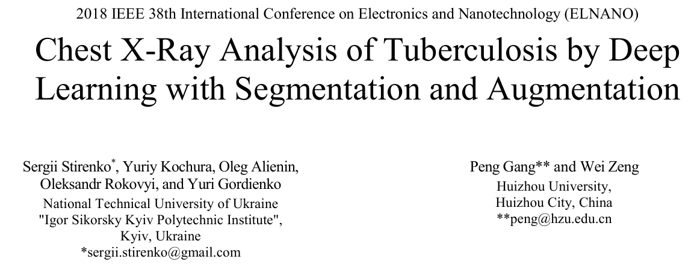
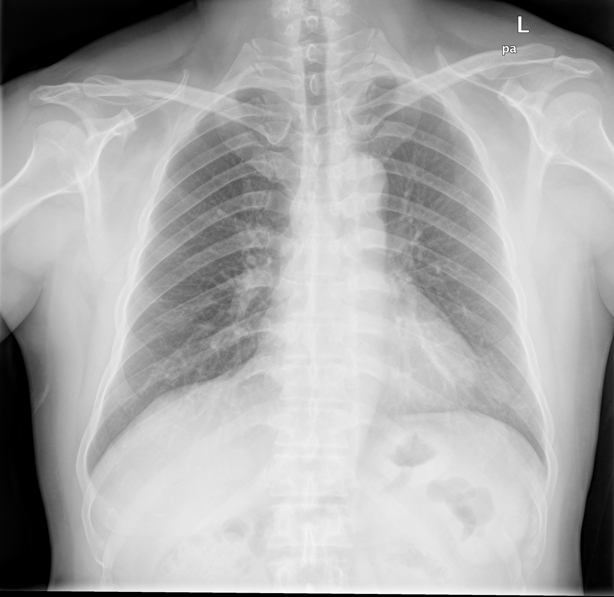
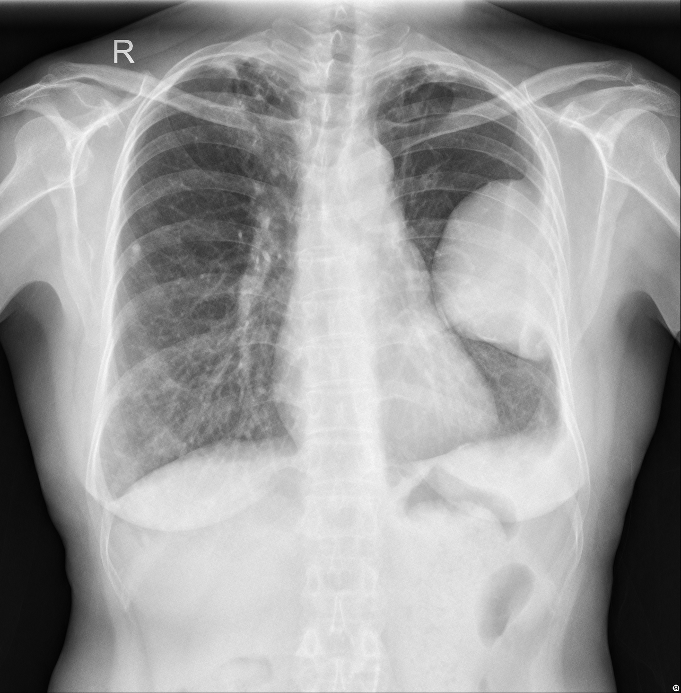
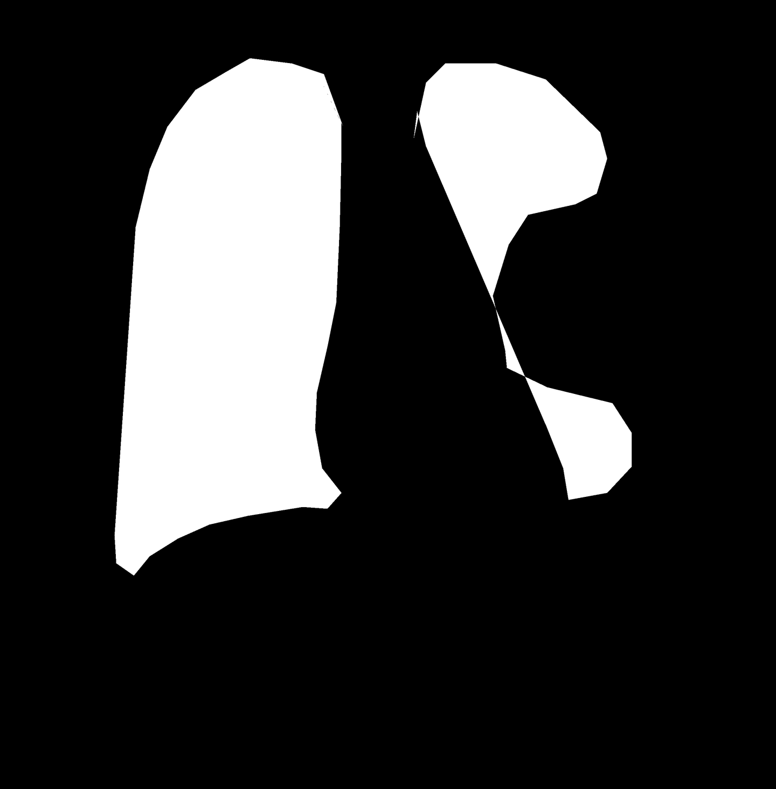

# SZ-CXR

<div align="center">
    <a href="https://github.com/openmedlab/"></a>
</div>
<p style="text-align:center;font-size:10px;"><em></em></p>

## Dataset Information

**SZ-CXR** is a lung X-ray dataset designed for tuberculosis diagnosis. The dataset contains **336 X-ray images with tuberculosis** and **326 X-ray images without tuberculosis**. To assist in accurate tuberculosis diagnosis, the dataset also provides **lung contour segmentation annotations** for each image. The entire dataset is divided into **training, validation, and test sets** in an **8:1:1 ratio**.

The significance of this dataset lies in its application for **computer-aided tuberculosis diagnosis** using deep learning and segmentation techniques. Although relatively small, with around **662 images**, studies have shown that deep convolutional neural networks can achieve statistically reliable tuberculosis prediction results on this dataset through appropriate **data augmentation** and lung region segmentation processing. This work demonstrates that even on imbalanced and small datasets, optimizing segmentation and data processing methods can improve the accuracy of medical image analysis, providing strong support for disease diagnosis.

## Dataset Meta Information

| Dimensions | Modality | Task Type                    | Anatomical Structures | Anatomical Area | Number of Categories | Data Volume | File Format |
|------------|----------|------------------------------|-----------------------|-----------------|----------------------|-------------|-------------|
| 2D         | X-Ray    | Segmentation, Classification | Tuberculosis          | Lung            | 1                    | 566         | PNG         |


### Resolution Details

| Dataset Statistics | size       |
|--------------------|------------|
| min                | 989*1225   |
| median             | 2937*2743  |
| max                | 3001*3001  |

## Label Information Statistics

| Metric        | Lung |
|---------------|------|
| Case Count    | 566  |
| Coverage      | 100% |

## Visualization

Original X-ray image without tuberculosis and lung annotation:

<div align="center">
    <a href="https://github.com/openmedlab/"></a>
</div>
<p style="text-align:center;font-size:10px;"><em></em></p>

<div align="center">
    <a href="https://github.com/openmedlab/"></a>
</div>
<p style="text-align:center;font-size:10px;"><em></em></p>

Original X-ray image containing tuberculosis and lung annotations:

<div align="center">
    <a href="https://github.com/openmedlab/"></a>
</div>
<p style="text-align:center;font-size:10px;"><em></em></p>

<div align="center">
    <a href="https://github.com/openmedlab/"></a>
</div>
<p style="text-align:center;font-size:10px;"><em></em></p>

## File Structure

``` 
SZ-CXR
│
├── images
│   ├── CHNCXR_0001_0.png
│   ├── CHNCXR_0002_0.png
│   ├── CHNCXR_0003_0.png
│   ├── ...
│
└── masks
    ├── CHNCXR_0001_0_mask.png
    ├── CHNCXR_0002_0_mask.png
    ├── CHNCXR_0003_0_mask.png
    ├── ...
```

## Authors and Institutions

Sergii Stirenko (National Technical University of Ukraine "Igor Sikorsky Kyiv Polytechnic Institute")

Yuriy Kochura (National Technical University of Ukraine "Igor Sikorsky Kyiv Polytechnic Institute")

Oleg Alienin (National Technical University of Ukraine "Igor Sikorsky Kyiv Polytechnic Institute")

Oleksandr Rokovyi (National Technical University of Ukraine "Igor Sikorsky Kyiv Polytechnic Institute")

Yuri Gordienko (National Technical University of Ukraine "Igor Sikorsky Kyiv Polytechnic Institute")

## Source Information

Official Website: https://www.kaggle.com/datasets/raddar/tuberculosis-chest-xrays-shenzhen

Download Link: https://lhncbc.nlm.nih.gov/LHC-downloads/downloads.html#tuberculosis-image-data-sets
Article Address: https://ieeexplore.ieee.org/stamp/stamp.jsp?tp=&arnumber=8477564

Publication Date: 2018

## Citation

``` 
@inproceedings{stirenko2018chest,
  title={Chest X-ray analysis of tuberculosis by deep learning with segmentation and augmentation},
  author={Stirenko, Sergii and Kochura, Yuriy and Alienin, Oleg and Rokovyi, Oleksandr and Gordienko, Yuri and Gang, Peng and Zeng, Wei},
  booktitle={2018 IEEE 38th International Conference on Electronics and Nanotechnology (ELNANO)},
  pages={422--428},
  year={2018},
  organization={IEEE}
}
```

Original introduction article is [here](https://zhuanlan.zhihu.com/p/1072030774).