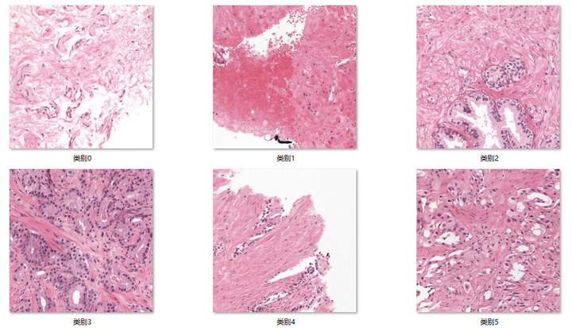
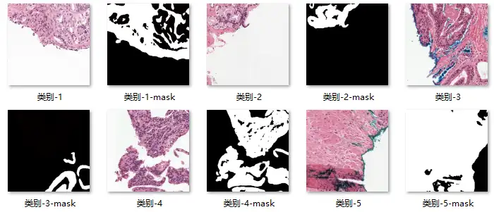

# SegPANDA200

<div align="center">
    <a href="https://github.com/openmedlab/"></a>
</div>
<p style="text-align:center;font-size:10px;"><em></em></p>

## Dataset Information

The **SegPANDA200** dataset is a pathology dataset specifically designed for image segmentation, generated from the PANDA challenge dataset, with patch images sized at 1024 pixels. The dataset contains a total of 100,960 images of six different types of tissue, which are evenly divided into training, validation, and test sets according to the proportion of ISUP grades.

Prostate cancer (PCa) is the second most common cancer among men worldwide, with over 1 million new cases diagnosed each year and more than 350,000 deaths annually. Reducing the mortality rate hinges on developing more accurate diagnostic methods. PCa diagnosis is based on the grading of prostate tissue biopsies, which are examined by pathologists and scored according to the Gleason grading system. Deep learning systems have shown great potential in accurately grading PCa. This dataset enables further research and development of more precise image segmentation algorithms, thereby improving the accuracy of prostate cancer diagnosis.

Additionally, the dataset can serve as a small fine-tuning dataset for refining models that have been pre-trained on large-scale datasets, enhancing performance on specific tasks. This provides a valuable resource for developing more customized and accurate diagnostic tools for prostate cancer.

## Dataset Meta Information

| Dimensions | Modality  | Task Type    | Anatomical Structures | Number of Categories | Data Volume   | File Format |
|------------|-----------|--------------|-----------------------|----------------------|---------------|-------------|
| 2D         | Pathology | Segmentation | Prostate              | 6                    | 100960        | JPG, PNG    |


### Resolution Details

| Dataset Statistics  | size          |
|---------------------|---------------|
| min                 | (1024, 1024)  |
| median              | (1024, 1024)  |
| max                 | (1024, 1024)  |

## Label Information Statistics

| Category                                           | Number of Occurrences | Percentage of Occurrences |
|----------------------------------------------------|------------------------|----------------------------|
| 0 - background (non tissue) or unknown              | 19,000                 | 18.82%                     |
| 1 - stroma                                          | 17,136                 | 16.97%                     |
| 2 - healthy epithelium                              | 13,650                 | 13.52%                     |
| 3 - cancerous epithelium (Gleason 3)                | 14,844                 | 14.70%                     |
| 4 - cancerous epithelium (Gleason 4)                | 14,150                 | 14.02%                     |
| 5 - cancerous epithelium (Gleason 5)                | 20,076                 | 20.58%                     |

## Visualization

<div align="center">
    <a href="https://github.com/openmedlab/"></a>
</div>
<p style="text-align:center;font-size:10px;"><em> Local Visualization.</em></p>

## File Structure

``` 
segPANDA200
│
├── train
│   ├─0
│   ├──folder-1
│   ├───folder-1-img1.jpg
│   ├───folder-1-mask1.png
│   ├───folder-1-img2.jpg
│   ├───folder-1-mask2.png
│   ├───...
│   ├─1
│   └─2
│   └─3
│   └─4
│   └─5
├── val
├── test
```

## Authors and Institutions

Masakata Kawai（University of Yamanashi, Department of Pathology）

Noriaki Ota（Systems Research & Development Center, Technology Bureau, NS Solutions Corp.）

Shinsuke Yamaoka（Systems Research & Development Center, Technology Bureau, NS Solutions Corp.）

## Source Information

Official Website: https://link.springer.com/chapter/10.1007/978-3-031-44917-8_25

Download Link: https://drive.google.com/drive/folders/1kPWiFxL5HxVRM4antSPq9FzjBIbmkGWA

Article Address: https://link.springer.com/chapter/10.1007/978-3-031-44917-8_25

Publication Date: 2023-10

## Citation

``` 
@inproceedings{kawai2023large,
  title={Large-scale pretraining on pathological images for fine-tuning of small pathological benchmarks},
  author={Kawai, Masakata and Ota, Noriaki and Yamaoka, Shinsuke},
  booktitle={Workshop on Medical Image Learning with Limited and Noisy Data},
  pages={257--267},
  year={2023},
  organization={Springer}
}
```

Original introduction article is [here](https://zhuanlan.zhihu.com/p/711820068).