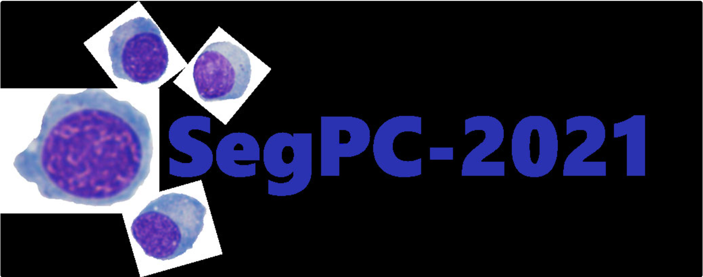
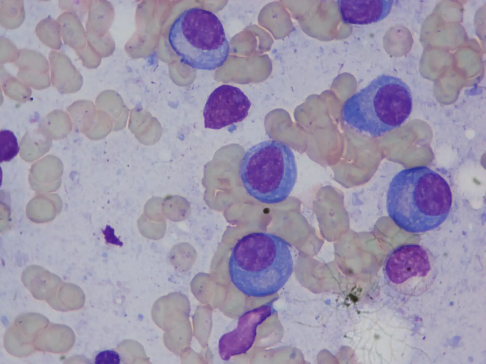
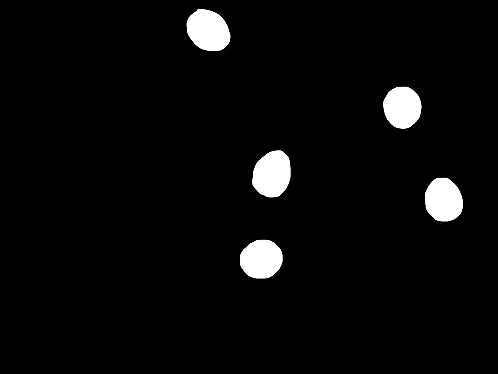

# SegPC21

<div align="center">
    <a href="https://github.com/openmedlab/"></a>
</div>
<p style="text-align:center;font-size:10px;"><em></em></p>

## Dataset Information

The **SegPC-21** dataset is a segmentation dataset for microscopic images of plasma cells in multiple myeloma. The pathological microscopic images in the dataset were obtained from bone marrow aspiration slides of patients diagnosed with multiple myeloma (MM). The slides were stained using Jenner-Giemsa, and the cells of interest are plasma cells, which are the cells to be segmented in the dataset. The pathological slides in the dataset were captured using two different microscopes with resolutions of 2040x1536 and 1920x2560. The dataset provides fine-grained segmentation labels for plasma cells, specifically segmenting the cytoplasm and nucleus of the plasma cells. The training set consists of 298 images, the validation set contains 200 images, and the test set includes 277 images.

Segmenting plasma cells in pathological slides can assist in diagnosing plasma cell cancer (multiple myeloma, a type of blood cancer). Developing automatic, accurate, and fast plasma cell segmentation algorithms can help pathologists improve diagnostic efficiency and success rates, aiding in the early screening of plasma cell cancer. Plasma cell segmentation is quite a challenging task due to the varying morphology and size of plasma cells, and their potential contact with other cells, which adds to the complexity of segmentation. This dataset provides a substantial number of high-quality annotated pathological slides of plasma cells, promoting the development of related algorithms.

## Dataset Meta Information

| Dimensions | Modality             | Task Type      | Anatomical Structures | Number of Categories | Data Volume | File Format |
|------------|----------------------|----------------|-----------------------|----------------------|-------------|-------------|
| 2D         | Microscopic Imaging  | Segmentation   | Myeloma               | 2                    | 498         | .bmp        |


### Resolution Details

| Dataset Statistics | size       |
|--------------------|------------|
| min                | 1536x2040  |
| median             | 1536x2040  |
| max                | 1536x2040  |

## Label Information Statistics

| Anatomical Structure      | Cytoplasm | Nucleus |
|---------------------------|-----------|---------|
| Number of Occurrences     | 498       | 498     |
| Percentage of Occurrences | 100%      | 100%    |

## Visualization

<div align="center">
    <a href="https://github.com/openmedlab/"></a>
</div>
<p style="text-align:center;font-size:10px;"><em> Raw Image.</em></p>

<div align="center">
    <a href="https://github.com/openmedlab/"></a>
</div>
<p style="text-align:center;font-size:10px;"><em>Cytoplasm.</em></p>

<div align="center">
    <a href="https://github.com/openmedlab/"></a>
</div>
<p style="text-align:center;font-size:10px;"><em>Nucleus.</em></p>

## File Structure

``` 
SegPC2021
└── SegPC2021
    └── TCIA_SegPC_dataset
        └── TCIA_SegPC_dataset
            └── TCIA_SegPC_dataset
                ├── submission_and_evaluation_scripts_and_readme
                ├── test
                ├── train
                │   └── train
                │       └── train
                │           ├── x
                │           │   ├── 106.bmp
                │           │   ├── 108.bmp
                │           │   └── ...
                │           └── y
                │               ├── 106_1.bmp
                │               ├── 106_2.bmp
                │               └── ...
                └── validation
```

## Authors and Institutions

Anubha Gupta (SBILab, Department of ECE, IIIT-Delhi, New Delhi, 110020, India)

Rahul Duggal (SBILab, Department of ECE, IIIT-Delhi, New Delhi, 110020, India)

Shiv Gehlot (SBILab, Department of ECE, IIIT-Delhi, New Delhi, 110020, India)

Ritu Gupta (Laboratory Oncology Unit, Dr. B. R.A. IRCH, AIIMS, Delhi, India)

Anvit Mangal (SBILab, Department of ECE, IIIT-Delhi, New Delhi, 110020, India)

Lalit Kumar (Deptt. of Medical Oncology, Dr. B. R.A. IRCH, AIIMS, Delhi, India)

Nisarg Thakkar (Dept. of CSE, BITS Pilani Goa Campus, India)

Devprakash Satpathy (Dept. of CSE, BITS Pilani Goa Campus, India)

## Source Information

Official Website: https://segpc-2021.grand-challenge.org/SegPC-2021/

Download Link: https://segpc-2021.grand-challenge.org/SegPC-2021/

Article Address: https://www.sciencedirect.com/science/article/pii/S1361841520301523?via%3Dihub

Publication Date: 2021.04

## Citation

``` 
@article{gupta2020gcti,
  title={GCTI-SN: Geometry-inspired chemical and tissue invariant stain normalization of microscopic medical images},
  author={Gupta, Anubha and Duggal, Rahul and Gehlot, Shiv and Gupta, Ritu and Mangal, Anvit and Kumar, Lalit and Thakkar, Nisarg and Satpathy, Devprakash},
  journal={Medical Image Analysis},
  volume={65},
  pages={101788},
  year={2020},
  publisher={Elsevier}
}
```

Original introduction article is [here](https://zhuanlan.zhihu.com/p/712986709).