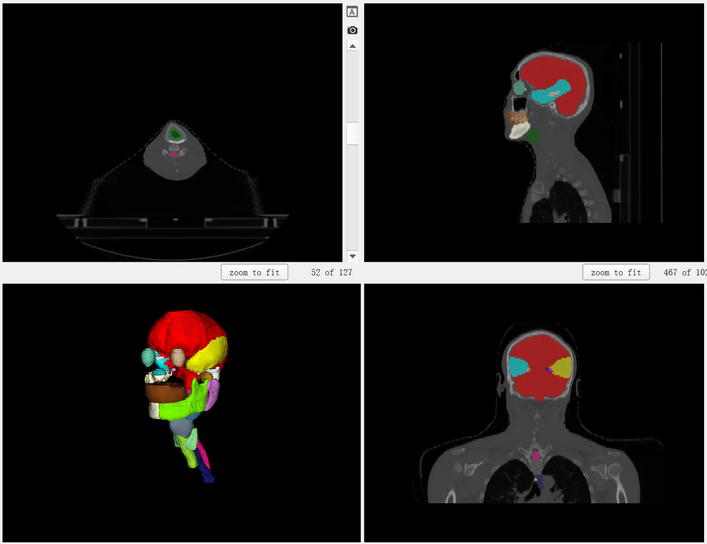
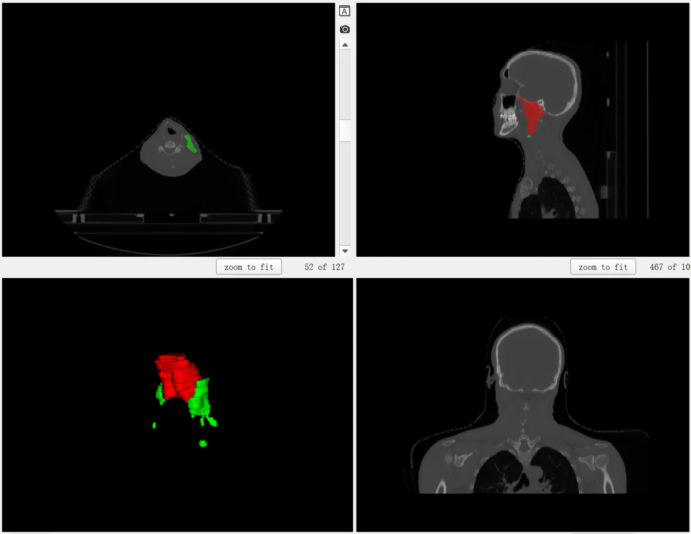

# SegRap 2023

## Dataset Information

The SegRap 2023 dataset provides precise segmentation of high-risk organs (Organs-At-Risk, OAR) and the entire volume of tumors (Gross Tumor Volume, GTV) in nasopharyngeal cancer patients, based on plain CT and contrast-enhanced CT images. As a challenge in MICCAI 2023, SegRap introduces two challenging tasks: Task 1 involves detailed segmentation of 45 types of OAR, covering some smaller or structurally complex head and neck organs, such as the parotid gland and optic nerve; Task 2 focuses on the segmentation of the entire volume of tumors, mainly nasopharyngeal carcinoma and its associated lymph nodes. It is important to note that some regions among the 45 types of OAR overlap, such as the temporal lobe with the hippocampus, and the middle ear with the tympanic cavity. To differentiate these overlapping parts, officials provide not only separate segmentation masks for the 45 types of OAR but also a unified mask containing 54 labels, with 9 labels specifically representing these overlapping areas. The SegRap 2023 dataset in total includes 200 cases, with 120 cases of training data publicly providing images and annotations, and 20 cases of validation data providing images only.

In the field of radiation therapy, the key to 3D CT image segmentation is to accurately identify and protect OAR to ensure that while eradicating tumors, the damage to surrounding vital organs is minimized as much as possible. Taking brain tumor radiation therapy as an example, although it is necessary to ensure that the tumor absorbs a sufficient dose of radiation for complete eradication, it is also imperative to protect sensitive areas like the optic nerve from excessive radiation. Therefore, the ability to automatically and accurately segment OAR from CT images has great clinical value in enhancing treatment efficiency and patient safety. At the same time, accurately delineating the GTV of tumor areas is equally important, as it directly affects the formulation of treatment plans and the distribution of radiation doses. Hence, the design of the SegRap dataset aims to promote research and technological advancements in this field, achieving more precise and safe radiation therapy.


## Dataset Meta Information

| Dimensions | Modality   | Task Type | Anatomical Structures                             | Anatomical Area | Number of Categories  | Data Volume | File Format |
|------------|------------|-----------|---------------------------------------------------|-----------------|-----------------------|-------------|-------------|
| 3D         | CE CT & CT | Segmentation | 45 types of head and neck OAR & 2 types of tumors | Head and Neck   | Task 1: 45, Task 2: 2 | Training: 120 Validation: 20 Test: 60        | .nii.gz     |


### Resolution Details

| Dataset Statistics | spacing (mm)     | size            |
|--------------------|------------------|-----------------|
| min                | (0.43, 0.43, 3.00)              | (512, 512, 98)     |
| median             | (0.54, 0.54, 3.00)           | (1024, 1024, 126) |
| max                | (1.13, 1.13, 3.02)              | (1024, 1024, 197) |

## Label Information Statistics

### Task 1 - OAR

| Label | Segmented Organ       | Cases | Coverage | Volume (cm³) | Average Volume (cm³) | Maximum Volume (cm³) |
|-------|-----------------------|-------|----------|--------------|----------------------|----------------------|
| 1     | Brain                 | 120   | 100%     | 763.24       | 1123.11              | 1350.8               |
| 2     | BrainStem             | 120   | 100%     | 21.68        | 31.71                | 39.28                |
| 3     | Chiasm                | 120   | 100%     | 0.26         | 1.17                 | 1.88                 |
| 4     | TemporalLobe_L        | 120   | 100%     | 66.29        | 98.3                 | 124.94               |
| 5     | TemporalLobe_R        | 120   | 100%     | 68.5         | 107.82               | 133.59               |
| 6     | TemporalLobe_Hippocampus_Overlap_L | 120   | 100%     | 1.6          | 4.41                 | 6.98                 |
| 7     | TemporalLobe_Hippocampus_Overlap_R | 120   | 100%     | 1.3          | 3.9                  | 6.23                 |
| 8     | Hippocampus_L         | 119   | 99%      | 0            | 0.37                 | 1.78                 |
| 9     | Hippocampus_R         | 117   | 98%      | 0.01         | 0.45                 | 1.63                 |
| 10    | Eye_L                 | 120   | 100%     | 6.5          | 10.46                | 12.48                |
| 11    | Eye_R                 | 120   | 100%     | 6.22         | 10.28                | 12.36                |
| 12    | Lens_L                | 120   | 100%     | 0.12         | 0.27                 | 0.76                 |
| 13    | Lens_R                | 120   | 100%     | 0.18         | 0.3                  | 0.43                 |
| 14    | OpticNerve_L          | 120   | 100%     | 0.44         | 0.76                 | 1.39                 |
| 15    | OpticNerve_R          | 120   | 100%     | 0.27         | 0.8                  | 1.32                 |
| 16    | MiddleEar_L           | 120   | 100%     | 0.28         | 0.55                 | 2.75                 |
| 17    | MiddleEar_R           | 120   | 100%     | 0.23         | 0.5                  | 2.35                 |
| 18    | IAC_L (Internal Acoustic Canal_L) | 120   | 100%     | 0.07         | 0.2                  | 0.36                 |
| 19    | IAC_R (Internal Acoustic Canal_R) | 120   | 100%     | 0.09         | 0.19                 | 0.35                 |
| 20    | MiddleEar_TympanicCavity_Overlap_L | 120   | 100%     | 0.07         | 0.3                  | 0.45                 |
| 21    | MiddleEar_TympanicCavity_Overlap_R | 120   | 100%     | 0.08         | 0.29                 | 0.44                 |
| 22    | TympanicCavity_L                   | 120   | 100%     | 0.01         | 0.28                 | 0.53                 |
| 23    | TympanicCavity_R                   | 120   | 100%     | 0.12         | 0.42                 | 0.67                 |
| 24    | MiddleEar_VestibulSemi_Overlap_L   | 120   | 100%     | 0.08         | 0.13                 | 0.24                 |
| 25    | MiddleEar_VestibulSemi_Overlap_R   | 120   | 100%     | 0.05         | 0.1                  | 0.2                  |
| 26    | VestibulSemi_L                     | 119   | 99%      | 0            | 0.05                 | 0.12                 |
| 27    | VestibulSemi_R                     | 118   | 98%      | 0.03         | 0.08                 | 0.14                 |
| 28    | Cochlea_L                          | 120   | 100%     | 0.07         | 0.17                 | 0.23                 |
| 29    | Cochlea_R                          | 120   | 100%     | 0.07         | 0.18                 | 0.26                 |
| 30    | MiddleEar_ETbone_Overlap_L         | 115   | 96%      | 0.01         | 0.05                 | 0.11                 |
| 31    | MiddleEar_ETbone_Overlap_R         | 97    | 81%      | 0            | 0.02                 | 0.05                 |
| 32    | ETbone_L                           | 120   | 100%     | 0.05         | 0.16                 | 0.29                 |
| 33    | ETbone_R                           | 120   | 100%     | 0.09         | 0.19                 | 0.32                 |
| 34    | Pituitary                          | 120   | 100%     | 0.08         | 0.28                 | 0.55                 |
| 35    | OralCavity                         | 120   | 100%     | 98.83        | 150.09               | 192.49               |
| 36    | Mandible_L                         | 120   | 100%     | 31.17        | 44.69                | 63.06                |
| 37    | Mandible_R                         | 120   | 100%     | 31.21        | 45.54                | 68.26                |
| 38    | Submandibular_L                    | 120   | 100%     | 3.64         | 9.78                 | 14.08                |
| 39    | Submandibular_R                    | 120   | 100%     | 0.06         | 9.35                 | 14.77                |
| 40    | Parotid_L                          | 120   | 100%     | 20.97        | 35.13                | 56.43                |
| 41    | Parotid_R                          | 120   | 100%     | 19.39        | 36.47                | 57.08                |
| 42    | Mastoid_L                          | 120   | 100%     | 4.43         | 14.38                | 35.43                |
| 43    | Mastoid_R                          | 120   | 100%     | 5.04         | 13.78                | 33.2                 |
| 44    | TMjoint_L                          | 120   | 100%     | 1.4          | 3.04                 | 4.74                 |
| 45    | TMjoint_R                          | 120   | 100%     | 1.84         | 2.82                 | 3.97                 |
| 46    | SpinalCord                         | 120   | 100%     | 17.49        | 29.14                | 59.56                |
| 47    | Esophagus                          | 120   | 100%     | 7.32         | 18.16                | 59.03                |
| 48    | Larynx                             | 120   | 100%     | 9.78         | 31.8                 | 47.64                |
| 49    | Larynx_Glottic                     | 120   | 100%     | 1.19         | 5.92                 | 10.58                |
| 50    | Larynx_Supraglot                   | 120   | 100%     | 3.77         | 7.9                  | 13.01                |
| 51    | Larynx_PharynxConstr_Overlap  | 120   | 100%     | 3.38         | 8.07                 | 11.27                |
| 52    | PharynxConstr                 | 120   | 100%     | 5.6          | 11.1                 | 16.85                |
| 53    | Thyroid                       | 120   | 100%     | 4.45         | 17.56                | 50.97                |
| 54    | Trachea                       | 120   | 100%     | 17.75        | 36.98                | 63.59                |

### Task 2 - GTV

| Segmentation Organ | GTVnx (Primary Tumor) | GTVnd (Lymph Nodes) |
|--------------------|-----------------------|---------------------|
| Cases              | 120                   | 120                 |
| Coverage           | 100%                  | 100%                |
| Volume (cm³)       | 30                    | 3.73                |
| Average Volume (cm³) | 81                  | 28                  |
| Maximum Volume (cm³) | 244                 | 153                 |


## Visualization

<div align="center">
    <a href="https://github.com/openmedlab/"></a>
</div>
<p style="text-align:center;font-size:10px;"><em> Task 1: OAR </em></p>

<div align="center">
    <a href="https://github.com/openmedlab/"></a>
</div>
<p style="text-align:center;font-size:10px;"><em> Task 2: GTV </em></p>

## File Structure


The official release includes two files: "SegRap2023_Training_Set_120cases.zip" (which contains separated masks for each category and two types of modal images, including 2 images + 45 OAR masks + 2 GTV masks, totaling 49 NIfTI files) and "SegRap2023_Training_Set_120cases_OneHot_Labels.zip" (divided into two tasks, each containing a multi-class mask file that combines all categories for each case).


``` 
Dataset
│
├── SegRap2023_Training_Set_120cases
│   ├── segrap_0000
│   │   ├── image.nii.gz
│   │   ├── image_contrast.nii.gz
│   │   ├── Brain.nii.gz
│   │   ├── ...
│   │   ├── GTVnd.nii.gz
│   │   ├── GTVp.nii.gz
│   └── ...
├── SegRap2023_Training_Set_120cases_OneHot_Labels
│   ├── task001
│   │   ├── segrap_0000
│   │   ├── ...
│   ├── task002
│   │   ├── segrap_0000
│   │   ├── ...
```

## Authors and Institutions

1. Xiangde Luo, PhD Student, University of Electronic Science and Technology of China, Chengdu, China; Shanghai AI Laboratory, Shanghai, China.

2. Wenjun Liao, MD & Oncologist, Department of Radiation Oncology, Sichuan Cancer Hospital & Institute, Sichuan Cancer Center, Chengdu, China.

3. Mu Zhou, Visiting Professor, Rutgers University, New Jersey, USA.

4. Jia Fu, PhD Student, University of Electronic Science and Technology of China, Chengdu, China.

5. Shichuan Zhang, Professor & Deputy head of the department of radiation oncology, Department of Radiation Oncology, Sichuan Cancer Hospital & Institute, Chengdu, China.

6. Guotai Wang, Associate Professor, University of Electronic Science and Technology of China, Chengdu, China, Shanghai AI Laboratory, Shanghai, China.

7. Shaoting Zhang, Professor, Shanghai AI Laboratory, Shanghai, China; Centre for Perceptual and Interactive Intelligence's (CPII), Hong Kong, China.


## Source Information

Official Website: https://segrap2023.grand-challenge.org/

Download Link: https://segrap2023.grand-challenge.org/dataset/

Article Address: https://arxiv.org/abs/2312.09576

Publication Date: April 2023

## Citation

``` 
@article{luo2023segrap2023,
  title={SegRap2023: A Benchmark of Organs-at-Risk and Gross Tumor Volume Segmentation for Radiotherapy Planning of Nasopharyngeal Carcinoma},
  author={Luo, Xiangde and Fu, Jia and Zhong, Yunxin and Liu, Shuolin and Han, Bing and Astaraki, Mehdi and Bendazzoli, Simone and Toma-Dasu, Iuliana and Ye, Yiwen and Chen, Ziyang and others},
  journal={arXiv preprint arXiv:2312.09576},
  year={2023}
}
```

Original introduction article is [here](https://zhuanlan.zhihu.com/p/660168607).