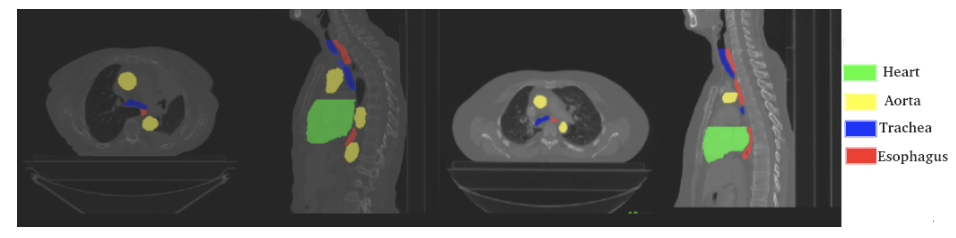
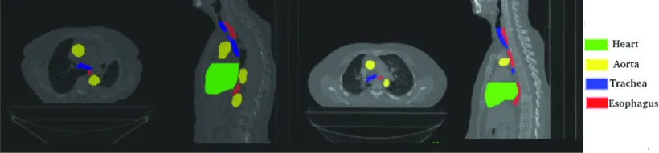
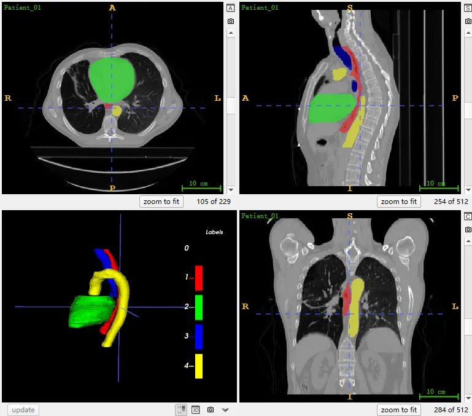

# SegTHOR

<div align="center">
    <a href="https://github.com/openmedlab/"></a>
</div>
<p style="text-align:center;font-size:10px;"><em></em></p>

## Dataset Information

The SegTHOR (Segmentation of THoracic Organs at Risk) dataset is a CT dataset specifically for the segmentation of thoracic organs at risk (OARs), which are the organs surrounding the tumor that need to be protected from radiation during radiotherapy, as part of the ISBI 2019 challenge. In this dataset, the risk organs include the heart, trachea, aorta, and esophagus, each differing in spatial and appearance characteristics. The esophagus is manually annotated from the fourth cervical vertebra to the esophagogastric junction, the heart is annotated according to the recommendations of the radiation oncology group, the trachea is annotated from the lower limit of the larynx to 2 cm below the carina but does not include the bronchial branches, and the aorta is annotated from its origin to below the diaphragmatic pillar. The dataset includes 60 CT images, with 40 for training and 20 for testing.

## Dataset Meta Information

| Dimensions | Modality | Task Type | Anatomical Structures             | Anatomical Area | Number of Categories | Data Volume                   | File Format |
|------------|----------|-----------|-----------------------------------|-----------------|----------------------|-------------------------------|-------------|
| 3D         | CT       | Segmentation | Heart, Trachea, Aorta, Esophagus. | Chest           | 4                    | 40 for training, 20 for test. | .nii.gz     |

Total number of 2D slices in the 40 training images: 7420.

### Resolution Details

| Dataset Statistics | spacing (mm)     | size            |
|--------------------|------------------|-----------------|
| min                | (0.90, 0.90, 2.0)              | (512, 512, 147)     |
| median             | (0.98, 0.98, 2.5)           | (512, 512, 177) |
| max                | (1.37, 1.37, 2.5)              | (512, 512, 284) |

## Label Information Statistics

| Segmentation Class | esophagus | heart | trachea | aorta |
|--------------------|-------------|---------|-----------|----------|
| Case Count         | 40          | 40      | 40        | 40       |
| Detection Rate     | 100%        | 100%    | 100%      | 100%     |
| Min Volume (cm³)   | 30          | 438     | 22        | 95       |
| Median Volume (cm³)| 45          | 847     | 38        | 206      |
| Max Volume (cm³)   | 170         | 1829    | 73        | 465      |


## Visualization

<div align="center">
    <a href="https://github.com/openmedlab/"></a>
</div>
<p style="text-align:center;font-size:10px;"><em> Paper Visualization.</em></p>

<div align="center">
    <a href="https://github.com/openmedlab/"></a>
</div>
<p style="text-align:center;font-size:10px;"><em> ITK-SNAP Visualization. Red: Heart, Green: Trachea, Blue: Aorta, Yellow: Esophagus.</em></p>

## File Structure

The SegTHOR dataset includes two folders: `train` and `test`. The `train` folder contains 40 subfolders (from `Patient_01` to `Patient_40`), each with a label file `GT.nii.gz` and a corresponding `.nii.gz` data file. The `test` folder directly contains 20 `.nii.gz` files from `Patient_41.nii.gz` to `Patient_60.nii.gz`.

``` 
SegTHOR/
|-- train/
|   |-- Patient_01/
|   |   |-- GT.nii.gz
|   |   |-- Patient_01.nii.gz
|   |-- Patient_02/
|   |   ... (similar structure as Patient_01)
|   ...
|   |-- Patient_40/
|       ... (similar structure as Patient_01)
|
|-- test/
    |-- Patient_41.nii.gz
    |-- Patient_42.nii.gz
    ...
    |-- Patient_60.nii.gz
```

## Authors and Institutions

Caroline Petitjean (University of Rouen, France)

Zoé Lambert (INSA Rouen Normandie, France)

Su Ruan (University of Rouen, France)

Bernard Dubray (University of Rouen, Henri Becquerel Center, Regional Cancer Center, France)


## Source Information

Official Website: https://competitions.codalab.org/competitions/21145

Download Link: https://competitions.codalab.org/competitions/21145#participate-get_starting_kit

Article Address: https://ieeexplore.ieee.org/document/9286453, https://ceur-ws.org/Vol-2349/

Publication Date: January, 2019.

## Citation

``` 
@INPROCEEDINGS{9286453,
  author={Lambert, Zoé and Petitjean, Caroline and Dubray, Bernard and Kuan, Su},
  booktitle={2020 Tenth International Conference on Image Processing Theory, Tools and Applications (IPTA)}, 
  title={SegTHOR: Segmentation of Thoracic Organs at Risk in CT images}, 
  year={2020},
  volume={},
  number={},
  pages={1-6},
  doi={10.1109/IPTA50016.2020.9286453}}
```

Original introduction article is [here](https://zhuanlan.zhihu.com/p/658989097).