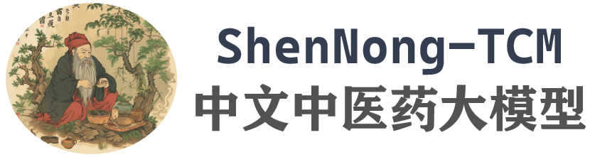
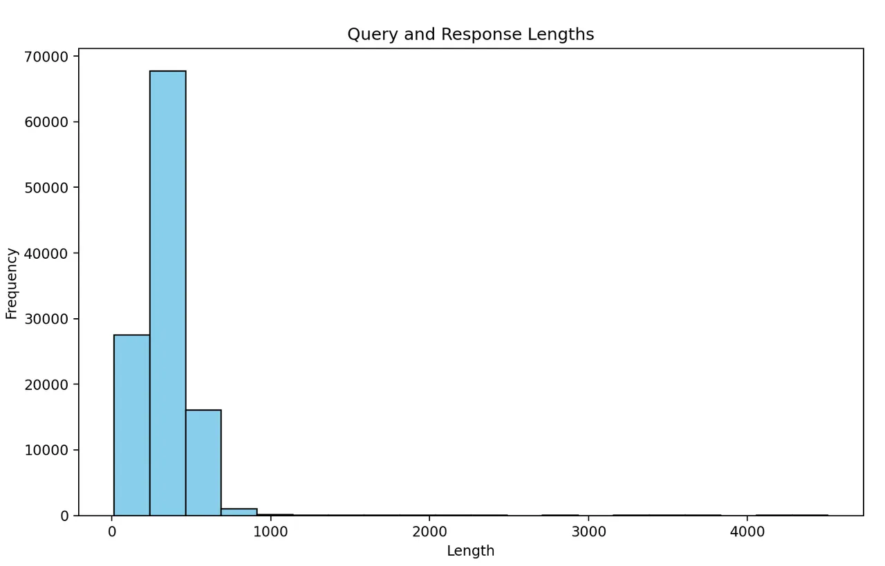

# ShenNong-TCM-Dataset/EB

<div align="center">
    <a href="https://github.com/openmedlab/"></a>
</div>
<p style="text-align:center;font-size:10px;"><em></em></p>

## Dataset Information

The ShenNong-TCM (ShenNong-Traditional Chinese Medicine) series of large models represent an innovative exploration of large language models in the field of Traditional Chinese Medicine (TCM). By applying LoRA fine-tuning technology on carefully designed instruction data, the ShenNong-TCM model not only integrates more human care into its answers but also provides practical medical advice. Notably, the model can directly recommend suitable Chinese herbal medicines or prescriptions based on the patient's symptoms, rather than merely offering generic medical guidance.

The training and evaluation of ShenNong-TCM are based on two professional datasets: ShenNong-TCM-Dataset and ShenNong-TCM-EB (Evaluation Benchmark). ShenNong-TCM-Dataset, relying on the knowledge graph of traditional Chinese medicine, constructs an entity-centered dataset with the help of ChatGPT-3.5. Similarly, ShenNong-TCM-EB is also based on entities but originates from the question bank of the Traditional Chinese Medicine Practitioner Qualification Examination. Although the ShenNong-TCM series of datasets have not been widely publicized through published papers, all related materials can be found on GitHub and the Hugging Face platform. Unfortunately, although the ShenNong-TCM-Dataset has been released publicly, ShenNong-TCM-EB, despite having detailed examples and generation processes published, has not yet made its generated evaluation benchmark dataset available to the public. However, the question generation mechanism of ShenNong-TCM-EB still holds significant research value, which we will delve into in subsequent data example analyses.

## Dataset Meta Information

| Task Type | Language | Train | Val | Test | File Format | Size  |
|-----------|----------|-------|-----|------|---------|-------|
| QA        | Chinese  | 113K  | -   | 3,279	  | .json   | 110MB |


## Dataset Information Statistics

The training set consists of single-round question-answering pairs, with the specific length statistics of the Q&A shown below. It can be observed that the vast majority of the training data lengths are concentrated below 1000, which does not exceed the usage limit of the 2048 context window for many 7B models, thereby ensuring performance to a certain extent.

<div align="center">
    <a href="https://github.com/openmedlab/"></a>
</div>
<p style="text-align:center;font-size:10px;"><em></em></p>

The specific proportions as officially calculated are as follows:

| Question Type   | Single-Stem Single-Best Choice Questions (Type A1/A2) | Case Group Best Choice Questions (Type A3) | Standard Combination Questions (Type B1) | 
|-----------------|-----------------------------------------------------------|----------------------------------------------------|------------------------------------------|
| Question Number | 1600                                                      | 198                                                | 1481                                     |

## Dataset Example

The test set is divided into two main types of questions, A and B, with type A further divided into A1, A2, and A3. The specifics of these question types are as follows:

Best Choice Questions or Single-Answer Choice Questions (Type A): Each question consists of a stem followed by five possible answers labeled A, B, C, D, and E. Among these five options, only one is the correct answer. Type A questions are divided into two types, A1 and A2:
- Single-Sentence Best Choice Questions (Type A1): The stem appears in the form of a statement, which can be affirmative or negative.
- Case Summary Best Choice Questions (Type A2): A brief clinical case serves as the stem.
- Case Group Best Choice Questions (Type A3): The stem begins with a clinical scenario centered on a patient, followed by several (more than one) related questions. Each question is related to the initial clinical scenario but tests different points, mainly focusing on clinical application.

Standard Combination Questions (Type B1): Each question is made up of five possible answers labeled A, B, C, D, and E, followed by two or more stems. The options are presented first, followed by the stems. When answering, one must choose one option as the correct answer for each stem. Each option can be used zero, one, or more than once.

The instruction data in the ShenNong-TCM-Dataset is illustrated in the following figure, which shows a very clear structure.

``` 
{
    "query": 
        "我腹痛，没有其他症状，有什么中药可以推荐吗？
          要求：1. 请考虑所有症状。
               2. 请输出推理过程，推理过程可能涉及症状、证候、治法、方剂/中药等信息。", 
    "response": 
       "首先需要确定腹痛的性质（寒热虚实），进而确定证候。
        如果腹痛为寒性，常见证候为寒疝，其症状为腹痛缓解于温，加重于寒；
        腹部感觉冷痛，喜按；肢冷，脉沉紧。治法常用温经散寒、行气止痛，常用方剂为理中丸、温中汤等。
        其中，理中丸主要成分为黄连、半夏、生姜等，具有温中散寒、行气止痛的作用。\n\n
        如果腹痛为实性，常见证候为实疝，其症状为腹痛剧烈，不受温度影响；
        腹部胀满，喜按；舌苔厚腻，脉滑数。治法常用清热化湿、行气消肿，常用方剂为二陈汉药、消痞丸等。
        其中，二陈汉药主要成分为黄连、半夏、生姜、陈皮等，具有清热解毒、行气止痛的作用。\n\n
        如果腹痛为虚性，常见证候为虚疝，其症状为腹痛呈间歇性、隐痛性质，多见于脾胃气虚、肾气虚等。
        治法常用补益气血、固摄止痛，常用方剂为四君子汤、六君子丸等。
        其中，四君子汤主要成分为人参、白术、茯苓、甘草等，具有补益脾胃、固摄止痛的作用。\n\n
        综上所述，具体选择中药方剂需要根据腹痛的性质和相应的证候来确定，
        建议就医并在医生指导下进行中药治疗。"
}
```

The data was constructed using ChatGPT-3.5, and the design of the construction prompt is as follows:

``` 
system_prompt = "你需要尽可能给出多样化的，与中医(中国传统医学),中药等相关的，任务指令和对应的回答。我们将用于人工评估ChatGPT模型对指令的完成情况。要求:\n"
system_prompt += "1. 主题多样化，涵盖不同的中医实体，例如：" + "、".join(
    random.sample(entity_list, 10)
) + "等。\n"

# generate random tasks
task_list = ["开放式生成", "分类", "问答", "编辑", "摘要",
             "写作", "分析", "常识推理", "写文献",
             "抽取", "推荐", "问诊", "文献标题生成", "诊断", "方剂推荐", "治疗推荐"]
system_prompt += "2. 表述多样化，结合真实问题；指令类型多样化，例如：" + "、".join(random.sample(task_list, 10)) + "等。\n"

# other requirements
system_prompt += "3. 如果遇到无法处理的指令（只靠文本无法回答），给出无法处理的回复。\n"
system_prompt += "4. 除非特别要求，请使用中文，指令可以是命令句、疑问句、或其他合适的类型。\n"
system_prompt += "5. 为指令生成一个适当且涉及真实情况的<input>，不应该只包含简单的占位符。<input>应提供实质性的内容，具有挑战性。字数不超过" + str(
    random.randint(80, 120)) + "字。\n"
system_prompt += "6. <output>应该是对指令的适当且真实的回应，不能只回复答应或拒绝请求。如果需要额外信息才能回复时，请努力预测用户意图并尝试回复。<output>的内容应少于" + str(
    512) + "字。\n\n"

system_prompt += "请给出满足条件的5条JSON格式数据：\n"
```

As previously mentioned, this generation method is entity-based. It involves making selections within a random task based on specific entities (medical entities and information from the knowledge graph) and providing randomly lengthened question-and-answer pairs within a certain range. This method ensures balance among the entities, preventing the training data from being biased towards a particular category.

The generation of the test set is similar, but there are more distinctions in the format, and, as previously mentioned, it is divided into various question types. Here is a specific example:

Single-Stem Single-Best Choice Questions (Type A1/A2):

``` 
 {
  "question": "《素问·咳论》：“五脏六腑皆令人咳”，但关系最密切的是（  ）。\nA．心肺\nB．肺肾\nC．肺脾\nD．肺胃\nE．肺大肠",
  "answer": [
    "D"
  ],
  "analysis": "根据《素问·咳论》“此皆聚于胃，关于肺，使人多涕唾而面浮肿气逆也”可知与五脏六腑皆令人咳关系最密切的脏腑为肺胃。手太阴肺经起于中焦，还循胃口，上膈属肺。寒凉饮食入胃，导致中焦寒，寒气循手太阴肺经上入于肺中，导致肺寒，肺为娇脏，不耐寒热，外内寒邪并聚于肺，则肺失宣降，肺气上逆发生咳嗽。因此答案选D。",
  "knowledge_point": "中医经典",
  "index": 8196,
  "score": 1
}
```

Case Group Best Choice Questions (Type A3):

``` 
{
  "share_content": "刘×，男，46岁，刻下眩晕而见头重如蒙。胸闷恶心，食少多寐，苔白腻，脉濡滑。",
  "question": [
    {
      "sub_question": "1)．证属（  ）。\nA．肝阳上亢\nB．气血亏虚\nC．肾精不足\nD．痰浊中阻\nE．以上都不是\n",
      "answer": [
        "D"
      ],
      "analysis": ""
    },
    {
      "sub_question": "2)．治法宜选（  ）。\nA．燥湿祛痰，健脾和胃\nB．补肾滋阴\nC．补肾助阳\nD．补养气血，健运脾胃\nE．平肝潜阳，滋养肝肾\n",
      "answer": [
        "A"
      ],
      "analysis": ""
    },
    {
      "sub_question": "3)．方药宜选（  ）。\nA．右归丸\nB．左归丸\nC．半夏白术天麻汤\nD．归脾汤\nE．天麻钩藤饮\n",
      "answer": [
        "C"
      ],
      "analysis": ""
    }
  ],
  "knowledge_point": "中医内科学",
  "index": 334,
  "score": 1
}
```

Standard Combination Questions (Type B1):

``` 
  {
  "share_content": "（共用备选答案）\nA.化痰息风，健脾祛湿\nB.清肺化痰，散结排脓\nC.疏风宣肺，化痰止咳\nD.清热化痰，平肝息风\nE.润肺清热，理气化痰\n",
  "question": [
    {
      "sub_question": "1)．贝母瓜蒌散的功用是（  ）。",
      "answer": [
        "E"
      ],
      "analysis": ""
    },
    {
      "sub_question": "2)．半夏白术天麻汤的功用是（  ）。",
      "answer": [
        "A"
      ],
      "analysis": ""
    }
  ],
  "knowledge_point": "方剂学",
  "index": 1938,
  "score": 1
}
```

## File Structure

The structure of the dataset is as follows, composed of two JSON files.

``` 
ShenNong_TCM_Dataset
|—— ChatMed_TCM-v0.2.json
|—— EB.json (to be release)
```

## Authors and Institutions

Wenjing Yue (Intelligent Knowledge Management and Service Team, School of Computer Science and Technology, East China Normal University)

Wei Zhu (Intelligent Knowledge Management and Service Team, School of Computer Science and Technology, East China Normal University)

Xiaoling Wang (Intelligent Knowledge Management and Service Team, School of Computer Science and Technology, East China Normal University)

## Source Information

Official Website: https://github.com/ywjawmw/TCMEB/blob/main/README.md

Download Link: https://huggingface.co/datasets/michaelwzhu/ShenNong_TCM_Dataset

Article Address: TBD

Publication Date: 2023-08

## Citation

``` 
@misc{yue2023 TCMEB,
  title={TCMEB: Performance Evaluation of Large Language Models Based on Traditional Chinese Medicine Benchmarks}, 
  author={Wenjing Yue, Wei Zhu and Xiaoling Wang},
  year={2023},
  publisher = {GitHub},
  journal = {GitHub repository},
  howpublished = {\url{https://github.com/ywjawmw/TCMEB}},
}
```

Original introduction article is [here](https://zhuanlan.zhihu.com/p/687327089).