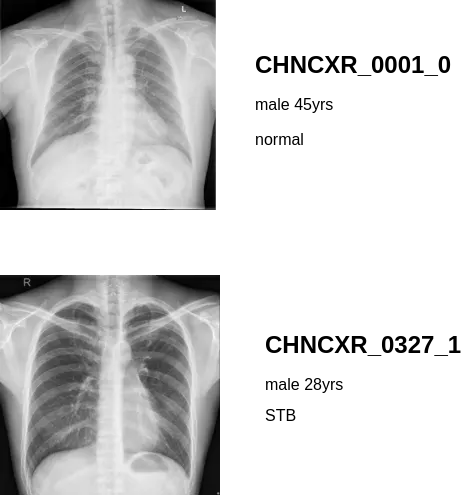

# Shenzhen chest X-ray set 

<div align="center">
    <a href="https://github.com/openmedlab/"></a>
</div>
<p style="text-align:center;font-size:10px;"><em></em></p>

## Dataset Information

The Shenzhen chest X-ray set is a tuberculosis digital imaging database created by the National Library of Medicine of the United States in collaboration with the Third People's Hospital of Shenzhen City and the Guangdong Medical College in China. It contains 336 X-ray images exhibiting manifestations of tuberculosis and 326 normal cases. These X-ray images are provided in PNG format with a resolution of about 3000x3000 pixels. The image file names follow the format CHNCXR_#####_0/1.png, where '0' represents normal and '1' represents abnormal. The clinical reading results for each X-ray image are saved in text file format, with file names following the format CHNCXR_#####_0/1.txt. Each text file includes the patient's age, gender, and lung abnormalities (such as pulmonary tuberculosis). This dataset has been de-identified and is exempt from Institutional Review Board (IRB) review.

This tuberculosis digital imaging database provides a valuable resource for medical research, especially in the diagnosis and treatment of tuberculosis. It not only helps medical professionals better understand the radiographic characteristics of tuberculosis but also provides experimental data for the identification and automated diagnosis of diseases using machine learning and artificial intelligence technologies. Additionally, this dataset is also of significant importance for medical education and public health work.

## Dataset Meta Information

| Dataset | Type | train | val | test | Format     | Size  |
|---------|------|-------|-----|------|------------|-------|
| VQA     | Chest X-ray | 662   | -   | -    | .png/.txt | 3.6G |


### Resolution Details

| Dataset Statistics | size          |
|--------------------|---------------|
| min                | (1130, 948)   |
| median             | (2730, 2941)  |
| max                | (3001, 3001)  |

## Label Information Statistics

| Anatomy Structure                 | tuberculosis |
|-----------------------------------|--------------|
| The number of occurrences         | 336          |
| Appearance ratio                  | 50.75%       |

## Visualization

<div align="center">
    <a href="https://github.com/openmedlab/"></a>
</div>
<p style="text-align:center;font-size:10px;"><em></em></p>

## File Structure

The dataset consists of two folders, named "ClinicalReadings" and "CXR_png". The "ClinicalReadings" folder contains information corresponding to each Chest-X Ray, including sex, age, and lung condition, while the "CXR_png" folder contains the images of each Chest-X Ray.

``` 
ChinaSet_AllFiles/
├── ClinicalReadings
│   ├── CHNCXR_0001_0.txt
│   ├── CHNCXR_0002_0.txt
│   ├── CHNCXR_0003_0.txt
│   └── ...
│   
├── CXR_png
│   ├── CHNCXR_0001_0.png
│   ├── CHNCXR_0002_0.png
│   ├── CHNCXR_0003_0.png
│   └── ...
└── NLM-ChinaCXRSet-ReadMe.docx
```

## Authors and Institutions

Stefan Jaeger (Lister Hill National Center for Biomedical Communications at the National Library of Medicine, NIH)

Sema Candemir (Lister Hill National Center for Biomedical Communications at the National Library of Medicine, NIH)

Sameer Antani (Lister Hill National Center for Biomedical Communications at the National Library of Medicine, NIH)

Yì-Xiáng J. Wáng (Department of Imaging and Interventional Radiology at The Chinese University of Hong Kong, Prince of Wales Hospital)

Pu-Xuan Lu (Department of Radiology at Shenzhen's Third People's Hospital, Guangdong Medical College)

George Thoma (Lister Hill National Center for Biomedical Communications at the National Library of Medicine, NIH)


## Source Information

Official Website: https://lhncbc.nlm.nih.gov/LHC-downloads/downloads.html#tuberculosis-image-data-sets

Download Link: https://openi.nlm.nih.gov/imgs/collections/ChinaSet_AllFiles.zip

Article Address: https://www.ncbi.nlm.nih.gov/pmc/articles/PMC4256233/

Publication Date: 2021.6

## Citation

``` 
@article{jaeger2014two,
  title={Two public chest X-ray datasets for computer-aided screening of pulmonary diseases},
  author={Jaeger, Stefan and Candemir, Sema and Antani, Sameer and W{\'a}ng, Y{\`\i}-Xi{\'a}ng J and Lu, Pu-Xuan and Thoma, George},
  journal={Quantitative imaging in medicine and surgery},
  volume={4},
  number={6},
  pages={475},
  year={2014},
  publisher={AME Publications}
}
```

Original introduction article is [here](https://zhuanlan.zhihu.com/p/679962725).