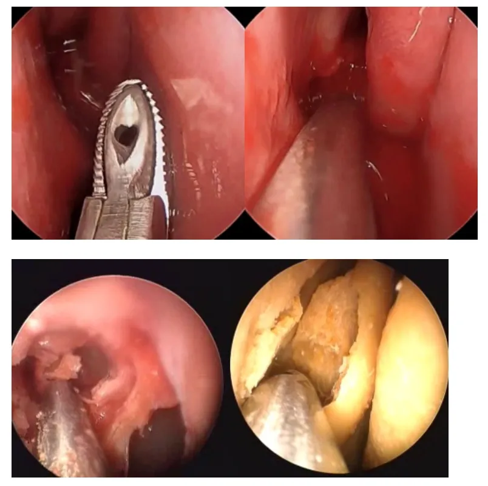

# Sinus Surgery Endoscopic Image Datasets

<div align="center">
    <a href="https://github.com/openmedlab/"></a>
</div>
<p style="text-align:center;font-size:10px;"><em></em></p>

## Dataset Information

The dataset was developed by the BioRobotics Lab at the University of Washington (http://brl.ee.washington.edu). It contains endoscopic images of sinus surgery with manual annotations for the task of surgical instrument segmentation. The dataset is collected from endoscopic sinus surgeries performed by surgeons, characterized by dexterous needle movements, narrow operating spaces, and close proximity between the lens and objects.

UW-Sinus-Surgery-C/L includes two sub-datasets: the cadaver surgery dataset (UW-Sinus-Surgery-C) with a total of 4345 images, and the live surgery dataset (UW-Sinus-Surgery-L) with a total of 4658 images. In each dataset, the "images" folder contains endoscopic images, and the "labels" folder contains segmentation masks (where 0 represents the background and 1 represents surgical instruments).

## Dataset Meta Information

| Dimensions | Modality   | Task Type    | Anatomical Area         | Data Volume | File Format |
|------------|------------|--------------|-------------------------|-------------|-------------|
| 2D         | Rhinoscopy | Segmentation | nasal cavity            | 9003        | jpg         |


### Resolution Details

| Category       | Size                                     |
|----------------|------------------------------------------|
| Small Size     | 240 * 240 (body), 256 * 256 (on site) |
| Medium Size    | 240 * 240 (body), 256 * 256 (on site)     |
| Large Size     | 240 * 240 (body), 256 * 256 (on site)     |


## Label Information Statistics

The segmentation ground truth is provided by images where pixel values indicate class indices. Here, 0 represents the background, and 1 represents surgical instruments. The following image shows an example of a surgical scene (since the pixel value for the background is 0 and the instruments are 1, the segmentation mask appears as a black area):

<div align="center">
    <a href="https://github.com/openmedlab/"></a>
</div>
<p style="text-align:center;font-size:10px;"><em> Real surgery scene </em></p>

<div align="center">
    <a href="https://github.com/openmedlab/"></a>
</div>
<p style="text-align:center;font-size:10px;"><em> Segmentation mask </em></p>


## Visualization

<div align="center">
    <a href="https://github.com/openmedlab/"></a>
</div>
<p style="text-align:center;font-size:10px;"><em></em></p>

## File Structure

Introduce file structure of original dataset folder.

Take representative MSD dataset for example:

``` 
Dataset
|--- readme.txt
|--- cadaver
|     |---images
|     |---labels
|     
|—— live
      |---images
      |---labels
```

The naming convention for the images is as follows:

i Sinus Surgery-C Dataset: S[video_ID][frame_index]

ii Sinus Surgery-L Dataset: L[video_ID][frame_index] where [video_ID] indicates which video the image is extracted from, and [frame_index] is the frame index within the corresponding video.


## Authors and Institutions

Shan Lin (University of Washington, EECS)

Fangbo Qin (University of Washington, EECS)

Randall A. Bly (University of Washington School of Medicine, Department of Otolaryngology)

Kris S. Moe (University of Washington School of Medicine, Department of Otolaryngology)

Blake Hannaford (University of Washington, EECS)


## Source Information

Official Website: https://github.com/SURA23/Sinus-Surgery-Endoscopic-Image-Datasets?tab=readme-ov-file

Download Link: https://digital.lib.washington.edu/researchworks/handle/1773/45396

Article Address: https://ieeexplore.ieee.org/document/9341556

Publication Date: 2020-08

## Citation

``` 
@INPROCEEDINGS{9341556,
  author={Lin, Shan and Qin, Fangbo and Li, Yangming and Bly, Randall A. and Moe, Kris S. and Hannaford, Blake},
  booktitle={2020 IEEE/RSJ International Conference on Intelligent Robots and Systems (IROS)}, 
  title={LC-GAN: Image-to-image Translation Based on Generative Adversarial Network for Endoscopic Images}, 
  year={2020},
  volume={},
  number={},
  pages={2914-2920},
  doi={10.1109/IROS45743.2020.9341556}}
```

Original introduction article is [here](https://zhuanlan.zhihu.com/p/677697941).