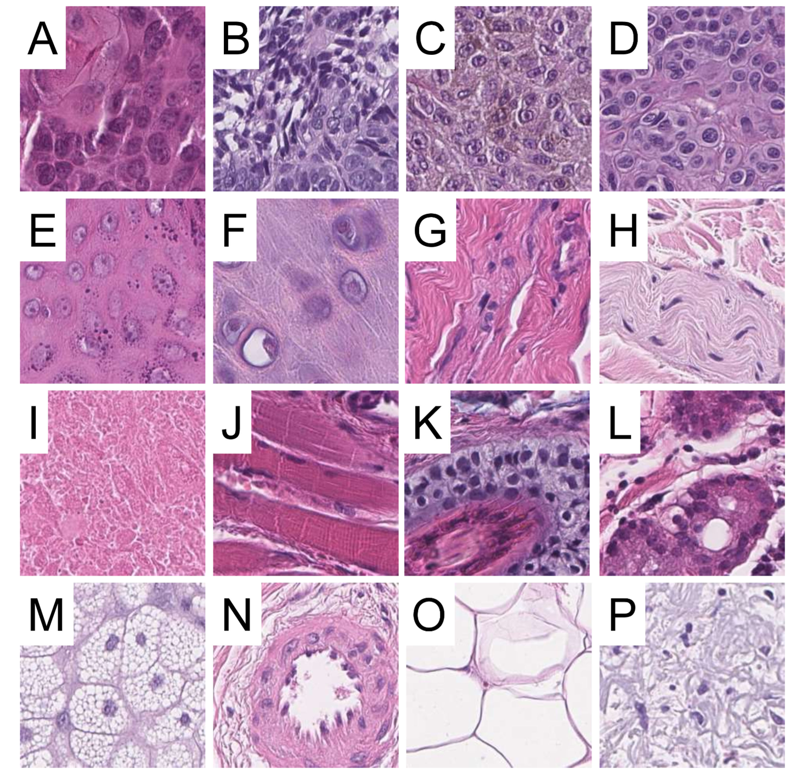
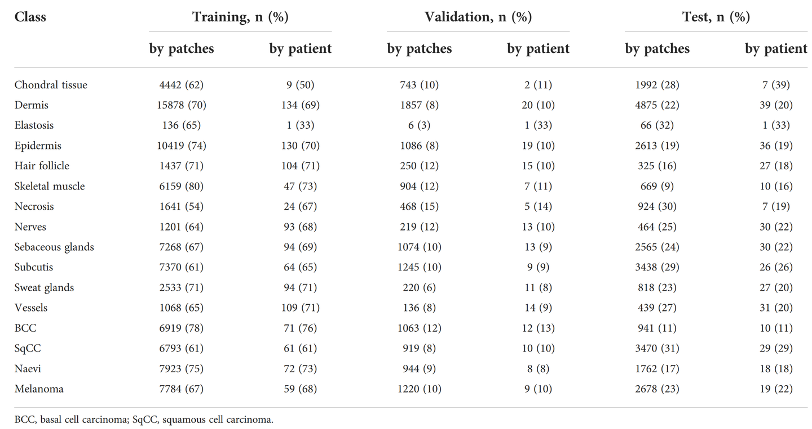

# SkinCancer

<div align="center">
    <a href="https://github.com/openmedlab/"></a>
</div>
<p style="text-align:center;font-size:10px;"><em></em></p>

## Dataset Information

The **SkinCancer dataset** is designed for the classification of skin pathology images, containing high-resolution annotated images of common skin tumors and non-tumorous anatomical tissues. The dataset comprises **386 cases**, covering the most prevalent types of skin tumors: **Basal Cell Carcinoma (BCC)**, **Squamous Cell Carcinoma (SqCC)**, and **Melanoma**, along with various non-tumorous tissues. The pathological slide images have undergone rigorous multi-level manual annotation, identifying **16 distinct tissue categories**, including structures such as epidermis, dermis, subcutaneous tissue, hair follicles, nerves, and sweat glands.

The dataset's slide images were sourced from the **Institute of Pathology at Heidelberg University (Germany)**, the **Trier Center for Cytological and Molecular Diagnostics**, and the **Hannover Institute of Dermatopathology**. All diagnoses follow the **World Health Organization (WHO) classification for skin tumors**. Slides containing tumor regions were scanned using automated slide scanners, and after quality review, a total of **129,364 image patches** were generated. These patches provide ample data for model training and evaluation, enabling researchers to develop, validate, and optimize deep learning models to support and enhance the pathology diagnostic workflow.

## Dataset Meta Information

| Dimensions | Modality  | Task Type      | Anatomical Structures | Number of Categories | Data Volume    | File Format |
|------------|-----------|----------------|-----------------------|----------------------|----------------|-------------|
| 2D         | Pathology | Classification | Skin                  | 16                   | 129,364        | JPG         |


### Resolution Details

| Dataset Statistics | spacing (μm) | size        |
|--------------------|--------------|-------------|
| min                | (100, 100)   | (395, 395)  |
| median             | (100, 100)   | (395, 395)  |
| max                | (100, 100)   | (395, 395)  |

## Label Information Statistics

<div align="center">
    <a href="https://github.com/openmedlab/"></a>
</div>
<p style="text-align:center;font-size:10px;"><em></em></p>

The Chinese and English categories correspond to:
鳞状细胞癌 Squamous cell carcinoma;
基底细胞癌 Basal cell carcinoma;
黑色素瘤 Melanoma;
痣 Naevi;
表皮 Epidermis;
软骨组织 Chondral tissue;
真皮 Dermis;
神经 Nerves;
坏死 Necrosis;
骨骼肌 Skeletal muscle;
毛囊 Hair follicles;
汗腺/小汗腺 Sweat glands/Eccrine glands;
皮脂腺 Sebaceous glands;
血管 Vessels;
皮下组织 Subcutis;
弹力纤维退化 Elastosis

## Visualization

<div align="center">
    <a href="https://github.com/openmedlab/"></a>
</div>
<p style="text-align:center;font-size:10px;"><em>Original paper visualization. Squamous cell carcinoma (A), basal cell carcinoma (B), melanoma (C), nevus (D), epidermis (E), cartilage (F), dermis (G), nerve (H), necrosis (I), skeletal muscle (J), hair follicle (K), sweat/eccrine glands (L), sebaceous glands (M), blood vessels (N), subcutaneous tissue (O), and elastic fiber degeneration (P).</em></p>

## File Structure

``` 
data
│
├── class_dict.json
├── tiles_v2.csv
├── tiles/
    ├── nontumor_skin_chondraltissue_chondraltissue
    ├── nontumor_skin_dermis_dermis
    ├── nontumor_skin_elastosis_elastosis
    ├── nontumor_skin_chondraltissue_chondraltissu
    └── ...
```

## Authors and Institutions

Katharina Kriegsmann (Department of Hematology, Oncology and Rheumatology, Heidelberg University)

Frithjof Lobers (Department of Clinical Immunology, Medical Faculty, University of Leipzig)

Christiane Zgorzelski  (Institute of Pathology, Heidelberg University)

Jörg Kriegsmann  (MVZ Histology, Cytology and Molecular Diagnostics Trier & Proteopath Trier )

Charlotte Janßen (Center for Industrial Mathematics (ZeTeM), University of Bremen)

Rolf Rüdinger Meliß  (Center for Industrial Mathematics (ZeTeM), University of Bremen)

Thomas Muley (Translational Lung Research Centre (TLRC) Heidelberg, Member of the German Centre for Lung Research (DZL))

Ulrich Sack  (Department of Clinical Immunology, Medical Faculty, University of Leipzig)

Georg Steinbuss (Department of Hematology, Oncology and Rheumatology, Heidelberg University)

Mark Kriegsmann (Institute of Pathology, Heidelberg University)

## Source Information

Official Website: https://heidata.uni-heidelberg.de/dataset.xhtml?persistentId=doi:10.11588/data/7QCR8S

Download Link: https://heidata.uni-heidelberg.de/dataset.xhtml?persistentId=doi:10.11588/data/7QCR8S

Article Address: https://www.frontiersin.org/journals/oncology/articles/10.3389/fonc.2022.1022967/full

Publication Date: 2023-03

## Citation

``` 
@article{kriegsmann2022deep,
  title={Deep learning for the detection of anatomical tissue structures and neoplasms of the skin on scanned histopathological tissue sections},
  author={Kriegsmann, Katharina and Lobers, Frithjof and Zgorzelski, Christiane and Kriegsmann, J{\"o}rg and Jan{\ss}en, Charlotte and Meli{\ss}, Rolf R{\"u}dinger and Muley, Thomas and Sack, Ulrich and Steinbuss, Georg and Kriegsmann, Mark},
  journal={Frontiers in Oncology},
  volume={12},
  pages={1022967},
  year={2022},
  publisher={Frontiers Media SA}
}
```

Original introduction article is [here](https://zhuanlan.zhihu.com/p/6015868509).