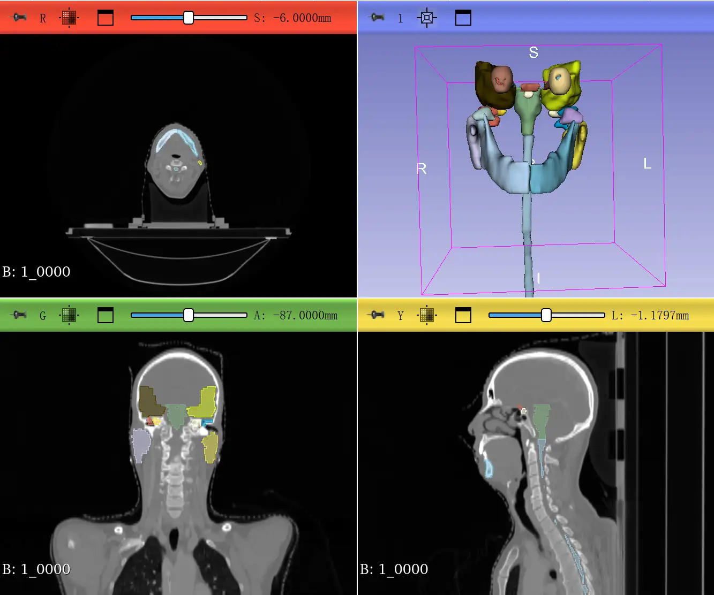
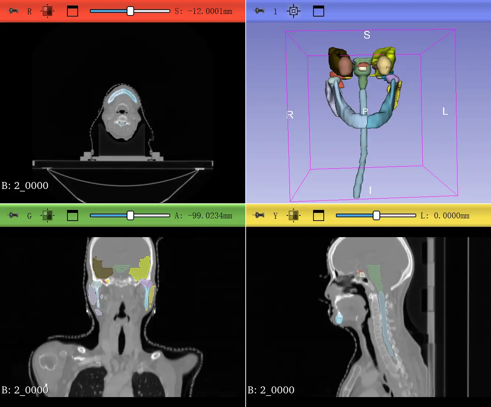

# StructSeg2019 Task1

<div align="center">
    <a href="https://github.com/openmedlab/"></a>
</div>
<p style="text-align:center;font-size:10px;"><em></em></p>

## Dataset Information

The StructSeg2019-Task1 dataset is specifically designed for the study of nasopharyngeal carcinoma using head and neck CT scans, focusing on the segmentation of organs at risk (OAR) which is crucial for enhancing the planning and effectiveness of radiation therapy. This dataset includes CT scans from 50 patients with nasopharyngeal carcinoma for training, each meticulously annotated by experienced radiologists and verified by another physician. Additionally, CT scans from 10 patients are used as test data, ensuring robust model evaluation. The dataset meticulously annotates 22 different OARs including the eyes, lenses, optic nerves, optic chiasm, pituitary gland, brainstem, temporal lobes, spinal cord, parotid glands, ears, temporomandibular joints, and jaws, each organ assigned specific importance weights based on their sensitivity and importance to radiation therapy.

The StructSeg2019-Task1 dataset not only provides critical technical support for the precision of radiation therapy planning but also promotes research and application development within the fields of medical imaging and radiation oncology through its public availability. This openness enables the research community to develop more effective and precise models for segmenting organs at risk, thereby improving treatment outcomes and the quality of patient care.

## Dataset Meta Information

| Dimensions | Modality | Task Type | Anatomical Structures | Anatomical Area         | Number of Categories | Data Volume | File Format |
|------------|----------|-----------|-----------------------|-------------------------|---------------------|-------------|-------------|
| 3D         | CT       | Segmentation | Head and Neck         | Organs of Head and Neck | 22                  | 50          | .nii.gz     |


### Resolution Details

| Dataset Statistics | spacing (mm)                | size            |
|--------------------|-----------------------------|-----------------|
| min                | (0.9765625, 0.9765625, 3.0) | (512,512,100)   |
| median             | (1.140625, 1.140625, 3.0)   | (512,512,124)   |
| max                | (1.1875, 1.1875, 3.0)       | (512, 512, 152) |

## Label Information Statistics

| Label                       | Cases | Percentage | Max Volume (cm³) | Min Volume (cm³) | Median Volume (cm³) |
|-----------------------------|-------|------------|------------------|------------------|---------------------|
| brainstem                   | 50    | 100.00%    | 35.37            | 13.05            | 26.36               |
| left_eye                    | 50    | 100.00%    | 13.24            | 5.99             | 9.06                |
| right_eye                   | 50    | 100.00%    | 13.96            | 5.71             | 8.96                |
| left_lens                   | 50    | 100.00%    | 0.50             | 0.12             | 0.26                |
| right_lens                  | 50    | 100.00%    | 0.54             | 0.13             | 0.24                |
| left_optical_nerve          | 50    | 100.00%    | 1.60             | 0.29             | 0.70                |
| right_optical_nerve         | 50    | 100.00%    | 1.77             | 0.23             | 0.72                |
| optic_chiasm                | 50    | 100.00%    | 2.07             | 0.45             | 0.85                |
| left_temporal_lobes         | 50    | 100.00%    | 160.42           | 50.42            | 104.88              |
| right_temporal_lobes        | 50    | 100.00%    | 151.92           | 47.85            | 109.76              |
| pituitary                   | 50    | 100.00%    | 1.66             | 0.05             | 0.48                |
| left_parotid_gland          | 50    | 100.00%    | 53.39            | 10.73            | 24.67               |
| right_parotid_gland         | 50    | 100.00%    | 52.64            | 10.61            | 26.30               |
| left_inner_ear              | 50    | 100.00%    | 3.81             | 1.40             | 2.56                |
| right_inner_ear             | 50    | 100.00%    | 3.88             | 1.60             | 2.62                |
| left_middle_ear             | 50    | 100.00%    | 22.59            | 3.48             | 11.16               |
| right_middle_ear            | 50    | 100.00%    | 26.74            | 3.13             | 11.90               |
| left_temporomandibular_joint| 50    | 100.00%    | 5.26             | 0.82             | 2.94                |
| right_temporomandibular_joint| 50   | 100.00%    | 5.73             | 1.39             | 2.76                |
| spinal_cord                 | 50    | 100.00%    | 37.15            | 9.92             | 21.94               |
| left_mandible               | 50    | 100.00%    | 60.97            | 21.92            | 37.50               |
| right_mandible              | 50    | 100.00%    | 55.52            | 22.91            | 38.39               |


## Visualization


<div align="center">
    <a href="https://github.com/openmedlab/"></a>
</div>
<p style="text-align:center;font-size:10px;"><em></em></p>

<div align="center">
    <a href="https://github.com/openmedlab/"></a>
</div>
<p style="text-align:center;font-size:10px;"><em></em></p>

## File Structure

The StructSeg2019-Task1 dataset is structured as follows: it includes 50 subfolders, each representing a different patient. Within each patient's subfolder, there are two files: `data.nii.gz` and `label.nii.gz`. The file `data.nii.gz` contains the patient's CT scan data, while `label.nii.gz` contains the corresponding manually annotated data, which identifies various organ-at-risk regions (OARs).

``` 
HaN_OAR
├──1
│   ├── data.nii.gz
│   └── label.nii.gz
│──2
│   ├── data.nii.gz
│   └── label.nii.gz
├── ...
│
└──50
     ├── data.nii.gz
     └── label.nii.gz
```

## Authors and Institutions

Hongsheng Li (SenseTime, CUHK)  

Jinghao Zhou (SenseTime)  

Jincheng Deng (Shenzhen Minuo Intelligent Technology Development Co., Ltd.)  

Ming Chen (Zhejiang Cancer Hospital)

## Source Information

Official Website: https://structseg2019.grand-challenge.org/

Download Link: https://structseg2019.grand-challenge.org/Download/

Article Address: -

Publication Date: 2019

## Citation

``` 
@data{h75x-gt46-23,
doi = {10.21227/h75x-gt46},
url = {https://dx.doi.org/10.21227/h75x-gt46},
author = {Shi, Jun},
publisher = {IEEE Dataport},
title = {StructSeg2019 GTV Segmentation},
year = {2023} }
```

Original introduction article is [here](https://zhuanlan.zhihu.com/p/693700532).