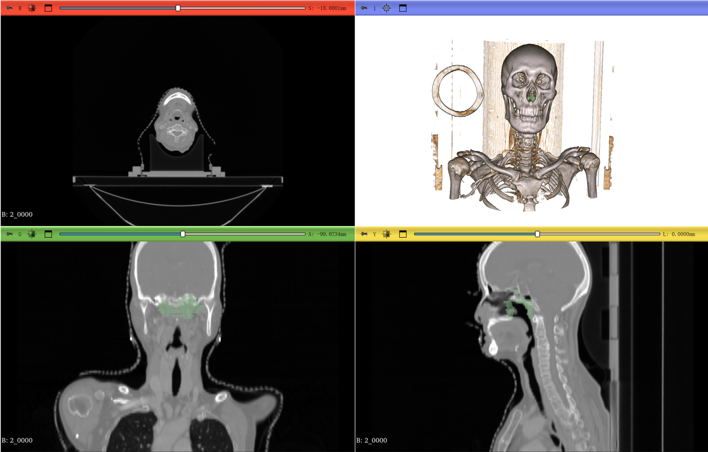
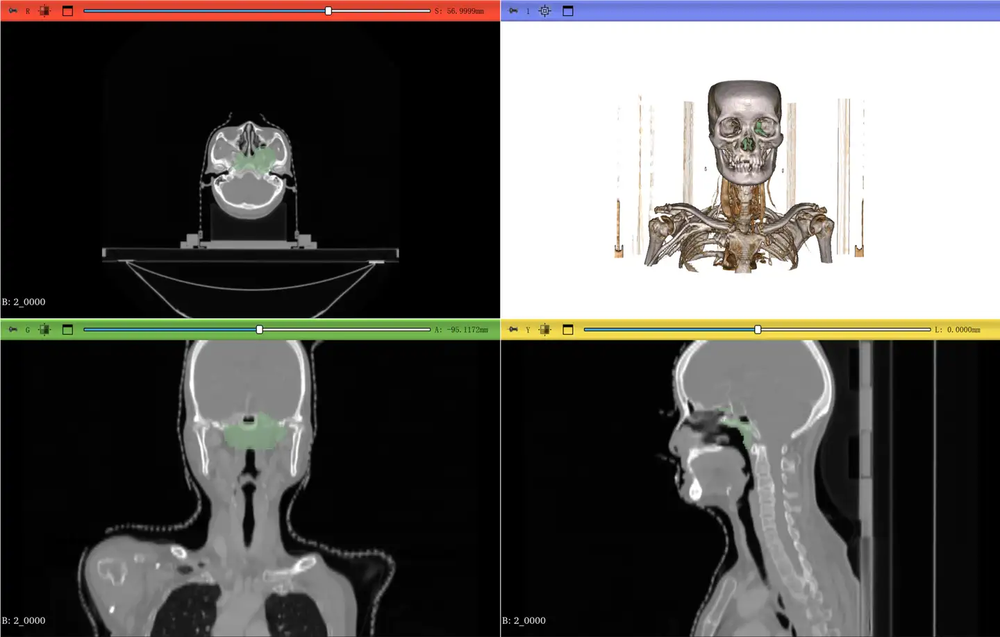

# StructSeg 2019 Task2

<div align="center">
    <a href="https://github.com/openmedlab/"></a>
</div>
<p style="text-align:center;font-size:10px;"><em></em></p>

## Dataset Information

The StructSeg2019-Task2 dataset is specifically designed for the automatic segmentation of the Gross Target Volume (GTV) in nasopharyngeal carcinoma. It contains high-resolution computed tomography (CT) images from 60 nasopharyngeal carcinoma patients. The dataset is divided into two parts: a training set, which includes CT scans and precise GTV annotations from 50 patients, and a test set (not publicly available) that includes CT scans and annotations from 10 patients for evaluating algorithm segmentation performance. All GTV annotations are manually completed by experienced radiologists and oncologists, ensuring high accuracy and professionalism. These high-quality data not only provide an ideal platform for researchers to develop and test medical imaging algorithms but also help explore ways to improve the efficiency and precision of radiotherapy planning.

The provision of this dataset is significant for advancing innovative automated image processing technologies in nasopharyngeal carcinoma treatment planning. Accurate GTV segmentation is crucial for determining the target area of radiotherapy, directly impacting the effectiveness and safety of the treatment. The application of automated segmentation technologies can offer personalized treatment plans to patients in a short time, reduce the workload of doctors, and improve the efficiency of treatment preparation, thereby enhancing the treatment experience and outcomes for patients. Furthermore, the development of advanced image analysis tools can accelerate technological innovation in the medical imaging field, promoting the advancement of radiotherapy and related medical research.

## Dataset Meta Information

| Dimensions | Modality | Task Type    | Anatomical Structures | Anatomical Area                               | Number of Categories | Data Volume | File Format |
|------------|----------|--------------|----------------------|-----------------------------------------------|----------------------|-------------|-------------|
| 3D         | CT       | Segmentation | Head and Neck        | Nasopharyngeal Carcinoma Gross Target Volume  | 1                    | 50          | .nii.gz     |


### Resolution Details


| Dataset Statistics | spacing (mm)             | size            |
|--------------------|--------------------------|-----------------|
| min                | (0.9765, 0.9765, 3.0)    | (512, 512, 100) |
| median             | (1.1406, 1.1406, 3.0)    | (512, 512, 124) |
| max                | (1.1875, 1.875, 3.0)     | (512, 512, 152) |

Number of 2D slices in the dataset: 6151

## Label Information Statistics

| Anatomical Structure | Nasopharyngeal Carcinoma |
| --------------------- | ----------------------- |
| Occurrences           | 50                      |
| Percentage            | 100%                    |

## Visualization

<div align="center">
    <a href="https://github.com/openmedlab/"></a>
</div>
<p style="text-align:center;font-size:10px;"><em></em></p>

<div align="center">
    <a href="https://github.com/openmedlab/"></a>
</div>
<p style="text-align:center;font-size:10px;"><em></em></p>

## File Structure

The file structure of the StructSeg2019-Task2 dataset is as follows. It contains 50 subfolders, each representing a different patient. In each patient's subfolder, there are two files: data.nii.gz and label.nii.gz. The data.nii.gz file contains the patient's CT scan data, while the label.nii.gz file contains the corresponding manual annotations indicating nasopharyngeal carcinoma.

``` 
HaN_OAR
├──1
│   ├── data.nii.gz
│   └── label.nii.gz
│──2
│   ├── data.nii.gz
│   └── label.nii.gz
├── ...
│
└──50
     ├── data.nii.gz
     └── label.nii.gz
```

## Authors and Institutions

Hongsheng Li (SenseTime, CUHK)  

Jinghao Zhou (SenseTime)  

Jincheng Deng (Shenzhen Minuo Intelligent Technology Development Co., Ltd.)  

Ming Chen (Zhejiang Cancer Hospital)

## Source Information

Official Website: https://structseg2019.grand-challenge.org/

Download Link: https://structseg2019.grand-challenge.org/Download/

Article Address: -

Publication Date: 2019

## Citation

``` 
@data{h75x-gt46-23,
doi = {10.21227/h75x-gt46},
url = {https://dx.doi.org/10.21227/h75x-gt46},
author = {Shi, Jun},
publisher = {IEEE Dataport},
title = {StructSeg2019 GTV Segmentation},
year = {2023} }
```

Original introduction article is [here](https://zhuanlan.zhihu.com/p/694768783).