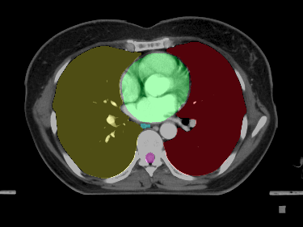

# StructSeg 2019 Task3

<div align="center">
    <a href="https://github.com/openmedlab/"></a>
</div>
<p style="text-align:center;font-size:10px;"><em></em></p>


## Dataset Information

The StructSeg2019-Task3 dataset aims to advance the development of automatic segmentation technology for Organs-at-Risk (OAR) in radiotherapy planning for lung cancer patients. By accurately segmenting key OARs in chest CT scans, this dataset enhances the safety and efficiency of radiotherapy. The dataset includes high-resolution CT images from 60 lung cancer patients, with 50 patients' images used as training data and the remaining 10 as test data (not publicly available). Each CT scan is meticulously annotated by an experienced oncologist and verified by another doctor to ensure data quality and accuracy.

The training and test datasets include annotations for six critical OARs: the left lung, right lung, spinal cord, esophagus, heart, and trachea. Each organ is assigned a different importance weight: left lung (100), right lung (100), spinal cord (100), esophagus (70), heart (100), and trachea (80). These weights reflect the relative importance of each organ in radiotherapy planning, helping researchers to weight and optimize protection strategies for different organs during algorithm development.

This dataset is designed to address a key challenge in lung cancer radiotherapy: how to accurately target and treat the tumor while minimizing damage to normal tissues and organs. By providing high-quality, professionally annotated CT images, the dataset offers an ideal platform for developing and testing new image processing algorithms that can automatically identify and segment OARs, thereby supporting more precise treatment planning and decision-making. Additionally, advancements in automatic OAR segmentation technology will help improve radiotherapy efficiency, reduce the workload of doctors, and ultimately provide lung cancer patients with better treatment experiences and outcomes.

## Dataset Meta Information

| Dimensions | Modality | Task Type | Anatomical Structures | Anatomical Area | Number of Categories | Data Volume | File Format |
|------------|----------|-----------|-----------------------|-----------------|----------------------|-------------|-------------|
| 3D         | CT       | Segmentation | Chest                 | Chest Organ     | 6                    | 50          | .nii.gz     |


### Resolution Details

| Dataset Statistics | spacing (mm)           | size             |
|--------------------|------------------------|------------------|
| min                | (0.9765, 0.9765, 3.0)  | (512, 512, 80)   |
| median             | (1.1718, 1.1718, 5.0)  | (512, 512, 95)   |
| max                | (1.3671, 1.3671, 5.0)  | (512, 512, 127)  |

Number of 2D slices in the data set: 4,775.

## Label Information Statistics

|    | Label     | Cases | Percentage | Max Volume (cm^3) | Min Volume (cm^3) | Median Volume (cm^3) |
|----|-----------|-------|------------|-------------------|-------------------|----------------------|
| 0  | lung_left | 50    | 100.00%    | 2644.70           | 514.91            | 1325.47              |
| 1  | lung_right | 50    | 100.00%    | 2852.96           | 731.46            | 1841.02              |
| 2  | spinal_cord | 50    | 100.00%    | 958.86            | 414.26            | 691.58               |
| 3  | esophagus | 50    | 100.00%    | 59.17             | 18.91             | 35.52                |
| 4  | heart     | 50    | 100.00%    | 82.56             | 28.69             | 55.60                |


## Visualization

<div align="center">
    <a href="https://github.com/openmedlab/"></a>
</div>
<p style="text-align:center;font-size:10px;"><em></em></p>

## File Structure

The file structure of the StructSeg2019-Task3 dataset is as follows. It contains 50 subfolders, each representing a different patient. Within each patient's subfolder, there are two files: `data.nii.gz` and `label.nii.gz`. The `data.nii.gz` file contains the patient's CT scan data, while the `label.nii.gz` file contains the corresponding manual annotation data, indicating the thoracic organs.

``` 
HaN_OAR
├──1
│   ├── data.nii.gz
│   └── label.nii.gz
│──2
│   ├── data.nii.gz
│   └── label.nii.gz
├── ...
│
└──50
     ├── data.nii.gz
     └── label.nii.gz
```

## Authors and Institutions

Hongsheng Li (SenseTime, CUHK)  

Jinghao Zhou (SenseTime)  

Jincheng Deng (Shenzhen Minuo Intelligent Technology Development Co., Ltd.)  

Ming Chen (Zhejiang Cancer Hospital)


## Source Information

Official Website: https://structseg2019.grand-challenge.org/

Download Link: https://structseg2019.grand-challenge.org/Download/

Article Address: -

Publication Date: 2019

## Citation

``` 
@data{h75x-gt46-23,
doi = {10.21227/h75x-gt46},
url = {https://dx.doi.org/10.21227/h75x-gt46},
author = {Shi, Jun},
publisher = {IEEE Dataport},
title = {StructSeg2019 GTV Segmentation},
year = {2023} }
```

Original introduction article is [here](https://zhuanlan.zhihu.com/p/694880378).