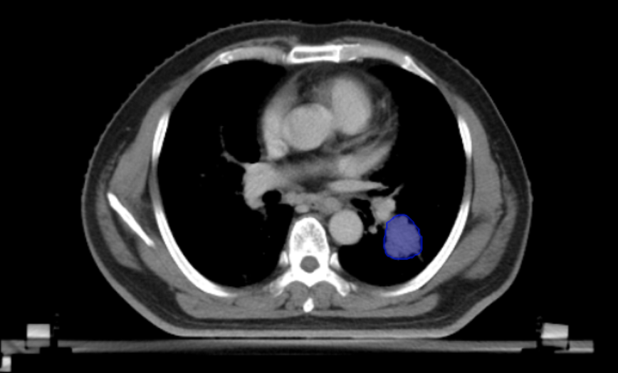
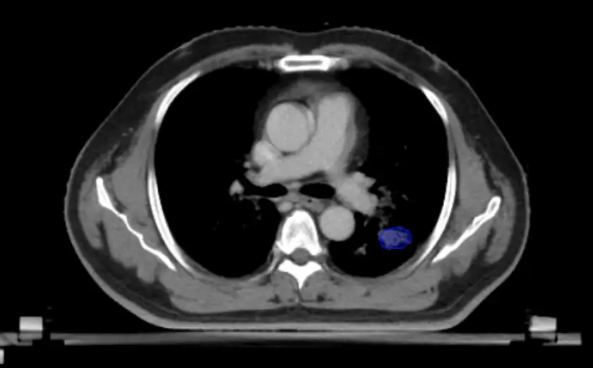

# StructSeg2019 Task4

<div align="center">
    <a href="https://github.com/openmedlab/"></a>
</div>
<p style="text-align:center;font-size:10px;"><em></em></p>

## Dataset Information

StructSeg2019-Task4 dataset is specifically designed for the automatic segmentation of Gross Target Volume (GTV) in lung cancer radiotherapy planning. The aim is to optimize treatment efficacy and minimize the impact on surrounding healthy tissues through precise tumor delineation. The dataset involves high-resolution computed tomography (CT) images from 60 lung cancer patients, including scans from 50 patients used as training data and 10 patients' images as test data (unpublished). Each CT scan has been annotated by an experienced oncologist and verified by another physician, ensuring high accuracy and quality of GTV annotations.

This dataset provides robust support and a validation platform for developing and testing advanced algorithms capable of automatically identifying and segmenting lung cancer tumor regions. Accurate segmentation of lung cancer GTV is crucial for precise radiotherapy planning, as it directly affects the calculation of treatment doses and the direction of radiation beams. By reducing radiation exposure to the lungs and surrounding vital organs, treatment safety and effectiveness can be significantly enhanced, side effects minimized, and patients' quality of life improved.

The dataset not only accelerates research progress in the field of medical image processing and promotes the development of automated GTV segmentation technology but also fosters the personalization and precision of radiotherapy planning. This advancement contributes to the overall management and outcomes of lung cancer treatment. Automated tools developed using this dataset are expected to strengthen decision support for physicians in treatment planning, reduce the time and effort required for manual contouring, and improve the efficiency and accuracy of treatment planning, ultimately providing more effective and safer treatment options for lung cancer patients.

## Dataset Meta Information

| Dimensions | Modality | Task Type | Anatomical Structures | Anatomical Area               | Number of Categories | Data Volume | File Format |
|------------|----------|-----------|-----------------------|-------------------------------|----------------------|-------------|-------------|
| 3D         | CT       | Segmentation | Chest                 | Lung Cancer Tumor Target Area | 1                    | 50          | .nii.gz     |


### Resolution Details

| Dataset Statistics | spacing (mm)           | size             |
|--------------------|------------------------|------------------|
| min                | (0.9765, 0.9765, 3.0)  | (512, 512, 80)   |
| median             | (1.1718, 1.1718, 5.0)  | (512, 512, 95)   |
| max                | (1.3671, 1.3671, 5.0)  | (512, 512, 127)  |

## Label Information Statistics

| Anatomical Structure | Lung Tumor Target Area |
|----------------------|------------------------|
| Number of Occurrences| 50                     |
| Occurrence Percentage | 100%                  |

## Visualization

<div align="center">
    <a href="https://github.com/openmedlab/"></a>
</div>
<p style="text-align:center;font-size:10px;"><em></em></p>

<div align="center">
    <a href="https://github.com/openmedlab/"></a>
</div>
<p style="text-align:center;font-size:10px;"><em></em></p>

## File Structure

The file structure of the StructSeg2019-Task4 dataset is as follows. It includes 50 subfolders, each representing a different patient. Within each patient's subfolder, there are two files: `data.nii.gz` and `label.nii.gz`. The `data.nii.gz` file contains the patient's CT scan data, while the `label.nii.gz` file contains the corresponding manually annotated data used to indicate chest organs.

``` 
HaN_OAR
├──1
│   ├── data.nii.gz
│   └── label.nii.gz
│──2
│   ├── data.nii.gz
│   └── label.nii.gz
├── ...
│
└──50
     ├── data.nii.gz
     └── label.nii.gz
```

## Authors and Institutions

Hongsheng Li (SenseTime, CUHK)  

Jinghao Zhou (SenseTime)  

Jincheng Deng (Shenzhen Minuo Intelligent Technology Development Co., Ltd.)  

Ming Chen (Zhejiang Cancer Hospital)

## Source Information

Official Website: https://structseg2019.grand-challenge.org/

Download Link: https://structseg2019.grand-challenge.org/Download/

Article Address: -

Publication Date: 2019

## Citation

``` 
@data{h75x-gt46-23,
doi = {10.21227/h75x-gt46},
url = {https://dx.doi.org/10.21227/h75x-gt46},
author = {Shi, Jun},
publisher = {IEEE Dataport},
title = {StructSeg2019 GTV Segmentation},
year = {2023} }
```

Original introduction article is [here](https://zhuanlan.zhihu.com/p/694883488).