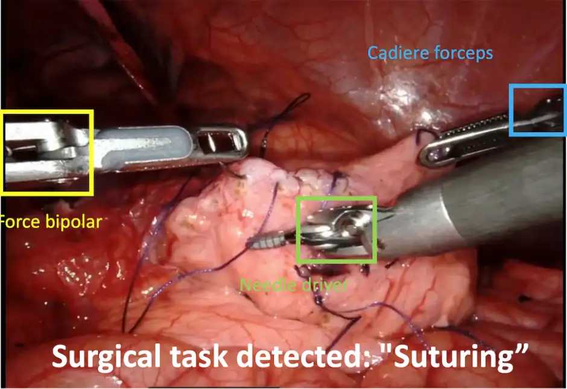
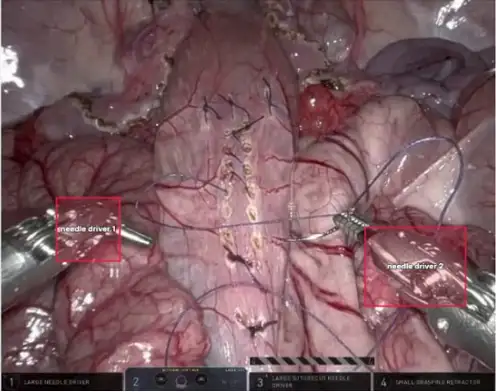

# MICCAI-24 SurgVU24

<div align="center">
    <a href="https://github.com/openmedlab/"></a>
</div>
<p style="text-align:center;font-size:10px;"><em></em></p>

## Dataset Information

The SurgVU24 dataset is focused on the identification of surgical instruments and surgical phase recognition in robot-assisted endoscopic surgeries. The dataset comprises around 280 long surgery videos collected from 155 surgical training sessions. These videos have a frame rate of 60 FPS, a resolution of 720p (1280x720), a total duration of approximately 840 hours, and more than 18 million frames. The videos were recorded during surgical training conducted by medical trainees using the Da Vinci Surgical Robot, primarily performing tasks such as tissue dissection, suturing, and vessel sealing. In each video segment, three surgical instruments are mounted on the robot, and in some segments, these instruments may be occluded or temporarily invisible. Each segment can contain up to three of the 12 possible surgical instruments.

Machine learning models capable of detecting and tracking the surgical environment from endoscopic videos could enable transformative interventions. For example, the ability to automatically classify surgical progress (such as phases, steps, tasks, or actions) and identify the instruments being used would allow for improved assessment of surgical performance, efficiency, and tool coordination, as well as new analyses for operating room resource planning. However, obtaining the data required to train these models is very time-consuming and labor-intensive. Clinical videos need to be annotated frame-by-frame to categorize surgical phases and identify the bounding boxes or key points of surgical instruments under various conditions. Additionally, annotators must continually undergo training to keep up with surgical techniques and innovations in instruments. This dataset provides detailed, frame-by-frame annotations of surgical tasks and instruments, significantly reducing the annotation burden needed to train these models and paving the way for numerous clinical applications.

## Dataset Meta Information

| Dimensions | Modality  | Task Type                  |  Anatomical Area | Number of Categories                                            | Data Volume | File Format |
|------------|-----------|----------------------------|------------------|-----------------------------------------------------------------|-------------|-------------|
| 2D         | Endoscopy | Video Timing Positioning   | Abdominal cavity | 12 types of surgical instruments + 8 types of surgical tasks    | 280         | .mp4,.csv     |


### Resolution Details

| Dataset Statistics | size     |
|--------------------|----------|
| min                | 1280x720 |
| median             | 1280x720 |
| max                | 1280x720 |

## Label Information Statistics

Surgical task labels and surgical instrument labels

Here is the translated table in markdown format:

| Category Name                      | Number of Occurrences | Percentage of Occurrences |
|------------------------------------|-----------------------|---------------------------|
| Suturing                           | 265                   | 0.948                     |
| Uterine horn                       | 251                   | 0.897                     |
| Suspensory ligaments               | 229                   | 0.819                     |
| Rectal artery/vein                 | 163                   | 0.581                     |
| Retraction and collision avoidance | 165                   | 0.594                     |
| Range of motion                    | 94                    | 0.335                     |
| Skills application                 | 51                    | 0.181                     |
| Other                              | 17                    | 0.06                      |

| Category Name                  | Number of Occurrences | Percentage of Occurrences |
|--------------------------------|-----------------------|---------------------------|
| prograsp forceps               | 253                   | 0.903                     |
| needle driver                  | 276                   | 0.987                     |
| monopolar curved scissors      | 273                   | 0.974                     |
| cadiere forceps                | 271                   | 0.968                     |
| bipolar forceps                | 273                   | 0.974                     |
| grasping retractor             | 242                   | 0.864                     |
| vessel sealer                  | 126                   | 0.452                     |
| stapler                        | 88                    | 0.316                     |
| force bipolar                  | 65                    | 0.232                     |
| permanent cautery hook/spatula | 27                    | 0.097                     |
| tip-up fenestrated grasper     | 7                     | 0.026                     |
| clip applier                   | 188                   | 0.671                     |

## Visualization

<div align="center">
    <a href="https://github.com/openmedlab/"></a>
</div>
<p style="text-align:center;font-size:10px;"><em></em></p>

<div align="center">
    <a href="https://github.com/openmedlab/"></a>
</div>
<p style="text-align:center;font-size:10px;"><em></em></p>

<div align="center">
    <a href="https://github.com/openmedlab/"></a>
</div>
<p style="text-align:center;font-size:10px;"><em></em></p>

## File Structure

```
SurgVU24/
│
├── case_000/
│   ├── .ipynb_checkpoints/
│   ├── case_000_video_part_001.mp4
│   ├── tasks.csv
│   ├── tools.csv
│
├── case_001/
│   ├── .ipynb_checkpoints/
│   ├── case_001_video_part_001.mp4
│   ├── tasks.csv
│   ├── tools.csv
│
├── case_002/
│   ├── .ipynb_checkpoints/
│   ├── case_002_video_part_001.mp4
│   ├── tasks.csv
│   ├── tools.csv
│
├── case_003/
│   ├── .ipynb_checkpoints/
│   ├── case_003_video_part_001.mp4
│   ├── tasks.csv
│   ├── tools.csv
│
...
```

## Authors and Institutions

Aneeq Zia (Intuitive Surgical, Inc)

Conor Perreault (Intuitive Surgical, Inc)

Rogerio Garcia Nespolo (Intuitive Surgical, Inc)

Max Berniker (Intuitive Surgical, Inc)

Anthony Jarc (Intuitive Surgical, Inc)

## Source Information

Official Website: https://surgvu24.grand-challenge.org/

Download Link: https://surgvu24.grand-challenge.org/

Article Address: TBD

Publication Date: 2024-05

## Citation

``` 
TBD
```

Original introduction article is [here](https://zhuanlan.zhihu.com/p/711642463).