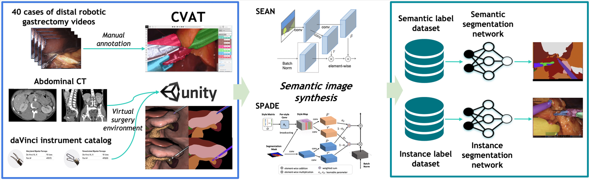
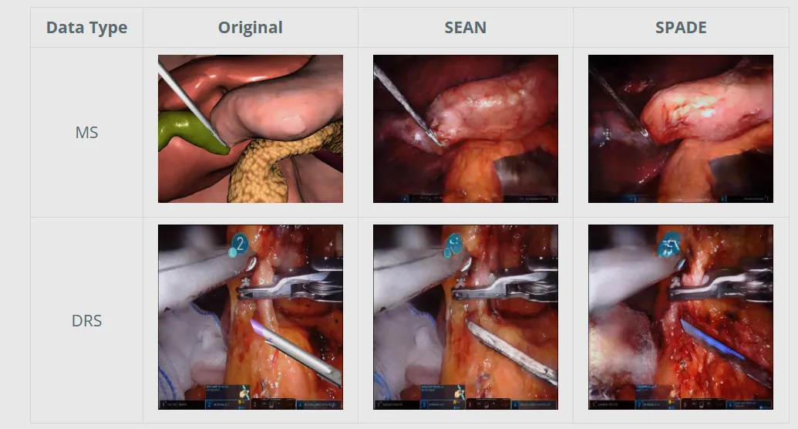

# Surgical scene segmentation

<div align="center">
    <a href="https://github.com/openmedlab/"></a>
</div>
<p style="text-align:center;font-size:10px;"><em></em></p>

## Dataset Information

The dataset "Surgical scene segmentation in robotic gastrectomy with real and synthetic data" is a semantic segmentation dataset for endoscopic images, and the paper was published at MICCAI 2022. The dataset includes both actual collected data and synthetic data, with a total of 4510 real instances and 1246 (domain_random_syn) + 3400 (manual_syn) synthetic instances. The work also utilized SEAN and SPADE models for semantic image synthesis on synthetic data for data augmentation.

This dataset provides both real and synthetic surgical scene segmentation data for robotic surgeries, which aids in the development of automated surgical visual systems. By accurately identifying and segmenting organs, tissues, and instruments during surgery, it can assist surgeons in operational procedures, increasing surgical precision and safety, reducing the risk of complications, and improving patient outcomes.

## Dataset Meta Information

| Dimensions | Modality | Task Type    | Anatomical Area | Number of Categories | Data Volume | File Format |
|------------|----------|--------------|----------------|----------------------|-------------|-------------|
| 2D         | Endoscopy       | Segmentation | abdomen        | 32                   | 4510+1246+3400        | jpg         |


### Resolution Details


| Dataset Statistics | size      |
|--------------------|-----------|
| min                | 1280×1024 |
| median             | 1280×1024 |
| max                | 1280×1024 |

## Label Information Statistics

| Class                          | R1   | MS   | DRS  | SIS(DRS)  |
|--------------------------------|------|------|------|-----------|
| Harmonic Ace Head              | 1313 | 289  | 591  | 539       |
| Harmonic Ace Body              | 1267 | 297  | 766  | 559       |
| Maryland Bipolar Forceps Head  | 1454 | 297  | 580  | 593       |
| Maryland Bipolar Forceps Wrist | 1092 | 286  | 577  | 466       |
| Maryland Bipolar Forceps Body  | 672  | 273  | 770  | 396       |
| Cadiere Forceps Head           | 1083 | 515  | 0    | 404       |
| Cadiere Forceps Wrist          | 892  | 441  | 0    | 323       |
| Cadiere Forceps Body           | 850  | 407  | 0    | 303       |
| Curved Atraumatic Grasper Head | 700  | 592  | 887  | 230       |
| Curved Atraumatic Grasper Body | 787  | 591  | 1053 | 267       |
| Small Clip Applier Head        | 277  | 300  | 540 | 198       |
| Small Clip Applier Wrist       | 260  | 300  | 544 | 191       |
| Small Clip Applier Body        | 183  | 299  | 742 | 203       |
| Suction                        | 286  | 298  | 779 | 238       |
| Needle                         | 286  | 299  | 609 | 256       |
| Endotip                        | 298  | 300  | 820 | 249       |
| Specimenbag                    | 506  | 0    | 0   | 201       |
| DrainTube                      | 304  | 300  | 794 | 246       |
| Liver                          | 2779 | 3143 | 349 | 1047      |
| Stomach                        | 2252 | 3299 | 355 | 821       |
| Pancreas                       | 1450 | 3165 | 301 | 529       |
| Spleen                         | 274  | 3016 | 328 | 95        |
| Gallbladder                    | 815  | 2159 | 246 | 300       |
| Gauze                          | 2701 | 0    | 0   | 1007      |
| The Other Instruments          | 1435 | 0   | 0   | 523      |
| The Other Tissues              | 3367 | 0   | 0   | 1236     |
| Background                     | 3375 | 3300| 1228| 1236     |


## Visualization

<div align="center">
    <a href="https://github.com/openmedlab/"></a>
</div>
<p style="text-align:center;font-size:10px;"><em></em></p>

## File Structure
``` 
Dataset

│

├── images

│ ├── domain_random_syn

│ │ ├── 2021-03-09-16-03-58_1.jpg

│ │ ├── 2021-03-09-16-03-58_2.jpg

│ │ ├── ...

│ ├── manual_syn

│ │ ├── CadiereForceps_close_2021-09-27-14-20-30_0.jpg

│ │ ├── CadiereForceps_close_2021-09-27-14-20-31_15.jpg

│ │ ├── ...

│ ├── real

│ │ ├── R001_ch1_video_01_00-10-37-20.jpg

│ │ ├── R001_ch1_video_01_00-15-18-17.jpg

│ │ ├── ...

│ ├── sean_spade_translation

│ │ ├── sean

│ │ │ ├── domain_random_syn

│ │ │ │ ├── R001_ch1_video_01_00-26-29-12_2021-09-28-13-32-47_264_13_14_15.jpg

│ │ │ │ ├── R001_ch1_video_01_00-30-47-11_2021-09-27-16-57-04_287_19.jpg

│ │ │ │ ├── ...

│ │ │ ├── manual_syn

│ │ │ │ ├── CadiereForceps_close_2021-09-27-14-20-30_0.jpg

│ │ │ │ ├── CadiereForceps_close_2021-09-27-14-20-31_15.jpg

│ │ │ │ ├── ...

│ │ ├── spade

│ │ │ ├── domain_random_syn

│ │ │ │ ├── R001_ch1_video_01_00-26-29-12_2021-09-28-13-32-47_264_13_14_15.jpg

│ │ │ │ ├── R001_ch1_video_01_00-30-47-11_2021-09-27-16-57-04_287_19.jpg

│ │ │ │ ├── ...

│ │ │ ├── manual_syn

│ │ │ │ ├── CadiereForceps_close_2021-09-27-14-20-30_0.jpg

│ │ │ │ ├── CadiereForceps_close_2021-09-27-14-20-31_15.jpg

│ │ │ │ ├── ...

├── instance_jsons

│ ├── domain_random_syn.json

│ ├── manual_syn.json

│ ├── real_train_1.json

│ ├── ...

│ ├── sean_domain_random_syn.json

│ ├── sean_manual_syn.json

│ ├── spade_domain_random_syn.json

│ ├── spade_manual_syn.json

├── raw_syn_masks

│ ├── domain_random_syn

│ │ ├── 2021-03-09-16-03-58_1.png

│ │ ├── 2021-03-09-16-03-58_2.png

│ │ ├── ...

│ ├── manual_syn

│ │ ├── CadiereForceps_close_2021-09-27-14-20-30_0.png

│ │ ├── CadiereForceps_close_2021-09-27-14-20-31_15.png

│ │ ├── ...

├── raw_syn_mask_color_map.json

├── semantic_masks

│ ├── domain_random_syn

│ │ ├── 2021-03-09-16-03-58_1.png

│ │ ├── 2021-03-09-16-03-58_2.png

│ │ ├── ...

│ ├── manual_syn

│ │ ├── CadiereForceps_close_2021-09-27-14-20-30_0.png

│ │ ├── CadiereForceps_close_2021-09-27-14-20-31_15.png

│ │ ├── ...

│ ├── real_train_1

│ │ ├── R001_ch1_video_01_00-10-37-20.png

│ │ ├── R001_ch1_video_01_00-15-18-17.png

│ │ ├── ...

│ ├── ...

│ ├── sean_spade_translation

│ │ ├── sean

│ │ │ ├── domain_random_syn

│ │ │ │ ├── R001_ch1_video_01_00-26-29-12_2021-09-28-13-32-47_264_13_14_15.png

│ │ │ │ ├── R001_ch1_video_01_00-30-47-11_2021-09-27-16-57-04_287_19.png

│ │ │ │ ├── ...

│ │ │ ├── manual_syn

│ │ │ │ ├── CadiereForceps_close_2021-09-27-14-20-30_0.png

│ │ │ │ ├── CadiereForceps_close_2021-09-27-14-20-31_15.png

│ │ │ │ ├── ...

│ │ ├── spade

│ │ │ ├── domain_random_syn

│ │ │ │ ├── R001_ch1_video_01_00-26-29-12_2021-09-28-13-32-47_264_13_14_15.png

│ │ │ │ ├── R001_ch1_video_01_00-30-47-11_2021-09-27-16-57-04_287_19.png

│ │ │ │ ├── ...

│ │ │ ├── manual_syn

│ │ │ │ ├── CadiereForceps_close_2021-09-27-14-20-30_0.png

│ │ │ │ ├── CadiereForceps_close_2021-09-27-14-20-31_15.png

│ │ │ │ ├── ...

├── category.json

└── info.txt
```

## Authors and Institutions

Jihun Yoon (Hutom Corp.)

SeulGi Hong (Hutom Corp.)

Seungbum Hong (Hutom Corp.)

Jiwon Lee (Hutom Corp.)

Soyeon Shin (Hutom Corp.)

Bokyung Park (Hutom Corp.)

Nakjun Sung (Hutom Corp.)

Hayeong Yu (Hutom Corp.)

Sungjae Kim (Hutom Corp.)

SungHyun Park (Department of Surgery, Yonsei University College of Medicine)

Woo Jin Hyung (Hutom Corp. Department of Surgery, Yonsei University College of Medicine)

Min-Kook Choi (Hutom Corp.)


## Source Information

Official Website: https://sisvse.github.io/

Download Link: https://www.kaggle.com/datasets/yjh4374/sisvse-dataset?resource=download-directory

Article Address: https://conferences.miccai.org/2022/papers/489-Paper2739.html

Publication Date: 2022-9

## Citation

``` 
@misc{jihun_yoon_min-kook_choi_2022,
	title={Surgical Scene Segmentation in Robotic Gastrectomy},
	url={https://www.kaggle.com/ds/2744937},
	DOI={10.34740/KAGGLE/DS/2744937},
	publisher={Kaggle},
	author={Jihun Yoon and Min-kook Choi},
	year={2022}
}
```

Original introduction article is [here](https://zhuanlan.zhihu.com/p/686245004).