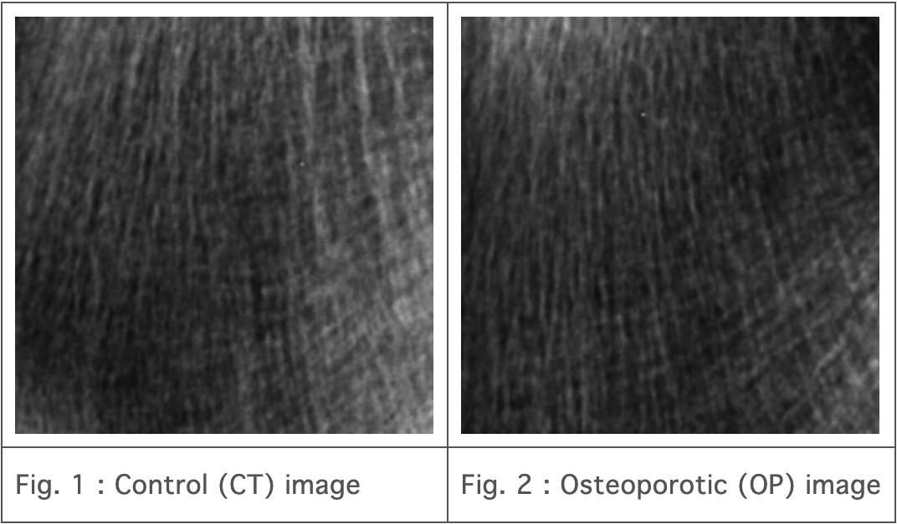
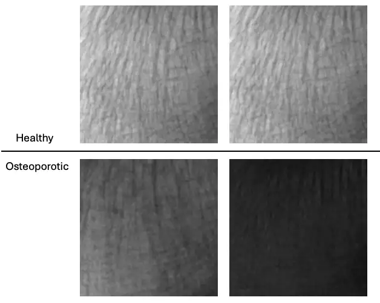

# TCB Challenge

<div align="center">
    <a href="https://github.com/openmedlab/"></a>
</div>
<p style="text-align:center;font-size:10px;"><em></em></p>

## Dataset Information

The TCB dataset is an X-ray image dataset used for the classification of osteoporosis. This dataset is part of a challenge hosted by the International Society for Biomedical Imaging (ISBI). It consists of 174 cases, with 87 as control group and 87 as osteoporosis patients. The purpose of the challenge is to identify cases of osteoporosis from 2D bone X-ray images using texture analysis methods.

Currently, the diagnosis of osteoporosis is primarily through Dual-energy X-ray Absorptiometry (DEXA) to assess bone density. However, DEXA alone can only predict 60% of fracture risk. 2D texture analysis allows for a simple assessment of bone structure in conventional X-rays, and many studies have shown that 2D texture analysis can indirectly evaluate the 3D microarchitecture. Through this dataset and challenge, researchers can explore and compare different texture analysis methods, thus advancing the technology for diagnosing osteoporosis.

## Dataset Meta Information

| Dimensions | Modality        | Task Type      | Anatomical Structures   | Number of Categories | Data Volume | File Format |
|------------|-----------------|----------------|-------------------------|----------------------|-------------|-------------|
| 2D         | Bone Radiograph | Classification | Bone                    | 2                    | 174         | PNG         |


### Resolution Details

| Dataset Statistics | size        |
|--------------------|-------------|
| min                | (400, 400)  |
| median             | (400, 400)  |
| max                | (400, 400)  |

## Label Information Statistics

| Metric        | Healthy | Osteoporotic |
|---------------|---------|--------------|
| Case Count    | 87      | 87           |
| Coverage      | 50%     | 50%          |

## Visualization

<div align="center">
    <a href="https://github.com/openmedlab/"></a>
</div>
<p style="text-align:center;font-size:10px;"><em></em></p>

## File Structure

``` 
TCB_Challenge_Data
│
├── BLIND_Data
│   ├── Image_Blind_1.tif
│   ├── Image_Blind_2.tif
│   ├── Image_Blind_3.tif
│   ├── Image_Blind_4.tif
│   ├── Image_Blind_5.tif
│   ├── Image_Blind_6.tif
│   └── ...
│
├── TRAIN_TEST_Data
│   ├── Class0
│   │   ├── Image_0_01.tif
│   │   ├── Image_0_02.tif
│   │   ├── Image_0_03.tif
│   │   └── ...
│   │
│   ├── Class1
│   │   ├── Image_1_01.tif
│   │   ├── Image_1_02.tif
│   │   ├── Image_1_03.tif
│   │   └── ...
│   │
│   ├── TRAIN_TEST_Data.xlsx
│   ├── 1stClassificationResults.xlsx
│   ├── LastName_BlindClassificationResults.xlsx
│   └── TCB_Challenge_Content.pdf
```
`BLIND_Data`: Contains X-ray image files for blind testing.

`TRAIN_TEST_Data`: Contains classification data and associated documents for training and testing.

- `Class0`: Contains X-ray image files for the control group (normal bones).
- `Class1`: Contains X-ray image files for osteoporosis patients.

`TRAIN_TEST_Data.xlsx`: Contains information about the training and testing data.

`1stClassificationResults.xlsx`: An Excel file containing the first classification results.

`LastName_BlindClassificationResults.xlsx`: An Excel file containing the blind test classification results.

`TCB_Challenge_Content.pdf`: A PDF document containing the content and instructions for the TCB challenge.

## Authors and Institutions

Rachid Jennane (University of Orleans, France)

## Source Information

Official Website: https://www.idpoisson.fr/tcbchallenge/

Download Link: https://www.idpoisson.fr/tcbchallenge/data/

Article Address: https://www.researchgate.net/publication/309326405_Bone_Texture_Characterization_for_Osteoporosis_Diagnosis_using_Digital_Radiography

Publication Date: 2016-08

## Citation

``` 
@inproceedings{zheng2016bone,
  title={Bone texture characterization for osteoporosis diagnosis using digital radiography},
  author={Zheng, Keni and Makrogiannis, Sokratis},
  booktitle={2016 38th Annual International Conference of the IEEE Engineering in Medicine and Biology Society (EMBC)},
  pages={1034--1037},
  year={2016},
  organization={IEEE}
}
```

Original introduction article is [here](https://zhuanlan.zhihu.com/p/708163168).