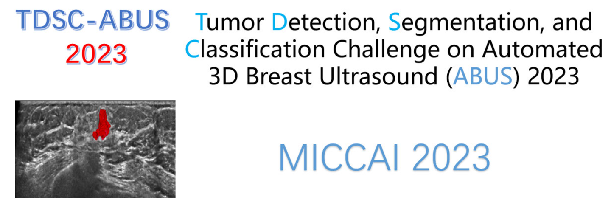
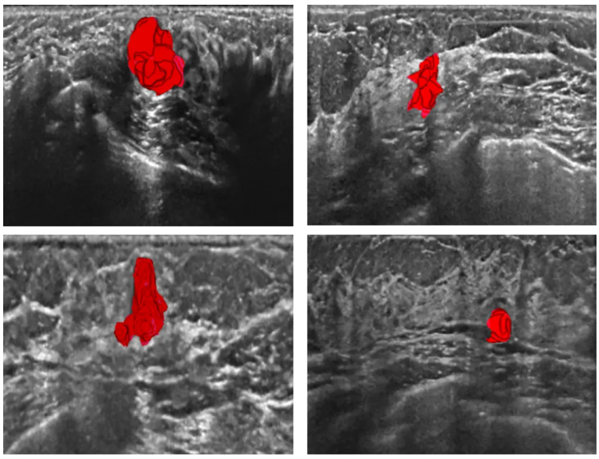
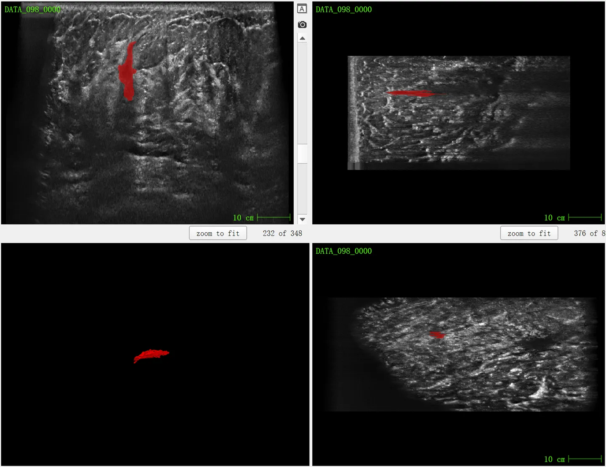

# TDSC-ABUS2023

<div align="center">
    <a href="https://github.com/openmedlab/"></a>
</div>
<p style="text-align:center;font-size:10px;"><em> ITK-SNAP Visualization.</em></p>

## Dataset Information

The TDSC-ABUS dataset focuses on the tumor detection, segmentation, and classification in automated 3D breast ultrasound (ABUS) images and is a part of the MICCAI 2023 Challenge, aimed at advancing technologies for breast cancer prevention and diagnosis based on ultrasound. The dataset employs methods of detection, segmentation, and classification to identify tumors and further distinguishes them as benign or malignant. As the dataset title indicates, it encompasses three subtasks: detection, segmentation, and classification. The annotation information for these three subtasks is interrelated, with the most detailed segmentation task providing pixel-level annotations of the tumors. The actual tumor category information is stored in a file named labels.csv, classified into benign and malignant categories. Next, we will specifically focus on some details of TDSC-ABUS 2023 when it is applied as a segmentation dataset.

## Dataset Meta Information

| Dimensions | Modality    | Task Type | Anatomical Structures          | Anatomical Area | Number of Categories | Data Volume | File Format |
|------------|-------------|-----------|--------------------------------|-----------------|--------------------|-------------|-------------|
| 3D         | Ultra Sound | Segmentation | Breast Tumor | Entire body       | 1                  | 100 for training, 30 for validation, 70 for test.        | nrrd        |

## Label Information Statistics

| Segmentation Class | Breast Tumor (Excluding surrounding tissue) |
|--------------------|---------------------------------------------|
| Case Count         | 100                                         |
| Detection Rate     | 100%                                        |
| Min Volume (cm³)   | 4                                           |
| Median Volume (cm³)| 110                                         |
| Max Volume (cm³)   | 6863                                        |

## Visualization

<div align="center">
    <a href="https://github.com/openmedlab/"></a>
</div>
<p style="text-align:center;font-size:10px;"><em> Paper Visualization.</em></p>

<div align="center">
    <a href="https://github.com/openmedlab/"></a>
</div>
<p style="text-align:center;font-size:10px;"><em> Visualization of No.98 case.</em></p>

## File Structure

The official file structure is as follows, containing two directories: DATA and MASK, which are used to store ultrasound images and corresponding annotation information, respectively. The labels.csv file records the classification of tumors, divided into benign (benign) and malignant (malignant):

``` 
Dataset
│
├── DATA
│   ├── xxx.nrrd
│   └── ...
├── MASK 
│   ├── xxx.nrrd
│   └── ...
├── labels.csv
```

## Authors and Institutions

Kuanquan Wang (Director of the Perception Computing Research Center, School of Computer Science and Technology, Harbin Institute of Technology)

Gongning Luo (School of Computer Science and Technology, Harbin Institute of Technology)

Mingwang Xu (School of Computer Science and Technology, Harbin Institute of Technology)

Suyu Dong (School of Information and Computer Engineering, Northeast Forestry University)

Qiucheng Wang (Harbin Medical University)

Wen Cheng (Harbin Medical University)

Wei Wang (School of Computer Science and Technology, Harbin Institute of Technology)

Xinjie Liang (School of Computer Science and Technology, Harbin Institute of Technology)


## Source Information

Official Website: https://tdsc-abus2023.grand-challenge.org/TDSC-ABUS2023/

Download Link: https://tdsc-abus2023.grand-challenge.org/Dataset/

Article Address: TBD

Publication Date: March, 2023.

## Citation

``` 
TBD
```

Original introduction article is [here](https://zhuanlan.zhihu.com/p/657996614).