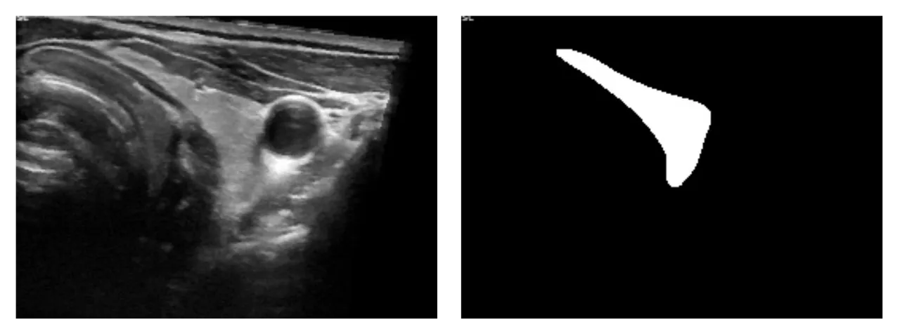

# TG3K

<div align="center">
    <a href="https://github.com/openmedlab/"></a>
</div>
<p style="text-align:center;font-size:10px;"><em></em></p>

## Dataset Information

The TG3K dataset is obtained from 16 ultrasound videos. Initially, the dataset was designed for the accurate segmentation of the thyroid gland area from videos. The extraction process first involved extracting frames from videos. To ensure the quality of the dataset, a rule was established: only images where the thyroid gland area occupies more than 0.06 of the total image area were retained. Consequently, the TG3K dataset consists of such high-quality images, including 3583 ultrasound images. The unique aspect of this dataset is its use for the segmentation of thyroid nodules, a valuable and challenging task. The TG3K dataset is designed for the segmentation of thyroid nodules, a task that is both clinically significant and challenging. Accurate segmentation of thyroid nodules is crucial for the early diagnosis and treatment of thyroid cancer. Through in-depth research on this dataset, it is possible to better understand and address the challenges in thyroid nodule segmentation, contributing significantly to improving the diagnostic accuracy and treatment efficacy of thyroid cancer.

## Dataset Meta Information

| Dimensions | Modality | Task Type | Anatomical Structures          | Anatomical Area | Number of Categories | Data Volume | File Format |
|------------|----------|-----------|--------------------------------|-----------------|----------------------|-------------|-------------|
| 2D         | Ultra Sound | Segmentation | Thyroid Nodule | Head and Neck   | 1                    | 3585        | JPG         |


### Resolution Details

| Dataset Statistics | size         |
|--------------------|--------------|
| min                | (234, 178)   |
| median             | (258, 194)   |
| max                | (325, 193)   |

Number of images in the dataset: 3585 images.

## Label Information Statistics

| Segmentation Class | Thyroid Nodules |
|--------------------|-----------------|
| Case Count         | 3585            |
| Detection Rate     | 100%            |
| Min Volume (cm³)    | 89              |
| Median Volume (cm³) | 3782           |
| Max Volume (cm³)    | 12412           |

## Visualization

<div align="center">
    <a href="https://github.com/openmedlab/"></a>
</div>
<p style="text-align:center;font-size:10px;"><em> (a) Ultrasound image (b) Segmentation annotation.</em></p>

## File Structure

The file structure of the TG3K dataset is as follows. The TG3K dataset consists of two folders: "thyroid-image" and "thyroid-mask." The former contains ultrasound images, and the latter contains segmentation annotations. Both are in .jpg format. The specific file architecture is as follows:

``` 
tg3k/
├── tg3k-trainval.json
├── thyroid-image
│   ├── 0000.jpg
│   ├── 0001.jpg
│   ├── 0002.jpg
│   ├── 0003.jpg
│   └── ...
└── thyroid-mask
    ├── 0000.jpg
    ├── 0001.jpg
    ├── 0002.jpg
    ├── 0003.jpg
    └── ...
```

## Authors and Institutions

Haifan Gong (School of Computer Science and Engineering, Sun Yat-sen University)

Jiaxin Chen (School of Mathematics and Computer Science, Nanchang University)

Guanqi Chen (School of Computer Science and Engineering, Sun Yat-sen University)

Haofeng Li (Shenzhen Big Data Research Center, The Chinese University of Hong Kong (Shenzhen))

Guanbin Li (School of Computer Science and Engineering, Sun Yat-sen University)

Fei Chen (Zhujiang Hospital, Southern Medical University)


## Source Information

Official Website: https://github.com/haifangong/TRFE-Net-for-thyroid-nodule-segmentation

Download Link: https://github.com/haifangong/TRFE-Net-for-thyroid-nodule-segmentation

Article Address: https://www.sciencedirect.com/science/article/pii/S0010482522010976

Publication Date: 2022.12.20

## Citation

``` 
@article{gong2023thyroid,
  title={Thyroid region prior guided attention for ultrasound segmentation of thyroid nodules},
  author={Gong, Haifan and Chen, Jiaxin and Chen, Guanqi and Li, Haofeng and Li, Guanbin and Chen, Fei},
  journal={Computers in Biology and Medicine},
  volume={155},
  pages={106389},
  year={2023},
  publisher={Elsevier}
}
```

Original introduction article is [here](https://zhuanlan.zhihu.com/p/671226445).