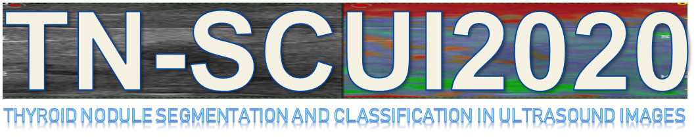
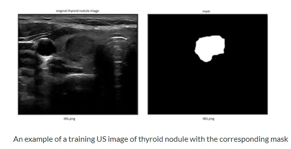

# TN-SCUI 2020

<div align="center">
    <a href="https://github.com/openmedlab/"></a>
</div>
<p style="text-align:center;font-size:10px;"><em></em></p>

## Dataset Information

The TN-SCUI 2020 (Thyroid Nodule Segmentation and Classification in Ultrasound Image) dataset is currently the largest-scale thyroid nodule ultrasound image dataset, comprising a total of 4554 ultrasound images. These data are provided by Shanghai Ruijin Hospital, coming from the China Medical Ultrasound Artificial Intelligence Alliance (CMUAA). The training set includes 3644 ultrasound images, divided into 1641 benign cases and 2003 malignant cases, all in .png format. The test set contains 910 images, of which 400 are used for validation and 510 for final ranking. The nodules in the dataset are annotated by experienced doctors, and all images have personal labels removed to protect patient privacy.

The thyroid is a key endocrine gland located in the lower front of the neck, responsible for secreting hormones that regulate metabolism and physiological functions. Thyroid nodules, common in adults, may increase with age, with about 5% to 10% potentially being malignant. Ultrasound imaging, as the preferred tool for assessing thyroid nodules, is non-invasive and radiation-free, but its interpretation depends on the experience and expertise of the physician. In recent years, to improve diagnostic accuracy and efficiency, various computer-aided diagnosis (CAD) systems have been developed. The TN-SCUI2020 challenge aims to promote the research and development of these systems by providing a large-scale thyroid ultrasound dataset, thereby improving the automatic recognition and classification of thyroid nodules.

## Dataset Meta Information

| Dimensions | Modality    | Task Type | Anatomical Structures          | Anatomical Area | Number of Categories | Data Volume | File Format |
|------------|-------------|-----------|--------------------------------|-----------------|----------------------|-------------|-------------|
| 2D         | Ultra Sound | Segmentation | Thyroid Nodule | Head and Neck   | 1                    | 4554        | PNG         |


### Resolution Details

| Dataset Statistics | size         |
|--------------------|--------------|
| min                | (335, 504)   |
| median             | (500, 685)   |
| max                | (719, 863)   |

Based on the statistics from the 3644 image training set.

## Label Information Statistics

| Segmentation Class | Thyroid Nodules |
|--------------------|-----------------|
| Case Count         | 3644            |
| Detection Rate     | 100%            |
| Min Pixel Count    | 274             |
| Median Pixel Count | 14665           |
| Max Pixel Count    | 382414          |

## Visualization

<div align="center">
    <a href="https://github.com/openmedlab/"></a>
</div>
<p style="text-align:center;font-size:10px;"><em> Official website visualization.</em></p>

<div align="center">
    <a href="https://github.com/openmedlab/"></a>
</div>
<p style="text-align:center;font-size:10px;"><em> Visualization.</em></p>

## File Structure

The TNSCUI2020 training dataset contains two main directories: image and mask, as well as a training label file train.csv. The image directory contains the original images, and the mask directory contains the corresponding segmentation annotated images. Each image is named in the format "xxx.png", where "xxx" represents the patient ID ranging from 001 to 3644. The annotated images for the segmentation task are binary images, with pixel values as foreground (255) or background (0). The train.csv file contains annotations for the classification task, with each line including the patient ID and a CATE field, where CATE is 0 for benign and 1 for malignant.

``` 
TNSCUI2020_train
│
├── image
│   ├── 00001.png
│   ├── 00002.png
│   ├── ...
│   ├── 03643.png
│   └── 03644.png
│
├── mask
│   ├── 00001.png
│   ├── 00002.png
│   ├── ...
│   ├── 03643.png
│   └── 03644.png
│
└── train.csv
```

## Authors and Institutions

Medical Committee:

- Jianqiao Zhou (Department of Ultrasound Medicine, Ruijin Hospital, Shanghai Jiao Tong University School of Medicine, China)

- Xiaohong Jia (Department of Ultrasound Medicine, Ruijin Hospital, Shanghai Jiao Tong University School of Medicine, China)

- Yijie Dong (Department of Ultrasound Medicine, Ruijin Hospital, Shanghai Jiao Tong University School of Medicine, China)

Technical Committee:

- Dong Ni (National-Local Joint Engineering Laboratory of Medical Ultrasound, Health Science Center, School of Biomedical Engineering, Shenzhen University, China)

- Alison Noble (Institute of Biomedical Engineering, Department of Engineering Science, University of Oxford, UK)

- Ruobing Huang (National-Local Joint Engineering Laboratory of Medical Ultrasound, Health Science Center, School of Biomedical Engineering, Shenzhen University, China)

- Tao Tan (Eindhoven University of Technology, Netherlands)

- Xing Tao (Perception Computing Lab, Hangzhou Dianzi University, China)

- Rui Li (National-Local Joint Engineering Laboratory of Medical Ultrasound, Health Science Center, School of Biomedical Engineering, Shenzhen University, China)

- Manh The Van (National-Local Joint Engineering Laboratory of Medical Ultrasound, Health Science Center, School of Biomedical Engineering, Shenzhen University, China)

## Source Information

Official Website: https://tn-scui2020.grand-challenge.org/Home/

Download Link: https://tn-scui2020.grand-challenge.org/Source_links/

Article Address: https://zenodo.org/records/3715942#.XvBr7GgzaUk

Publication Date: May, 2020.

## Citation

``` 
@misc{zhou2020thyroid,
  title        = {Thyroid Nodule Segmentation and Classification in Ultrasound Images},
  author       = {Zhou, Jianqiao and Jia, Xiaohong and Ni, Dong and Noble, Alison and Huang, Ruobing and Tan, Tao and Van, Manh The},
  year         = 2020,
  month        = mar,
  publisher    = {Zenodo},
  doi          = {10.5281/zenodo.3715942},
  url          = {https://doi.org/10.5281/zenodo.3715942}
}
```

Original introduction article is [here](https://zhuanlan.zhihu.com/p/668680181).