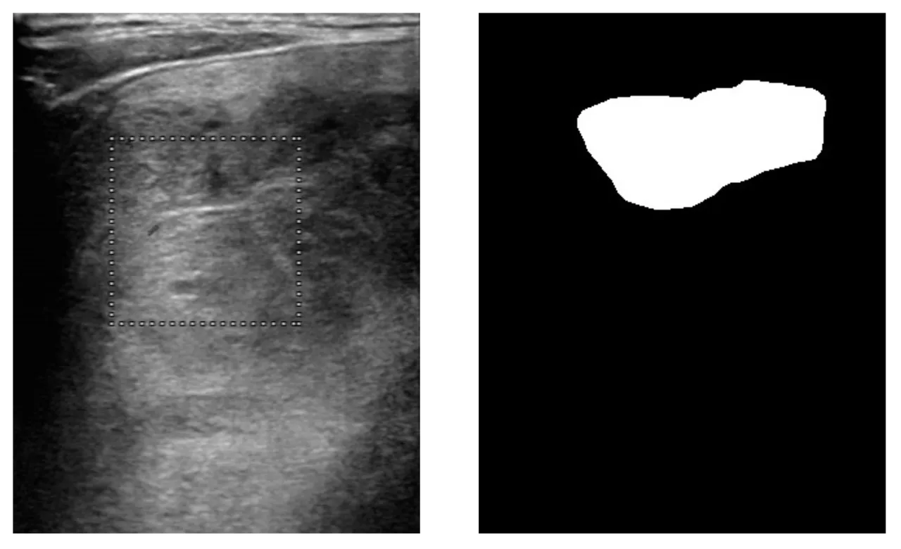

# TN3K

<div align="center">
    <a href="https://github.com/openmedlab/"></a>
</div>
<p style="text-align:center;font-size:10px;"><em></em></p>

## Dataset Information

The TN3K (Thyroid Nodule Region Segmentation Dataset) comprises 3493 ultrasound images from 2421 patients, captured between January 2016 and August 2020. These images were selected from over 30,000 images provided by our collaborating hospitals based on the following criteria: (1) Each image contains at least one thyroid nodule area; (2) Images of lymph nodes or those containing large colored areas are excluded; (3) In cases where multiple images were taken of the same area or from the same patient's perspective, only one representative image is retained. The dataset is divided into a training set and a test set, with 2879 and 614 images respectively. Segmenting thyroid nodules in ultrasound images is a valuable and challenging task, crucial for the diagnosis of thyroid cancer.

## Dataset Meta Information

| Dimensions | Modality | Task Type | Anatomical Structures          | Anatomical Area | Number of Categories | Data Volume | File Format |
|------------|----------|-----------|--------------------------------|-----------------|----------------------|-------------|-------------|
| 2D         | Ultra Sound | Segmentation | Thyroid Nodule | Head and Neck   | 1                    | 3493        | JPG         |


### Resolution Details

| Dataset Statistics | size         |
|--------------------|--------------|
| min                | (216, 217)   |
| median             | (412, 337)   |
| max                | (1463, 771)   |


## Label Information Statistics

| Segmentation Class | Thyroid Nodules |
|--------------------|-----------------|
| Case Count         | 3493            |
| Detection Rate     | 100%            |
| Min Volume (cm³)    | 1469              |
| Median Volume (cm³) | 10254           |
| Max Volume (cm³)    | 451543           |

## Visualization

<div align="center">
    <a href="https://github.com/openmedlab/"></a>
</div>
<p style="text-align:center;font-size:10px;"><em> (a) Ultrasound image (b) Segmentation annotation.</em></p>

## File Structure

The file structure of the TN3K dataset is as follows. The TN3K dataset consists of two folders: "GT" for segmentation annotations and "original" for original images. Both are in .png format. The specific file architecture is as follows:

``` 
tn3k/
├── label4test.csv
├── label4trainval.csv
├── test-image
│   ├── 0000.jpg
│   ├── 0001.jpg
│   ├── 0002.jpg
│   └── ...
├── test-mask
│   ├── 0000.jpg
│   ├── 0001.jpg
│   ├── 0002.jpg
│   └── ...
├── tn3k-trainval-fold0.json
├── tn3k-trainval-fold1.json
├── tn3k-trainval-fold2.json
├── tn3k-trainval-fold3.json
├── tn3k-trainval-fold4.json
├── tn3k-trainval.json
├── trainval-image
└── trainval-mask
│   ├── 2871.jpg
│   ├── 2872.jpg
│   ├── 2873.jpg
│   └── ...
└── trainval-mask
    ├── 0000.jpg
    ├── 0001.jpg
    ├── 0002.jpg
    └── ...
```

## Authors and Institutions

Haifan Gong (School of Computer Science and Engineering, Sun Yat-sen University)

Guanqi Chen (School of Computer Science and Engineering, Sun Yat-sen University)

Ranran Wang (School of Information Engineering, Nanchang University)

Xiang Xie (School of Computer Science and Engineering, Sun Yat-sen University)

Mingzhi Mao (School of Computer Science and Engineering, Sun Yat-sen University)

Yizhou Yu (Deepwise AI Lab)

Fei Chen (Zhujiang Hospital, Southern Medical University)

Guanbin Li (School of Computer Science and Engineering, Sun Yat-sen University)


## Source Information

Official Website: https://github.com/haifangong/TRFE-Net-for-thyroid-nodule-segmentation

Download Link: https://github.com/haifangong/TRFE-Net-for-thyroid-nodule-segmentation

Article Address: https://ieeexplore.ieee.org/abstract/document/9434087/

Publication Date: 2021.5.25

## Citation

``` 
@inproceedings{gong2021multi,
  title={Multi-task learning for thyroid nodule segmentation with thyroid region prior},
  author={Gong, Haifan and Chen, Guanqi and Wang, Ranran and Xie, Xiang and Mao, Mingzhi and Yu, Yizhou and Chen, Fei and Li, Guanbin},
  booktitle={2021 IEEE 18th international symposium on biomedical imaging (ISBI)},
  pages={257--261},
  year={2021},
  organization={IEEE}
}
```

Original introduction article is [here](https://zhuanlan.zhihu.com/p/671225978).