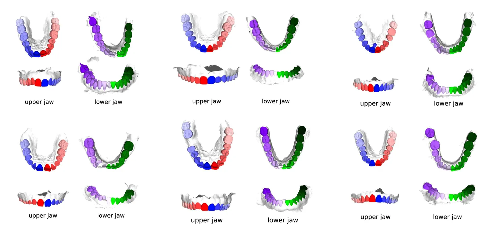
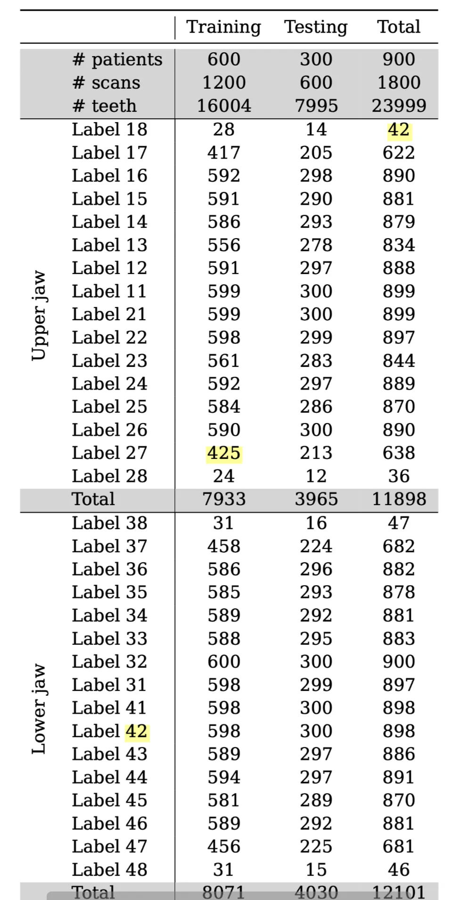
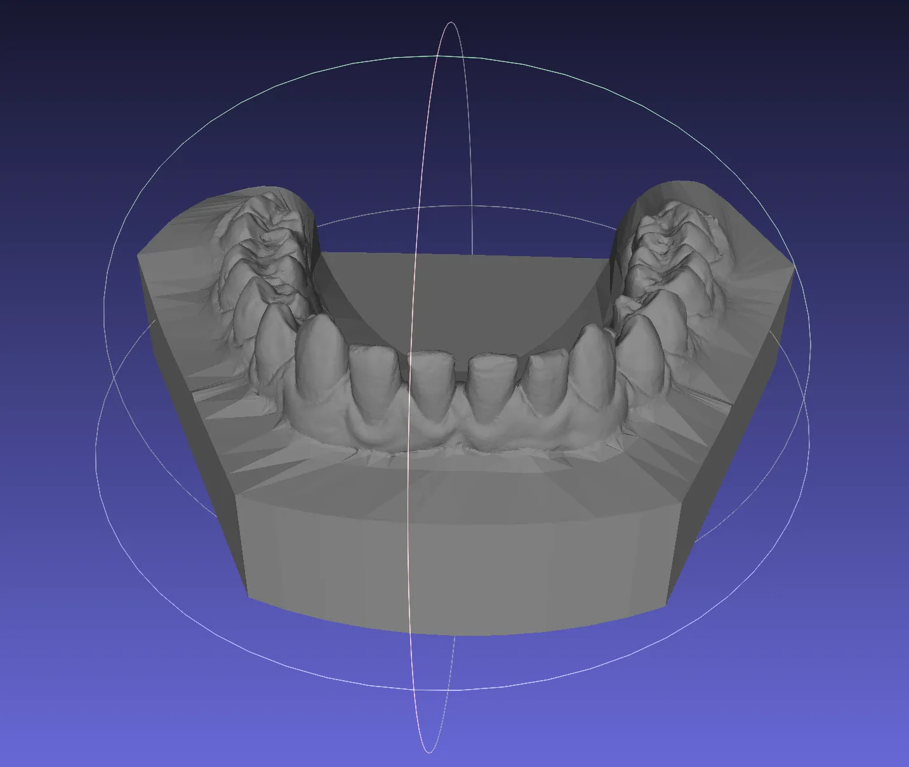
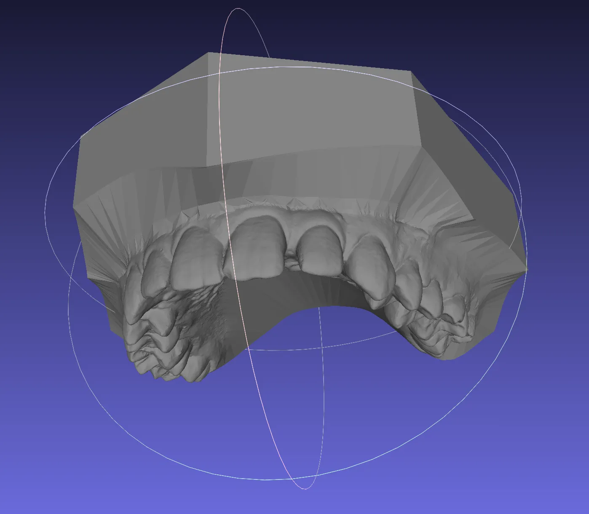

# Teeth3DS

<div align="center">
    <a href="https://github.com/openmedlab/"></a>
</div>
<p style="text-align:center;font-size:10px;"><em></em></p>

## Dataset Information

Teeth3DS is the first public dataset focusing on 3D tooth segmentation and labeling. Created for the 3DTeethSeg challenge at the International Conference on Medical Image Computing and Computer-Assisted Intervention (MICCAI) in 2022, its aim is to foster development in the research field and inspire the 3D vision research community to engage in intraoral 3D scanning analysis, such as tooth identification, segmentation, labeling, 3D modeling, and reconstruction. Teeth3DS consists of 1800 intraoral scans (containing 23,999 annotated teeth), covering both the upper and lower jaws. These scans were obtained and validated by orthodontists/oral surgeons with over 5 years of professional experience.

Computer-Aided Design (CAD) tools are increasingly popular in modern dental treatment planning due to their high precision. Particularly in orthodontic CAD systems, advanced intraoral scanners (IOS) are now widely used as they provide accurate digital surface models of teeth. These models greatly assist dentists in simulating tooth extraction, movement, deletion, and rearrangement, facilitating the prediction of treatment outcomes. Thus, digital dental models have the potential to liberate dentists from tedious and time-consuming tasks. Despite the growing prevalence of intraoral scanners in clinical dental practice, there is a paucity of research contributions on tooth segmentation/labeling in the literature, and no publicly available databases. A fundamental issue related to IOS data is the reliable segmentation and identification of teeth observed in scans. Tooth segmentation and labeling are challenging due to the inherent similarity between tooth shapes and their ambiguous placement on the jawbones. Additionally, several challenges are faced in tooth segmentation and labeling: 1. Variation in tooth position and shape between different subjects. 2. Presence of dental anomalies, such as tooth crowding leading to misalignment, thus blurring the boundaries between adjacent teeth. Moreover, missing teeth and cavities are common in the population, along with damaged teeth. 3. The presence of braces and other dental devices. Hence, the authors introduced the Teeth3DS dataset, aiming to address the existing pain points.

## Dataset Meta Information

The dataset is an IOS modality dataset, primarily composed of obj files and json files. The obj files resemble point cloud information and can be read using trimesh, mainly including information about vertices and faces. The point cloud information can be converted into voxel information using the **mesh.voxelized API, which can then be transformed into an ndarray.**

## Label Information Statistics

Each 3D obj file is labeled with a JSON file. The meanings of the fields in the JSON file are explained in the comments below:

```
{
    "id_patient": "", 
    "jaw": "upper", #or "lower",  extracted  from input
    "labels": [0, 0, 44, 33, 34, 0, 0, 45, 0, .. ,41,  0, 0, 37, 0, 34, 45, 0, 31, 36], 
    # label of each 3D point in FDI format (label 0 correspond to gingiva)
    "instances": [0, 0, 10, 2, 12, 0, 0, 9, 0, 0, .. , 10, 0, 0, 8, 0, 0, 9, 0, 1, 8, 13],
    # each 3D point with same instance correspond only to one tooth
    # all points with the same instance (correpond exactly to one tooth) should have the same label 
    # preferably tooth instance is in [1,2, .. , number_of_tooth_detected] 
    # by default 0 is attributed to gingiva instance
}
```

- "labels": the category label for each 3D point, where 0 represents the gums.

- "instances": the tooth number to which each 3D point belongs.

<div align="center">
    <a href="https://github.com/openmedlab/"></a>
</div>
<p style="text-align:center;font-size:10px;"><em> Combined visualization of 3D and label information.</em></p>

<div align="center">
    <a href="https://github.com/openmedlab/"></a>
</div>
<p style="text-align:center;font-size:10px;"><em></em></p>

## Visualization

<div align="center">
    <a href="https://github.com/openmedlab/"></a>
</div>
<p style="text-align:center;font-size:10px;"><em>Jaw.</em></p>

<div align="center">
    <a href="https://github.com/openmedlab/"></a>
</div>
<p style="text-align:center;font-size:10px;"><em>Upper jaw.</em></p>

## File Structure

The dataset is divided into Training and Testing folders, with the same structure in each. Within the Training folder, 'Upper' represents information about the upper jaw and 'Lower' represents information about the lower jaw. Inside these folders are subfolders for each patient, identified by a unique number. Each patient's folder contains the 3D information file (obj file) and the corresponding JSON label file. This structure organizes the data by jaw type and patient, facilitating access to specific 3D scans and their associated labels for training and testing purposes.

``` 
Training
│
├── Upper
│   ├── 015WXFRN
│   │   ├── 015WXFRN_upper.stl
│   │   ├── 015WXFRN_upper.obj
│   │   ├── 015WXFRN_upper.json
│   ├── AKBDPB4C
│   │   ├── ...
│   ├── ...
├──Lower
│   ├──AKBDPB4C
│   │   ├── 9GSQBATD_lower.stl
│   │   ├── 9GSQBATD_lower.obj
│   │   ├── 9GSQBATD_lower.json
│   ├── 01KAS2KD
│   │   ├── ...
│   ├── ...

Testing
│
├── Upper
│   ├── 01KAS2KD
│   │   ├── O52P1SZT_upper.stl
│   │   ├── O52P1SZT_upper.obj
│   │   ├── O52P1SZT_upper.json
│   ├── 014F9HTN
│   │   ├── ...
│   ├── ...
├──Lower
│   ├──09H2L7DM
│   │   ├── 09H2L7DM_lower.stl
│   │   ├── 09H2L7DM_lower.obj
│   │   ├── 09H2L7DM_lower.json
│   ├── 8XVU7PN9
│   │   ├── ...
│   ├── ...
```

## Authors and Institutions

Achraf Ben-Hamadou (FACS Digital Research Center, Udine Laboratory)

Oussama Smaoui (Udine Laboratory)

Houda Chaabouni-Chouayakh (FACS Digital Research Center, Udine Laboratory)

Ahmed Rekik (FACS Digital Research Center, Udine Laboratory)

Sergi Pujades (French National Institute for Computer Science and Applied Mathematics)

Edmond Boyer (French National Institute for Computer Science and Applied Mathematics)

Julien Strippoli (FACS Digital Research Center)

Aurélien Thollot (FACS Digital Research Center)

Hugo Setbon (FACS Digital Research Center)

Cyril Trosset (FACS Digital Research Center)

Edouard Ladroit (FACS Digital Research Center)


## Source Information

Official Website: https://github.com/DCBIA-OrthoLab/3DTeethSeg22_challenge

Download Link: https://osf.io/xctdy/

Article Address: https://arxiv.org/pdf/2210.06094.pdf

Publication Date: October, 2022.

## Citation

``` 
@article{ben2022teeth3ds,
 title={Teeth3DS: a benchmark for teeth segmentation and labeling from intra-oral 3D scans},
 author={Ben-Hamadou, Achraf and Smaoui, Oussama and Chaabouni-Chouayakh, Houda and Rekik, Ahmed and Pujades, Sergi and Boyer, Edmond and Strippoli, Julien and Thollot, Aur{\'e}lien and Setbon, Hugo and Trosset, Cyril and others},
 journal={arXiv preprint arXiv:2210.06094},
 year={2022}
}
```

Original introduction article is [here](https://zhuanlan.zhihu.com/p/672219960).