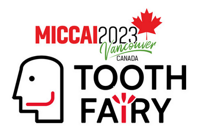
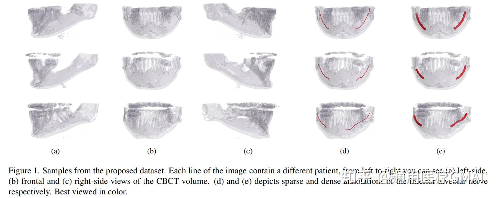
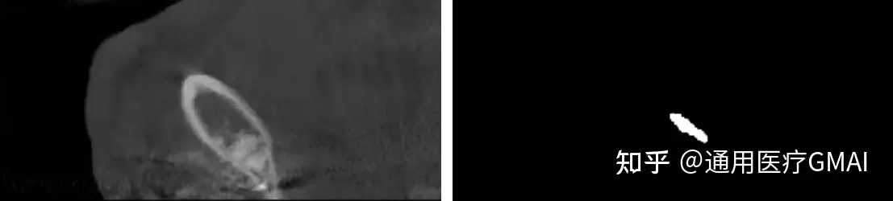
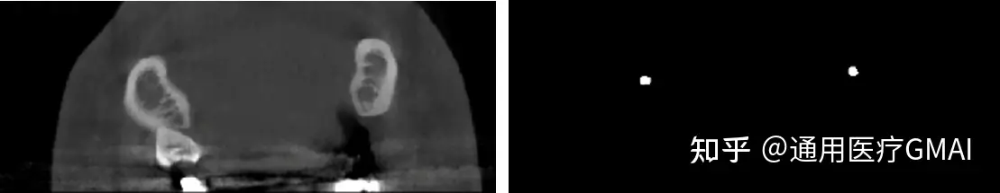
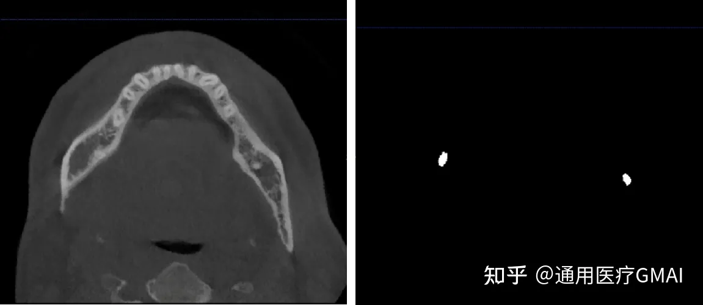

# ToothFairy

<div align="center">
    <a href="https://github.com/openmedlab/"></a>
</div>
<p style="text-align:center;font-size:10px;"><em></em></p>

## Dataset Information

ToothFairy is a dataset for voxel-level segmentation of the Inferior Alveolar Nerve (IAN) in Cone Beam Computed Tomography (CBCT) scans, and it is part of a challenge at MICCAI 2023. It includes 443 sparsely annotated CBCT images, of which 153 also have densely annotated data. For the challenge's validation and testing, 8 and 15 cases, respectively, have been reserved within the dataset. During the evaluation phase, additional undisclosed data will be made available for participants to use. The core objective of this challenge is to explore how to advance deep learning segmentation techniques for 3D IAN, in the context of both sparse and dense annotations, to achieve excellent segmentation results.

## Dataset Meta Information

| Dimensions | Modality | Task Type | Anatomical Structures    | Anatomical Area | Number of Categories | Data Volume | File Format |
|------------|----------|-----------|--------------------------|-----------------|----------------------|-------------|-------------|
| 3D         | CBCT       | Segmentation | Inferior Alveolar Nerve  | Head            | 1                    | 443        | .npy        |

In the provided 443 cases, 130 cases with dense annotations and 290 cases with sparse annotations are used as the training set, with 8 cases reserved for the validation set, and 15 cases for the test set.

### Resolution Details

| Dataset Statistics | size          |
|--------------------|---------------|
| min                | (312,265,148) |
| median             | (370,342,169) |
| max                | (463,423,178) |

Total number of slices: 74,871 (based on a count of 443 images).

## Label Information Statistics

Based on the statistics of the 153 cases with dense annotations.

| Metric        | Inferior Alveolar Nerve (IAN) |
|---------------|-----------------------------|
| Max Volume    | 46571                        |
| Min Volume    | 6015                            |
| Median Volume | 25061                        |

## Visualization

<div align="center">
    <a href="https://github.com/openmedlab/"></a>
</div>
<p style="text-align:center;font-size:10px;"><em> From paper.</em></p>

<div align="center">
    <a href="https://github.com/openmedlab/"></a>
</div>
<p style="text-align:center;font-size:10px;"><em> Perspective 1 of DATA78（Left: image, Right: label）</em></p>

<div align="center">
    <a href="https://github.com/openmedlab/"></a>
</div>
<p style="text-align:center;font-size:10px;"><em> Perspective 2 of DATA78（Left: image, Right: label）</em></p>

<div align="center">
    <a href="https://github.com/openmedlab/"></a>
</div>
<p style="text-align:center;font-size:10px;"><em> Perspective 3 of DATA78（Left: image, Right: label）</em></p>

## File Structure

The file structure of the `ToothFairy` dataset is as follows. The file `data.npy` contains the original CBCT scan data for each patient. All patients (for example, `P548`) have at least one sparse annotation file, `gt_sparse.npy`, and some patients (for example, P1) also have a dense annotation file, `gt_alpha.npy`. The `splits.json` file contains four different groups: training, validation, testing, and synthetic. All volumes in the first three groups have both sparse and dense annotations, while volumes in the synthetic group only have sparse annotations.

``` 
ToothFairy_Dataset
├── Dataset
│   ├── P1
│   │   ├── gt_alpha.npy
│   │   ├── gt_sparse.npy
│   │   └── data.npy
│   ├── P2
│   │   ├── gt_alpha.npy
│   │   ├── gt_sparse.npy
│   │   └── data.npy
│   ├── . . . 
│   └── P548
│   │   ├── gt_sparse.npy
│   │   └── data.npy
├── splits.json
└── README.md
```

## Authors and Institutions

Federico Bolelli (University of Modena and Reggio Emilia, Italy)

Luca Lumetti (University of Modena and Reggio Emilia, Italy)

Mattia Di Bartolomeo (University of Modena and Reggio Emilia, Italy)

Shankeeth Vinayahalingam (Radboud University, Netherlands)

Alexandre Anesi (University of Modena and Reggio Emilia, Italy)

Bram van Ginneken (Radboud University, Netherlands)

Costantino Grana (University of Modena and Reggio Emilia, Italy)


## Source Information

Official Website: https://toothfairy.grand-challenge.org/toothfairy/

Download Link: https://ditto.ing.unimore.it/toothfairy/

Article Address: https://openaccess.thecvf.com/content/CVPR2022/html/Cipriano_Improving_Segmentation_of_the_Inferior_Alveolar_Nerve_Through_Deep_Label_CVPR_2022_paper.html

Publication Date: March, 2023.

## Citation

``` 
@article{2022IEEEAccess,
    author={Cipriano, Marco and Allegretti, Stefano and Bolelli, Federico and Di Bartolomeo, Mattia and Pollastri, Federico and Pellacani, Arrigo and Minafra, Paolo and Anesi, Alexandre and Grana, Costantino},
    title={Deep Segmentation of the Mandibular Canal: a New 3D Annotated Dataset of CBCT Volumes},
    journal={IEEE Access},
    year={2022},
    volume={10},
    pages={11500--11510},
    publisher={IEEE},
    issn={2169-3536},
    doi={10.1109/ACCESS.2022.3144840}
}

@inproceedings{2022CVPR,
    author={Cipriano, Marco and Allegretti, Stefano and Bolelli, Federico and Pollastri, Federico and Grana, Costantino},
    title={Improving Segmentation of the Inferior Alveolar Nerve through Deep Label Propagation},
    booktitle={Proceedings of the IEEE/CVF Conference on Computer Vision and Pattern Recognition (CVPR)},
    year={2022},
    pages={21137--21146},
    publisher={IEEE},
    venue={New Orleans, USA},
    month={Jun}
}
```

Original introduction article is [here](https://zhuanlan.zhihu.com/p/655121552).