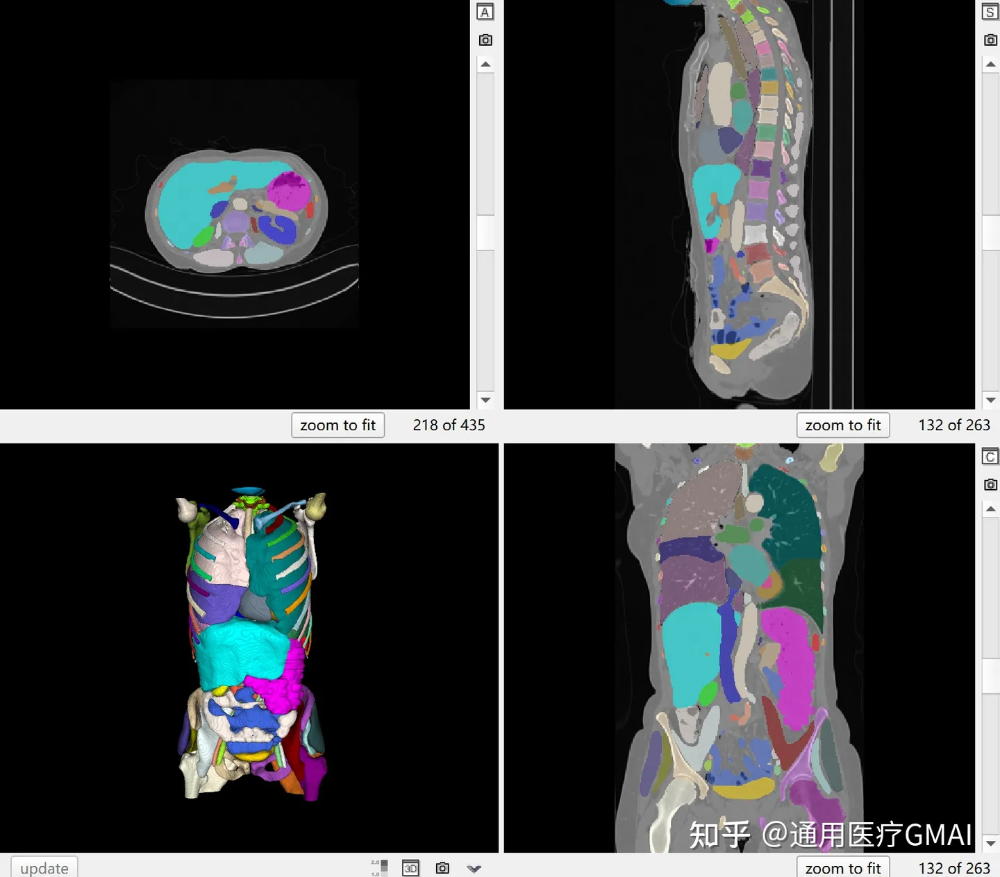

# TotalSegmentator

## Dataset Information

TotalSegmentator is the currently largest publicly available dataset for three-dimensional medical image segmentation, including 1204 CT images covering 104 types of anatomical structures. Among them, 1082 images are for training, 57 for validation, and 65 for testing. Unlike most datasets focusing only on partial organs and with limited data volume, TotalSegmentator provides unprecedented data scale and diversity, better adapting to the variable clinical scenarios. In addition, it annotates some structures that are rare in other datasets, offering a solid foundation for model research and optimization.

## Dataset Meta Information

| Dimensions | Modality | Task Type | Anatomical Structures          | Anatomical Area | Number of Categories | Data Volume | File Format |
|------------|----------|-----------|--------------------------------|-----------------|----------------------|-------------|-------------|
| 3D         | CT       | Segmentation | 27 organs; 59 bones; 10 muscles; 8 vessels | Entire body       | 104                  | 1204        | .nii.gz     |

### Resolution Details

| Dataset Statistics | spacing (mm)     | size              |
|--------------------|------------------|-------------------|
| min                | (1.5, 1.5, 1.5)              | (47, 48, 29)      |
| median             | (1.5, 1.5, 1.5)           | (241, 231, 231)   |
| max                | (1.5, 1.5, 1.5)              | (499, 430, 851)   |

Total Number of Slices in the Dataset: 312400 (Statistics for 1203 images, excluding one damaged data s0864)

## Label Information Statistics

| Label | Anatomical Structure | Occurrence Count | Presence Rate | Mean Volume (cm³) | Volume Variability (cm³) |
|-------|----------------------|------------------|---------------|-------------------|-------------------------|
| 1     | Spleen               | 870              | 72.32%        | 2542.37           | 176.34                  |
| 2     | Kidney, Right        | 767              | 63.76%        | 432.66            | 127.42                  |
| 3     | Kidney, Left         | 786              | 65.34%        | 527               | 126.78                  |
| 4     | Gallbladder          | 640              | 53.20%        | 146.8             | 17.87                   |
| 5     | Liver                | 921              | 76.56%        | 4162.89           | 1356.34                 |
| 6     | Stomach              | 889              | 73.90%        | 3175.5            | 228.41                  |
| 7     | Aorta                | 1074             | 89.28%        | 1447.04           | 172.47                  |
| 8     | Inferior Vena Cava   | 961              | 79.88%        | 150.43            | 52.15                   |
| 9     | Portal Vein and Splenic Vein | 814      | 67.66%        | 65.64             | 20.74                   |
| 10    | Pancreas             | 795              | 66.08%        | 145.81            | 59.18                   |
| 11    | Adrenal Gland, Right             | 811              | 67.41%        | 9.88              | 3.96                    |
| 12    | Adrenal Gland, Left              | 784              | 65.17%        | 13.27             | 4                      |
| 13    | Lung, Upper Lobe, Left           | 1008             | 83.79%        | 2914.96           | 794.34                  |
| 14    | Lung, Lower Lobe, Left           | 900              | 82.92%        | 2135.9            | 640.52                  |
| 15    | Lung, Upper Lobe, Right          | 885              | 73.57%        | 2304.48           | 731.92                  |
| 16    | Lung, Middle Lobe, Right         | 865              | 71.89%        | 1812.85           | 330.91                  |
| 17    | Lung, Lower Lobe, Right          | 975              | 81.05%        | 2412.88           | 744.78                  |
| 18    | Vertebrae, L5                    | 603              | 50.12%        | 99.43             | 61.75                   |
| 19    | Vertebrae, L4                    | 618              | 51.37%        | 115.43            | 62.8                    |
| 20    | Vertebrae, L3                    | 628              | 52.20%        | 140.96            | 62.18                   |
| 21    | Vertebrae, L2                    | 695              | 57.77%        | 93.21             | 55.74                   |
| 22    | Vertebrae, L1                    | 784              | 65.17%        | 97.68             | 50.84                   |
| 23    | Vertebrae, T12                   | 854              | 70.99%        | 108.59            | 44.9                    |
| 24    | Vertebrae, T11                   | 870              | 72.32%        | 75                | 44.16                   |
| 25    | Vertebrae, T10                   | 860              | 71.49%        | 85.52             | 38                     |
| 26    | Vertebrae, T9                    | 833              | 69.24%        | 67.92             | 33.19                   |
| 27    | Vertebrae, T8                    | 830              | 68.84%        | 81.54             | 30.12                   |
| 28    | Vertebrae, T7                    | 731              | 60.76%        | 60.16             | 28.24                   |
| 29    | Vertebrae, T6                    | 722              | 60.02%        | 56.8              | 25.2                    |
| 30    | Vertebrae, T5                  | 759              | 60.43%        | 46.19             | 24.35                   |
| 31    | Vertebrae, T4                  | 735              | 61.10%        | 37.59             | 22.98                   |
| 32    | Vertebrae, T3                  | 759              | 61.43%        | 40.2              | 21.8                    |
| 33    | Vertebrae, T2                  | 721              | 59.93%        | 38.82             | 23.05                   |
| 34    | Vertebrae, T1                  | 701              | 58.27%        | 41.32             | 21.92                   |
| 35    | Vertebrae, C7                  | 688              | 57.19%        | 32.37             | 13.5                    |
| 36    | Vertebrae, C6                  | 554              | 46.05%        | 27.45             | 6.1                     |
| 37    | Vertebrae, C5                  | 348              | 28.93%        | 25.66             | 11.24                   |
| 38    | Vertebrae, C4                  | 249              | 20.70%        | 25.07             | 12.36                   |
| 39    | Vertebrae, C3                  | 228              | 18.95%        | 23.21             | 12.76                   |
| 40    | Vertebrae, C2                  | 243              | 20.20%        | 28.83             | 17.34                   |
| 41    | Esophagus                           | 240              | 84.37%        | 17.67             | 27.35                   |
| 42    | Trachea                             | 788              | 65.50%        | 79.61             | 32.48                   |
| 43    | Heart Myocardium                    | 849              | 70.57%        | 264.4             | 117.96                  |
| 44    | Heart Atrium, Left                  | 834              | 69.33%        | 231.52            | 71.32                   |
| 45    | Heart Ventricle, Left               | 847              | 70.41%        | 245.14            | 102.92                  |
| 46    | Heart Atrium, Right                 | 849              | 70.57%        | 319.19            | 81.95                   |
| 47    | Heart Ventricle, Right              | 859              | 71.40%        | 388.04            | 137.71                  |
| 48    | Pulmonary Artery                    | 721              | 59.93%        | 155.23            | 66.18                   |
| 49    | Brain                               | 239              | 19.87%        | 1557.75           | 431.31                  |
| 50    | Iliac Artery, Left                  | 634              | 52.70%        | 106.37            | 15.67                   |
| 51    | Iliac Artery, Right                 | 627              | 52.12%        | 129.88            | 16.1                    |
| 52    | Iliac Vein, Left                    | 642              | 53.37%        | 61.56             | 29.08                   |
| 53    | Iliac Vein, Right                   | 614              | 51.04%        | 54.32             | 24.36                   |
| 54    | Small Bowel                         | 793              | 65.92%        | 2584.29           | 690.8                   |
| 55    | Duodenum                            | 751              | 62.43%        | 297.75            | 48.01                   |
| 56    | Colon                               | 895              | 74.40%        | 2046.86           | 533.74                  |
| 57    | Rib, Left 1st                       | 738              | 61.35%        | 211.19            | 9.25                    |
| 58    | Rib, Left 2nd                       | 749              | 62.26%        | 24.73             | 10.81                   |
| 59    | Rib, Left 3rd                       | 769              | 63.92%        | 27.64             | 11.88                   |
| 60    | Rib, Left 4th                       | 796              | 66.17%        | 33.91             | 14.68                   |
| 61    | Rib, Left 5th                       | 853              | 70.91%        | 38.91             | 15.45                   |
| 62    | Rib, Left 6th                       | 891              | 74.06%        | 42.54             | 17.19                   |
| 63    | Rib, Left 7th                       | 873              | 72.57%        | 44.01             | 18.43                   |
| 64    | Rib, Left 8th                       | 871              | 72.40%        | 41.62             | 15.88                   |
| 65    | Rib, Left 9th                       | 873              | 72.57%        | 33.72             | 15.28                   |
| 66    | Rib, Left 10th                      | 863              | 71.74%        | 34.57             | 12.46                   |
| 67    | Rib, Left 11th                      | 839              | 69.74%        | 25.96             | 7.98                    |
| 68    | Rib, Left 11                    | 869              | 69.74%        | 25.96             | 7.98                    |
| 69    | Rib, Left 12                    | 772              | 64.17%        | 10.47             | 3.14                    |
| 70    | Rib, Right 1                    | 735              | 61.10%        | 26.65             | 9.55                    |
| 71    | Rib, Right 2                    | 746              | 62.01%        | 25.05             | 10.86                   |
| 72    | Rib, Right 3                    | 762              | 63.34%        | 28.6              | 12.04                   |
| 73    | Rib, Right 4                    | 778              | 64.67%        | 32.8              | 15.13                   |
| 74    | Rib, Right 5                    | 825              | 68.58%        | 38.53             | 16.49                   |
| 75    | Rib, Right 6                    | 852              | 70.82%        | 43.19             | 18.29                   |
| 76    | Rib, Right 7                    | 834              | 69.33%        | 46.05             | 19.48                   |
| 77    | Rib, Right 8                    | 843              | 70.07%        | 45.69             | 17.14                   |
| 78    | Rib, Right 9                    | 848              | 70.70%        | 39.37             | 16.07                   |
| 79    | Rib, Right 10                   | 843              | 70.07%        | 33.73             | 12.03                   |
| 80    | Rib, Right 11                   | 847              | 70.41%        | 23.15             | 7.78                    |
| 81    | Rib, Right 12                   | 761              | 63.26%        | 12.83             | 3.08                    |
| 82    | Humerus, Left                   | 642              | 53.37%        | 214.21            | 38.7                    |
| 83    | Humerus, Right                  | 711              | 59.10%        | 203.61            | 38.77                   |
| 84    | Scapula, Left                   | 800              | 66.50%        | 327.81            | 85.73                   |
| 85    | Scapula, Right                  | 779              | 64.75%        | 160.98            | 87.98                   |
| 86    | Clavicle, Left                  | 724              | 60.18%        | 62.2              | 21.76                   |
| 87    | Clavicle, Right                 | 719              | 59.77%        | 53.77             | 23.52                   |
| 88    | Femur, Left                     | 568              | 47.22%        | 774.1             | 158.57                  |
| 89    | Femur, Right                    | 529              | 43.97%        | 721.38            | 161.57                  |
| 90    | Hip, Left                       | 632              | 52.37%        | 592.92            | 359.22                  |
| 91    | Hip, Right                      | 620              | 51.70%        | 598.67            | 359.67                  |
| 92    | Sacrum                          | 603              | 50.12%        | 356.18            | 216.43                  |
| 93    | Face                            | 356              | 29.59%        | 1722.87           | 390.72                  |
| 94    | Gluteus Maximus, Left           | 582              | 48.38%        | 1017.17           | 443.94                  |
| 95    | Gluteus Maximus, Right          | 581              | 48.30%        | 1084.03           | 263.22                  |
| 96    | Gluteus Medius, Left            | 610              | 50.71%        | 504.59            | 246.23                  |
| 97    | Gluteus Medius, Right           | 599              | 49.79%        | 466.93            | 223.51                  |
| 98    | Gluteus Minimus, Left           | 565              | 46.97%        | 99.59             | 57.57                   |
| 99    | Gluteus Minimus, Right          | 556              | 46.22%        | 122.36            | 60.8                    |
| 100   | Autochthon, Left                | 1115             | 92.68%        | 796.14            | 285.7                   |
| 101   | Autochthon, Right               | 1113             | 92.52%        | 808.46            | 279.46                  |
| 102   | Iliopsoas, Left                 | 818              | 68.00%        | 571.27            | 200.07                  |
| 103   | Iliopsoas, Right                | 854              | 68.50%        | 635.86            | 194.32                  |
| 104   | Ureter, Right (Distal End)      | 829              | 68.57%        | 44.76             | 14.34                   |


## Visualization

<div align="center">
    <a href="https://github.com/openmedlab/"></a>
</div>
<p style="text-align:center;font-size:10px;"><em>Visualization using itk-snap.</em></p>

## File Structure
After unzipping the official compressed package, the file structure is as follows: it contains a meta.csv file and multiple sxxxx subdirectories. In meta.csv, each line represents an imaging data, listing the picture ID (image_id), age (age), gender (gender), institutional code (institute), body part or examination range (study_type), and dataset division (split). These data cover CT scans of multiple body parts, sourced from different institutions, and are divided into training, validation, and testing subsets. Each sxxxx subdirectory contains a segmentations folder and a ct.nii.gz file.

```commandline
TotalSegmentator
│
├── meta.csv
│
├── s0000
│   ├── segmentations
│   │   ├── adrenal_gland_left.nii.gz
│   │   ├── adrenal_gland_right.nii.gz
│   │   ├── aorta.nii.gz
│   │   └── ...
│   ├── ct.nii.gz
│
├── s0001
├── s0002
├── s0003
└── ...
```

## Authors and Institutions

Jakob Wasserthal (Department of Radiology and Nuclear Medicine, University Hospital Basel, Switzerland)

## Source Information

Official Website: https://github.com/wasserth/TotalSegmentator

Download Link: https://zenodo.org/record/6802614

Article Address: https://pubs.rsna.org/doi/10.1148/ryai.230024

Data Public Release Date: 2022-07

## Citation

```
@article{totalsegmentator,
    author = {Wasserthal, Jakob and Breit, Hanns-Christian and Meyer, Manfred T. and Pradella, Maurice and Hinck, Daniel and Sauter, Alexander W. and Heye, Tobias and Boll, Daniel T. and Cyriac, Joshy and Yang, Shan and Bach, Michael and Segeroth, Martin},
    title = {TotalSegmentator: Robust Segmentation of 104 Anatomic Structures in CT Images},
    journal = {Radiology: Artificial Intelligence},
    volume = {5},
    number = {5},
    pages = {e230024},
    year = {2023}
}
```

Original introduction article is [here](https://zhuanlan.zhihu.com/p/652672013).