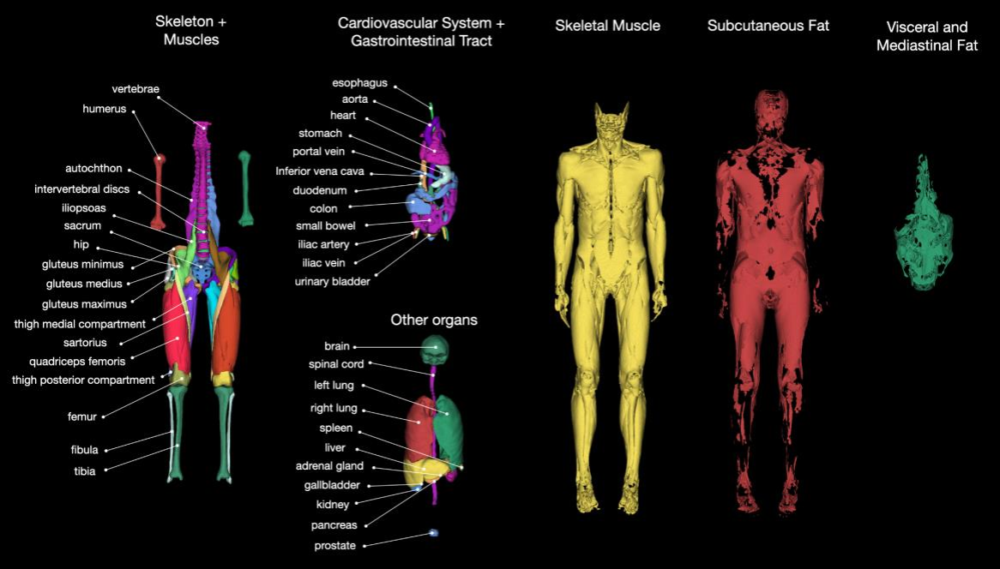
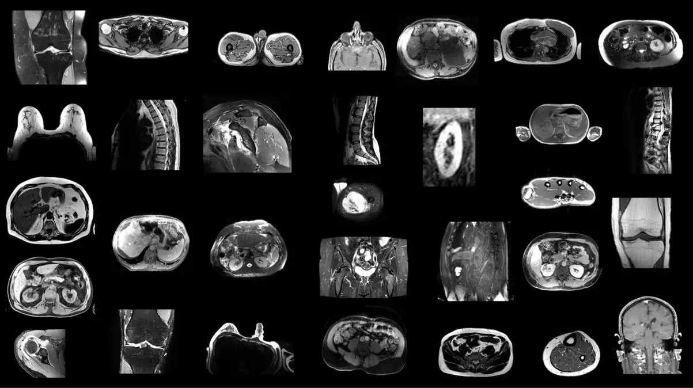

# TotalSegmentator MRI

<div align="center">
    <a href="https://github.com/openmedlab/"></a>
</div>
<p style="text-align:center;font-size:10px;"><em></em></p>

## Dataset Information

TotalSegmentator MRI dataset includes 298 MR images and provides segmentation annotations for up to 56 different commonly used anatomical structures. Among these, 251 MR images are sourced from the Picture Archiving and Communication System (PACS) at the University Hospital Basel, collected between 2011 and 2023, while the remaining 47 MR images come from the Imaging Data Commons (IDC) platform to enhance diversity. The dataset is derived from random sampling in routine clinical practice, representing a real-world dataset that can be generalized to clinical applications. It encompasses various lesions, scanners, imaging sequences, and data from different medical institutions. Notably, although the official paper mentions 59 categories, only 56 classes are provided in the publicly available dataset, with slight discrepancies.

Magnetic Resonance Imaging (MRI) offers detailed anatomical images without using ionizing radiation, crucial for diagnosing various clinical conditions, including neurological disorders and musculoskeletal injuries. While the TotalSegmentator (CT) dataset has been widely used, MRI image segmentation remains challenging due to variations in imaging parameters and protocols across different sequences and body parts, impacting the universality and accuracy of algorithms. The TotalSegmentator MRI dataset expands the capability to handle various MRI images, aiming to develop an open-source and user-friendly segmentation model that can automatically and robustly segment major anatomical structures without relying on specific MR sequences.

## Dataset Meta Information

| Dimensions | Modality | Task Type | Anatomical Structures | Anatomical Area | Number of Categories | Data Volume | File Format |
|------------|----------|-----------|-----------------------|-----------------|----------------------|-------------|-------------|
| 3D         | MRI      | Segmentation | 56 body structures    | Entire body       | 56                   | 298         | .nii.gz     |


### Resolution Details

| Dataset Statistics | spacing (mm)       | size              |
|--------------------|--------------------|-------------------|
| min                | (0.20, 0.20, 0.20) | (11,12,5)         |
| median             | (1.03, 1.18, 3.0)  | (320, 260, 80)    |
| max                | (6.5, 10.6, 28)    | (1092, 896, 1138) |

Number of 2D slices in the dataset: 57,991

## Label Information Statistics

| Label | Structure                         | Cases | Percentage | Max Volume (cm³) | Median Volume (cm³) |
|-------|-----------------------------------|-------|------------|------------------|---------------------|
| 1     | spleen                            | 118   | 39.60%     | 1075.97          | 173.02              |
| 2     | kidney_right                      | 115   | 38.59%     | 335.82           | 118.39              |
| 3     | kidney_left                       | 120   | 40.27%     | 446.03           | 113.4               |
| 4     | gallbladder                       | 88    | 29.53%     | 110.95           | 14.03               |
| 5     | liver                             | 128   | 42.95%     | 3172.88          | 1181                |
| 6     | stomach                           | 123   | 41.28%     | 833.72           | 196.02              |
| 7     | pancreas                          | 108   | 36.24%     | 169.44           | 43.42               |
| 8     | adrenal_gland_right               | 105   | 35.23%     | 7.75             | 1.89                |
| 9     | adrenal_gland_left                | 104   | 35.26%     | 9.07             | 2.81                |
| 10    | lung_left                         | 139   | 46.64%     | 2577.92          | 531.88              |
| 11    | lung_right                        | 138   | 46.31%     | 3616.18          | 623.26              |
| 12    | esophagus                         | 120   | 40.27%     | 34.84            | 8.73                |
| 13    | small_bowel                       | 154   | 51.68%     | 1699.95          | 258.14              |
| 14    | duodenum                          | 117   | 39.26%     | 105.99           | 31.74               |
| 15    | colon                             | 179   | 60.07%     | 2837.21          | 263.84              |
| 16    | urinary_bladder                   | 64    | 21.48%     | 502.32           | 64.98               |
| 17    | prostate                          | 36    | 12.08%     | 108.13           | 17.98               |
| 18    | sacrum                            | 93    | 31.21%     | 226.63           | 112.92              |
| 19    | vertebrae                         | 195   | 65.44%     | 399.01           | 151.25              |
| 20    | intervertebral_discs              | 193   | 64.77%     | 201.98           | 73.01               |
| 21    | spinal_cord                       | 197   | 66.11%     | 105.17           | 38.41               |
| 22    | heart                             | 116   | 38.93%     | 818.85           | 360.54              |
| 23    | aorta                             | 141   | 47.32%     | 226.72           | 55.46               |
| 24    | inferior_vena_cava                | 136   | 45.64%     | 129.78           | 32.2                |
| 25    | portal_vein_and_splenic_vein      | 113   | 37.92%     | 35.47            | 10.23               |
| 26    | iliac_artery_left                 | 110   | 36.91%     | 24.34            | 4.14                |
| 27    | iliac_artery_right                | 113   | 37.92%     | 25.1             | 4.18                |
| 28    | iliac_vena_left                   | 106   | 35.57%     | 38.99            | 7.3                 |
| 29    | iliac_vena_right                  | 108   | 36.24%     | 29.86            | 5.25                |
| 30    | humerus_left                      | 40    | 13.42%     | 167.43           | 31.31               |
| 31    | humerus_right                     | 41    | 13.76%     | 179.23           | 24.09               |
| 32    | fibula                            | 35    | 11.74%     | 50.67            | 9.41                |
| 33    | tibia                             | 38    | 12.75%     | 426.23           | 103.47              |
| 34    | femur_left                        | 88    | 29.53%     | 438              | 103.01              |
| 35    | femur_right                       | 88    | 29.53%     | 462.92           | 110.36              |
| 36    | hip_left                          | 118   | 39.60%     | 365.59           | 101.1               |
| 37    | hip_right                         | 119   | 39.93%     | 336.61           | 103.37              |
| 38    | gluteus_maximus_left              | 84    | 28.19%     | 859.77           | 235.84              |
| 39    | gluteus_maximus_right             | 83    | 27.85%     | 733.48           | 263.89              |
| 40    | gluteus_medius_left               | 92    | 30.87%     | 459.73           | 127.54              |
| 41    | gluteus_medius_right              | 92    | 30.87%     | 345.01           | 125.98              |
| 42    | gluteus_minimus_left              | 73    | 24.50%     | 136.64           | 46.14               |
| 43    | gluteus_minimus_right             | 72    | 24.16%     | 86.14            | 40.38               |
| 44    | autochthon_left                   | 178   | 59.73%     | 614.1            | 185.48              |
| 45    | autochthon_right                  | 177   | 59.40%     | 583.41           | 169.24              |
| 46    | iliopsoas_left                    | 166   | 55.70%     | 423.27           | 108.68              |
| 47    | iliopsoas_right                   | 170   | 57.05%     | 413.83           | 99.59               |
| 48    | quadriceps_femoris_left           | 70    | 23.49%     | 2228.98          | 75.2                |
| 49    | quadriceps_femoris_right          | 72    | 24.16%     | 2149.81          | 81.72               |
| 50    | thigh_medial_compartment_left     | 63    | 21.14%     | 1163.8           | 165.98              |
| 51    | thigh_medial_compartment_right    | 72    | 24.16%     | 1167.81          | 155.36              |
| 52    | thigh_posterior_compartment_left  | 50    | 16.78%     | 657.73           | 61.61               |
| 53    | thigh_posterior_compartment_right | 52    | 17.45%     | 664.63           | 19.04               |
| 54    | sartorius_left                    | 69    | 23.15%     | 198.14           | 16.75               |
| 55    | sartorius_right                   | 68    | 22.82%     | 169              | 21.52               |
| 56    | brain                             | 17    | 5.70%      | 1783.46          | 1577.3              |


## Visualization

<div align="center">
    <a href="https://github.com/openmedlab/"></a>
</div>
<p style="text-align:center;font-size:10px;"><em> Official Visualization.</em></p>

<div align="center">
    <a href="https://github.com/openmedlab/"></a>
</div>
<p style="text-align:center;font-size:10px;"><em> Local ITK-SNAP Visualization.</em></p>

## File Structure

The dataset file structure is as follows: the folder contains 298 subdirectories (from s0001 to s0298). Each subdirectory contains an MRI image file (mri.nii.gz) and corresponding segmentation files for multiple anatomical structures. In the root directory, there is also a meta.csv file. The meta.csv file contains the following metadata categories for each MRI image: patient information (age, gender), institution information (institution, study type, manufacturer, scanner model), scan parameters (slice thickness, scan sequence, repetition time, echo time, magnetic field strength), and data division (data source, dataset partition).

``` 
TotalsegmentatorMRI_dataset_v100/
├── s0001/
│   ├── mri.nii.gz
│   └── segmentations/
│       ├── adrenal_gland_left.nii.gz
│       ├── adrenal_gland_right.nii.gz
│       ├── aorta.nii.gz
│       ├── autochthon_left.nii.gz
│       ├── autochthon_right.nii.gz
│       └── ...   # 省略其他类别
├── s0002/
├── s0003/
├── ...
├── s0298/
└── meta.csv
```

## Authors and Institutions

Tugba Akinci D’Antonoli (University Hospital Basel, Switzerland)

Lucas K. Berger (University Hospital Basel, Switzerland)

Ashraya K. Indrakanti (University Hospital Basel, Switzerland)

Nathan Vishwanathan (University Hospital Basel, Switzerland)

Jakob Weiß (University Medical Center Freiburg, Germany)

Matthias Jung (University Medical Center Freiburg, Germany)

Zeynep Berkarda (University Medical Center Freiburg, Germany)

Alexander Rau (University Medical Center Freiburg, Germany)

Marco Reisert (University Medical Center Freiburg, Germany)

Thomas Küstner (University Hospital of Tuebingen, Germany)

Alexandra Walter (German Cancer Research Center, Germany; Karlsruhe Institute of Technology, Germany)

Elmar M. Merkle (University Hospital Basel, Switzerland)

Martin Segeroth (University Hospital Basel, Switzerland)

Joshy Cyriac (University Hospital Basel, Switzerland)

Shan Yang (University Hospital Basel, Switzerland)

Jakob Wasserthal (University Hospital Basel, Switzerland)


## Source Information

Official Website: https://github.com/wasserth/TotalSegmentator

Download Link: https://zenodo.org/records/11367005

Article Address: https://arxiv.org/pdf/2405.19492

Publication Date: 2024-05

## Citation

``` 
@misc{dantonoli2024totalsegmentator,
      title={TotalSegmentator MRI: Sequence-Independent Segmentation of 59 Anatomical Structures in MR images}, 
      author={Tugba Akinci D'Antonoli and Lucas K. Berger and Ashraya K. Indrakanti and Nathan Vishwanathan and Jakob Weiß and Matthias Jung and Zeynep Berkarda and Alexander Rau and Marco Reisert and Thomas Küstner and Alexandra Walter and Elmar M. Merkle and Martin Segeroth and Joshy Cyriac and Shan Yang and Jakob Wasserthal},
      year={2024},
      eprint={2405.19492},
      archivePrefix={arXiv},
      primaryClass={eess.IV}
}
```

Original introduction article is [here](https://zhuanlan.zhihu.com/p/701053163).