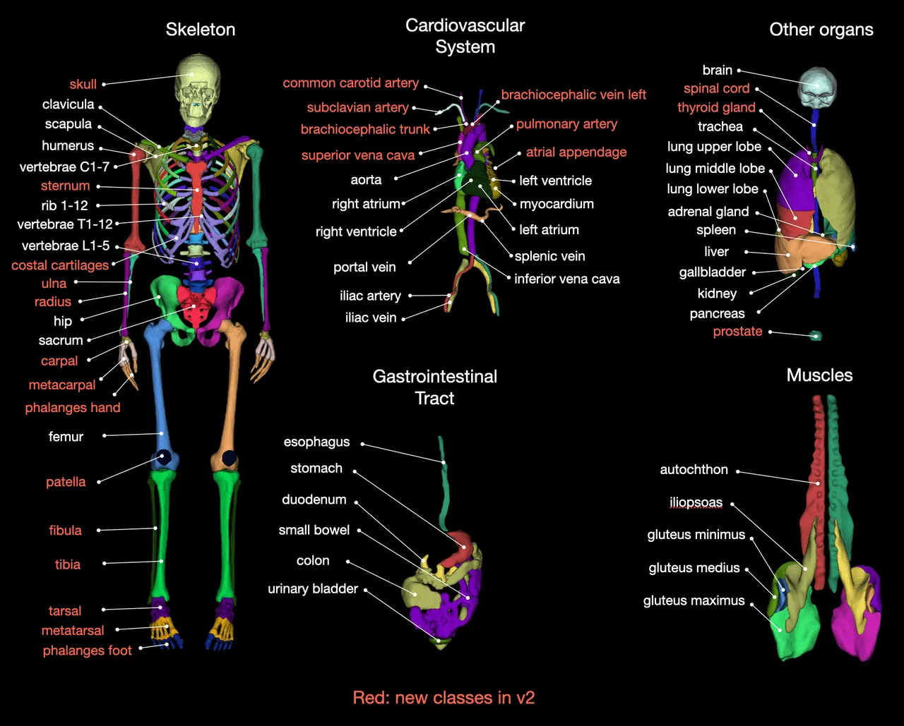
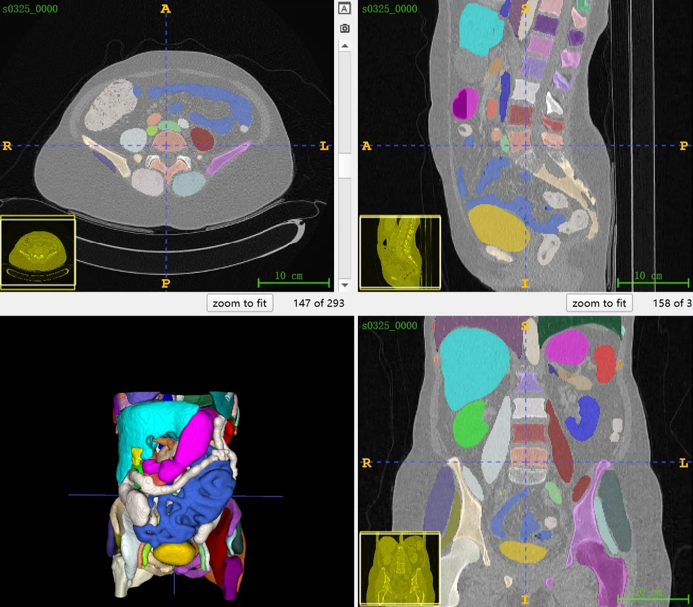
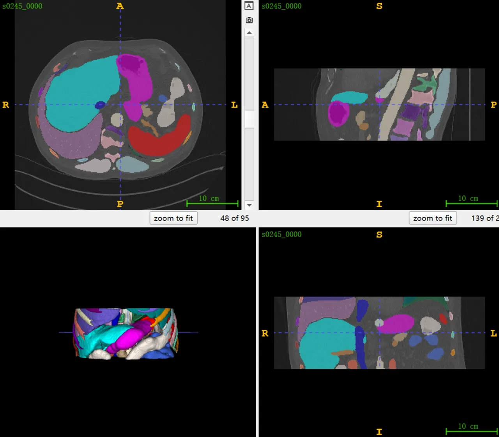

# TotalSegmentator V2

## Dataset Information

TotalSegmentator is currently the largest publicly available annotated CT segmentation dataset. 
The first version of the data was released in July 2022, and the dataset underwent a significant update in September 2023. 
There was a modest increase in both the number of images and the number of annotation categories. 
The total number of images increased from 1204 to 1228 (only the number of images in the test set was increased), 
and the number of categories increased from 104 to 117. The current public dataset is divided into 1082 training images, 
57 validation images, and 89 test images (the v1 version had 65), all of which are publicly available with annotations. 
For an introduction to the first version of the data, please refer to the link below. For more detailed information about the data changes, 
please refer to the following:

### Changes/improvements for public dataset:

- Increased number of classes from 104 to 117 (all classes of the `total` task)
- Removed heart chamber classes
- Improved label quality (see above) (better than before but probably still some errors)
- More meta data per image (scanner, pathology, ...)
- Less intrusive defacing
- No more corrupted files
- Example code for converting to nnU-Net format
- Example code for evaluation
- Same subjects as in v1 for training and validation (we did not publish the additional subjects we used for TotalSegmentator v2 training)
- A few more subjects than in v1 for testing
- **NOTE**: labels for additional tasks are not included

## Dataset Meta Information

| Dimensions | Modality | Task Type | Anatomical Structures          | Anatomical Area | Number of Categories | Data Volume | File Format |
|------------|----------|-----------|--------------------------------|-----------------|----------------------|-------------|-------------|
| 3D         | CT       | Segmentation | Whole Body | Whole Body       | 117                  | 1228        | .nii.gz     |

### Resolution Details

| Resolution Level | spacing (mm) | size          |
|------------------|--------------|---------------|
| Original Image   | (1.5, 1.5, 1.5) | (47, 48, 29)   |
| Medium Resolution| (1.5, 1.5, 1.5) | (241, 231, 231)|
| High Resolution  | (1.5, 1.5, 1.5) | (499, 467, 851)|

Total number of image voxels: 317,863 (From the 1228 total cases of the dataset).

## Label Information Statistics

| Label | Organ            | Cases | Coverage | Volume (cm³) | Adjusted Volume (cm³) |
|-------|------------------|-------|----------|--------------|-----------------------|
| 1     | spleen           | 886   | 72.15%   | 177.28       | 2542.53               |
| 2     | kidney_right     | 782   | 63.68%   | 127.44       | 432.66                |
| 3     | kidney_left      | 802   | 65.31%   | 126.78       | 527                   |
| 4     | gallbladder      | 654   | 53.26%   | 18.13        | 146.8                 |
| 5     | liver            | 937   | 76.30%   | 1363.42      | 4162.89               |
| 6     | stomach          | 905   | 73.70%   | 228.41       | 3174.68               |
| 7     | pancreas         | 811   | 66.04%   | 59.33        | 145.81                |
| 8     | adrenal_gland_right | 827   | 67.35%   | 3.47         | 9.88                 |
| 9     | adrenal_gland_left | 800   | 65.15%   | 4.02         | 13.27                |
| 10    | lung_upper_lobe_left | 1024  | 83.39%   | 781.69       | 2929.41              |
| 11    | lung_lower_lobe_left | 1006  | 81.92%   | 633.56       | 2136.38              |
| 12    | lung_upper_lobe_right | 894   | 72.80%   | 729.36       | 2304.4               |
| 13    | lung_middle_lobe_right | 881   | 71.74%   | 328.26       | 1806.94              |
| 14    | lung_lower_lobe_right | 991   | 80.70%   | 734.69       | 2412.69              |
| 15    | esophagus        | 1032  | 84.04%   | 27           | 176.31               |
| 16    | trachea          | 792   | 64.50%   | 32.48        | 79.53                |
| 17    | thyroid_gland    | 700   | 57.00%   | 12.77        | 62.27                |
| 18    | small_bowel      | 811   | 66.04%   | 694.43       | 2584.29              |
| 19    | duodenum         | 768   | 62.54%   | 47.06        | 297.74               |
| 20    | colon            | 913   | 74.35%   | 535.68       | 2046.86              |
| 21    | urinary bladder    | 571   | 46.50%   | 144.21       | 835.44                |
| 22    | prostate           | 343   | 27.93%   | 27.06        | 140.62                |
| 23    | kidney cyst left   | 30    | 2.44%    | 57.39        | 527.12                |
| 24    | kidney cyst right  | 25    | 2.04%    | 26.03        | 914.43                |
| 25    | sacrum             | 616   | 50.16%   | 171.23       | 296.25                |
| 26    | vertebrae S1       | 589   | 47.96%   | 47.04        | 99.11                 |
| 27    | vertebrae L5       | 619   | 50.41%   | 62.48        | 99.82                 |
| 28    | vertebrae L4       | 636   | 51.79%   | 62.66        | 110.09                |
| 29    | vertebrae L3       | 645   | 52.52%   | 62.09        | 140.92                |
| 30    | vertebrae L2       | 712   | 57.98%   | 55.86        | 93.21                 |
| 31    | vertebrae L1       | 801   | 65.23%   | 50.86        | 97.68                 |
| 32    | vertebrae T12      | 871   | 70.93%   | 44.88        | 108.59                |
| 33    | vertebrae T11      | 887   | 72.23%   | 41.41        | 75                    |
| 34    | vertebrae T10      | 877   | 71.42%   | 37.97        | 85.52                 |
| 35    | vertebrae T9       | 849   | 69.14%   | 33.17        | 67.92                 |
| 36    | vertebrae T8       | 796   | 64.82%   | 30.04        | 81.54                 |
| 37    | vertebrae T7       | 745   | 60.67%   | 28.14        | 60.16                 |
| 38    | vertebrae T6       | 732   | 59.61%   | 25.05        | 56.8                  |
| 39    | vertebrae T5       | 733   | 59.69%   | 24.31        | 46.18                 |
| 40    | vertebrae T4       | 738   | 60.10%   | 22.98        | 37.59                 |
| 41    | vertebrae T3                | 742   | 60.42%   | 21.8         | 40.2                  |
| 42    | vertebrae T2                | 724   | 58.96%   | 23.04        | 38.84                 |
| 43    | vertebrae T1                | 704   | 57.33%   | 21.92        | 41.35                 |
| 44    | vertebrae C7                | 691   | 56.27%   | 13.5         | 32.54                 |
| 45    | vertebrae C6                | 556   | 45.28%   | 6.1          | 27.45                 |
| 46    | vertebrae C5                | 349   | 28.42%   | 11.3         | 25.66                 |
| 47    | vertebrae C4                | 250   | 20.36%   | 12.31        | 25.07                 |
| 48    | vertebrae C3                | 229   | 18.65%   | 12.75        | 23.21                 |
| 49    | vertebrae C2                | 252   | 20.52%   | 17.02        | 28.8                  |
| 50    | vertebrae C1                | 247   | 20.11%   | 12.63        | 23.22                 |
| 51    | heart                       | 916   | 74.59%   | 523.93       | 1305.97               |
| 52    | aorta                       | 1078  | 87.79%   | 181.52       | 1566.34               |
| 53    | pulmonary vein              | 775   | 63.11%   | 21.95        | 53.63                 |
| 54    | brachiocephalic trunk       | 725   | 59.04%   | 5.18         | 15.39                 |
| 55    | subclavian artery right     | 724   | 58.96%   | 7.2          | 23.88                 |
| 56    | subclavian artery left      | 746   | 60.75%   | 8.07         | 22.28                 |
| 57    | common carotid artery right | 718   | 58.47%   | 2.94         | 9.7                   |
| 58    | common carotid artery left  | 746   | 60.75%   | 4.56         | 13.22                 |
| 59    | brachiocephalic vein left   | 726   | 59.12%   | 11.78        | 31.58                 |
| 60    | brachiocephalic vein right  | 728   | 59.28%   | 6.02         | 22.04                 |
| 61    | atrial appendage left       | 669   | 54.48%   | 6.72         | 26.66                 |
| 62    | superior vena cava          | 757   | 61.64%   | 19.23        | 42.7                  |
| 63    | inferior vena cava          | 977   | 79.56%   | 57.37        | 159.91                |
| 64    | portal vein and splenic vein| 830   | 67.59%   | 20.74        | 65.64                 |
| 65    | iliac artery left           | 651   | 53.01%   | 15.62        | 106.37                |
| 66    | iliac artery right          | 644   | 52.44%   | 16.05        | 129.88                |
| 67    | iliac vena left             | 636   | 51.79%   | 28.89        | 61.56                 |
| 68    | iliac vena right            | 629   | 51.22%   | 24.17        | 54.32                 |
| 69    | humerus left                | 609   | 49.59%   | 44.34        | 256.93                |
| 70    | humerus right               | 603   | 49.10%   | 49           | 310.76                |
| 71    | scapula_left             | 807   | 65.72%   | 85.29        | 327.81                |
| 72    | scapula_right            | 786   | 64.01%   | 87.12        | 160.98                |
| 73    | clavicle_left            | 727   | 59.20%   | 21.91        | 62.2                  |
| 74    | clavicle_right           | 723   | 58.88%   | 23.47        | 53.77                 |
| 75    | femur_left               | 566   | 46.09%   | 176.6        | 857.8                 |
| 76    | femur_right              | 556   | 45.28%   | 174.98       | 771.3                 |
| 77    | hip_left                 | 644   | 52.44%   | 351.62       | 584.29                |
| 78    | hip_right                | 637   | 51.87%   | 351.84       | 587.02                |
| 79    | spinal_cord              | 1183  | 96.34%   | 51.55        | 1564                  |
| 80    | gluteus_maximus_left     | 595   | 48.45%   | 443.69       | 1017.17               |
| 81    | gluteus_maximus_right    | 594   | 48.37%   | 461.64       | 1084.03               |
| 82    | gluteus_medius_left      | 625   | 50.90%   | 225.88       | 504.59                |
| 83    | gluteus_medius_right     | 613   | 49.92%   | 222.88       | 466.93                |
| 84    | gluteus_minimus_left     | 578   | 47.07%   | 52.44        | 99.59                 |
| 85    | gluteus_minimus_right    | 569   | 46.34%   | 60.64        | 122.36                |
| 86    | autochthon_left          | 1133  | 92.26%   | 289.49       | 796.14                |
| 87    | autochthon_right         | 1131  | 92.10%   | 284.58       | 808.46                |
| 88    | iliopsoas_left           | 836   | 68.08%   | 200.18       | 571.27                |
| 89    | iliopsoas_right          | 842   | 68.57%   | 188.32       | 557.65                |
| 90    | brain                    | 249   | 20.28%   | 562.19       | 1546.77               |
| 91    | skull                    | 470   | 38.27%   | 142.36       | 1157.69               |
| 92    | rib_right 4              | 787   | 64.09%   | 15.01        | 32.8                  |
| 93    | rib_right 3              | 766   | 62.38%   | 12.01        | 28.6                  |
| 94    | rib_left_1               | 742   | 60.42%   | 9.12         | 21.1                  |
| 95    | rib_left_2               | 752   | 61.24%   | 10.82        | 24.73                 |
| 96    | rib_left_3               | 773   | 62.95%   | 11.83        | 27.64                 |
| 97    | rib_left_4               | 806   | 65.64%   | 14.51        | 33.91                 |
| 98    | rib_left_5               | 868   | 70.68%   | 15.27        | 38.9                  |
| 99    | rib_left_6               | 909   | 74.02%   | 17.02        | 42.46                 |
| 100   | rib_left_7               | 891   | 72.56%   | 18.12        | 43.8                  |
| 101   | rib_left_8          | 888   | 72.31%   | 15.82        | 41.45                 |
| 102   | rib_left_9          | 890   | 72.48%   | 15.22        | 33.71                 |
| 103   | rib_left_10         | 880   | 71.66%   | 12.46        | 34.54                 |
| 104   | rib_left_11         | 857   | 69.79%   | 8            | 25.96                 |
| 105   | rib_left_12         | 790   | 64.33%   | 3.16         | 10.47                 |
| 106   | rib_right_1         | 738   | 60.10%   | 9.47         | 26.35                 |
| 107   | rib_right_2         | 751   | 61.16%   | 10.86        | 25.05                 |
| 108   | rib_right_5         | 838   | 68.24%   | 16.27        | 38.45                 |
| 109   | rib_right_6         | 869   | 70.77%   | 18.09        | 43.02                 |
| 110   | rib_right_7         | 851   | 69.30%   | 19.32        | 46.01                 |
| 111   | rib_right_8         | 859   | 69.95%   | 17.06        | 45.3                  |
| 112   | rib_right_9         | 860   | 70.03%   | 16.03        | 39.26                 |
| 113   | rib_right_10        | 866   | 70.52%   | 12.63        | 33.55                 |
| 114   | rib_right_11        | 866   | 70.52%   | 7.78         | 23.15                 |
| 115   | rib_right_12        | 785   | 63.93%   | 3.07         | 12.83                 |
| 116   | sternum             | 959   | 78.09%   | 49.9         | 123.91                |
| 117   | costal_cartilages   | 1017  | 82.82%   | 114.45       | 294.52                |

## Visualization

<div align="center">
    <a href="https://github.com/openmedlab/"></a>
</div>
<p style="text-align:center;font-size:10px;"><em>Visualization from official website.</em></p>

<div align="center">
    <a href="https://github.com/openmedlab/"></a>
</div>
<p style="text-align:center;font-size:10px;"><em>Visualization using ITK-SNAP on large image.</em></p>

<div align="center">
    <a href="https://github.com/openmedlab/"></a>
</div>
<p style="text-align:center;font-size:10px;"><em>Visualization using ITK-SNAP on small image.</em></p>

## File Structure

The file structure is consistent with TotalSegmentator v1. After decompressing the official zip package, it includes a meta.csv file and several sxxxx subdirectories. In the meta.csv, each row represents an imaging data, listing the picture ID (image_id), age (age), gender (gender), institution code (institute), body part or examination range (study_type), and dataset division (split). These data cover CT scans of multiple body parts from different institutions and are divided into three subsets: training, validation, and testing. Each sxxxx subdirectory contains a segmentation folder and a ct.nii.gz file.

```
Totalsegmentator_dataset_v2
│
├── meta.csv
│
├── s0000
│   ├── segmentations
│   │   ├── adrenal_gland_left.nii.gz
│   │   ├── adrenal_gland_right.nii.gz
│   │   ├── aorta.nii.gz
│   │   └── ...
│   ├── ct.nii.gz
│
├── s0001
├── s0002
├── ...
└── s1429
```

## Author and Institution
Jakob Wasserthal (University Hospital Basel, Department of Radiology and Nuclear Medicine, Switzerland)

## Source Information
Official Website: https://github.com/wasserth/TotalSegmentator

Download Link: https://doi.org/10.5281/zenodo.6802613

Article Address: https://pubs.rsna.org/doi/10.1148/ryai.230024

Publication Date: September 2023

## Citation

```
@article{totalsegmentator,
    author = {Wasserthal, Jakob and Breit, Hanns-Christian and Meyer, Manfred T. and Pradella, Maurice and Hinck, Daniel and Sauter, Alexander W. and Heye, Tobias and Boll, Daniel T. and Cyriac, Joshy and Yang, Shan and Bach, Michael and Segeroth, Martin},
    title = {TotalSegmentator: Robust Segmentation of 104 Anatomic Structures in CT Images},
    journal = {Radiology: Artificial Intelligence},
    volume = {5},
    number = {5},
    pages = {e230024},
    year = {2023}
}
```

Original introduction article is [here](https://zhuanlan.zhihu.com/p/672663079).


