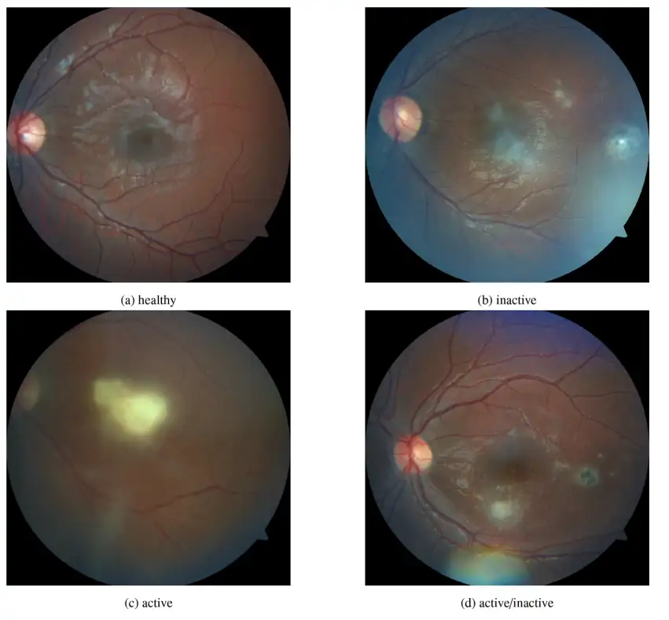

# ToxoFundus

<div align="center">
    <a href="https://github.com/openmedlab/"></a>
</div>
<p style="text-align:center;font-size:10px;"><em></em></p>

## Dataset Information

The ToxoFundus (Ocular Toxoplasmosis Fundus Images Dataset) is a high-quality retinal image classification dataset specifically designed for the study and diagnosis of ocular toxoplasmosis. The dataset includes 412 high-resolution color fundus photographs, covering two categories: **healthy eyes** and **ocular toxoplasmosis**, with the latter category including both active and inactive forms of the disease. These images were carefully selected and annotated by three ophthalmologists with extensive expertise in detecting toxoplasmosis infection using fundus images, ensuring the accuracy and reliability of the data.

Ocular toxoplasmosis is a serious eye infection that can lead to permanent vision loss or blindness if not promptly detected and treated. Traditionally, the diagnosis of this disease relies heavily on the meticulous assessment of fundus images by ophthalmologists, which is time-consuming and requires substantial clinical experience. Therefore, leveraging artificial intelligence to achieve automatic detection of ocular toxoplasmosis is of great significance.

The establishment of the ToxoFundus dataset provides researchers with valuable resources to develop and evaluate deep learning-based algorithms for the automatic identification and classification of toxoplasmosis lesions in fundus images. This can improve diagnostic efficiency, reduce the workload of ophthalmologists, and help in the timely detection and treatment of the disease in resource-limited areas, thereby preventing blindness and improving the quality of life for patients. Furthermore, the creation of this dataset offers new insights into the application of artificial intelligence in ophthalmology, contributing to the advancement and progress of medical image analysis technology.

## Dataset Meta Information

| Dimensions | Modality            | Task Type      | Anatomical Structures | Anatomical Area | Number of Categories | Data Volume  | File Format |
|------------|---------------------|----------------|-----------------------|-----------------|----------------------|--------------|-------------|
| 2D         | Fundus Color Photos | Classification | Retina                | Eye             | 2                    | 412          | JPG         |


### Resolution Details

| Dataset Statistics | size        |
|--------------------|-------------|
| max                | (2124, 2056)  |
| min                | (1536, 1152)  |

## Label Information Statistics

| Category         | diseased (active, inactive, active/inactive, inactive/active ocular toxoplasmosis) | healthy (healthy) |
|------------------|----------------------------------------------------------------------------------|-------------------|
| Occurrence Count | 279                                                                              | 132               |
| Occurrence Ratio | 67.9%                                                                            | 32.1%             |


## Visualization

<div align="center">
    <a href="https://github.com/openmedlab/"></a>
</div>
<p style="text-align:center;font-size:10px;"><em>(a) Healthy eye (b) Inactive Toxoplasma chorioretinitis (c) Active Toxoplasma chorioretinitis (d) Active/inactive Toxoplasma chorioretinitis</em></p>

## File Structure

The folder named `Data_Processed_Paper` contains processed images, which are categorized only into healthy and diseased (ocular toxoplasmosis) classes for binary classification. The `diseased` class is composed of five subcategories found in the `Data_Raw_6class_All` folder. These subcategories include active, inactive, active/inactive ocular toxoplasmosis, inactive/active ocular toxoplasmosis, and others (all belonging to the diseased class of ocular toxoplasmosis).

``` 
.
├── Data_Processed_Paper
│   ├── Data_Processed_Paper
│   │   ├── Diseased
│   │   │   ├── GG_100.jpg
│   │   │   ├── GG_101.jpg
│   │   │   ├── ...
│   │   ├── .DS_Store
│   │   └── Healthy
│   │       ├── GG_10.jpg
│   │       ├── ...
│   └── .DS_Store
├── Data_Raw_6class_All
│   ├── Data_Raw_6class_All
│   │   ├── active
│   │   │   ├── 114.jpg
│   │   │   ├── 120.jpg
│   │   │   ├── ...
│   │   ├── active_active
│   │   │   └── 479.jpg
│   │   ├── active_inactive
│   │   │   ├── 101.jpg
│   │   │   ├── 104.jpg
│   │   │   ├── ...
│   │   ├── .DS_Store
│   │   ├── healthy
│   │   │   ├── 10.jpg
│   │   │   ├── 11.jpg
│   │   │   ├── ...
│   │   ├── inactive
│   │   │   ├── 100.jpg
│   │   │   ├── 102.jpg
│   │   │   ├── ...
│   │   └── inactive_inactive
│   │       └── 747.jpg
│   └── .DS_Store
└── .DS_Store
```

## Authors and Institutions

Olivia Cardozo (Ophthalmology Department, General Hospital of Paraguay)

Verena Ojeda (Department of Computer Engineering, American University of Paraguay)

Rodrigo Parra (Department of Computer Engineering, American University of Paraguay)

Julio César Mello-Román (National University of Paraguay)

José Luis Vázquez Noguera (Department of Computer Engineering, American University of Paraguay)

Miguel García-Torres (Data Science and Big Data Lab, Pablo de Olavide University, Seville)

Federico Divina (Data Science and Big Data Lab, Pablo de Olavide University, Seville)

Sebastian A. Grillo (School of Science and Technology, Autonomous University, Paraguay)

Cynthia Villalba (National University of Paraguay)

Jacques Facon (Department of Computer and Electronic Engineering, Federal University of Espírito Santo, Brazil)

Veronica Elisa Castillo Benítez (Ophthalmology Department, Clínicas Hospital, Faculty of Medical Sciences, National University)

Ingrid Castro Matto (Ophthalmology Department, Clínicas Hospital, Faculty of Medical Sciences, National University)

Diego Aquino-Brítez (Department of Computer Engineering, American University of Paraguay)

## Source Information

Official Website: https://www.kaggle.com/datasets/nafin59/ocular-toxoplasmosis-fundus-images-dataset

Download Link: https://www.kaggle.com/datasets/nafin59/ocular-toxoplasmosis-fundus-images-dataset

Article Address: https://www.sciencedirect.com/science/article/pii/S2352340923001749?via%3Dihub

Publication Date: 2023-06

## Citation

``` 
@article{CARDOZO2023109056,
title = {Dataset of fundus images for the diagnosis of ocular toxoplasmosis},
journal = {Data in Brief},
volume = {48},
pages = {109056},
year = {2023},
issn = {2352-3409},
doi = {https://doi.org/10.1016/j.dib.2023.109056},
url = {https://www.sciencedirect.com/science/article/pii/S2352340923001749},
author = {Olivia Cardozo and Verena Ojeda and Rodrigo Parra and Julio César Mello-Román and José Luis {Vázquez Noguera} and Miguel García-Torres and Federico Divina and Sebastian A. Grillo and Cynthia Villalba and Jacques Facon and Veronica Elisa {Castillo Benítez} and Ingrid {Castro Matto} and Diego Aquino-Brítez},
keywords = {Toxoplasmosis, Coriorretinitis, Artificial intelligence},
abstract = {Toxoplasmosis chorioretinitis is commonly diagnosed by an ophthalmologist through the evaluation of the fundus images of a patient. Early detection of these lesions may help to prevent blindness. In this article we present a data set of fundus images labeled into three categories: healthy eye, inactive and active chorioretinitis. The dataset was developed by three ophthalmologists with expertise in toxoplasmosis detection using fundus images. The dataset will be of great use to researchers working on ophthalmic image analysis using artificial intelligence techniques for the automatic detection of toxoplasmosis chorioretinitis.}
}
```

Original introduction article is [here](https://zhuanlan.zhihu.com/p/696607049).