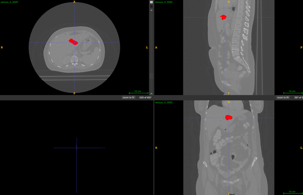

# TriALS

<div align="center">
    <a href="https://github.com/openmedlab/"></a>
</div>
<p style="text-align:center;font-size:10px;"><em></em></p>

## Dataset Information

The TriALS 2024 Task1 dataset is the training data for Task1 of the MICCAI 2024 TriALS challenge, which is a segmentation task. The data is in CT modality, intended for Portal-Venous Lesion Segmentation, with the labels defined as: background = 0, Portal-Venous Lesion = 1. Task1 of the TriALS challenge focuses on the segmentation of liver lesions during the portal-venous phase, aiming to establish a benchmark for the imaging segmentation of liver tumors in African populations. Similar to the international liver tumor segmentation challenge LiTS, this task follows clinical practice by selecting portal-venous phase CT scans as the primary phase for lesion segmentation.

The importance of this task lies in providing a disease diagnosis and research benchmark for a specific population (the Egyptian population), as well as in evaluating and optimizing the performance of deep learning models in the detection and segmentation of liver lesions. In this way, researchers can better understand and advance the potential and effectiveness of using non-contrast CT scans in resource-limited settings.

## Dataset Meta Information

| Dimensions | Modality | Task Type      | Anatomical Structures | Anatomical Area | Number of Categories | Data Volume | File Format |
|------------|----------|----------------|-----------------------|-----------------|----------------------|-------------|-------------|
| 3D         | CT       | Segmentation   | Liver Disease         | Chest           | 1                    | 60          | .nii.gz     |


### Resolution Details

| Dataset Statistics | spacing (mm)        | size             |
|--------------------|---------------------|------------------|
| min                | (0.75, 0.75, 0.80)  | (512, 512, 344)  |
| median             | (0.90, 0.90, 0.80)  | (512, 512, 623)  |
| max                | (1.07, 1.07, 1.25)  | (512, 512, 819)  |

Number of 2D slices in the dataset: 34379.

## Label Information Statistics

| Metric              | Portal-Venous Lesion Segmentation |
|---------------------|-----------------------------------|
| Case Count          | 54                                |
| Coverage            | 90.00%                            |
| Min Volume (cm³)    | 0.13                              |
| Median Volume (cm³) | 4.965                             |
| Max Volume (cm³)    | 2922.4                            |

## Visualization

<div align="center">
    <a href="https://github.com/openmedlab/"></a>
</div>
<p style="text-align:center;font-size:10px;"><em>Red is the liver lesion in the portal venous phase.</em></p>

## File Structure

``` 
Task_1/
├── imagesTr
│   ├── venous_0_0000.nii.gz
│   ├── venous_1_0000.nii.gz
│   ├── ...
├── labelsTr
│   ├── venous_0.nii.gz
│   ├── venous_1.nii.gz
│   ├── ...
```

## Authors and Institutions

- Marawan Elbatel (Hong Kong University of Science and Technology, China)
- Xiaomeng Li (Hong Kong University of Science and Technology, China)
- Mohamed Ghonim (Ain Shams University, Cairo, Egypt)
- Aya Yassin (Ain Shams University, Cairo, Egypt)
- Mohanad Ghonim (Ain Shams University, Cairo, Egypt)
- Ahmed Abouelhoda (Ain Shams University, Cairo, Egypt)
- Amr Muhammad Abdo Salem (Ain Shams University, Cairo, Egypt)
- Nouran Elghitany (Ain Shams University, Cairo, Egypt)
- Noha Elghitany (Ain Shams University, Cairo, Egypt)
- Amira Adel (Ain Shams University, Cairo, Egypt)
- Susan Adil Ali (Ain Shams University, Cairo, Egypt)

## Source Information

Official Website: https://www.synapse.org/Synapse:syn53285416/wiki/

Download Link: https://www.synapse.org/Synapse:syn53285416/wiki/626914

Article Address: TBD

Publication Date: 2024-06

## Citation

``` 
TBD
```

Original introduction article is [here](https://zhuanlan.zhihu.com/p/717375889).