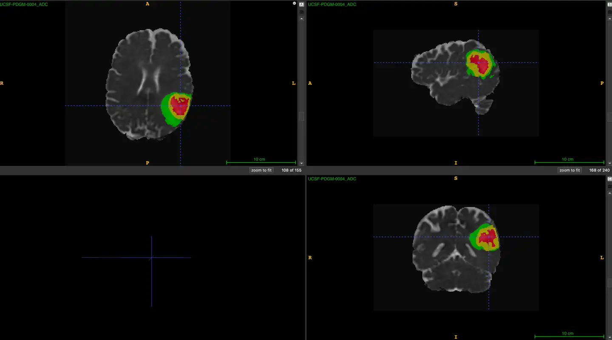
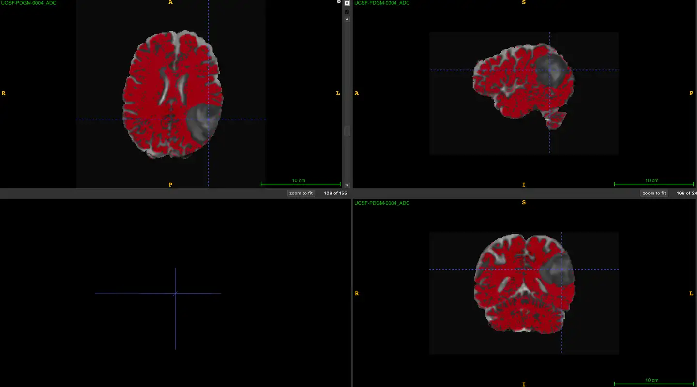
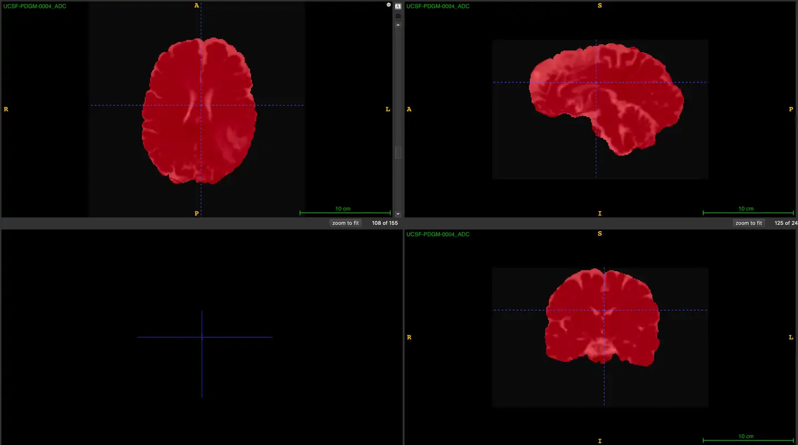

# UCSF-PDGM

<div align="center">
    <a href="https://github.com/openmedlab/"></a>
</div>
<p style="text-align:center;font-size:10px;"><em></em></p>

## Dataset Information

The UCSF-PDGM dataset is an MRI modality dataset for segmenting diffuse gliomas, part of the TCIA collection. It contains data from 501 cases. The MRI modalities include eight types: 3D T2-weighted, T2/FLAIR-weighted, susceptibility-weighted imaging (SWI), diffusion-weighted imaging (DWI), pre- and post-contrast T1-weighted images, 3D Arterial Spin Labeling (ASL) perfusion images, and 2D 55-direction high angular resolution diffusion imaging (HARDI). During the study, two gadolinium-based contrast agents were used: Gadovist (0.1 mL/kg, Bayer, LOC) and Gadoteric acid (0.2 mL/kg, Dotarem, Guerbet, Aulnay-sous-Bois, France). The dataset includes not only tumor segmentation but also whole brain and cerebral cortex segmentations, detailed in the visualization section.

The UCSF-PDGM dataset is a significant public dataset containing preoperative MRI data from 501 patients with histopathologically confirmed diffuse gliomas. This dataset utilizes a standardized 3 Tesla MRI protocol, encompassing advanced imaging techniques such as 3D imaging, diffusion-weighted imaging (DWI), and perfusion imaging. All cases include the IDH mutation status, and some high-grade gliomas also include the methylation status of the MGMT promoter. The availability of this dataset aims to advance AI applications in diffuse glioma research, including automated tumor segmentation, radiogenomics, and MRI-based survival prediction. By integrating with existing datasets, UCSF-PDGM hopes to propel the next phase of radiological AI research.

## Dataset Meta Information

| Dimensions | Modality | Task Type    | Anatomical Structures | Anatomical Area | Number of Categories | Data Volume | File Format |
|------------|----------|--------------|-----------------------|-----------------|----------------------|-------------|-------------|
| 3D         | MR       | Segmentation | Glioma                | Brain           | 4                    | 501         | .nii.gz     |


### Resolution Details

| Dataset Statistics | spacing (mm)        | size             |
|--------------------|---------------------|------------------|
| min                | (1.00, 1.00, 1.00)  | (240, 240, 155)  |
| median             | (1.00, 1.00, 1.00)  | (240, 240, 155)  |
| max                | (1.00, 1.00, 1.00)  | (240, 240, 155)  |

Number of 2D slices in the dataset: 77655

## Label Information Statistics

| Anatomical Feature        | Necrotic Tumor Core | Peritumoral Edema | Enhancing Tumor | Whole Brain |
|---------------------------|---------------------|-------------------|-----------------|-------------|
| Number of Cases           | 401                 | 501               | 426             | 501         |
| Segmentation Accuracy     | 80.04%              | 100%              | 85.03%          | 100.00%     |
| Min Volume (cm³)          | 0.0                 | 0.06              | 0.0             | 149.19      |
| Median Volume (cm³)       | 6.8                 | 50.28             | 17.68           | 915.69      |
| Max Volume (cm³)          | 171.72              | 261.98            | 84.29           | 1631.09     |


## Visualization

<div align="center">
    <a href="https://github.com/openmedlab/"></a>
</div>
<p style="text-align:center;font-size:10px;"><em>Tumor segmentation.</em></p>

<div align="center">
    <a href="https://github.com/openmedlab/"></a>
</div>
<p style="text-align:center;font-size:10px;"><em>Parenchyma segmentation.</em></p>

<div align="center">
    <a href="https://github.com/openmedlab/"></a>
</div>
<p style="text-align:center;font-size:10px;"><em>Brain segmentation.</em></p>

## File Structure

Each data folder contains corresponding data, with names including abbreviations for different MR modalities. Among them, "brain_parenchyma" is the segmentation mask for the cerebral cortex, "brain_segmentation" is the segmentation mask for the entire brain, and "tumor_segmentation" is the segmentation mask for the tumor.

``` 
UCSF-PDGM-v3
│
├── UCSF-PDGM-0004_nifti
│   ├── UCSF-PDGM-0004_ADC.nii.gz
│   ├── UCSF-PDGM-0004_ASL.nii.gz
│   ├── UCSF-PDGM-0004_brain_parenchyma_segmentation.nii.gz
│   ├── UCSF-PDGM-0004_brain_segmentation.nii.gz
│   ├── UCSF-PDGM-0004_DTI_eddy_FA.nii.gz
│   ├── UCSF-PDGM-0004_DTI_eddy_L1.nii.gz
│   ├── UCSF-PDGM-0004_DTI_eddy_L2.nii.gz
│   ├── UCSF-PDGM-0004_DTI_eddy_L3.nii.gz
│   ├── UCSF-PDGM-0004_DTI_eddy_MD.nii.gz
│   ├── UCSF-PDGM-0004_DTI_eddy_noreg.nii.gz
│   ├── UCSF-PDGM-0004_DWI_bias.nii.gz
│   ├── UCSF-PDGM-0004_DWI.nii.gz
│   ├── UCSF-PDGM-0004_FLAIR_bias.nii.gz
│   ├── UCSF-PDGM-0004_FLAIR.nii.gz
│   ├── UCSF-PDGM-0004_SWI_bias.nii.gz
│   ├── UCSF-PDGM-0004_SWI.nii.gz
│   ├── UCSF-PDGM-0004_T1_bias.nii.gz
│   ├── UCSF-PDGM-0004_T1c_bias.nii.gz
│   ├── UCSF-PDGM-0004_T1c.nii.gz
│   ├── UCSF-PDGM-0004_T1.nii.gz
│   ├── UCSF-PDGM-0004_T2_bias.nii.gz
│   ├── UCSF-PDGM-0004_T2.nii.gz
│   ├── UCSF-PDGM-0004_tumor_segmentation.nii.gz
├── UCSF-PDGM-0005_nifti
│   ├── UCSF-PDGM-0005_ADC.nii.gz
│   ├── UCSF-PDGM-0005_ASL.nii.gz
│   ├── UCSF-PDGM-0005_brain_parenchyma_segmentation.nii.gz
│   ├── UCSF-PDGM-0005_brain_segmentation.nii.gz
│   ├── UCSF-PDGM-0005_DTI_eddy_FA.nii.gz
│   ├── UCSF-PDGM-0005_DTI_eddy_L1.nii.gz
│   ├── UCSF-PDGM-0005_DTI_eddy_L2.nii.gz
│   ├── UCSF-PDGM-0005_DTI_eddy_L3.nii.gz
│   ├── UCSF-PDGM-0005_DTI_eddy_MD.nii.gz
│   ├── UCSF-PDGM-0005_DTI_eddy_noreg.nii.gz
│   ├── UCSF-PDGM-0005_DWI_bias.nii.gz
│   ├── UCSF-PDGM-0005_DWI.nii.gz
│   ├── UCSF-PDGM-0005_FLAIR_bias.nii.gz
│   ├── UCSF-PDGM-0005_FLAIR.nii.gz
│   ├── UCSF-PDGM-0005_SWI_bias.nii.gz
│   ├── UCSF-PDGM-0005_SWI.nii.gz
│   ├── UCSF-PDGM-0005_T1_bias.nii.gz
│   ├── UCSF-PDGM-0005_T1c_bias.nii.gz
│   ├── UCSF-PDGM-0005_T1c.nii.gz
│   ├── UCSF-PDGM-0005_T1.nii.gz
│   ├── UCSF-PDGM-0005_T2_bias.nii.gz
│   ├── UCSF-PDGM-0005_T2.nii.gz
│   ├── UCSF-PDGM-0005_tumor_segmentation.nii.gz
├── ...
```

## Authors and Institutions

Evan Calabrese (Center for Intelligent Imaging, Department of Radiology and Biomedical Imaging, University of California, San Francisco, USA)

Javier Villanueva-Meyer (Center for Intelligent Imaging, Department of Radiology and Biomedical Imaging, University of California, San Francisco, USA)

Jeffrey Rudie (Center for Intelligent Imaging, Department of Radiology and Biomedical Imaging, University of California, San Francisco, USA)

Andreas Rauschecker (Center for Intelligent Imaging, Department of Radiology and Biomedical Imaging, University of California, San Francisco, USA)

Ujjwal Baid (Center for Biomedical Image Computing & Analytics (CBICA), University of Pennsylvania, USA)

Spyridon Bakas (Center for Biomedical Image Computing & Analytics (CBICA), University of Pennsylvania, USA)

Soonmee Cha (Center for Intelligent Imaging, Department of Radiology and Biomedical Imaging, University of California, San Francisco, USA)

John Mongan (Center for Intelligent Imaging, Department of Radiology and Biomedical Imaging, University of California, San Francisco, USA)

Christopher Hess (Center for Intelligent Imaging, Department of Radiology and Biomedical Imaging, University of California, San Francisco, USA)

## Source Information

Official Website: https://www.cancerimagingarchive.net/collection/ucsf-pdgm/

Download Link: https://www.cancerimagingarchive.net/collection/ucsf-pdgm/

Article Address: https://arxiv.org/abs/2109.00356

Publication Date: 2023-04

## Citation

``` 
@article{Calabrese_2022,
   title={The University of California San Francisco Preoperative Diffuse Glioma MRI Dataset},
   volume={4},
   ISSN={2638-6100},
   url={http://dx.doi.org/10.1148/ryai.220058},
   DOI={10.1148/ryai.220058},
   number={6},
   journal={Radiology: Artificial Intelligence},
   publisher={Radiological Society of North America (RSNA)},
   author={Calabrese, Evan and Villanueva-Meyer, Javier E. and Rudie, Jeffrey D. and Rauschecker, Andreas M. and Baid, Ujjwal and Bakas, Spyridon and Cha, Soonmee and Mongan, John T. and Hess, Christopher P.},
   year={2022},
   month=nov }
```

Original introduction article is [here](https://zhuanlan.zhihu.com/p/702167956).