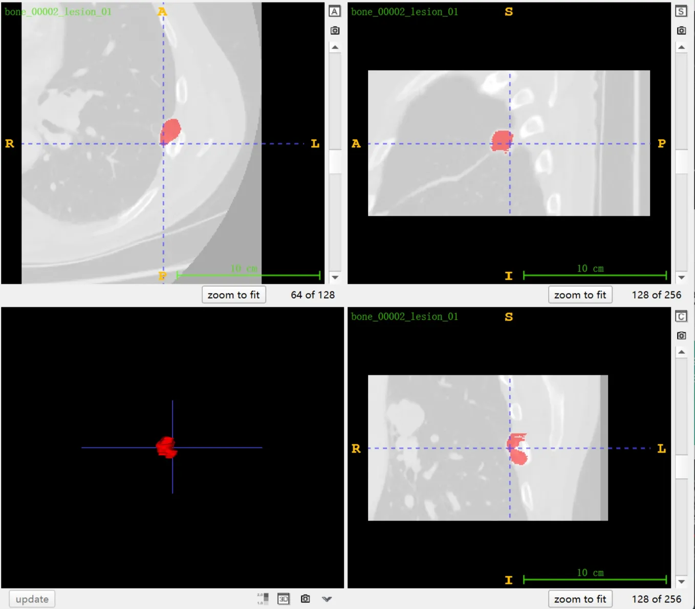
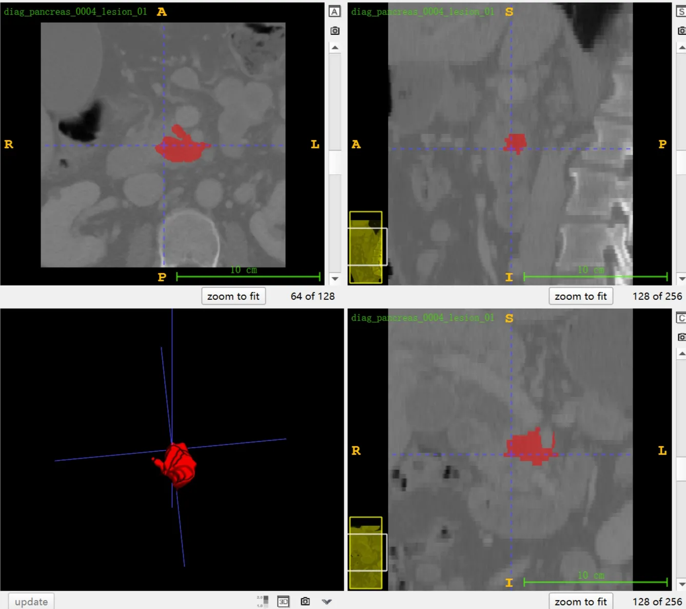

# ULS

## Dataset Information

ULS (Universal Lesion Segmentation in Computed Tomography) is a large-scale dataset for lesion region segmentation in chest and abdominal CT images. It includes a total of 6,514 fully annotated cases and 32,310 weakly annotated cases with lesions centered in 256x256x128-sized VOIs (Volumes of Interest). The construction of this dataset is based on several existing datasets, including KiTS21, LIDC-IDRI, LiTS, MDS Task 6/7/10, NIH-LN, CCC18, and DeepLesion. Additionally, two new datasets are provided: one for skeletal lesions (previously lacking relevant datasets) and another containing extra pancreatic lesions (typically challenging to segment). Furthermore, additional 3D annotations have been performed on some of the DeepLesion data.

<div align="center">
    <a href="https://github.com/openmedlab/"></a>
</div>
<p style="text-align:center;font-size:10px;"><em>Radiologists identify a lesion on the scanned image and define a Region of Interest (ROI) around that lesion for segmentation. The model extracts measurements for assessment, possibly using standards like RECIST. Participants in this challenge will work with VOIs (Volumes of Interest) sized at 256x256x128 pixels, which are sufficient to fully encompass the largest lesion within the VOI.
</em></p>

With the increasing number of CT examinations each year, radiologists face a growing workload, particularly in the field of oncological radiology, where cancer patients require long-term and repeated imaging checks to monitor their condition. In CT scans, manual measurements are typically used to quantify lesions based on the Response Evaluation Criteria in Solid Tumors (RECIST) to standardize the process. In recent years, AI-based tumor segmentation models have made significant progress, especially in segmenting liver, kidney, and lung tumors. However, there is an urgent need in clinical practice for a universal and robust model capable of quickly handling various lesion types in the chest and abdominal regions.

To address this need, the development of a Universal Lesion Segmentation (ULS) model has become necessary, relying on carefully curated and diverse datasets. Currently, most related research uses partially annotated single datasets. In this context, the ULS23 challenge has released entirely annotated 3D training data and combined it with existing data sources to lower the barrier for training ULS models. Additionally, a multicenter and diverse test set is provided for evaluation.


## Dataset Meta Information

| Dimensions | Modality | Task Type | Anatomical Structures | Anatomical Area | Number of Categories | Data Volume | File Format |
|------------|---------|-----------|-----------------------|-----------------|-----------------|---------|-------------|
| 3D         | CT, PET       | Segmentation | Tumor                 | Whole Body       | 1               | 1014 for training, 200 for test     | .nii.gz     |


## Resolution Details

| Anatomical Structures  | spacing (mm)      | size           |
|------------------|-------------------|----------------|
| min              | (0.33, 0.33, 0.45) | (256, 256, 128)|
| median           | (0.74, 0.74, 1.25) | (256, 256, 128)|
| max              | (1.04, 1.04, 7.5) | (256, 256, 128)|

The ULS dataset contains a total of 4,135,680 2D slice images.

## Label Information Statistics

Statistical analysis of the 6,514 fully annotated images.

| Metric        | Lesion |
|---------------|--------|
| Case Count    | 6514   |
| Coverage      | 100%   |
| Min Volume (cm³) | 0.01   |
| Median Volume (cm³) | 0.83   |
| Max Volume (cm³) | 1411   |

## Visualization

<div align="center">
    <a href="https://github.com/openmedlab/"></a>
</div>
<p style="text-align:center;font-size:10px;"><em> ITK-SNAP Visualization, skeletal lesions.</em></p>

<div align="center">
    <a href="https://github.com/openmedlab/"></a>
</div>
<p style="text-align:center;font-size:10px;"><em> ITK-SNAP Visualization, pancreatic lesions.</em></p>

## File Structure

The dataset file structure is as follows. ULS23 primarily consists of two parts: the new dataset (novel_data) and the processed dataset (processed_data). The processed dataset is further divided into two categories: fully annotated (fully_annotated) and partially annotated (partially_annotated). Within each dataset folder, there is an "images" folder containing 256x256x128-sized Volumes of Interest (VOI) images, and a "labels" folder containing the corresponding annotation data.

``` 
ULS23
│
├── novel_data
│   ├── ULS23_DeepLesion3D
│   ├── ULS23_Radboudumc_Bone
│   └── ULS23_Radboudumc_Pancreas
│
├── processed_data
│   ├── fully_annotated
│   │   ├── kits21
│   │   ├── LIDC-IDRI
│   │   ├── LiTS
│   │   ├── LNDb
│   │   ├── MDSC_Task06_Lung
│   │   ├── MDSC_Task07_Pancreas
│   │   ├── MDSC_Task10_Colon
│   │   ├── NIH_LN_ABD
│   │   └── NIH_LN_MED
│   │
│   └── partially_annotated
│       ├── CCC18
│       └── DeepLesion
```

## Authors and Institutions

Max de Grauw (Diagnostic Image Analysis Group, Radboud University Medical Center, Netherlands)

Bram van Ginneken (Diagnostic Image Analysis Group, Radboud University Medical Center, Netherlands)

Alessa Hering (Diagnostic Image Analysis Group, Radboud University Medical Center, Netherlands)

## Source Information

Official Website: https://uls23.grand-challenge.org/

Download Link: https://uls23.grand-challenge.org/datasets/

Article Address: TBD

Publication Date: October 2023

## Citation

``` 
TBD
```

Original introduction article is [here](https://zhuanlan.zhihu.com/p/675541442).