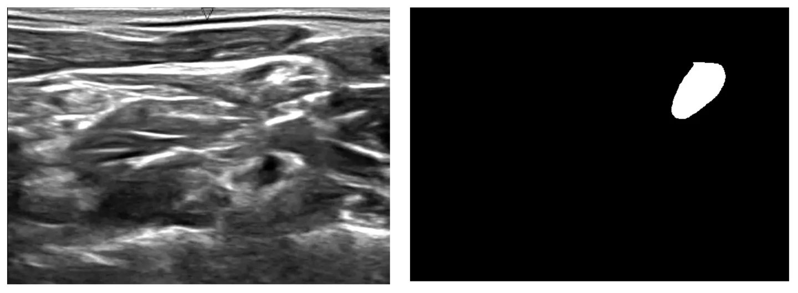

# Ultrasound Nerve Segmentation

<div align="center">
    <a href="https://github.com/openmedlab/"></a>
</div>
<p style="text-align:center;font-size:10px;"><em></em></p>

## Dataset Information

The dataset originates from the Kaggle Ultrasound Nerve Segmentation Challenge, which includes 11,143 ultrasound images with a resolution of 580x420 pixels, manually annotated by clinical experts to create mask images. Of these samples, 5,635 images were used for training and 5,508 images for testing, with the training set labeled and the test set unlabeled. Even the bravest patients can feel apprehensive at the mention of surgery. Surgical procedures inevitably bring discomfort and often involve significant postoperative pain. Currently, patient pain is typically managed using anesthetics, which come with many unwanted side effects. The sponsors of the Kaggle Ultrasound Nerve Segmentation Challenge are working to improve pain management by using indwelling catheters that block or mitigate pain at its source. Pain management catheters reduce reliance on anesthetics and accelerate patient recovery. Accurately identifying nerve structures in ultrasound images is a crucial step for the effective insertion of pain management catheters in patients. In this competition, Kaggle participants are challenged to build a model that can identify nerve structures in a dataset of neck ultrasound images. Doing so can improve the placement of catheters, contributing to a more pain-free future.

## Dataset Meta Information

| Dimensions | Modality   | Task Type | Anatomical Structures | Anatomical Area | Number of Categories | Data Volume                                    | File Format |
|------------|------------|-----------|-----------------------|-----------------|----------------------|------------------------------------------------|-------------|
| 2D         | Ultra Sound | Segmentation | Cervical nerves       | Head and Neck   | 1                    | 5635 with annotation, 5508 without annotation. | tif         |


### Resolution Details

| Dataset Statistics | size         |
|--------------------|--------------|
| min                | (580, 420)   |
| median             | (580, 420)   |
| max                | (580, 420)   |

## Label Information Statistics

| Segmentation Class | Cervical nerves |
|--------------------|-----------------|
| Case Count         | 2323            |
| Detection Rate     | 41%             |
| Min Volume (cm³)    | 2684             |
| Median Volume (cm³) | 6976           |
| Max Volume (cm³)    | 17439          |

Note: Label statistics are based on the 5635 labeled images in the training set.

## Visualization

<div align="center">
    <a href="https://github.com/openmedlab/"></a>
</div>
<p style="text-align:center;font-size:10px;"><em>Left: Ultrasound image; Right: Segmentation annotation.</em></p>

## File Structure

The file structure of the Ultrasound-Nerve-Segmentation dataset is as follows. There are two folders: "train" for the training set and "test" for the test set.

``` 
ultrasound-nerve-segmentation
├── sample_submission.csv
├── test
│   ├── 9.tif
│   ├── 99.tif
│   ├── 999.tif
│   └── ...
└── train
    ├── 33_77_mask.tif
    ├── 33_77.tif
    ├── 33_78_mask.tif
    ├── 33_78.tif
    ├── 33_79.tif
    └── ...
```

## Authors and Institutions

kaggle


## Source Information

Official Website: https://kaggle.com/competitions/ultrasound-nerve-segmentation

Download Link: https://www.kaggle.com/c/ultrasound-nerve-segmentation/data

Article Address: -

Publication Date: 2016.5.19

## Citation

``` 
@misc{ultrasound-nerve-segmentation,
    author = {Anna Montoya, Hasnin, kaggle446, shirzad, Will Cukierski, yffud},
    title = {Ultrasound Nerve Segmentation},
    publisher = {Kaggle},
    year = {2016},
    url = {https://kaggle.com/competitions/ultrasound-nerve-segmentation}
}
```

Original introduction article is [here](https://zhuanlan.zhihu.com/p/671223484).