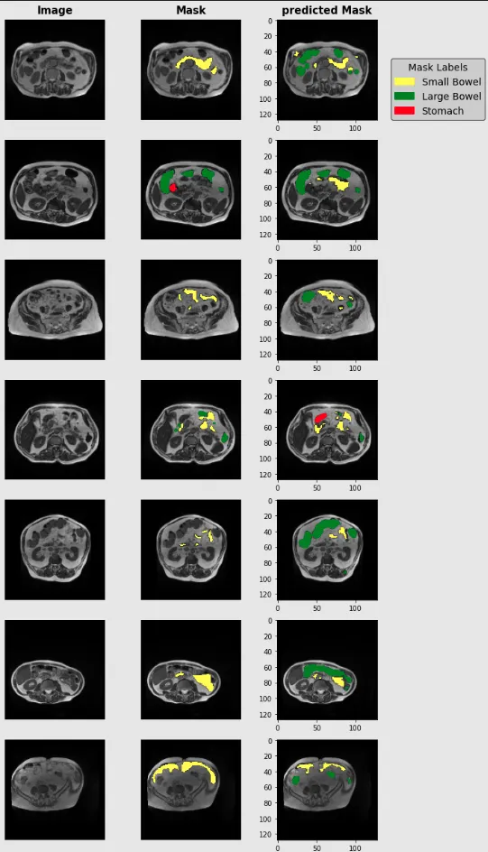
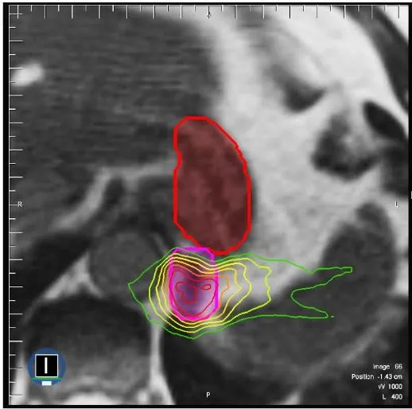

# UW-Madison GI Tract Image Segmentation

<div align="center">
    <a href="https://github.com/openmedlab/"></a>
</div>
<p style="text-align:center;font-size:10px;"><em> </em></p>

## Dataset Information

The UW-Madison GI Tract Image Segmentation dataset is a medical imaging dataset for segmentation of the small intestine, large intestine, and stomach in magnetic resonance imaging (MRI). Provided by the Department of Radiology at the University of Wisconsin-Madison, it contains 38,496 images, categorized into 3 classes: small intestine, large intestine, and stomach. Currently, only the training set is available for download. The filenames of the images in this dataset contain four numbers (e.g., 276_276_1.63_1.63.png), representing the width/height of the slice in pixels (as integers) and the pixel spacing in width/height (as floating-point numbers) in millimeters. The first two numbers define the resolution of the slice, while the last two indicate the physical size of each pixel.

Gastrointestinal cancers are among the most common cancers globally, with approximately 5 million patients undergoing radiotherapy in 2019. Traditional radiotherapy protocols require daily sessions of 10-15 minutes over a course of 1-6 weeks, with manual delineation of the gastrointestinal tract by physicians to avoid irradiating healthy tissue. This process is time-consuming and laborious, prolonging treatment times and adding to the patient's burden. Advances in technology have led to new radiotherapy protocols that can shorten treatment times and increase efficiency. The emergence of technologies like MR-Linac enables visualization of daily tumor and bowel location, but still requires manual delineation of the gastrointestinal tract by physicians, a time-consuming and labor-intensive process. The advent of the UW-Madison GI Tract Image Segmentation dataset offers a new approach to this problem. The dataset contains 38,496 MRI images of gastrointestinal organs and tumors that can be used to train deep learning models for the automatic segmentation of gastrointestinal organs.

## Dataset Meta Information

| Dimensions | Modality | Task Type | Anatomical Area        | Number of Categories | Data Volume | File Format |
|------------|----------|-----------|------------------------|----------------------|-------------|-------------|
| 2D         | MRI      | Segmentation | Gastrointestinal tract | 3                    | 38496        | .nii.gz     |


### Resolution Details

| Dataset Statistics | size       |
|--------------------|------------|
| min                | 234 x 234  |
| median             | 266 x 266  |
| max                | 360 x 310  |

## Label Information Statistics

| Category      | small_bowel | large_bowel | stomach | null(total) |
|---------------|-------------|-------------|---------|-------------|
| Case Count    | 14085       | 11201       | 8627    | 81575       |
| Percentage    | 36.59%      | 29.10%      | 22.41%  | 70.63%      |


## Visualization

<div align="center">
    <a href="https://github.com/openmedlab/"></a>
</div>
<p style="text-align:center;font-size:10px;"><em> ITK-SNAP Visualization Example.</em></p>

<div align="center">
    <a href="https://github.com/openmedlab/"></a>
</div>
<p style="text-align:center;font-size:10px;"><em> In this image, the tumor (outlined in thick pink) is located near the stomach (outlined in thick red). During treatment, a high dose of radiation is directed at the tumor while avoiding exposure to the stomach. Dose levels are indicated by the rainbow-colored contours, with red representing a higher dose and green representing a lower dose.</em></p>

## File Structure

The dataset structure is as follows. The image filenames in this dataset contain four numbers (e.g., 276_276_1.63_1.63.png). These four numbers represent the slice's width/height in pixels (as integers) and the pixel spacing in width/height (as floating-point numbers) in millimeters.

``` 
Dataset
│
├── train
│   ├── case101
│   │   ├── case101_day20
│   │   │   ├── scans
│   │   │   │   ├── slice_0001_266_266_1.50_1.50.png
│   │   │   │   ├── slice_0002_266_266_1.50_1.50.png
│   │   │   │   └──...
│   │   └──...
│   └── case102
│   │   │   ├── case102_day0
│   │   │   ├── scans
│   │   │   │   ├── slice_0001_360_360_1.50_1.50.png
│   │   │   │   ├── slice_0002_360_360_1.50_1.50.png
│   │   │   │   └──...
│   │   └──...
│   └──...
├── train.csv
```

## Authors and Institutions

Sangjune Laurence Lee(University of Wisconsin-Madison)

Poonam Yadav(University of Wisconsin-Madison)

Yin Li PhD(University of Wisconsin-Madison)

Jason J. Meudt(University of Wisconsin-Madison)

Jessica Strang(University of Wisconsin-Madison)

Dustin Hebel(University of Wisconsin-Madison)

Alyx Alfson(University of Wisconsin-Madison)

Stephanie J. Olson(University of Wisconsin-Madison)

Tera R. Kruser(University of Wisconsin-Madison)

Jennifer B Smilowitz(University of Wisconsin-Madison)

Kailee Borchert(University of Wisconsin-Madison)

Brianne Loritz(University of Wisconsin-Madison)

John Bayouth(University of Wisconsin-Madison)

Michael Bassetti(University of Wisconsin-Madison)


## Source Information

Official Website: https://www.kaggle.com/competitions/uw-madison-gi-tract-image-segmentation/overview

Download Link: https://www.kaggle.com/competitions/uw-madison-gi-tract-image-segmentation/overview

Article Address: TBD

Publication Date: 2022-04

## Citation

``` 
@misc{uw-madison-gi-tract-image-segmentation,
    author = {happyharrycn, Maggie, Phil Culliton, Poonam Yadav, Sangjune Laurence Lee},
    title = {UW-Madison GI Tract Image Segmentation },
    publisher = {Kaggle},
    year = {2022},
    url = {https://kaggle.com/competitions/uw-madison-gi-tract-image-segmentation}
}
```

Original introduction article is [here](https://zhuanlan.zhihu.com/p/684829564).