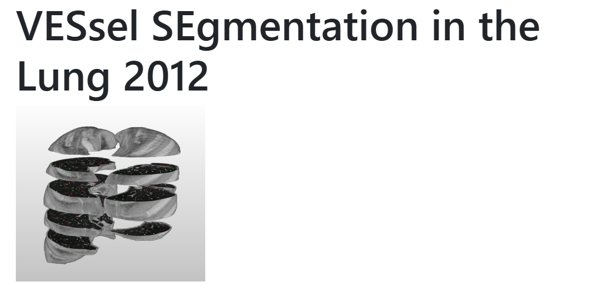
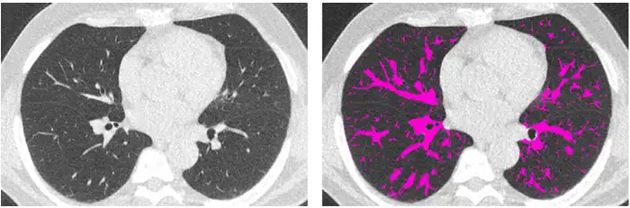

# VESSEL12

<div align="center">
    <a href="https://github.com/openmedlab/"></a>
</div>
<p style="text-align:center;font-size:10px;"><em></em></p>

## Dataset Information

The VESSEL12 dataset focuses on segmenting vascular structures in lung CT images and includes CT scans from both asymptomatic subjects and patients with respiratory diseases. These images were captured using various common clinical CT scanners and imaging protocols, with approximately half of them involving contrast agents during imaging. Furthermore, about half of the images contain abnormalities such as emphysema, nodules, or pulmonary embolism. The maximum slice thickness is 1 millimeter, and most CT images are isotropic or nearly isotropic. Only 20 training set images are available for download, and the quantities of the validation and test sets are not specified.

The vascular system is involved in many diseases, including the most deadly such as cardiovascular and cerebrovascular diseases. The vascular tree is ubiquitous, present in nearly every organ, complex, and highly intertwined; thus, vascular segmentation is a common yet challenging task. Reliable quantitative medical image analysis requires automated vascular segmentation to distinguish between vessels and organs of interest. Additionally, accurately segmented fine lung vascular structures can aid in developing lung biopsy navigation systems, providing accurate guidance for biopsy procedures.

## Dataset Meta Information

| Dimensions | Modality | Task Type    | Anatomical Structures | Anatomical Area | Number of Categories | Data Volume | File Format |
|------------|----------|--------------|-----------------------|-----------------|----------------------|-------------|-------------|
| 3D         | CT       | Segmentation | Vessels               | Lung            | 1                    | 20          | .tar.bz2    |


### Resolution Details

| Dataset Statistics | spacing (mm)       | size             |
|--------------------|--------------------|------------------|
| min                | (0.58, 0.58, 0.70) | (512, 512, 355)  |
| median             | (0.74, 0.74, 1.0)  | (512, 512, 425)  |
| max                | (0.89, 0.89, 1.0)  | (512, 512, 543)  |

Number of 2D slices in the dataset: 8593.

## Label Information Statistics

| Metric              | Tumor    |
|---------------------|----------|
| Case Count          | 20       |
| Coverage            | 100%     |
| Min Volume (cm³)    | 1898.5   |
| Median Volume (cm³) | 6414.8   |
| Max Volume (cm³)    | 9474.18  |

## Visualization

Diagram of lung vasculature on a horizontal plane, where the vascular tree is represented in pink.

<div align="center">
    <a href="https://github.com/openmedlab/"></a>
</div>
<p style="text-align:center;font-size:10px;"><em></em></p>

## File Structure

The file structure of the data set is as follows:

``` 
VESSEL2012
│
├── exampleScans
│   └── VESSEL12_ExampleScans.tar.bz2
│
├── lungmasks
│   └── VESSEL12_01-20_Lungmasks.tar.bz2
│
└── tar_bz2_per_1
    ├── VESSEL12_01.tar.bz2
    ├── VESSEL12_02.tar.bz2
    └── VESSEL12_03.tar.bz2
    └── ...
```

## Authors and Institutions

This dataset has many authors, so only the first three authors and the last author are shown.

Rina D. Rudyanto (Center for Applied Medical Research, University of Navarra, Spain)

Sjoerd Kerkstra (Diagnostic Image Analysis Group, Radboud University Nijmegen Medical Centre, The Netherlands)

Eva M. van Rikxoort (Diagnostic Image Analysis Group, Radboud University Nijmegen Medical Centre, The Netherlands)

Bram van Ginneken (Diagnostic Image Analysis Group, Radboud University Nijmegen Medical Centre, The Netherlands)

## Source Information

Official Website: https://vessel12.grand-challenge.org/

Download Link: https://vessel12.grand-challenge.org/

Article Address: https://www.sciencedirect.com/science/article/pii/S136184151400111X?via%3Dihub

Publication Date: 2012.05

## Citation

``` 
@article{rudyanto2014comparing,
  title={Comparing algorithms for automated vessel segmentation in computed tomography scans of the lung: the VESSEL12 study},
  author={Rudyanto, Rina D and Kerkstra, Sjoerd and Van Rikxoort, Eva M and Fetita, Catalin and Brillet, Pierre-Yves and Lefevre, Christophe and Xue, Wenzhe and Zhu, Xiangjun and Liang, Jianming and {\"O}ks{\"u}z, Ilkay and others},
  journal={Medical image analysis},
  volume={18},
  number={7},
  pages={1217--1232},
  year={2014},
  publisher={Elsevier}
}
```

Original introduction article is [here](https://zhuanlan.zhihu.com/p/706492761).