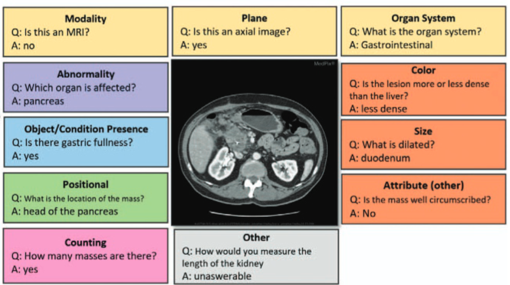
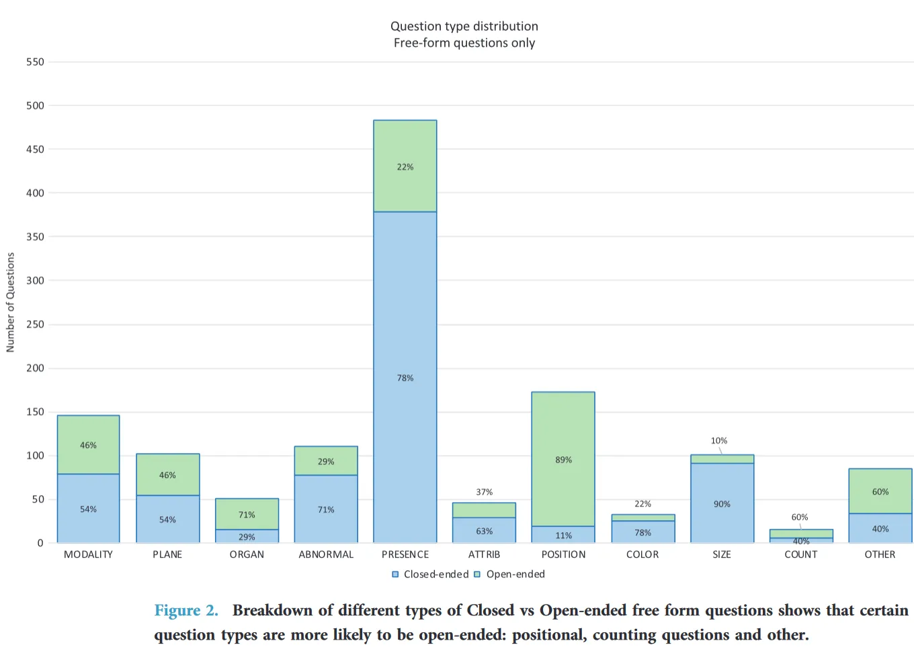

# VQA-RAD

<div align="center">
    <a href="https://github.com/openmedlab/"></a>
</div>
<p style="text-align:center;font-size:10px;"><em></em></p>

## Dataset Information

The file structure of the VQA-RAD dataset is as follows: it includes a readme.txt file, an .xlsx file providing image GG labels, an images folder with original images, a masks folder with corresponding mask images, and a partitions folder with default train/val/test split files. VQA-RAD is a radiology-specific Med-VQA dataset, one of the earlier works in this domain, released in 2018. It is well-curated, with images sourced from Medpix, a US open-source radiology teaching case database. Each image in the dataset uniquely corresponds to a different patient case to ensure diversity. All selected images are manually verified to be free of medical annotations, sufficiently clear in structure, and have corresponding textual information that can describe the image content.

Clinical professionals annotated at least 40 images by first asking questions freely and then standardizing these questions, ensuring the questions retained natural language fluidity while being standardized for data use.

Despite the careful selection and detailed design, the dataset is limited in size, with only 315 images and an average of about ten QA pairs per image. While the dataset is rich in information, it lacks in absolute data quantity. Given the high value of specialized knowledge in the medical field, this situation is challenging to improve upon. However, with the advancement of large language models, a combined approach using LLM+RAG to draft questions supplemented with human verification might become a more common method for dataset construction in the face of persistently high costs of expert annotation.

## Dataset Meta Information

| Task Type | Language | Train | Test | File Format        | Size  |
|-----------|----------|-------|------|--------------------|-------|
| VQA       | English  | 3064  | 451  | .jpg, .json, .xml | 40MB  |


## Dataset Information Statistics

| Question Type             | Description                                                                                                                                                                      |
|---------------------------|----------------------------------------------------------------------------------------------------------------------------------------------------------------------------------|
| Modality                  | How an image is taken – CT, x-ray, T2 weighted MRI, etc.                                                                                                                         |
| Plane                     | Orientation of an image slicing through the body – axial, sagittal, coronal                                                                                                       |
| Organ System              | Categorization that connects anatomical structures with pathophysiology, diagnosis, and treatment – pulmonary, cardiac, musculoskeletal system                                    |
| Abnormality               | Normalcy of an image or object. For example, “is there something wrong with the image?” or “What is abnormal about the lung?”, “Does the liver look normal?”                     |
| Object/Condition Presence | Objects could be normal structures like organs or body parts but could also be abnormal objects such as masses or lesions. Clinicians may refer to the presence of conditions in an image or patient – fractures, midline shift, infarction |
| Positional reasoning      | position or location of an object or organ, including what side of a patient, in respect to the image borders, or relative to other objects in the image                           |
| Color                     | signal intensity including enhancement or opaqueness                                                                                                                              |
| Size                      | measurement of size of an object, e.g., enlargement, atrophy                                                                                                                      |
| Attribute Other           | other types of description questions                                                                                                                                              |
| Counting                  | focusing on a quantity of objects, e.g., number of lesions                                                                                                                        |
| Other                     | catch-all categorization for questions that do not fall into the previous categories                                                                                              |
| Answer Type               |                                                                                                                                                                                  |
| Close-ended               | yes/no and other limited choices. For example, “Is the mass on the left or right?”                                                                                                |
| Open-ended                | Do not have a limited question structure and could have multiple correct answers                                                                                                  |

The types of questions included can be divided into multiple angles according to Question Type, and Answer Type can also be divided into open and closed.

<div align="center">
    <a href="https://github.com/openmedlab/"></a>
</div>
<p style="text-align:center;font-size:10px;"><em></em></p>

The specific amount of data can be referred to the picture above. The PRESENCE question occupies the highest proportion, while the number of COUNT, COLOR, ATTRIBUTE and other questions is smaller. This is also related to their clinical significance. In radiology images, due to Modalities such as CT are all grayscale images, so there are fewer scenes where color needs to be known.

The docx provided on the download page gives the following division method:

```
5.0 TRAINING AND TEST SET

To demonstrate a use case of VQA-RAD, we created a training and test set by randomly sampling the free-form questions and then matching the corresponding paraphrased questions. The resultant test set is composed of 300 randomly chosen free-form questions and 151 corresponding paraphrased questions. We used the remainder of the free-form and paraphrased questions as the training set.

Other training and test sets can be created using the free-form, paraphrasing, and framed questions. Since these question sets can share a single answer, we recommend isolating a phrase type (phrase_type), randomly selecting the proportion of questions, and finding matched questions using the qid_linked_id and the question_frame variables. This method can limit bias that may occur if, for example, a free-form question is used in the training and the paired paraphrased question is in the test set.
```

## Dataset Example

<div align="center">
    <a href="https://github.com/openmedlab/"></a>
</div>
<p style="text-align:center;font-size:10px;"><em></em></p>

The official picture gives a very specific example of various types of problems that a picture can contain. As you can see, there are corresponding examples for 11 question types.

## File Structure

The data set file structure is as follows. The structure is relatively simple. In addition to the description related information and QA information, there is an ImageFolder to store all image data.

``` 
VQA-RAD
|—— Readme.docx
|—— VQA_RAD Dataset Public.json
|—— VQA_RAD Dataset Public.xlsx
|—— VQA_RAD Dataset Public.xml
|—— VQA_RAD Image Folder
    |—— xxx.jpg
```

## Authors and Institutions

Jason J. Lau (National Library of Medicine - National Institutes of Health)

Soumya Gayen (National Library of Medicine - National Institutes of Health)

Asma Ben Abacha (National Library of Medicine - National Institutes of Health)

Dina Demner-Fushman (National Library of Medicine - National Institutes of Health)


## Source Information

Official Website: https://osf.io/89kps/

Download Link: https://osf.io/89kps/

Article Address: https://www.nature.com/articles/sdata2018251

Publication Date: 2018/11/20

## Citation

``` 
@article{lau2018dataset,
  title={A dataset of clinically generated visual questions and answers about radiology images},
  author={Lau, Jason J and Gayen, Soumya and Ben Abacha, Asma and Demner-Fushman, Dina},
  journal={Scientific data},
  volume={5},
  number={1},
  pages={1--10},
  year={2018},
  publisher={Nature Publishing Group} 
}
```

Original introduction article is [here](https://zhuanlan.zhihu.com/p/677164774).