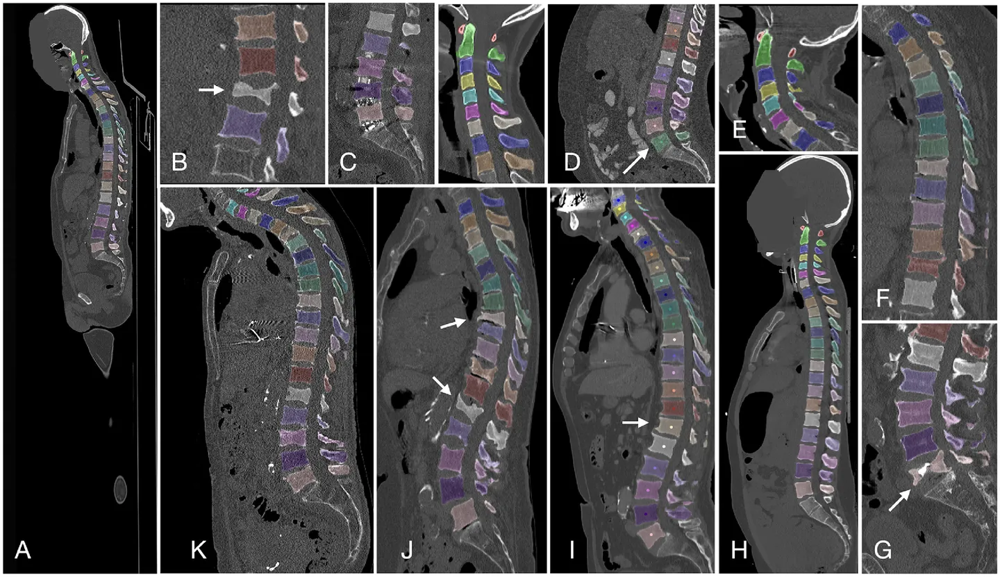
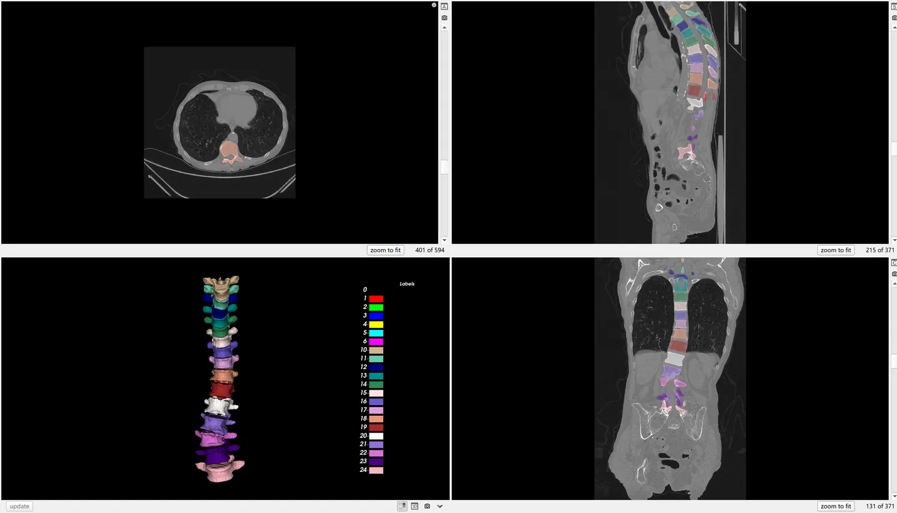

# VerSe

<div align="center">
    <a href="https://github.com/openmedlab/"></a>
</div>
<p style="text-align:center;font-size:10px;"><em></em></p>

## Dataset Information

The **VerSe** (**Ver**tebrae **Se**gmentation) dataset is a large-scale, multi-device, multi-center CT image spine segmentation dataset, encompassing scans from 355 patients totaling 374 scans. This dataset combines data from the VerSe19 and VerSe20 challenges at MICCAI in 2019 and 2020. Specifically, VerSe19 included 160 scans from 141 patients, while VerSe20 involved 319 scans from 300 patients. However, **due to the overlap of 86 patients in both datasets**, the total number of unique patients in VerSe is not simply the sum of the two datasets.

VerSe has categorized these 374 scans into 141 for training, 120 for validation, and 113 for testing, with all scans and annotations publicly available. Within the 26 vertebral annotation categories, in addition to the conventional 24 categories C1-C7, T1-T12, and L1-L5, the dataset uniquely annotates the **rarer T13 and L6 vertebrae**. Additionally, vertebrae only partially visible **at the top or bottom of a scan were not annotated**.

| VerSe | Patients | Scans | Scan split    | Vertebrae (Cer/Tho/Lum) |
|-------|----------|-------|---------------|-------------------------|
| 2019  | 141      | 160   | 80/40/40      | 1725 (220/884/621)      |
| 2020  | 300      | 319   | 113/103/103   | 4141 (581/2255/1305)    |
| Total | 355      | 374   | 141/120/113   | 4505 (611/2387/1507)    |

## Dataset Meta Information

| Dimensions | Modality | Task Type | Anatomical Structures         | Anatomical Area | Number of Categories | Data Volume                                        | File Format |
|------------|----------|-----------|-------------------------------|-----------------|----------------------|----------------------------------------------------|-------------|
| 3D         | CT       | Segmentation | Vertebrae | Vertebrae       | 26                   | 141 for training, 120 for validation, 113 for test | .nii.gz     |


### Resolution Details

| Dataset Statistics | spacing (mm)     | size            |
|--------------------|------------------|-----------------|
| min                | (0.19, 0.19, 0.40)              | (103, 144, 34)     |
| median             | (0.92, 0.92, 1.0)           | (512, 512, 292) |
| max                | (1.67, 1.67, 5.0)              | (960, 2048, 2023) |

## Label Information Statistics

| Label | Vertebrae            | Cases | Percentage | Max Volume (cm³) | Min Volume (cm³) | Median Volume (cm³) |
|-------|----------------------|-------|------------|------------------|------------------|---------------------|
| 1     | C1 (Cervical 1)      | 76    | 20.32%     | 25               | 7.82             | 14.24               |
| 2     | C2 (Cervical 2)      | 76    | 20.32%     | 28.23            | 11.73            | 18.38               |
| 3     | C3 (Cervical 3)      | 80    | 21.39%     | 20.66            | 8.26             | 12.98               |
| 4     | C4 (Cervical 4)      | 81    | 21.66%     | 19.69            | 7.57             | 12.51               |
| 5     | C5 (Cervical 5)      | 90    | 24.06%     | 19.61            | 8.01             | 13.08               |
| 6     | C6 (Cervical 6)      | 98    | 26.20%     | 22.2             | 8.59             | 17.5                |
| 7     | C7 (Cervical 7)      | 128   | 34.49%     | 26.97            | 10.19            | 17.34               |
| 8     | T1 (Thoracic 1)      | 180   | 48.13%     | 35.99            | 12.15            | 22.64               |
| 9     | T2 (Thoracic 2)      | 198   | 52.94%     | 36.18            | 13.23            | 22.61               |
| 10    | T3 (Thoracic 3)      | 182   | 48.66%     | 35.57            | 7.37             | 21.72               |
| 11    | T4 (Thoracic 4)      | 174   | 46.52%     | 39.59            | 12.75            | 22.34               |
| 12    | T5 (Thoracic 5)      | 165   | 44.12%     | 39.86            | 13.71            | 24.04               |
| 13    | T6 (Thoracic 6)      | 160   | 42.78%     | 43.19            | 15.04            | 26.11               |
| 14    | T7 (Thoracic 7)      | 166   | 44.39%     | 46.05            | 17.03            | 29.78               |
| 15    | T8 (Thoracic 8)      | 176   | 47.06%     | 49.81            | 17.72            | 32.2                |
| 16    | T9 (Thoracic 9)      | 215   | 57.49%     | 59.08            | 19.04            | 34.85               |
| 17    | T10 (Thoracic 10)    | 249   | 66.58%     | 61.32            | 13.79            | 38.72               |
| 18    | T11 (Thoracic 11)    | 268   | 71.66%     | 66.97            | 22.54            | 41.98               |
| 19    | T12 (Thoracic 12)    | 272   | 72.73%     | 74.24            | 23.19            | 46.4                |
| 20    | L1 (Lumbar 1)        | 298   | 79.68%     | 82.81            | 28.54            | 51.46               |
| 21    | L2 (Lumbar 2)        | 297   | 79.41%     | 87.59            | 30.93            | 56.54               |
| 22 | L3 (Lumbar 3)        | 295   | 78.88%     | 99.59            | 27.32            | 62.5                |
| 23 | L4 (Lumbar 4)        | 292   | 78.07%     | 108.07           | 37.8             | 64.66               |
| 24 | L5 (Lumbar 5)        | 276   | 73.80%     | 106.12           | 38               | 63.76               |
| 25 | L6 (Lumbar 6)        | 50    | 13.37%     | 101.18           | 47.52            | 70.55               |
| 26 | Sacrum               | 0     | 0.00%      | 0                | 0                | 0                   |
| 27 | Coccyx               | 0     | 0.00%      | 0                | 0                | 0                   |
| 28 | T13 (Thoracic 13)    | 6     | 1.60%      | 66.24            | 31.41            | 57.06               |

Label 26 27 are reserved but not provided in VerSe. Volume unit is cm^3.

## Visualization

<div align="center">
    <a href="https://github.com/openmedlab/"></a>
</div>
<p style="text-align:center;font-size:10px;"><em> Official Visualization.</em></p>

<div align="center">
    <a href="https://github.com/openmedlab/"></a>
</div>
<p style="text-align:center;font-size:10px;"><em> ITK-SNAP Visualization.</em></p>

## File Structure

The VerSe dataset includes six main folders, corresponding to the training, validation, and testing data for both VerSe19 and VerSe20. Each main folder contains two subdirectories: `rawdata` and `derivatives`. The `rawdata` subdirectory is dedicated to storing the original CT images ending in `.nii.gz`, while the `derivatives` subdirectory contains the segmentation masks, centroid coordinates stored in `.json` format, and `.png` reconstructed images for preview.

For example, the folder structure for the VerSe20 training data is as follows:

``` 
dataset-01training
├── rawdata
│   └── sub-gl003
│       └── sub-gl003_dir-ax_ct.nii.gz
└── derivatives
    └── sub-gl003
        ├── sub-gl003_dir-ax_seg-subreg_ctd.json
        ├── sub-gl003_dir-ax_seg-vert_msk.nii.gz
        └── sub-gl003_dir-ax_seg-vert_snp.png
```

## Authors and Institutions

Anjany Sekuboyina, Informatics & Klinikum rechts der Isar, Technical University of Munich.


## Source Information

Official Website: https://github.com/anjany/verse

Download Link: https://github.com/anjany/verse

Article Address: https://linkinghub.elsevier.com/retrieve/pii/S1361841521002127, https://pubs.rsna.org/doi/10.1148/ryai.2020190138, https://arxiv.org/pdf/2103.06360.pdf

Publication Date: 2020-05

## Citation

``` 
@article{Sekuboyina2021,
  title={VerSe: A Vertebrae Labelling and Segmentation Benchmark for Multi-detector CT Images},
  author={Sekuboyina, Anjany and Husseini, Malek E and Bayat, Amirhossein and Löffler, Maximilian and Liebl, Hans and Li, Hongwei and Tetteh, Giles and Kukačka, Jan and Payer, Christian and Štern, Darko and others},
  journal={Medical image analysis},
  volume={71},
  pages={102166},
  year={2021},
  publisher={Elsevier}
}

@article{Loffler2020,
  title={A Vertebral Segmentation Dataset with Fracture Grading},
  author={L{\"o}ffler, Maximilian T and Sekuboyina, Anjany and Jacob, Alina and Grau, Anna-Lena and Scharr, Andreas and El Husseini, Malek and Kallweit, Mareike and Zimmer, Claus and Baum, Thomas and Kirschke, Jan S},
  journal={Radiology: Artificial Intelligence},
  volume={2},
  number={4},
  pages={e190138},
  year={2020},
  publisher={Radiological Society of North America}
}

@article{Liebl2021,
  title={A Computed Tomography Vertebral Segmentation Dataset with Anatomical Variations and Multi-Vendor Scanner Data},
  author={Liebl, Hans and Schinz, David and Sekuboyina, Anjany and Malagutti, Luca and L{\"o}ffler, Maximilian T and Bayat, Amirhossein and El Husseini, Malek and Tetteh, Giles and Grau, Katharina and Niederreiter, Eva and others},
  journal={arXiv preprint arXiv:2103.06360},
  year={2021}
}
```

Original introduction article is [here](https://zhuanlan.zhihu.com/p/657508579).