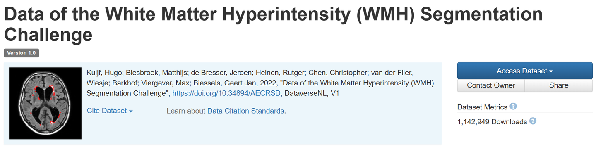
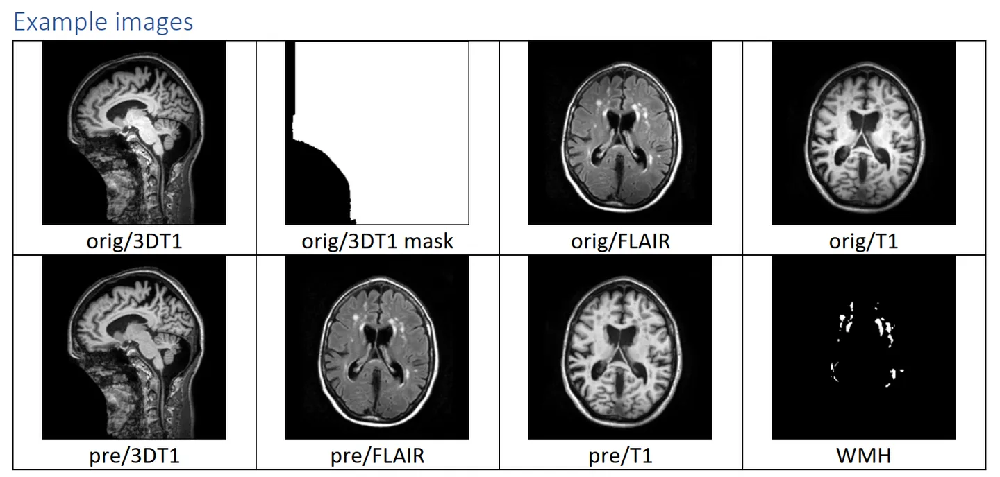

# WMH

<div align="center">
    <a href="https://github.com/openmedlab/"></a>
</div>
<p style="text-align:center;font-size:10px;"><em></em></p>

## Dataset Information

The **WMH** (White Matter Hyperintensity) dataset is a multimodal brain MR dataset specifically designed for comparing and evaluating automatic segmentation techniques for white matter hyperintensities (WMH). It includes training data from 60 cases from various institutions and different MR scanners, each comprising brain MR images in T1-weighted and FLAIR sequences along with expert manual annotations of white matter hyperintensities. Additionally, the dataset includes 110 test cases from five different MRI scanners to assess the automatic segmentation algorithms developed by competing teams. The test data is not publicly released to ensure the fairness and validity of the evaluation. Notably, the dataset also provides lesion annotations for a few other brain pathologies apart from WMH for some data, but these are ignored during the evaluation process and are not accounted for in this paper.

White matter hyperintensities (WMH) are one of the typical manifestations of small vessel brain diseases and can be clearly identified in brain MRI scans. WMHs are crucial for diagnosis, predicting disease progression, and monitoring treatment, especially in research on dementia and other neurodegenerative diseases of the nervous system. The traditional visually-based WMH assessment methods are limited; therefore, researchers have developed various automated WMH segmentation techniques aimed at providing more precise quantitative analyses to replace the traditional, time-consuming, and observer-dependent manual segmentation process.

## Dataset Meta Information

| Dimensions | Modality | Task Type | Anatomical Structures          | Anatomical Area | Number of Categories | Data Volume | File Format |
|------------|----------|-----------|--------------------------------|-----------------|----------------------|-------------|-------------|
| 3D         | CT       | Segmentation | White matter hyperintensities | Head            | 1                    | 170         | .nii.gz     |

Number of 2D slices in the dataset: 7,160 (based on a count of 60 cases in the training set).

### Resolution Details

| Dataset Statistics | spacing (mm)   | size          |
|--------------------|----------------|---------------|
| min                | (0.96, 0.96, 3.0)            | (132, 232, 48)   |
| median             | (1.0, 0.98, 3.0)         | (232, 256, 48) |
| max                | (1.2, 1.0, 3.0)              | (256, 256, 83) |

## Label Information Statistics

| Segmentation Class | WMH (White Matter Hyperintensities) |
|--------------------|-------------------------------------|
| Case Count         | 60                                  |
| Detection Rate     | 100%                                |
| Min Volume (cm³)   | 0.8                                 |
| Median Volume (cm³)| 15                                  |
| Max Volume (cm³)   | 75                                  |


## Visualization

<div align="center">
    <a href="https://github.com/openmedlab/"></a>
</div>
<p style="text-align:center;font-size:10px;"><em> Official readme visualization. The first row shows all the images that exist in the folder 'orig'. The second row displays the preprocessed images along with the manual WMH segmentation.</em></p>

<div align="center">
    <a href="https://github.com/openmedlab/"></a>
</div>
<p style="text-align:center;font-size:10px;"><em>ITK-SNAP Visualization. T1-weighted images. </em></p>

<div align="center">
    <a href="https://github.com/openmedlab/"></a>
</div>
<p style="text-align:center;font-size:10px;"><em>ITK-SNAP Visualization. FLAIR images.</em></p>

## File Structure

In this dataset, the `training` folder is subdivided into different geographic locations (such as Amsterdam, Singapore, Utrecht), and each location is further subdivided according to different scan types. For each subject, the provided files include raw and processed 3D T1 and FLAIR images, as well as masks and transformation parameters for these images. These files are stored in the `/orig` and `/pre` subfolders. The `/orig` folder contains the original images and the transformation parameters used to align the 3D T1 images with the FLAIR images, while the `/pre` folder contains images that have been corrected for bias field. In addition, a `/wmh.nii.gz` file is provided, which is a manual annotation used only for training data, containing labels for the background, white matter hyperintensities (WMH), and other pathologies.

``` 
dataverse_files/
├── MANIFEST.TXT
├── readme.pdf
├── additional_annotations/
│   ├── observer_o3/
│   └── observer_o4/
├── test/
│   ├── Amsterdam/
│   ├── Singapore/
│   └── Utrecht/
└── training/
    ├── Amsterdam/
    │   ├── GE3T/
    │   │   ├── 100/
    │   │   │   └── wmh.nii.gz
    │   │   ├── 101/
    │   │   │   └── wmh.nii.gz
    │   │   ├── ...
    │   │   └── 144/
    │   │       └── wmh.nii.gz
    │   └── ...
    ├── Singapore/
    │   └── ...
    └── Utrecht/
        └── ...
```

## Authors and Institutions

Hugo Kuijf (UMC Utrecht, Netherlands)

Matthijs Biesbroek (UMC Utrecht, Netherlands)

Jeroen de Bresser (UMC Utrecht, Netherlands)​​.


## Source Information

Official Website: https://dataverse.nl/dataset.xhtml?persistentId=doi:10.34894/AECRSD

Download Link: https://dataverse.nl/dataset.xhtml?persistentId=doi:10.34894/AECRSD

Article Address: https://ieeexplore.ieee.org/document/8669968;

Publication Date: November, 2019.

## Citation

``` 
@ARTICLE{8669968,
  author={Kuijf, Hugo J. and Biesbroek, J. Matthijs and De Bresser, Jeroen and Heinen, Rutger and Andermatt, Simon and Bento, Mariana and Berseth, Matt and Belyaev, Mikhail and Cardoso, M. Jorge and Casamitjana, Adrià and Collins, D. Louis and Dadar, Mahsa and Georgiou, Achilleas and Ghafoorian, Mohsen and Jin, Dakai and Khademi, April and Knight, Jesse and Li, Hongwei and Lladó, Xavier and Luna, Miguel and Mahmood, Qaiser and McKinley, Richard and Mehrtash, Alireza and Ourselin, Sébastien and Park, Bo-Yong and Park, Hyunjin and Park, Sang Hyun and Pezold, Simon and Puybareau, Elodie and Rittner, Leticia and Sudre, Carole H. and Valverde, Sergi and Vilaplana, Verónica and Wiest, Roland and Xu, Yongchao and Xu, Ziyue and Zeng, Guodong and Zhang, Jianguo and Zheng, Guoyan and Chen, Christopher and van der Flier, Wiesje and Barkhof, Frederik and Viergever, Max A. and Biessels, Geert Jan},
  journal={IEEE Transactions on Medical Imaging}, 
  title={Standardized Assessment of Automatic Segmentation of White Matter Hyperintensities and Results of the WMH Segmentation Challenge}, 
  year={2019},
  volume={38},
  number={11},
  pages={2556-2568},
  doi={10.1109/TMI.2019.2905770}}
```

Original introduction article is [here](https://zhuanlan.zhihu.com/p/668383167).