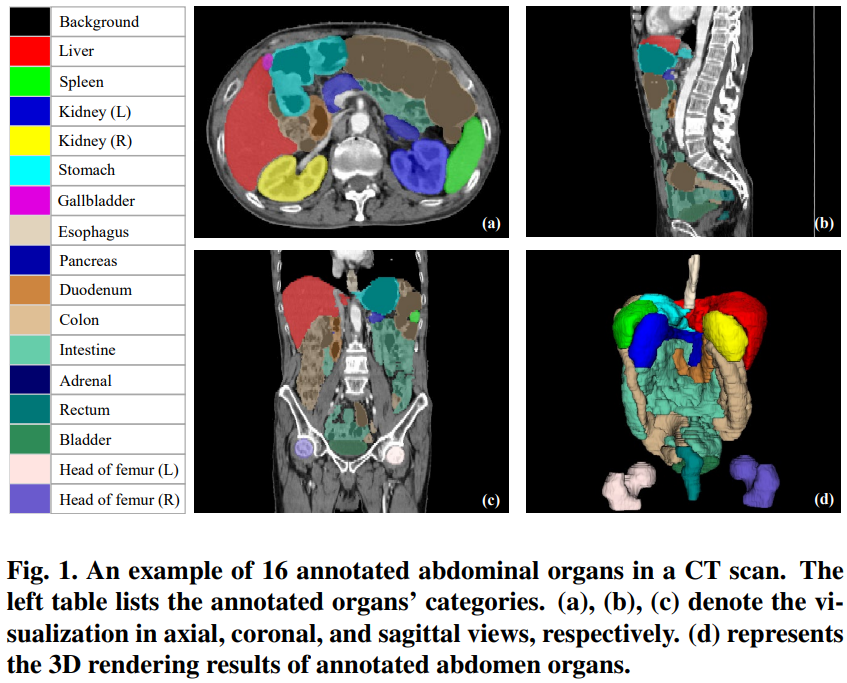
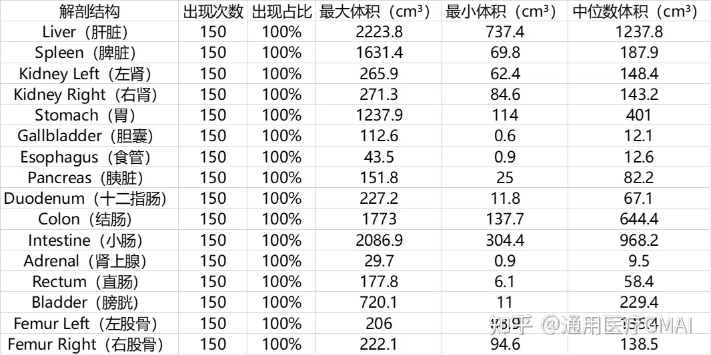

# WORD

<div align="center">
    <a href="https://github.com/openmedlab/"></a>
</div>
<p style="text-align:center;font-size:10px;"><em></em></p>

## Dataset Information

The WORD (Whole Abdominal ORgan Dataset) is a large-scale abdominal organ segmentation CT dataset. This dataset includes 150 CT scans comprehensively covering the abdominal area, providing detailed annotations for 16 different abdominal organs. The officials have divided these data into 100 scans for training, 20 for validation, and 30 for testing. Compared to other common abdominal organ segmentation datasets, the WORD not only provides more annotations for intestinal categories including the colon, intestine, and rectum but also includes annotations for the left and right femoral heads (Head of Femur(L) and Head of Femur(R)).

## Dataset Meta Information

| Dimensions | Modality | Task Type | Anatomical Structures          | Anatomical Area | Number of Categories | Data Volume                                       | File Format |
|------------|----------|-----------|--------------------------------|-----------------|----------------------|---------------------------------------------------|-------------|
| 3D         | CT       | Segmentation | 16 abdominal organs | abdomen       | 16                   | 100 for training, 20 for validation, 30 for test. | .nii.gz     |


### Resolution Details

| Dataset Statistics | spacing (mm)     | size            |
|--------------------|------------------|-----------------|
| min                | (0.7168, 0.7168, 2.5)              | (512, 512, 151)     |
| median             | (0.9766, 0.9766, 3)           | (512, 512, 202) |
| max                | (0.9766, 0.9766, 3)             | (512, 512, 343) |

## Label Information Statistics

| Organ        | Number of Cases | Percentage of Coverage | Maximum Volume (cm³) | Minimum Volume (cm³) | Median Volume (cm³) |
|--------------|-----------------|------------------------|----------------------|---------------------|---------------------|
| Liver        | 150             | 100%                   | 2223.8               | 737.4               | 1237.8              |
| Spleen       | 150             | 100%                   | 1631.4               | 69.8                | 187.9               |
| Kidney Left  | 150             | 100%                   | 265.9                | 62.4                | 148.4               |
| Kidney Right | 150             | 100%                   | 271.3                | 84.6                | 143.2               |
| Stomach      | 150             | 100%                   | 1237.9               | 114                 | 401                 |
| Gallbladder  | 150             | 100%                   | 112.6                | 0.6                 | 12.1                |
| Esophagus    | 150             | 100%                   | 43.5                 | 0.9                 | 12.6                |
| Pancreas     | 150             | 100%                   | 151.8                | 25                  | 82.2                |
| Duodenum     | 150             | 100%                   | 227.2                | 11.8                | 67.1                |
| Colon        | 150             | 100%                   | 1773                 | 137.7               | 644.4               |
| Intestine    | 150             | 100%                   | 2086.9               | 304.4               | 968.2               |
| Adrenal      | 150             | 100%                   | 29.7                 | 0.9                 | 9.5                 |
| Rectum       | 150             | 100%                   | 177.8                | 6.1                 | 58.4                |
| Bladder      | 150             | 100%                   | 720.1                | 11                  | 229.4               |
| Femur Left   | 150             | 100%                   | 206                  | 83.9                | 135.4               |
| Femur Right  | 150             | 100%                   | 222.1                | 94.6                | 138.5               |


## Visualization

<div align="center">
    <a href="https://github.com/openmedlab/"></a>
</div>
<p style="text-align:center;font-size:10px;"><em> Official Visualization.</em></p>

## File Structure

The official file structure is as follows, divided into 6 folders: training images, training labels, verification images, verification labels, test images, and test labels.

``` 
WORD
│
├── imagesTr
│   ├── word_0002.nii.gz
│   └── ...
│
├── labelsTr
│   ├── word_0002.nii.gz
│   └── ...
│
├── imagesVal
│   ├── word_0001.nii.gz
│   └── ...
│
├── labelsVal
│   ├── word_0001.nii.gz
│   └── ...
│
├── imagesTs
│   ├── word_0014.nii.gz
│   └── ...
│
└── labelsTs
    ├── word_0014.nii.gz
    └── ...
```

## Authors and Institutions

Xiangde Luo (University of Electronic Science and Technology of China, Shanghai AI Lab)

Guotai Wang (University of Electronic Science and Technology of China, Shanghai AI Lab)

Shaoting Zhang (University of Electronic Science and Technology of China, Shanghai AI Lab)


## Source Information

Official Website: https://github.com/HiLab-git/WORD

Download Link: https://github.com/HiLab-git/WORD

Article Address: https://arxiv.org/pdf/2111.02403.pdf

Publication Date: 2021-11

## Citation

``` 
@article{luo2022word,
  title={{WORD}: A large scale dataset, benchmark and clinical applicable study for abdominal organ segmentation from CT image},
  author={Xiangde Luo, Wenjun Liao, Jianghong Xiao, Jieneng Chen, Tao Song, Xiaofan Zhang, Kang Li, Dimitris N. Metaxas, Guotai Wang, and Shaoting Zhang},
  journal={Medical Image Analysis},
  volume={82},
  pages={102642},
  year={2022},
  publisher={Elsevier}}
```

Original introduction article is [here](https://zhuanlan.zhihu.com/p/654179326).