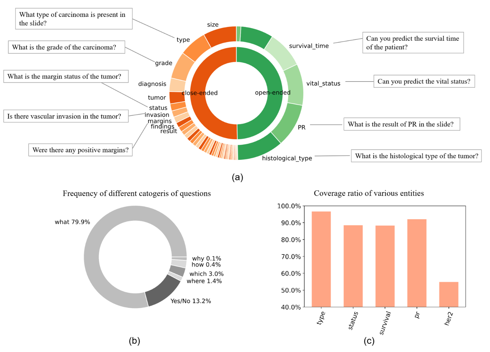
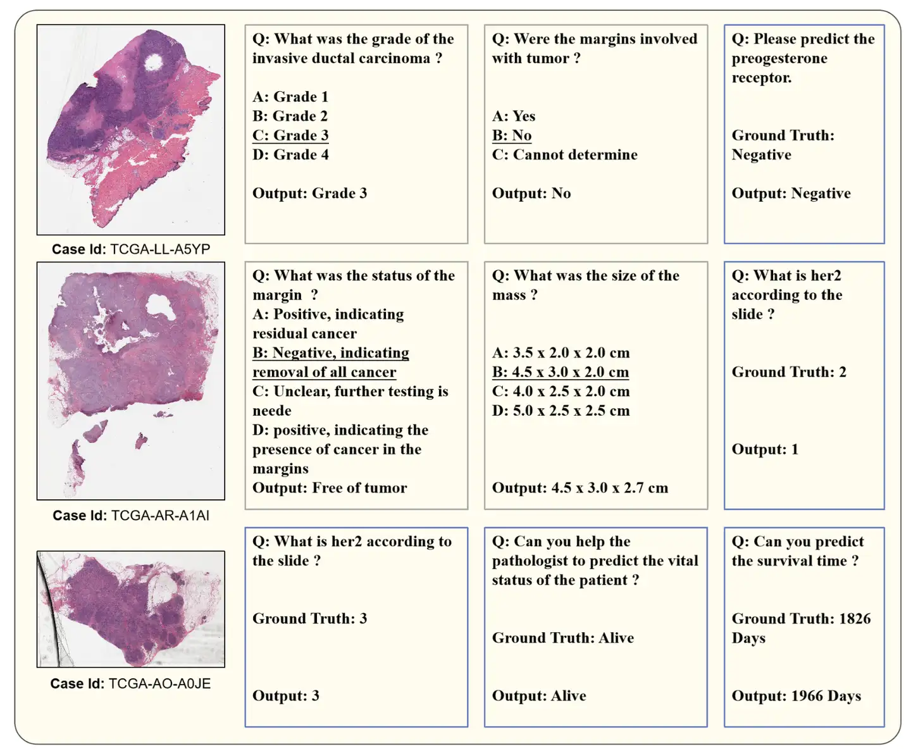

# WSI-VQA

<div align="center">
    <a href="https://github.com/openmedlab/"></a>
</div>
<p style="text-align:center;font-size:10px;"><em></em></p>

## Dataset Information

WSI-VQA is a dataset specifically designed for the visual question answering (VQA) task on whole slide images (WSI) in pathology. It contains 977 whole slide images and 8,672 question-answer pairs. The dataset is based on publicly available TCGA-BRCA pathology reports and clinical information, and it was generated with the assistance of large language models, covering a variety of tasks related to whole slide images. On average, each WSI is associated with 8.9 question-answer pairs, including 4,535 closed-ended and 4,137 open-ended question-answer pairs. The questions in the dataset are diverse, ranging from identifying margin status to immunohistochemical grading of WSIs. The dataset covers different categories of questions, with "what" questions being the most common, accounting for 80%. Additionally, there are other types of questions, such as 13.2% "yes/no" questions, 1.4% "where" questions, and 3% "which" questions.

The dataset is divided into a training set, validation set, and test set. The training set includes 804 WSIs and 7,139 question-answer pairs, the validation set contains 87 WSIs and 798 question-answer pairs, and the test set comprises 86 WSIs and 735 question-answer pairs. For the closed-ended question subset in the test phase, the distribution of correct options is as follows: 151 for option A, 107 for option B, 86 for option C, and 46 for option D. The WSI-VQA dataset will promote the development of multimodal large language models (MLLMs) in the field of pathology, advancing research progress and expanding the scope of applications.

## Dataset Meta Information

| Task Type | Language | Train | Val | Test | File Format | Size   |
|-----------|----------|-------|-----|------|-------------|--------|
| VQA       | English  | 7139  | 798 | 735  | .json       | 1170KB |

## Dataset Information Statistics

<div align="center">
    <a href="https://github.com/openmedlab/"></a>
</div>
<p style="text-align:center;font-size:10px;"><em>Dataset Statistics (Source Article): (a) Distribution of biological entities in the dataset. The central circle shows the distribution of closed-ended and open-ended question pairs, while the outer circle displays the entities in the dataset. (b) Frequency of different types of questions. (c) Proportion of various entities in the open-ended subset.</em></p>

## Dataset Example

<div align="center">
    <a href="https://github.com/openmedlab/"></a>
</div>
<p style="text-align:center;font-size:10px;"><em></em></p>

## File Structure

Due to the high resolution and preprocessing requirements of WSIs, the authors only provide the `WsiVQA.json` file containing the ID, question, and answer information, as well as CSV files for data splits. The original WSI images need to be downloaded and processed independently from the TCGA database (https://portal.gdc.cancer.gov/).

```
.              
├── WsiVQAQA.json
├── dataset
    ├── split.csv
```

## Authors and Institutions

Pingyi Chen (Zhejiang University, Westlake University)

Chenglu Zhu (Westlake University)

Sunyi Zheng (Westlake University)

Honglin Li (Zhejiang University, Westlake University)

Lin Yang (Westlake University)

## Source Information

Official Website: https://github.com/cpystan/WSI-VQA/tree/master

Download Link: https://github.com/cpystan/WSI-VQA/tree/master

Article Address: https://arxiv.org/html/2407.05603v1

Publication Date: 2024-07

## Citation

``` 
@misc{chen2024wsivqainterpretingslideimages,
      title={WSI-VQA: Interpreting Whole Slide Images by Generative Visual Question Answering}, 
      author={Pingyi Chen and Chenglu Zhu and Sunyi Zheng and Honglin Li and Lin Yang},
      year={2024},
      eprint={2407.05603},
      archivePrefix={arXiv},
      primaryClass={cs.CV},
      url={https://arxiv.org/abs/2407.05603}, 
}
```

Original introduction article is [here](https://zhuanlan.zhihu.com/p/711288906).