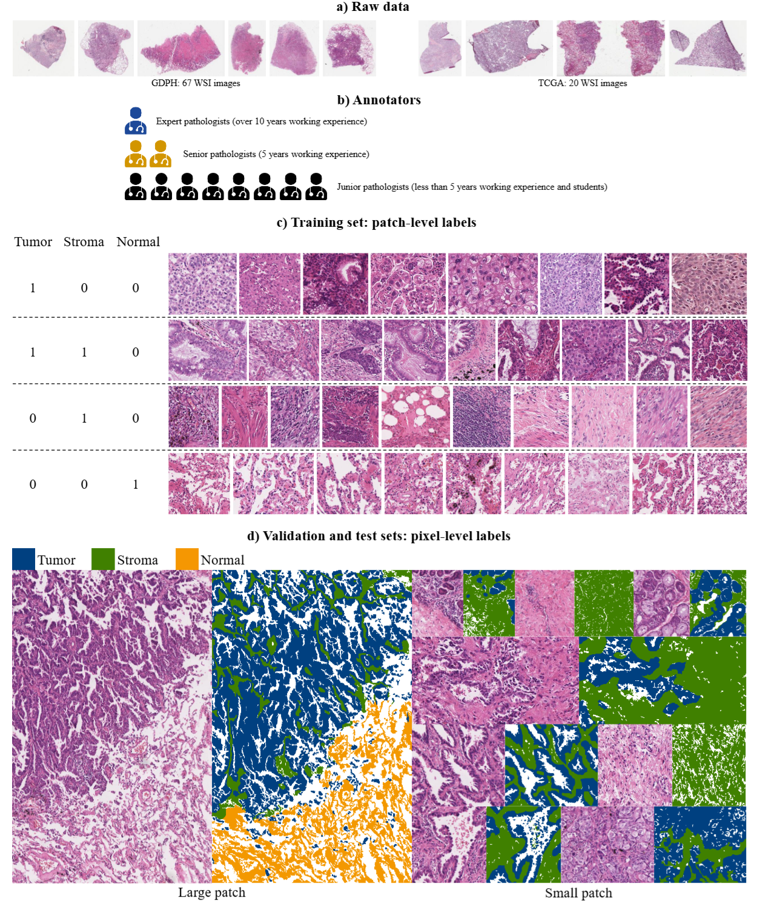
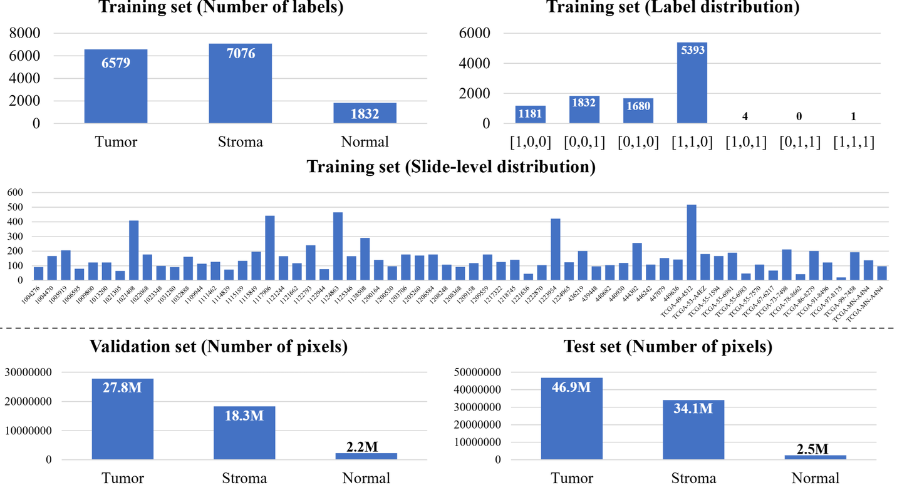

# WSSS4LUAD

<div align="center">
    <a href="https://github.com/openmedlab/"></a>
</div>
<p style="text-align:center;font-size:10px;"><em></em></p>

## Dataset Information

**WSSS4LUAD** is a dataset and challenge focused on weakly supervised semantic segmentation of lung adenocarcinoma tissue. The dataset comprises 87 whole-slide images (WSIs) sourced from the Guangdong Provincial People's Hospital (GDPH) and The Cancer Genome Atlas (TCGA), with 67 images from GDPH and 20 from TCGA. The training set includes 10,091 image patches with image-level labels, while the validation and test sets feature over 130 million pixel-level annotations. These annotations were collaboratively generated by pathologists and AI models and rigorously reviewed by experts.

Lung cancer is the leading cause of cancer-related deaths worldwide. However, obtaining precise semantic pixel-level annotations for tissues is extremely challenging and time-consuming. The goal of this challenge is to develop algorithms capable of semantic segmentation for three key tissue types in lung adenocarcinoma: tumor epithelium, tumor-associated stroma, and normal tissue, using only image-level labels. Contestants are required to train their algorithms with only image-level multi-class labels (3-class classification) and evaluate their performance using pixel-level ground truth for validation and testing.

The **WSSS4LUAD Challenge** advances pathology image segmentation through weakly supervised methods, aiming to reduce reliance on expensive pixel-level annotations while improving accuracy and efficiency in identifying lung adenocarcinoma tissue. This initiative not only offers new approaches for pathology research but also lays a solid foundation for supporting lung cancer diagnosis, enhancing clinical workflow efficiency, and facilitating the deployment of intelligent cancer image analysis tools.

## Dataset Meta Information

| Dimensions | Modality  | Task Type      | Anatomical Structures | Anatomical Area | Number of Categories | Data Volume | File Format |
|------------|-----------|----------------|-----------------------|-----------------|----------------------|-------------|-------------|
| 2D         | Pathology | Segmentation   | Lung                  | Lung            | 3                    | 10,211      | PNG         |


### Resolution Details

| Dataset Statistics | size         |
|--------------------|--------------|
| min                | (150, 150)   |
| median             | -            |
| max                | (5000, 5000) |

## Label Information Statistics

<div align="center">
    <a href="https://github.com/openmedlab/"></a>
</div>
<p style="text-align:center;font-size:10px;"><em>Data statistics include the number of block-level and pixel-level annotations for each tissue category in the training set, validation set, and test set, as well as the distribution of multi-category labels in the training set.</em></p>

## Visualization

<div align="center">
    <a href="https://github.com/openmedlab/"></a>
</div>
<p style="text-align:center;font-size:10px;"><em>Introduction to the WSSS4LUAD dataset. (a) The authors scanned 67 pathological slides from Guangdong Provincial People's Hospital and downloaded 20 WSIs from TCGA. During the data annotation process, an expert, two senior pathologists, and eight junior pathologists were invited to annotate the image-level training samples and pixel-level validation samples, respectively. Figures c and d show some examples of the training set, validation set, and test set.</em></p>

## File Structure

``` 
WSSS4LUAD/
│
├── 1.training.zip
├── 2.validation.zip
├── 3.testing.zip
└── mask.zip
```

## Authors and Institutions

Due to the large number of authors, only the first 8 are listed here:

Chu Han (Department of Radiology, Guangdong Provincial People’s Hospital, Guangdong Academy of Medical Sciences & Guangdong Provincial Key Laboratory of Artificial Intelligence in Medical Image Analysis and Application, Guangdong Provincial People’s Hospital, Guangdong Academy of Medical Sciences)

Xipeng Pan (Department of Radiology, Guangdong Provincial People’s Hospital, Guangdong Academy of Medical Sciences & Guangdong Provincial Key Laboratory of Artificial Intelligence in Medical Image Analysis and Application, Guangdong Provincial People’s Hospital, Guangdong Academy of Medical Sciences)

Lixu Yan (Department of Pathology, Guangdong Provincial People’s Hospital, Guangdong Academy of Medical Sciences)

Huan Lin (Department of Radiology, Guangdong Provincial People’s Hospital, Guangdong Academy of Medical Sciences & Guangdong Provincial Key Laboratory of Artificial Intelligence in Medical Image Analysis and Application, Guangdong Provincial People’s Hospital, Guangdong Academy of Medical Sciences)

Bingbing Li (Department of Pathology, Guangdong Provicial People’s Hospital Ganzhou Hospital)

Su Yao (Department of Pathology, Guangdong Provincial People’s Hospital, Guangdong Academy of Medical Sciences)

Shanshan Lv (Department of Pathology, Guangdong Provincial People’s Hospital, Guangdong Academy of Medical Sciences)

Zhenwei Shi (Department of Radiology, Guangdong Provincial People’s Hospital, Guangdong Academy of Medical Sciences & Guangdong Provincial Key Laboratory of Artificial Intelligence in Medical Image Analysis and Application, Guangdong Provincial People’s Hospital, Guangdong Academy of Medical Sciences)

## Source Information

Official Website: https://wsss4luad.grand-challenge.org/WSSS4LUAD/

Download Link: https://drive.google.com/drive/folders/1qTTTaHAp8HOnvxnKi1RXp-bC7sito9DF

Article Address: https://arxiv.org/abs/2204.06455

Publication Date: 2021

## Citation

``` 
@inproceedings{han2022wsss4luad,
   author = {Han, Chu and Pan, Xipeng and Yan, Lixu and Lin, Huan and Li, Bingbing and Yao, Su and Lv, Shanshan and Shi, Zhenwei and Mai, Jinhai and Lin, Jiatai and Zhao, Bingchao and Xu, Zeyan and Wang, Zhizhen and Wang, Yumeng and Zhang, Yuan and Wang, Huihui and Zhu, Chao and Lin, Chunhui and Mao, Lijian and Wu, Min and Duan, Luwen and Zhu, Jingsong and Hu, Dong and Fang, Zijie and Chen, Yang and Zhang, Yongbing and Li, Yi and Zou, Yiwen and Yu, Yiduo and Li, Xiaomeng and Li, Haiming and Cui, Yanfen and Han, Guoqiang and Xu, Yan and Xu, Jun and Yang, Huihua and Li, Chunming and Liu, Zhenbing and Lu, Cheng and Chen, Xin and Liang, Changhong and Zhang, Qingling and Liu, Zaiyi},
   title = {WSSS4LUAD: Grand Challenge on Weakly-supervised Tissue Semantic Segmentation for Lung Adenocarcinoma},
   publisher = {arXiv},
   year = {2022}
}
```

Original introduction article is [here](https://zhuanlan.zhihu.com/p/6086831058).