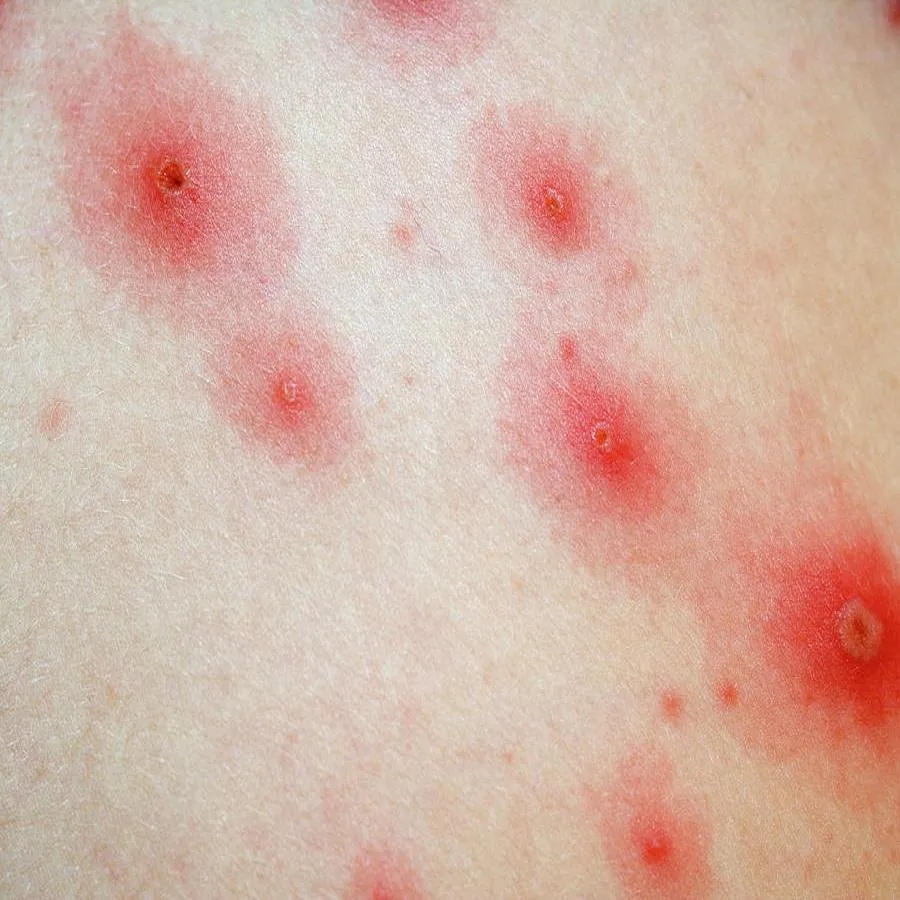
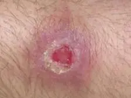
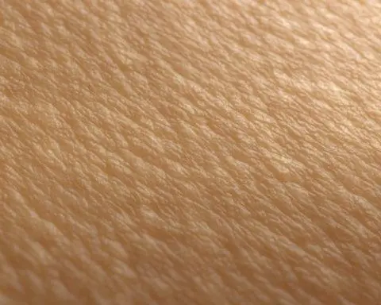
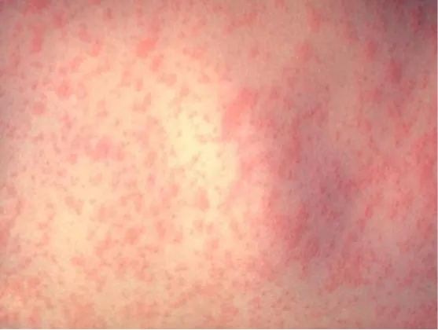
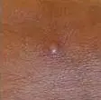
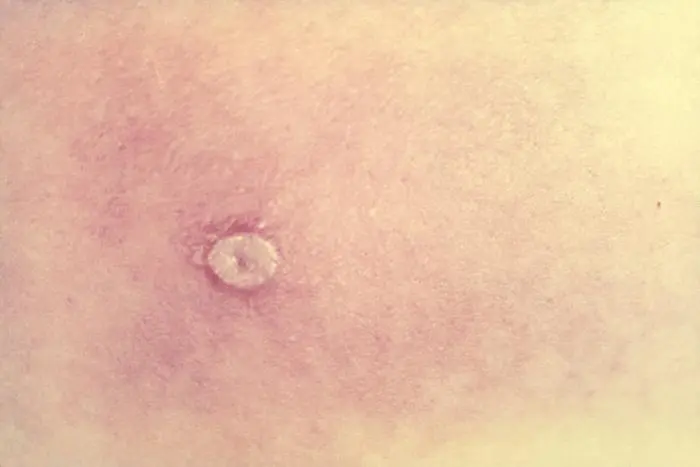

# Web-scraped Skin Image

<div align="center">
    <a href="https://github.com/openmedlab/"></a>
</div>
<p style="text-align:center;font-size:10px;"><em></em></p>

## Dataset Information

The Web-scraped Skin Image dataset consists of 804 skin images with disease classification labels obtained from web resources. This dataset encompasses 6 categories, including 117 images of monkeypox, 178 of chickenpox, 54 of cowpox, 47 of measles, 358 of smallpox, and 50 healthy skin images. The authors have obscured exposed eyes and private areas in these images with black boxes. Furthermore, to train better classification models, the authors used classic image augmentation techniques such as rotation and padding to increase the number of original images to 39,396.

The spread of monkeypox disease is rapid, with cases now reported in 75 countries. The clinical symptoms and appearance of monkeypox share similarities with other skin diseases such as smallpox, chickenpox, and cowpox, making early diagnosis of monkeypox through visual inspection alone quite challenging. Inspired by the successful application of machine learning technology during the previous COVID-19 pandemic, the authors were motivated to help healthcare workers achieve faster and more accurate skin disease diagnoses. They have collected and prepared this dataset from the web and made it publicly available, hoping to promote research and application of machine learning technology in this field.

## Dataset Meta Information

| Dimensions | Modality   | Task Type      | Anatomical Structures | Anatomical Area | Number of Categories | Data Volume | File Format |
|------------|------------|----------------|-----------------------|-----------------|----------------------|-------------|-------------|
| 2D         | Skin Image | Classification | Skin                  | Skin            | 6                    | 804         | JPG         |


### Resolution Details

| Dataset Statistics | size         |
|--------------------|--------------|
| min                | [104,115]   |
| median             | [700,487]   |
| max                | [4064,3760]   |

## Label Information Statistics

| Category    | Number of Images |
|-------------|------------------|
| Chickenpox  | 178              |
| Cowpox      | 54               |
| Healthy     | 50               |
| Measles     | 47               |
| Monkeypox   | 117              |
| Smallpox    | 358              |


## Visualization

<div align="center">
    <a href="https://github.com/openmedlab/"></a>
</div>
<p style="text-align:center;font-size:10px;"><em> Chickenpox example image.</em></p>

<div align="center">
    <a href="https://github.com/openmedlab/"></a>
</div>
<p style="text-align:center;font-size:10px;"><em> Cowpox example image.</em></p>

<div align="center">
    <a href="https://github.com/openmedlab/"></a>
</div>
<p style="text-align:center;font-size:10px;"><em> Healthy example image.</em></p>

<div align="center">
    <a href="https://github.com/openmedlab/"></a>
</div>
<p style="text-align:center;font-size:10px;"><em> Measles example image.</em></p>

<div align="center">
    <a href="https://github.com/openmedlab/"></a>
</div>
<p style="text-align:center;font-size:10px;"><em> Monkeypox example image.</em></p>

<div align="center">
    <a href="https://github.com/openmedlab/"></a>
</div>
<p style="text-align:center;font-size:10px;"><em> Smallpox example image.</em></p>

## File Structure

The file structure of the dataset is presented as follows: it includes an .xlsx file that records specific information such as the original image names, labels, resolutions, sources, and dates. There is a folder containing the original images and another folder containing the augmented images. Each of these two folders contains six subfolders, which store images of the corresponding categories.

``` 
monkeypox dataset
├── augmented_images
│   ├── chickenpox
│   │   ├── aug_ch_0001_0001.jpg
│   │   ├── aug_ch_0001_0002.jpg
│   │   ├── ...aug_co_0001_0001
│   ├── cowpox
│   │   ├── aug_co_0001_0001.jpg
│   │   ├── aug_co_0001_0002.jpg
│   │   ├── ...
│   ├── healthy
│   │   ├── aug_he_0001_0001.jpg
│   │   ├── aug_he_0001_0002.jpg
│   │   ├── ...
│   ├── measles
│   │   ├── aug_me_0001_0001.jpg
│   │   ├── aug_me_0001_0002.jpg
│   │   ├── ...
│   ├── monkeypox
│   │   ├── aug_mo_0001_0001.jpg
│   │   ├── aug_mo_0001_0002.jpg
│   │   ├── ...
│   ├── smallpox
│   │   ├── aug_sm_0001_0001.jpg
│   │   ├── aug_sm_0001_0002.jpg
│   │   ├── ...
├── preprocessed_original_images
│   ├── chickenpox
│   │   ├── aug_ch_0001_0001.jpg
│   │   ├── aug_ch_0001_0002.jpg
│   │   ├── ...aug_co_0001_0001
│   ├── cowpox
│   │   ├── aug_co_0001_0001.jpg
│   │   ├── aug_co_0001_0002.jpg
│   │   ├── ...
│   ├── healthy
│   │   ├── aug_he_0001_0001.jpg
│   │   ├── aug_he_0001_0002.jpg
│   │   ├── ...
│   ├── measles
│   │   ├── aug_me_0001_0001.jpg
│   │   ├── aug_me_0001_0002.jpg
│   │   ├── ...
│   ├── monkeypox
│   │   ├── aug_mo_0001_0001.jpg
│   │   ├── aug_mo_0001_0002.jpg
│   │   ├── ...
│   ├── smallpox
│   │   ├── aug_sm_0001_0001.jpg
│   │   ├── aug_sm_0001_0002.jpg
│   │   ├── ...
├── image_list_with_sources_and_credits.xlsx
```

## Authors and Institutions

Towhidul Islam - Northern University Bangladesh, Bangladesh

Mohammad Arafat Hussain - Harvard Medical School, USA

Forhad Uddin Hasan Chowdhury - Directorate General of Health Services, Bangladesh

B. M. Riazul Islam - Directorate General of Health Services, Bangladesh

## Source Information

Official Website: https://www.kaggle.com/datasets/arafathussain/monkeypox-skin-image-dataset-2022, https://www.heywhale.com/mw/dataset/62eb75d6fef0903951b1f199

Download Link: https://www.heywhale.com/mw/dataset/62eb75d6fef0903951b1f199

Article Address: https://www.biorxiv.org/content/10.1101/2022.08.01.502199v3.full.pdf

Publication Date: 2022-08-09

## Citation

``` 
@article{islam2022aweb,
  title={A Web-scrapped Skin Image Database of Monkeypox, Chickenpox, Smallpox, Cowpox, and Measles},
  author={Islam, Towhidul and Hussain, Mohammad Arafat and Chowdhury, Forhad Uddin Hasan and Islam, B M Riazul},
  journal={bioRxiv 2022.08.01.502199},
  doi={https://doi.org/10.1101/2022.08.01.502199},
  year={2022}
}
```

Original introduction article is [here](https://zhuanlan.zhihu.com/p/679181863).