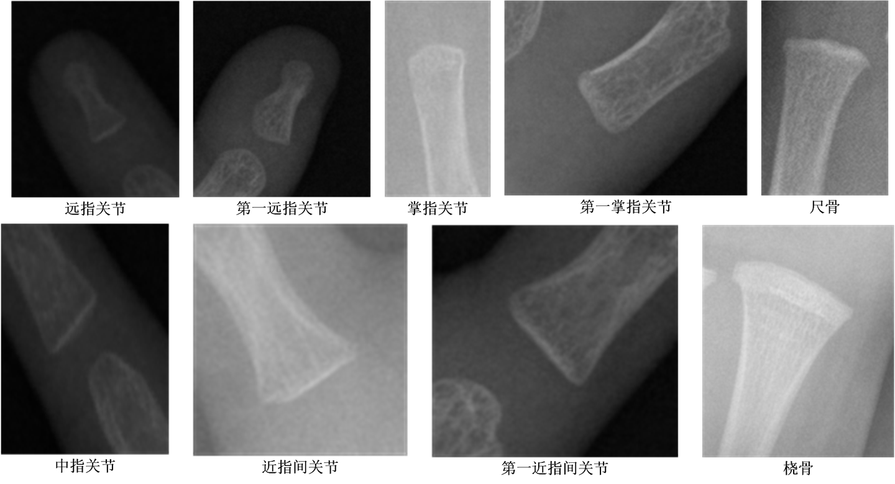

# X-ray Hand Small Joint Classification Dataset

<div align="center">
    <a href="https://github.com/openmedlab/"></a>
</div>
<p style="text-align:center;font-size:10px;"><em></em></p>

## Dataset Information

The bone age scoring method RUS-CHN in <<Zhonghua 05>> is a standardized method widely used in the assessment of children's growth and development. This method determines the individual's bone age by carefully observing and evaluating X-rays of specific bones in the hand. In this system, nine major atlases are divided in detail, including the radius atlas, ulna atlas, first metacarpal atlas, first proximal phalanx atlas, first distal phalanx atlas, and the atlases of the third and fifth metacarpal bones, third and fifth proximal phalanxes, third and fifth middle phalanxes, and third and fifth distal phalanxes, totaling nine atlases of key parts. Each atlas is further subdivided into 10 to 14 levels according to different stages of bone development. These levels reflect the continuous changes in bone maturity from infancy to late adolescence.

Based on the above atlas system, a large dataset was constructed, which contains a total of 8210 high-quality png format images, each of which is the result of accurate interception and classification annotation of X-rays of small joints of children's hands. These images not only clearly show the morphological characteristics of each skeletal part, but also strictly follow the classification standards of the RUS-CHN scoring method to ensure the consistency and accuracy of the data. The significance of this dataset is that it provides valuable resources for children's growth and development research, the development of bone age assessment technology, and clinical medical diagnosis. Through the training of machine learning and artificial intelligence algorithms, this dataset can be used to develop a more efficient and accurate bone age automatic assessment system, thereby replacing or partially replacing traditional manual assessment methods, reducing human errors, and improving work efficiency. In addition, this dataset can also help researchers to deeply understand the biological mechanisms of children's skeletal development, explore the genetic and environmental factors that affect skeletal maturity, and provide a scientific basis for the formulation of personalized growth and development intervention strategies. In short, this dataset is an important cornerstone for promoting scientific and technological progress and innovation in clinical practice in the field of children's growth and development.

## Dataset Meta Information

| Dimensions | Modality | Task Type      | Anatomical Structures | Anatomical Area | Number of Categories | Data Volume | File Format |
|------------|----------|----------------|-----------------------|-----------------|----------------------|-------------|-------------|
| 2D         | X-Ray    | Classification | Hand                  | Bone            | 9                    | 8210        | PNG         |


### Resolution Details

| Dataset Statistics | size       |
|--------------------|------------|
| min                | [63,73]    |
| median             | [174,139]  |
| max                | [452,303]  |

## Label Information Statistics

| Label                                      | Number  |
|--------------------------------------------|---------|
| Distal Interphalangeal (远指关节)              | 1262    |
| First Distal Interphalangeal (第一远指关节)      | 632     |
| Metacarpophalangeal (掌指关节)                 | 1262    |
| First Metacarpophalangeal (第一掌指关节)	        | 633     |
| Middle Interphalangeal (中指关节)              | 1262    |
| Proximal Interphalangeal (近指间关节)           | 1262    |
| First Proximal Interphalangeal (第一近指间关节)   | 632     |
| Radius (桡骨)                                | 633     |
| Ulna (尺骨)                                  | 632     |


## Visualization

<div align="center">
    <a href="https://github.com/openmedlab/"></a>
</div>
<p style="text-align:center;font-size:10px;"><em>Local Visualization</em></p>

## File Structure

``` 
RUS-CHN Dataset
├── images
│   ├── DIP
│   │   ├── xxx.png
│   │   ├── xxx.png
│   │    ...
│   ├──MCP
│   │   ├── xxx.png
│   │   ├── xxx.png
│   │    ...
├── train.txt
├── test.txt
```


## Source Information

Official Website: https://aistudio.baidu.com/datasetdetail/69582/2

Download Link: https://aistudio.baidu.com/datasetdetail/69582/2

Article Address: TBD

Publication Date: 2021-11-25

## Citation

``` 
TBD
```

Original introduction article is [here](https://zhuanlan.zhihu.com/p/773200955).