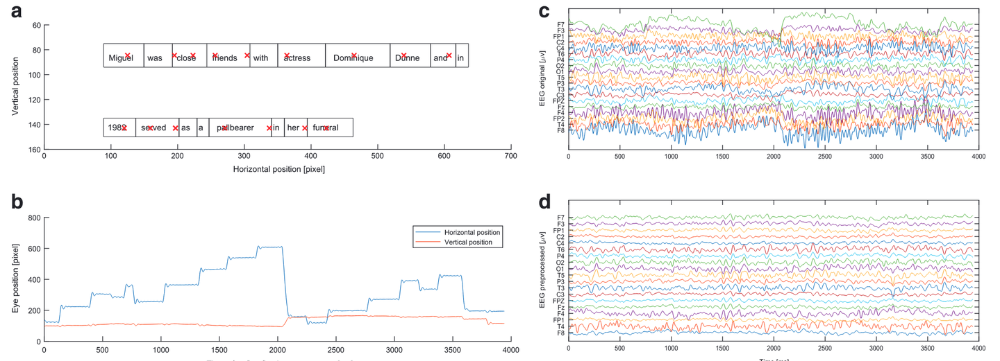
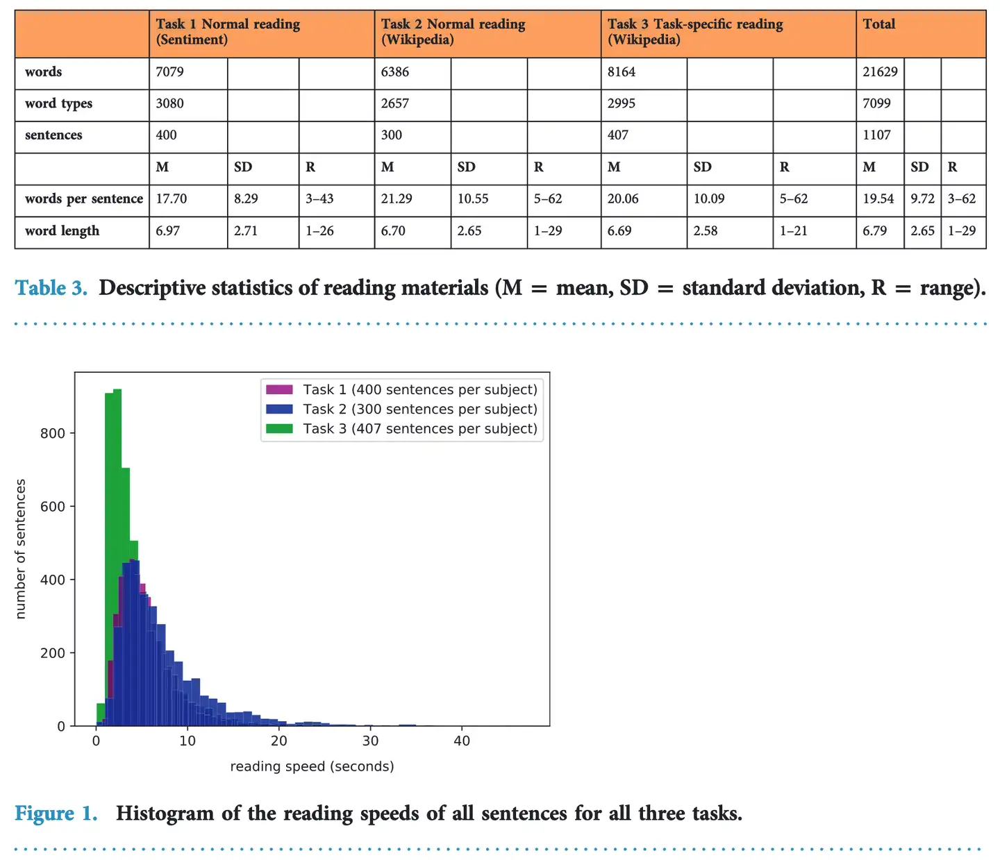

# ZuCo

<div align="center">
    <a href="https://github.com/openmedlab/"></a>
</div>
<p style="text-align:center;font-size:10px;"><em></em></p>

## Dataset Information

The ZuCo dataset is a collection combining high-density EEG (electroencephalography) and eye-tracking data, recorded from 12 healthy adult native English speakers while reading natural sentences. Participants read English texts for about 4-6 hours, with the dataset containing 21,629 words, 1,107 sentences, and 154,173 gaze data points.

The experimental setup in the ZuCo dataset includes three main tasks, each requiring participants to read natural sentences under different conditions:

**Task 1: Normal Reading (Sentiment Analysis)**

Participants were asked to read sentences extracted from movie reviews, containing either positive, negative, or neutral sentiments. They had to rate the quality of the movies based on the content of the sentences.

**Task 2: Normal Reading (Wikipedia)**

Participants read sentences from Wikipedia about famous people, involving specific semantic relations. They answered multiple-choice questions related to the content of the sentences after reading.

**Task 3: Task-Specific Reading (Wikipedia)**

Participants read sentences similar to those in Task 2, but were required to focus on identifying specific types of relationships (such as "awards," "educational background," etc.) during reading. They needed to determine whether the sentences contained the specified relationship types.

This dataset aims to provide rich physiological data for the natural language processing (NLP) field to train improved machine learning models, especially in tasks like entity and relationship extraction and sentiment analysis. Moreover, the dataset is crucial for studying the brain activity and eye movements involved in human reading and language comprehension processes.

## Dataset Meta Information

| Task Type    | Language | EEG sampling rate | Text Format | EEG format |
|--------------|----------|-------------------|-------------|------------|
| eeg-to-text  | English  | 500 Hz            | .csv        | .mat       |

## ## Dataset Information Statistics

<div align="center">
    <a href="https://github.com/openmedlab/"></a>
</div>
<p style="text-align:center;font-size:10px;"><em></em></p>

Table 3 and Figure 1 summarize the reading material statistics and the corresponding reading speed distribution for the three tasks in the ZuCo dataset. Tasks 1 and 2 feature shorter sentence lengths and faster reading speeds, with most sentences being read within 10 seconds; Task 3, which requires the identification of specific relationships, has a broader distribution of sentence lengths and reading times, with some sentences taking more than 20 seconds to read. Overall, the three tasks encompass 21,629 words, involving 7,099 types of vocabulary, distributed across 1,107 sentences, averaging 19.54 words per sentence, with an average word length of 6.79 letters.

## Data Example

<div align="center">
    <a href="https://github.com/openmedlab/"></a>
</div>
<p style="text-align:center;font-size:10px;"><em></em></p>

Figure 3 displays the visualization of eye-tracking and EEG (Electroencephalogram) data from a single trial session in the ZuCo dataset. Figure 3a shows the distribution of fixation points as participants read sentences, and Figure 3b illustrates the horizontal and vertical movements of these fixation points over time, together revealing the participants' eye movement behaviors. Figures 3c and 3d respectively present the raw EEG data and the preprocessed EEG data, demonstrating the transformation from the original brain signals to the processed signals.

## File Structure

``` 
/ZuCo
│
├── answers
│   ├── Fullresults_NR_ZAB.mat
│   ├── Fullresults_NR_ZDM.mat
│   ├── Fullresults_NR_ZDN.mat
│   └── ...
│   - A complete results file for each participant in Task 1 was saved.
│
├── scripts
│
├── task_materials
│   ├── duplicate_sentences.csv
│   ├── relations_labels_task2.csv
│   ├── relations_labels_task3.csv
│   └── sentiment_labels_task1.csv
│   - Contains the label files for Task 1, Task 2, and Task 3, as well as a list of repeated sentences.
│
│   ├── task1- SR
│   │   ├── Matlab files
│   │   │   ├── resultsZAB_SR.mat
│   │   │   ├── resultsZDM_SR.mat
│   │   │   ├── resultsZDN_SR.mat
│   │   │   └── ...
│   │   │   - Contains the results file for each participant on Task 1 (SR).
│   │   │
│   │   ├── Preprocessed
│   │   │   ├── ZDN
│   │   │   ├── ZGW
│   │   │   │   ├── gip_ZGW_SNR6_EEG.mat
│   │   │   │   ├── gip_ZGW_SNR7_EEG.mat
│   │   │   │   ├── gip_ZGW_SNR8_EEG.mat
│   │   │   │   ├── gip_ZGW_SR1_EEG.mat
│   │   │   │   └── ...
│   │   │   ├── ZJM
│   │   │   ├── ZJN
│   │   │   ├── ZJS
│   │   │   ├── ZKB
│   │   │   ├── ZKH
│   │   │   ├── ZKW
│   │   │   ├── ZMG
│   │   │   └── ZPH
│   │   │   - The pre-processed EEG data files for each participant were saved.
│   │   │
│   │   ├── sentencesSR.mat
│   │   └── sentiment_normal_reading.csv
│   │   - Contains the sentence information and sentiment labels of Task 1.
│   │
│   ├── Raw data
│   │   └── sentiment_normal_reading.csv
│   │   - Raw data file.
│
├── task2 - NR
│
├── task3 - TSR
│
```

## Authors and Institutions

Nora Hollenstein (ETH Zurich)

Jonathan Rotsztejn (ETH Zurich)

Marius Troendle (University of Zurich)

Andreas Pedroni (University of Zurich)

Ce Zhang (ETH Zurich)

Nicolas Langer (University of Zurich)

## Source Information

Official Website: https://osf.io/q3zws/

Download Link: https://osf.io/q3zws/

Article Address: https://www.nature.com/articles/sdata2018291#Sec2

Publication Date: 2018-07

## Citation

``` 
@article{hollenstein2018zuco,
  title={ZuCo, a simultaneous EEG and eye-tracking resource for natural sentence reading},
  author={Hollenstein, Nora and Rotsztejn, Jonathan and Troendle, Marius and Pedroni, Andreas and Zhang, Ce and Langer, Nicolas},
  journal={Scientific data},
  volume={5},
  number={1},
  pages={1--13},
  year={2018},
  publisher={Nature Publishing Group}
}
```

Original introduction article is [here](https://zhuanlan.zhihu.com/p/715413306).